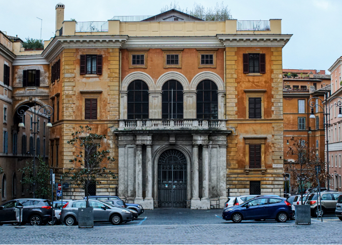

First Reading: Lev 13:1–2; 44–46
Second Reading: 1 Cor 10:31–11:1
Gospel: Mk 1:40–45

Friends,**Today’s** _readings_ direct our attention to the importance of community life. In fact, St. Thomas Aquinas highlights that living in society—in communion with other persons—is one of our basic instincts as human beings.According to the Levitical law we listened to in the first reading, a leper, considered impure by Jewish society, was obliged to live “alone … outside the camp” (Lev 13:46).In today’s Gospel (Mk 1:40–45), Jesus radically overturned this miserable situation. By touching and healing the leper, he overcame—with his holiness—what his fellow Jews deemed unclean and reintegrated him into his community.We are also part of a community: the Church, the earthly city, and—more particularly—the house we live in.

_Test Caption_

That’s why, in the Second Reading (1 Cor 10:31–11:1), St. Paul gives each one of us three tips on how to be a good member of a community, which could prove to be useful for us here at Altomonte College.Firstly: Do not offend others.In other words, do not cause difficulty, discomfort, or dislike to others. When we make our evening examination of conscience, we sometimes realize that, perhaps, we should not have said that graceless joke to our friend. We might become aware that our anger earlier in the day had no just cause; or, that we could have made our house-mates happier with our smile, rather than with our boring complaints. To begin with: do not offend others.Secondly: Please everyone in everything you do.This second tip is similar to the first one, yet it is expressed from a positive perspective. It invites us to do everything for the sake of others. It reminds us that every single act of ours—no matter how hidden or insignificant it may seem—generates social repercussions. For instance, an hour of intense study, offered to God, does a lot of good to others, since we acquire knowledge not only for our own edification, but also to bring others—our college-mates, the faithful in our respective diocese—closer to the Lord. In sum: please everyone in everything you do.Lastly: Do everything for God’s glory: *Deo omnis gloria!*This last tip is not but a call to see in another person the face of Christ. It is easier for us to remain at the purely human level and act according to our likes and dislikes: I do not like this person; his character does not get along with mine; he supports this club. However, living together becomes easier when I realize that every other person is—like myself—a son of God created in his image and redeemed by Christ.
