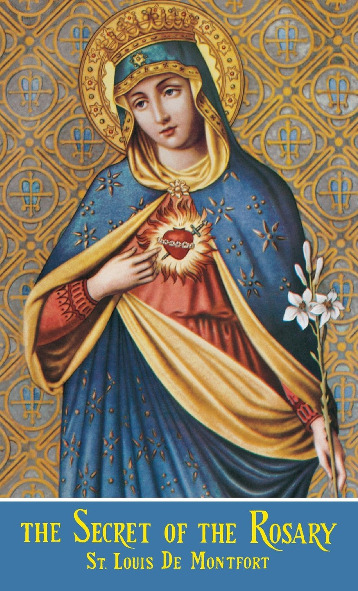
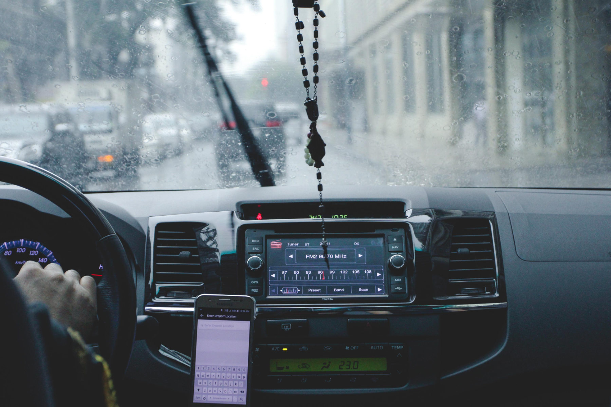

Salah satu kenangan masa kecil yang masih saya ingat dengan jelas adalah kedatangan para tetangga ke rumah kami untuk berdoa Rosario bersama. Kami duduk melingkar. Setiap orang, secara bergiliran, mendapatkan kesempatan untuk mengucapkan Salam Maria. Pada waktu itu, saya belum menghafal doa ini; jadi, saya memegang lembar contekan kecil. Setelah kami selesai berdoa Rosario, orang tua saya menyajikan minuman serta makanan ringan dan kami pun mengobrol dengan santai.

Saat itu, saya belum sadar bahwa Rosario yang saya pegang dengan tangan saya adalah senjata yang ampuh:

> Seperti di masa lampau —seperti yang terjadi di [Lepanto](https://opwest.org/lepanto/)—, hari ini Rosario harus menjadi **senjata yang ampuh**, untuk menaklukkan musuh-musuh Gereja Roma yang Kudus dan musuh-musuh Negara kalian.
>
> —St. Josemaría Escrivá, [*Holy Rosary*](https://amzn.to/3AVG1Zu), Author's note

')

Dalam artikel ini, saya akan menjelaskan tujuh kiat untuk berdoa Rosario. Sebelum saya membahas kiat-kiat ini, marilah kita ingat kembali (A) apa itu Rosario, (B) sejarah doa Rosario, (C) mengapa Rosario itu penting, dan (D) manfaat yang bisa kita peroleh apabila kita mendaraskannya dengan sungguh-sungguh.

## A. Apa itu Rosario?

Rosario adalah “rumusan doa yang terdiri dari lima belas dekade Salam Maria yang didahului oleh Bapa Kami. Sembari mendaraskan doa-doa tersebut, kita dengan khidmat merenungkan peristiwa-peristiwa penebusan kita.”[^1] Dalam bukunya [*The Secret of the Rosary*](https://amzn.to/3uBTDXP), [St. Louis-Marie Grignion De Montfort](https://www.newadvent.org/cathen/09384a.htm) menggambarkan Rosario sebagai **“perpaduan yang penuh berkat” antara doa mental dan doa vokal** (untuk mengetahui lebih jauh mengenai perbedaan antara doa mental dan doa vokal, [klik di sini](https://stpaulcenter.com/an-introduction-to-the-types-of-prayer/)).[^2] Di satu sisi, Rosario adalah **doa mental** karena ia merupakan sebuah perenungan atas peristiwa dan keutamaan Kristus dan Bunda Maria. Di sisi lain, Rosario adalah **doa vokal** karena ia terdiri dari lima Bapa Kami dan lima puluh Salam Maria.

Kata 'Rosario' sendiri berarti '**Mahkota Mawar**.' Jadi, setiap kali kita berdoa Rosario dengan khidmat, kita menempatkan mahkota seratus lima puluh mawar di atas kepala Yesus dan Maria.

## B. Dari mana asal doa Rosario?

Rosario adalah “**doa pertama** dan **devosi pertama** umat beriman.”[^3] Unsur utama dari doa Rosario, yakni doa Bapa Kami dan Salam Maria, “telah diucapkan selama berabad-abad, dari zaman para rasul dan para murid sampai sekarang.”[^4]

Pendarasan 150 Salam Maria dalam doa Rosario berakar pada [pembacaan 150 Mazmur](https://www.catholicculture.org/culture/library/view.cfm?id=4728). [Bentuk Rosario yang saat ini kita kenal](https://www.rosarycenter.org/homepage-2/rosary/the-rosary-st-dominic/) diterima oleh Gereja pada awal abad ke-13 melalui tangan [St. Dominikus dari Guzmán](https://www.britannica.com/biography/Saint-Dominic). Bunda Maria memberikannya kepadanya “sebagai sarana yang ampuh untuk mempertobatkan kaum [Albigensian](https://www.britannica.com/topic/Albigenses) dan para pendosa lainnya.”[^5]

Rosario secara resmi diakui oleh Gereja melalui [Paus Sixtus IV](https://www.britannica.com/biography/Sixtus-IV) pada abad ke-15. Kemudian, Rosario disusun oleh Antonio Ghislieri (yang akhirnya menjadi [Paus St. Pius V]( https://www.britannica.com/biography/Saint-Pius-V)) dalam bentuk perenungan lima belas peristiwa. Pada tahun 2002, [Paus Yohanes Paulus II](https://www.britannica.com/biography/Saint-John-Paul-II) menambahkan lima peristiwa baru—peristiwa-peristiwa terang.

  

    

      
    

  

  

    <h5>
      <a target="_blank" href="https://www.amazon.com/gp/product/1684221889/ref=as_li_tl?ie=UTF8&camp=1789&creative=9325&creativeASIN=1684221889&linkCode=as2&tag=happiness052f-20&linkId=c2aef0c4edb58c0b52ea2b7dca273349">The Secret of the Rosary</a>
    </h5>
    <h6>St. Louis De Monfort</h6>
    
Karya klasik ini menjelaskan apa itu Rosario dan memberikan kepada kita kiat-kiat praktis untuk mendoakannya dengan baik. Jika Anda ingin bertumbuh dalam kasih Anda kepada Kristus dan Bunda Maria melalui pendarasan Rosario Suci, buku ini ditulis untuk Anda.

  

## C. Seberapa penting Rosario?

Rosario sangatlah penting setidaknya karena empat alasan.

### 1. Permintaan Bunda kita

Pertama-tama, Rosario adalah doa yang diminta oleh Bunda kita di surga. Ia sangat menyukainya! Ia bahkan menyukainya lebih daripada semua devosi lainnya. Sebagai putra dan putri yang baik, kita pasti berusaha sebaik mungkin untuk memberikan apa pun yang menyenangkan **bunda kita di bumi**. Tidakkah kita akan melakukan hal yang sama terhadap **Bunda kita di surga**?

')

[Di Lourdes](https://www.catholicnewsagency.com/resource/55431/our-lady-of-lourdes) pada tahun 1858, sembari menggenggam rosario di tangannya, Maria menampakkan diri kepada [Bernadette Soubirous](https:// www.britannica.com/biography/Saint-Bernadette-of-Lourdes) dan memintanya untuk berdoa Rosario. Bunda Maria juga secara eksplisit [meminta kita untuk mendoakan Rosario setiap hari](https://catholicexchange.com/why-does-our-lady-of-fatima-call-us-to-the-daily-rosary) di salah satu [penampakannya di Fatima](https://www.fatima.pt/en/pages/narrative-of-the-apparitions-) pada tahun 1917:

> Aku adalah Bunda Rosario. Teruslah senantiasa berdoa Rosario setiap hari.

Dalam pesannya kepada Beato [Alan de La Roche](https://www.catholic.org/saints/saint.php?saint_id=482), Bunda Maria menyatakan bahwa

> di luar Kurban Kudus Misa, yang merupakan peringatan yang paling penting dan peringatan yang hidup akan sengsara Tuhan kita, tidak mungkin ada devosi yang lebih baik atau devosi yang mendatangkan upah yang lebih besar daripada pendarasan Rosario Suci, yang bisa dianggap sebagai **peringatan dan representasi kedua** dari hidup dan sengsara Tuhan kita Yesus Kristus.[^6]

Itulah sebabnya De Montfort menekankan keunggulan Rosario di antara semua devosi lainnya:

> Hampir tidak mungkin bagi saya untuk mengungkapkan dengan kata-kata betapa Bunda Maria **menyukai Rosario Suci** dan betapa ia **lebih mengunggulkannya** di antara semua devosi lainnya.[^7]

### 2. Ajaran para Paus

Kedua, [tak terhitung jumlah paus](https://udayton.edu/imri/mary/p/popes-on-the-rosary.php) yang telah mendorong kita untuk berdoa Rosario. Pastinya, Rosario dipromosikan oleh [semua paus abad ke-20](https://www.vaticannews.va/en/pope/news/2020-04/the-popes-and-the-rosary.html). Pada abad-abad sebelumnya, banyak juga paus yang telah melakukan hal yang sama. [Paus Leo XIII](https://www.britannica.com/biography/Leo-XIII), misalnya, menulis sebanyak [12 ensiklik dan 5 surat apostolik](https://udayton.edu/imri/mary/r/rosary-encyclicals-by-pope-leo-xiii.php) hanya mengenai doa Rosario!

### 3. Doa favorit para kudus
')
Ketiga, Rosario adalah doa favorit orang-orang kudus yang tak terhitung jumlahnya. St. Dominikus sendiri

> sangat yakin akan kemanjuran doa Rosario Suci dan akan nilainya yang besar sehingga, setiap kali ia mendengar pengakuan dosa, ia hampir tidak pernah memberikan penitensi lainnya.[^8] 

Untuk mengetahui lebih jauh tentang apa yang dikatakan para kudus mengenai devosi yang luar biasa ini, baca [artikel ini](https://www.ncregister.com/blog/why-mary-why-prayer-and-why-pray-the-rosary).

### 4. Pengubah dunia

Keempat, Rosario mengubah dunia! Dalam surat ensikliknya [*Laetitiae Sanctae*](https://www.vatican.va/content/leo-xiii/en/encyclicals/documents/hf_l-xiii_enc_08091893_laetitiae-sanctae.html) yang ditulis pada tahun 1893, Paus Leo XIII menegaskan bahwa “Rosario, jika didaraskan dengan khidmat, pasti akan bermanfaat bukan hanya bagi individu, tetapi juga bagi masyarakat secara luas.”[^9] Memang, Rosario adalah doa yang mampu mendatangkan perubahan!

## D. Manfaat apa yang saya terima lewat doa Rosario?

Manfaat-manfaat rohani yang dapat kita terima lewat doa Rosario tidaklah terbilang banyaknya.[^10] Berikut adalah beberapa manfaat tersebut menurut orang-orang kudus.

### 1. Pengetahuan dan kasih akan Kristus dan Maria

Rosario secara bertahap akan memberikan kepada kita pengetahuan yang sempurna akan Kristus dan Maria. Tentu saja: pengetahuan selalu membawa kita kepada cinta kasih. Karena kita mengenal mereka dengan lebih baik, kita juga akan mencintai mereka dengan lebih baik:

> Awal dari jalan, di mana pada akhirnya kamu akan sepenuhnya terbawa oleh cinta akan Yesus, adalah cinta yang penuh kepercayaan akan Maria.
>
> Apakah kamu ingin mencintai Bunda Maria? Kenalilah dia. Bagaimana caranya? Dengan mendoakan Rosario dengan baik.
>
> —St. Josemaría, [*Holy Rosary*, Author's note](https://www.escrivaworks.org/book/-point-0.htm)

### 2. Kemenangan atas semua musuh kita

Sebagai orang-orang kristiani, musuh terberat kita adalah Iblis, godaan, dan dosa. Rosario adalah “senjata ampuh”[^11] melawan semua hal tersebut!

### 3. Hidup dalam keutamaan

Kita telah membaca di atas bahwa Rosario terdiri dari perenungan atas **peristiwa dan keutamaan Kristus dan Bunda Maria**. Tapi, apa itu *keutamaan*?

Keutamaan adalah “kebiasaan dalam bertindak … kebiasaan baik yang menghasilkan karya-karya yang baik.”[^12] Dengan kata lain, keutamaan adalah kebiasaan baik yang menolong kita dalam melakukan apa yang baik (untuk mendalami apa itu keutamaan, baca [artikel ini](https://stpaulcenter.com/what-is-virtue/)). Tradisi dalam filsafat dan teologi kristiani mengenal [banyak jenis keutamaan](https://www.catholicculture.org/culture/library/catechism/index.cfm?recnum=5061). Misalnya, ada **empat keutamaan kardinal**: kebijaksanaan, keadilan, keberanian, dan penguasaan diri. Di sisi lain, **tiga keutamaan teologal**—yang hanya bisa diperoleh dari Allah—adalah iman, harapan, dan kasih. Masih ada banyak keutamaan lain yang terkait dengan tujuh keutamaan ini.

Ketika kita berdoa Rosario, kita merenungkan **keutamaan Tuhan Yesus dan Bunda Maria**. Misalnya, saat kita merenungkan peristiwa Kabar Sukacita, kita merenungkan **ketaatan** Maria. Peristiwa Yesus dipersembahkan di Bait Suci menyoroti **kerendahan hati** Maria yang diwujudkan dalam kepatuhannya terhadap Hukum Taurat. Transfigurasi, di sisi lain, menekankan sifat fana dunia ini, yang seharusnya memotivasi kita untuk mengembangkan keutamaan **kesederhanaan**. Setiap peristiwa merangkum keutamaan-keutamaan tertentu yang patut kita kembangkan dalam hidup kita sendiri.

')

Sebuah pepatah kuno dalam bahasa Italia mengatakan: "*Una buona mamma vale cento maestre*"—"Seorang ibu yang baik lebih berharga dari seratus guru." Dalam doa Rosario, Yesus dan Maria tampil lebih jelas sebagai teladan kita. Itulah sebabnya Rosario adalah sarana yang efektif bagi kita untuk bertumbuh dalam keutamaan.

### 4. Indulgensi

Banyak umat Katolik belum menyadari adanya kemungkinan untuk mendapatkan indulgensi dengan berdoa Rosario (jika kamu belum paham sepenuhnya mengenai 'indulgensi,' silakan [klik di sini](https://www.catholic.com/tract/myths-about-indulgences)). Sekarang, setelah kamu tahu bahwa kamu bisa mendapatkan indulgensi dengan mendaraskan Rosario dan kamu mulai bersemangat, kamu mungkin bertanya: *bagaimana* saya bisa mendapatkannya?

Mari kita mulai dengan mengingat bahwa indulgensi dapat bersifat **sebagian** atau **penuh**. Perbedaan di antara keduanya cukup sederhana. Indulgensi bersifat penuh jika ia **sepenuhnya** membebaskan kita dari hukuman sementara akibat dosa. Sebaliknya, indulgensi bersifat sebagian jika ia membebaskan kita **hanya dari sebagian hukuman sementara** akibat dosa.[^13]

Perihal perolehan indulgensi melalui pendarasan Rosario, [*Manual of Indulgences*](https://amzn.to/3CZ0LjY), 17, §1, menetapkan hal-hal berikut:

> Indulgensi penuh diberikan kepada umat beriman yang:
>
> (1) Dengan khidmat mendaraskan Rosario Bunda Maria dalam gedung gereja atau oratorium, atau dalam keluarga, komunitas religius, atau perkumpulan umat beriman, dan secara umum ketika beberapa umat beriman berkumpul untuk suatu tujuan yang mulia;
>
> (2) Atau dengan khidmat ikut serta dalam pendarasan Rosario yang dilaksanakan oleh [Bapa Paus](https://www.franciscanmedia.org/ask-a-franciscan/why-is-the-pope-called-the-supreme-pontiff) dan disiarkan secara langsung lewat radio atau televisi.

Perolehan indulgensi melalui pendarasan Rosario juga mengharuskan dipenuhinya persyaratan-persyaratan berikut (selain pemenuhan [syarat-syarat umum](https://www.ewtn.com/catholicism/devotions/conditions-13362)):[^14]

1. Kamu harus mendaraskan 5 dekade dalam Rosario **tanpa interupsi**.
2. Kamu harus **merenungkan dengan khidmat** peristiwa-peristiwanya (selain mengucapkan doa Bapa Kami dan Salam Maria).
3. Jika Rosario didaraskan **secara publik**, kamu harus **mengumumkan peristiwa-peristiwanya** sesuai dengan kebiasaan setempat. Jika kamu mendaraskan Rosario **sendirian**, maka **cukup** bagi kamu untuk **menggabungkan** perenungan peristiwa-peristiwa dengan doa-doa vokal (yakni doa Bapa Kami dan Salam Maria).

## E. Bagaimana saya harus mendaraskan Rosario?

Akhirnya, kita sampai pada bagian utama artikel ini! Berikut adalah tujuh kiat untuk mendoakan Rosario dengan baik.

### 1. Dengan motivasi yang murni

Rosario sepatutnya diucapkan dengan motivasi yang murni. Motivasi yang murni terdiri dari **niat untuk hidup kudus** dan **penolakan dosa**. Dengan kata lain, sebaiknya kita mendaraskan Rosario ketika kita berada dalam [keadaan rahmat](https://www.catholicculture.org/culture/library/dictionary/index.cfm?id=36634). Namun, ini tidak berarti bahwa mereka yang sadar bahwa mereka telah jatuh dalam [dosa berat](https://katolisitas.org/apakah-dosa-berat-dan-dosa-ringan/) dilarang untuk berdoa Rosario. Sebaliknya, “orang berdosa perlu berdoa jauh lebih banyak daripada orang baik.”[^15] Itulah sebabnya persyaratan minimum untuk berdoa Rosario adalah **tekad untuk meninggalkan dosa berat**:

> Untuk memperoleh manfaat dari pendarasan Rosario Suci, seseorang harus berada dalam keadaan rahmat atau **setidaknya bertekad sepenuhnya untuk meninggalkan dosa berat**. Ini kita ketahui karena teologi mengajarkan bahwa perbuatan baik dan doa hanyalah karya-karya mati apabila dilakukan dalam keadaan berdosa berat.[^16]
>
> —St. Louis De Montfort

### 2. Dengan perhatian

Kita sering tidak berkonsentrasi ketika kita sedang berdoa. Gangguan semacam ini adalah salah satu sumber keputusasaan yang utama bagi mereka yang mulai menapaki jalan doa.

Namun, penting bagi kita untuk menyadari bahwa ada dua jenis gangguan. Ada gangguan yang bersifat **disengaja**, sedangkan ada gangguan-gangguan lain yang bersifat **tidak disengaja**. 

Kita *tanpa disengaja* jatuh dalam gangguan ketika kita **tidak bermaksud mengalihkan perhatian kita**, akan tetapi—karena alasan-alasan yang tidak kita ketahui—kita kehilangan konsentrasi. Gangguan yang tidak disengaja datang dan pergi terlepas dari niat baik kita. Ia mirip dengan kerja beberapa organ dalam tubuh kita. Kita tidak bisa mengendalikan bagaimana jantung kita berdetak atau bagaimana sistem pencernaan kita memproses makanan, misalnya.

St. Thomas Aquinas mengakui adanya tantangan ini ketika ia berbicara mengenai intensi yang harus dimiliki pelayan dalam memberikan sakramen-sakramen. Meskipun ia menekankan perlunya [intensi yang aktual](https://www.catholicculture.org/culture/library/dictionary/index.cfm?id=31647) dalam diri pelayan, ia menyadari bahwa

> [keberhasilan untuk memiliki intensi yang aktual] tidaklah sepenuhnya berada dalam kekuasaan manusia, karena ketika seseorang ingin berkonsentrasi pada suatu hal, dengan tidak sengaja ia mulai memikirkan hal-hal lain, seperti yang dikatakan Mzm 39:13: *Hatiku telah meninggalkan daku.*
>
> —St. Thomas Aquinas, [*ST* III, q. 64 a. 8 ad 3](https://www.newadvent.org/summa/4064.htm#article8)

Di sisi lain, ada gangguan-gangguan lain yang bersifat *disengaja*. Gangguan yang disengaja terjadi ketika kita **secara sengaja ingin terganggu**—misalnya, ketika kita sedang berdoa, kita melihat HP kita—atau kita **menyerah pada godaan yang berasal dari gangguan yang tidak disengaja**—misalnya, pikiran tentang makanan muncul di benak kita secara tiba-tiba ketika kita sedang berdoa, tetapi kemudian kita malah mengikuti alur pikiran tersebut dengan mempertimbangkan apa yang akan kita santap untuk makan siang alih-alih mengesampingkan pikiran tersebut.

Perhatian adalah lawan dari jenis gangguan yang terakhir ini. Mendaraskan Rosario dengan penuh perhatian berarti **menghindari segala gangguan yang disengaja**. Simpan terlebih dahulu HP-mu. Masukkan *gadget* tersebut ke dalam *silent mode*. Dan jangan rencanakan perjalanan akhir pekanmu di tengah-tengah Rosario. Berdoalah dulu.

### 3. Dengan permohonan
Secara umum, manusia suka meminta sesuatu. Siapa, coba, yang tidak menginginkan barang gratis? Namun, seiring bertambahnya usia, kita tampaknya kehilangan keberanian untuk meminta hal-hal yang *besar*. Ketika kita berdoa Rosario, De Montfort mengingatkan kita akan “bahaya tidak memohon rahmat sama sekali, sehingga jika orang-orang ditanya apa intensi Rosario mereka, mereka tidak tahu harus berkata apa.”[^17] Namun, anak-anak kecil memiliki sikap yang berbeda, seperti yang diungkapkan oleh St. Josemaría:

> Jadilah anak kecil; keberanian terbesar selalu merupakan milik anak-anak. Siapa yang meminta … bulan? Siapa yang tidak memedulikan bahaya demi memperoleh apa yang diinginkannya?
>
> "Tambahkan" dalam diri anak "seperti itu" berlimpah rahmat dari Allah, tekad untuk melakukan Kehendak-Nya, cinta yang besar akan Yesus, segala pengetahuan manusia yang bisa ia peroleh dengan kemampuannya …, dan kamu akan melihat gambaran karakter para rasul zaman ini sesuai dengan apa yang Allah inginkan.
>
> —St. [Josemaría](https://opusdei.org/en/section/saint-josemaria/), *Jalan*, no. 857

Berdoa Rosario dengan permohonan berarti **meminta rahmat-rahmat khusus dari Allah**. Ada banyak cara untuk melakukan hal ini. Kamu bisa menentukan bagaimana kamu mau melakukannya! Kamu dapat mengucapkan seluruh Rosario untuk satu intensi khusus, misalnya, untuk temanmu yang sakit. Kamu boleh mempersembahkan setiap dekade—setiap satu Bapa Kami dan sepuluh Salam Maria—untuk sebuah intensi tertentu. Misalnya, dekade pertama bisa kamu daraskan untuk [Bapa Paus](https://www.vatican.va/content/vatican/en.html); yang kedua untuk keluargamu; yang ketiga untuk mereka yang telah berbuat baik kepadamu sepanjang hidupmu; dekade keempat untuk orang-orang yang kamu coba bawa lebih dekat kepada Allah; dan yang kelima bisa kamu ucapkan untuk semua yang sedang menderita.

Ini hanyalah sebuah contoh. Ada jutaan cara untuk berdoa Rosario dengan permohonan. Yang terpenting adalah saat kamu berdoa Rosario, kamu meminta rahmat khusus kepada Allah—rahmat yang besar, pastinya!—bagai anak kecil yang meminta bulan kepada orang tuanya.

### 4. Dengan jeda

Hendaknya kita berdoa Rosario dengan jeda sehingga kita dapat sungguh-sungguh memaknai apa yang kita ucapkan. De Montfort menyesalkan ketergesaan banyak orang ketika mendaraskan Rosario:

> Sungguh menyedihkan melihat bagaimana kebanyakan orang mendaraskan Rosario Suci—mereka mengucapkannya dengan sangat cepat dan dengan bergumam, sehingga kata-katanya tidak didaraskan dengan benar sama sekali.[^18]

Oleh sebab itu, ia menganjurkan kita untuk berhenti sejenak beberapa kali saat kita mendaraskan Bapa Kami dan Salam Maria. Simbol **salib** yang ia letakkan di antara kata-kata di bawah menunjukkan di mana **kita harus mengambil jeda singkat**.

> Bapa kami yang ada di surga,† Dimuliakanlah nama-Mu.† Datanglah kerajaan-Mu.† Jadilah kehendak-Mu† di atas bumi seperti di dalam surga.† Berilah kami rezeki pada hari ini,† dan ampunilah kesalahan kami,† seperti kami pun mengampuni yang bersalah kepada kami.† Dan janganlah masukkan kami ke dalam pencobaan,† tetapi bebaskanlah kami dari yang jahat. Amin.

> Salam Maria, penuh rahmat,† Tuhan sertamu,† terpujilah engkau di antara wanita† dan terpujilah Buah tubuhmu, Yesus.† Santa Maria, Bunda Allah,† doakanlah kami yang berdosa ini, sekarang† dan waktu kami mati. Amin.[^19]

### 5. Dengan fleksibilitas

Tidak ada alasan untuk tidak berdoa Rosario karena kita bisa melakukannya **di mana pun** dan **kapan pun**—inilah yang saya maksud dengan fleksibilitas. Memang benar: **berlutut** adalah postur doa yang terbaik. Meski demikian, Rosario dapat didaraskan **sambil berjalan**, **di tempat tidur** (saat sakit), atau bahkan **di tempat kerja**, karena “pekerjaan tangan seseorang tidak selalu bertentangan dengan doa vokal.”[^20] De Montfort mengungkapkan fleksibilitas ini dengan kata-kata berikut:

> Saya ingin menambahkan bahwa Rosario harus diucapkan dengan penuh hormat—artinya, Rosario hendaknya diucapkan dalam posisi **berlutut, dengan tangan dirapatkan dan menggenggam Rosario**. Namun, jika orang-orang sedang sakit, tentu saja mereka bisa mendaraskannya **di tempat tidur** atau, jika mereka sedang **bepergian**, Rosario bisa didoakan sambil **berjalan kaki**—dan, jika suatu penyakit membuat mereka tidak bisa berlutut, Rosario bisa didaraskan sembari **duduk** atau **berdiri**. Rosario bahkan bisa diucapkan **di tempat kerja**, apabila kewajiban sehari-hari seseorang membuatnya tidak bisa meninggalkan pekerjaannya, karena **pekerjaan tangan seseorang tidak selalu bertentangan dengan doa vokal**.[^21]

Saya berkali-kali ditanya apakah seseorang boleh mendaraskan Rosario sambil melakukan kegiatan lainnya. Jika keadaan hidup kita tidak memungkinkan kita untuk menyisihkan waktu khusus untuk berdoa Rosario, maka **jawabannya adalah ya**: kita tentu dapat berdoa Rosario sambil melakukan aktivitas lain (misalnya, mencuci piring, merawat bayi). Namun, kita harus memastikan bahwa kita menggabungkan Rosario kita dengan kegiatan lain **bukan karena kita malas atau hanya ingin 'menghemat' waktu**:

> Tentu saja, karena jiwa memiliki keterbatasan dan hanya dapat melakukan sejumlah hal, ketika kita sedang berkonsentrasi pada pekerjaan tangan, kita tidak dapat memberikan perhatian penuh pada hal-hal rohani, seperti doa. Tetapi, apabila kita tidak mempunyai jalan keluar yang lain, doa semacam ini [yang didaraskan sembari kita melakukan kegiatan lain] adalah doa yang **bernilai di mata Bunda Maria** dan ia menghargai **kehendak baik** kita lebih daripada tindakan kita yang kelihatan dari luar.”[^22]
>
> —St. Louis De Montfort

### 6. Dengan orang lain

Doa selalu memiliki aspek komunal: “Sebab di mana dua atau tiga orang berkumpul dalam nama-Ku, di situ Aku ada di tengah-tengah mereka,” sabda Tuhan (Mat 18:20). Berdoa Rosario sendirian itu sudah sangat baik. Akan tetapi, mendoakannya bersama dengan orang lain adalah sesuatu yang lebih baik lagi.

Setidaknya ada tiga keuntungan yang bisa kita peroleh ketika kita mendaraskan Rosario bersama orang lain. Pertama, kita **menaruh perhatian lebih** saat kita berdoa bersama. Setidaknya, akan lebih mudah bagi kita untuk melawan kantuk atau pikiran kosong. Kedua, berdoa Rosario bersama orang lain memberikan kesempatan kepada kita untuk memperoleh **indulgensi penuh**, seperti yang telah saya jelaskan di atas. Terakhir, ketika kita mendaraskan Rosario dalam sebuah kelompok, kita **saling mendukung** satu sama lain. De Montfort menjelaskan keuntungan ketiga ini dengan kata-kata berikut:

> … apabila seseorang tidak berdoa dengan baik, orang lain dalam perkumpulan yang sama yang berdoa lebih baik dapat menutupi kekurangannya. Dengan demikian, **mereka yang kuat menopang yang lemah**, yang bersemangat menginspirasi yang suam-suam kuku, yang kaya memperkaya yang miskin, yang buruk terhitung sebagai yang baik.[^23]

### 7. Dengan ketekunan

Saya rasa, kiat terakhir ini adalah kiat yang paling penting karena, tanpanya, kita tidak akan bisa menerapkan kiat-kiat sebelumnya! Ya, kita harus berdoa Rosario **setiap hari** dengan ketekunan. Tuhan ingin agar kita bertekun: “Hendaklah engkau setia sampai mati, dan Aku akan mengaruniakan kepadamu mahkota kehidupan” (Wahyu 2:10).

Sangatlah tepat bagi kita untuk mengakhiri artikel ini dengan kata-kata dari St. Louis De Montfort yang menyemangati kita semua:

> Bahkan jika kamu harus melawan gangguan sepanjang Rosario kamu, pastikan kamu berjuang dengan baik, dengan senjata di tangan: artinya, jangan berhenti mendaraskan Rosario meskipun sulit bagimu untuk melakukannya dan kamu sama sekali tidak memiliki hasrat.[^24]

[^1]:[*Manual of Indulgences*](https://amzn.to/3CZ0LjY), 17, §1.
[^2]:Louis De Montfort, *The Secret of the Rosary*, trans. Mary Barbour (Bay Shore: Montfort Fathers Publications, 1957), 16.
[^3]:De Montfort, *The Secret of the Rosary*, 17.
[^4]:De Montfort, *The Secret of the Rosary*, 17.
[^5]:De Montfort, *The Secret of the Rosary*, 17.
[^6]:De Montfort, *The Secret of the Rosary*, 101.
[^7]:De Montfort, *The Secret of the Rosary*, 34.
[^8]:De Montfort, *The Secret of the Rosary*, 102.
[^9]:Pope Leo XIII, *Laetitiae Sanctae*, §3.
[^10]:De Montfort, *The Secret of the Rosary*, 96.
[^11]:Josemaría Escrivá, [*Holy Rosary*, Author's note](https://www.escrivaworks.org/book/-point-0.htm).
[^12]:Thomas Aquinas, [*ST* I-II, q. 55 a. 3 co.](https://www.newadvent.org/summa/2055.htm#article3)
[^13]:See *The Code of Canon Law*, [c. 992–993](https://www.vatican.va/archive/cod-iuris-canonici/eng/documents/cic_lib4-cann959-997_en.html#CHAPTER_IV.).
[^14]:See [*Manual of Indulgences*](https://amzn.to/3CZ0LjY), 17, §1.
[^15]:De Montfort, *The Secret of the Rosary*, 136.
[^16]:De Montfort, *The Secret of the Rosary*, 135.
[^17]:De Montfort, *The Secret of the Rosary*, 162.
[^18]:De Montfort, *The Secret of the Rosary*, 144.
[^19]:De Montfort, *The Secret of the Rosary*, 144.
[^20]:De Montfort, *The Secret of the Rosary*, 148.
[^21]:De Montfort, *The Secret of the Rosary*, 148.
[^22]:De Montfort, *The Secret of the Rosary*, 148.
[^23]:De Montfort, *The Secret of the Rosary*, 151.
[^24]:De Montfort, *The Secret of the Rosary*, 142.

