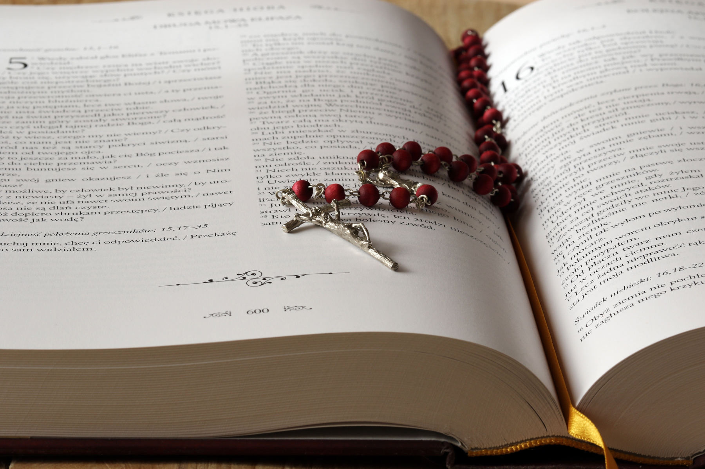
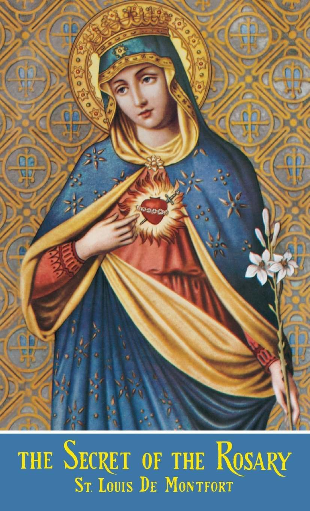

One of the childhood memories I still vividly conserve is the gathering of neighbors at our house to pray the Rosary. We sat in a circle. Each person, by turns, would get the chance to say a Hail Mary. I did not know this prayer by heart at that time, so I had with me a small cheat sheet to read from. After we finished our Rosary, my parents served refreshments and we chitchatted.

Back then, little did I know that the Rosary I fingered was a powerful weapon:

> As it was in other times —such as [Lepanto](https://opwest.org/lepanto/)—, the Rosary must be today a **powerful weapon**, to conquer the enemies of the Holy Roman Church and of your Country.
>
> —St. Josemaría Escrivá, [*Holy Rosary*](https://amzn.to/3AVG1Zu), Author's note

')

In this article, I will provide you with seven tips on how to pray the Rosary. Before jumping right into these tips, let us first recall (1) what the Rosary is, (2) a little bit of its history, (3) its importance, and (4) the benefits we may obtain by devoutly reciting it.

## A. What is the Rosary?

The Rosary is “a prayer formula consisting of fifteen decades of Hail Marys preceded by the Our Father, during the recitation of which we piously meditate on the corresponding mysteries of our redemption.”[^1] In his book [*The Secret of the Rosary*](https://amzn.to/3uBTDXP), [St. Louis-Marie Grignion de Montfort](https://www.newadvent.org/cathen/09384a.htm) (1673–1716) more graphically describes the Rosary as **“a blessed blending” of mental and vocal prayers**.[^2] On the one hand, it is a **mental prayer** because it consists in the meditation on the mysteries and virtues of Christ and Mary. It is, on the other hand, a **vocal prayer** since it is made up of five Our Fathers and fifty Hail Marys.

The word ‘Rosary’ itself means ‘**Crown of Roses**.’ Thus, every time we say the Rosary devoutly, we place a crown of one hundred and fifty roses upon the heads of Jesus and Mary.

## B. Where does the Rosary come from?

The Rosary is “the **first prayer** and the **first devotion** of the faithful.”[^3] Its core—the prayers of Our Father and Hail Mary—“has been in use all through the centuries, from the time of the apostles and disciples down to the present.”[^4]

The saying of 150 Hail Marys in the Rosary has its roots in [the recitation of 150 Psalms](https://www.catholicculture.org/culture/library/view.cfm?id=4728). [The present form was received](https://www.rosarycenter.org/homepage-2/rosary/the-rosary-st-dominic/) by the Church in the early-13th century through [St. Dominic de Guzmán](https://www.britannica.com/biography/Saint-Dominic). Our Lady gave it to him “as a powerful means of converting the Albigensians and other sinners.”[^5]

The Rosary was officially approved in the Church by [Pope Sixtus IV](https://www.britannica.com/biography/Sixtus-IV) in the 15th century and structured by Antonio Ghislieri (later [Pope St. Pius V](https://www.britannica.com/biography/Saint-Pius-V)) around the meditation of fifteen mysteries. In 2002, [Pope John Paul II](https://www.britannica.com/biography/Saint-John-Paul-II) added five new mysteries—the luminous mysteries.

  

    

      
    

  

  

    <h5>
      <a href="https://amzn.to/3EHDxR1">The Secret Of The Rosary</a>
    </h5>
    <h6>St. Louis De Monfort</h6>
    
This spiritual classic explains what the Rosary is and gives us practical tips on how to pray it well. If you wish to grow in your love toward Christ and Mary through the recitation of the Holy Rosary, this book is written for you.

  

## C. How important is the Rosary?

The Rosary is extremely important for at least four reasons.

### 1. Our Mother’s request

Firstly, the Rosary is the prayer requested by our heavenly Mother. She likes it! She also prefers it to all other devotions. As good sons and daughters, we would surely try our best to give whatever is pleasing to our earthly mother. Wouldn’t we do the same to our heavenly Mother?

')

[In Lourdes](https://www.catholicnewsagency.com/resource/55431/our-lady-of-lourdes) in 1858, with a rosary clasped in her hands, Mary appeared to [Bernadette Soubirous](https://www.britannica.com/biography/Saint-Bernadette-of-Lourdes) and requested her to say the Rosary. Our Blessed Mother also explicitly [asked us to pray it every day](https://catholicexchange.com/why-does-our-lady-of-fatima-call-us-to-the-daily-rosary) in one of her [apparitions in Fatima](https://www.fatima.pt/en/pages/narrative-of-the-apparitions-) in 1917: “I am the Lady of the Rosary. Continue always to pray the Rosary every day.”

In her message to Blessed [Alan de La Roche](https://www.catholic.org/saints/saint.php?saint_id=482), the Mary states that

> after the Holy Sacrifice of the Mass, which is the most important as well as the living memorial of Our Blessed Lord’s passion there could not possibly be a finer devotion or one of greater merit than that of the Holy Rosary, which is like a second memorial and representation of the life and passion of Our Lord Jesus Christ.[^6]

That is why De Montfort insists on the Rosary’s preeminence among all other devotions:

> It would hardly be possible for me to put into words how much Our Lady thinks of the Holy Rosary and of how she vastly prefers it to all other devotions.[^7]

### 2. The teaching of the Popes

Secondly, [countless popes](https://udayton.edu/imri/mary/p/popes-on-the-rosary.php) have encouraged us to pray the Rosary. It has definitely been promoted by [all the popes of the twentieth century](https://www.vaticannews.va/en/pope/news/2020-04/the-popes-and-the-rosary.html). In the preceding centuries, numerous popes also did the same. [Pope Leo XIII](https://www.britannica.com/biography/Leo-XIII), for example, wrote as many as [12 encyclicals and 5 apostolic letters](https://udayton.edu/imri/mary/r/rosary-encyclicals-by-pope-leo-xiii.php) on just the Rosary!

### 3. The saints’ favorite
')
Thirdly, the Rosary is the favorite prayer of innumerable saints. St. Dominic himself “was so convinced of the efficacy of the Holy Rosary and of its great value that, when he heard confessions, he hardly ever gave any other penance.”[^8] To find out more about what the saints say about this wonderful devotion, read [this article](https://www.ncregister.com/blog/why-mary-why-prayer-and-why-pray-the-rosary).

### 4. A world changer

Fourthly, the Rosary changes the world! In his encyclical letter [*Laetitiae Sanctae*](https://www.vatican.va/content/leo-xiii/en/encyclicals/documents/hf_l-xiii_enc_08091893_laetitiae-sanctae.html) published in 1893, Pope Leo XIII affirms that “the Rosary, if devoutly used, is bound to benefit not only the individual but society at large.”[^9] It is, indeed, a prayer capable of making changes!

## D. What benefits do I receive from praying the Rosary?

The spiritual benefits we may receive from praying the Rosary are incalculable.[^10] Here are some of those benefits pointed out by the saints.

### 1. Knowledge and love of Christ and Mary

The Rosary will gradually give us a perfect knowledge of Christ and Mary. Of course: with knowledge comes love. As we know them better, we will love them better too:

> The beginning of the way, at the end of which you will find yourself completely carried away with love for Jesus, is a confident love for Mary.
>
> —Do you want to love Our Lady? —Well, get to know her. How? —By praying her Rosary well.
>
> —St. Josemaría Escrivá, [*Holy Rosary*, Author's note](https://www.escrivaworks.org/book/-point-0.htm)

### 2. Victory over all our enemies

As Christians, our toughest enemies are the Devil, temptations, and sins. The Rosary is a “powerful weapon”[^11] against all of them!

### 3. Life of virtues

We have learned above that the Rosary consists in the meditation on **the mysteries and virtues of Christ and Mary**. But, what is *virtue*?

Virtue is “an operative habit … a good habit, productive of good works.”[^12] Said otherwise, it is a good habit that assists us in doing the good (to learn more about virtues, read [this article](https://stpaulcenter.com/what-is-virtue/)). Christian philosophical and theological tradition recognizes [many virtues](https://www.catholicculture.org/culture/library/catechism/index.cfm?recnum=5061). For example, there are four cardinal virtues: prudence (wisdom), justice, fortitude (courage), and temperance (self-control). On the other hand, the three theological virtues—those that can only come from God—are faith, hope, and love. There are still many more virtues that are connected to these seven virtues.

When we pray the Rosary, we meditate precisely on **the virtues of our Lord and the Blessed Virgin**. For instance, as we contemplate the Annunciation, we consider Mary’s **obedience**. The Presentation of Jesus at the Temple highlights Mary’s **humility** manifested in her compliance with the Law. The Transfiguration, on the other hand, emphasizes the transitory nature of the present world, which should motivate us to cultivate the virtue of **simplicity**. Every mystery encapsulates particular virtues we are called to foster in our own life.

')

In the Rosary, Jesus and Mary appear more clearly as our examples. That is why the Rosary is an effective means for us to grow in virtues.

### 4. Indulgences

Many Catholics are still unaware of the possibility of gaining indulgence by praying the Rosary (if you are not sure what ‘indulgence’ is, [click here](https://www.catholic.com/tract/myths-about-indulgences) to find out more). Now that you know it *is* possible and you start to get excited, you might ask: how can I get it?

Let us begin by recalling that indulgence may be plenary or partial. The distinction between both is quite straightforward. An indulgence is plenary if it **totally** frees from the temporal punishment due to sins. However, it is partial if it frees from the temporal punishment due to sins **only partially**.[^13]

When it comes to the obtainment of indulgence through the recitation of the Rosary, the 1999 [*Manual of Indulgences*](https://amzn.to/3CZ0LjY), 17, §1, establishes the following:

> A plenary indulgence is granted to the faithful who:
> 
> (1) Devoutly recite the Marian rosary in a church or oratory, or in a family, a religious community, or an association of the faithful, and in general when several of the faithful gather for some honest purpose;
> 
> (2) Or devoutly join in the recitation of the rosary while it is being recited by the [Supreme Pontiff](https://www.franciscanmedia.org/ask-a-franciscan/why-is-the-pope-called-the-supreme-pontiff) and broadcast live by radio or television.

The obtainment of indulgence through the recitation of the Rosary also requires the fulfillment of the following things (apart from the fulfillment of [the general conditions](https://www.ewtn.com/catholicism/devotions/conditions-13362)):[^14]

1. You must recite the 5 decades of the Rosary **without interruption**.
2. You must **devoutly meditate** on the mysteries (apart from saying the Our Fathers and the Hail Marys).
3. If the Rosary is **publicly** recited, you must **announce the mysteries** in accord with approved local custom. If you recite the Rosary **by yourself**, then it is **sufficient** for you to **simply join** the meditation on the mysteries to the vocal prayer.

## E. How should I recite the Rosary?

Finally, we get to the main part of this article! Here are the seven tips on how to pray the Rosary fruitfully.

### 1. With pure intention

The Rosary has to be said with pure intention. Purity of intention consists in **desire for holiness** and, consequently, **rejection of sins**. In other words, it is best to say the Rosary when we are in the [state of grace](https://www.catholicculture.org/culture/library/dictionary/index.cfm?id=36634). However, this does not mean that those conscious of having committed [mortal sins](https://www.catholic.com/magazine/online-edition/mortal-and-venial-sin) are forbidden from praying the Rosary. Rather, “sinners need to pray far more than good people do.”[^15] That is why the minimum requirement to say the Rosary is **the willingness to abandon mortal sin**:

> To say the Holy Rosary to advantage one must be in a state of grace or at the very least be fully determined to give up mortal sin. This we know because all our theology teaches us that good works and prayers are only dead works if they are done in a state of mortal sin.[^16]
> 
> —St. Louis-Marie de Montfort

### 2. With attention

We are often distracted when we pray. Distraction is one of the major sources of discouragement for those who are beginning to trod the path of prayer.

It is important for us to realize, though, that there are two types of distractions. Some distractions are **voluntary**, whereas others are **involuntary**. We are involuntarily distracted when we **do not seek to get distracted**, but—for some unspecified reasons—we do. Involuntary distractions come and go regardless of our good will. They are similar to some of our internal organs. We do not control how our heart beats or how our digestive system processes food, for instance.

St. Thomas Aquinas acknowledges this difficulty as he talks about the intention required of the minister in the administration of the sacraments. Although he insists on the need to have actual intention, he admits that

> [having actual intention] is not entirely in man’s power, because when a man wishes to be very intent on something, he begins unintentionally to think of other things, according to Ps 39:13: *My heart hath forsaken me.*
> 
> St. Thomas Aquinas, [*ST* III, q. 64 a. 8 ad 3](https://www.newadvent.org/summa/4064.htm#article8)

On the other hand, some other distractions are voluntary. In these cases, we **voluntarily** **seek to get distracted**—e.g., in the middle of our prayer, we check our phone—or we **give in to the pressure of involuntary distractions**—e.g., as we pray, a thought about food emerges in our mind out of the blue, but then we entertain it by deciding what to eat for lunch instead of dissipating it.

Attention is the opposite of this last type of distractions. Saying the Rosary with attention means avoiding voluntary distractions. Put your phone aside. Silence it. And don’t plan your weekend outing just yet. Pray.

### 3. With petitions

In general, human beings like to ask for things. Who doesn’t want free stuff anyway? Yet, as we grow older, we seem to lose the audacity to ask for big things. When it comes to saying the Rosary, De Montfort warns us of “the danger of not asking for any graces at all, so that if some people were asked their Rosary intention they would not know what to say.”[^17] However, children are different, as St. Josemaría Escrivá points out:

> Be a little child; the greatest daring is always that of children. Who cries for … the moon? Who is blind to dangers in getting what he wants?
> 
> To such a child add much grace from God, the desire to do his Will, great love for Jesus, all the human knowledge he is capable of acquiring … , and you will have a likeness of the apostles of today such as God undoubtedly wants them.
> 
> —St. [Josemaría Escrivá](https://opusdei.org/en/section/saint-josemaria/), *The Way*, no. 857

Praying the Rosary with petitions means asking for special graces from God. There are many ways to do this. It is really up to you! You can say the entire Rosary for a specific intention, e.g., for your friend who is sick. You can offer each decade—each set of one Our Father and ten Hail Marys—for an intention. For example, the first decade can be for the [Pope](https://www.vatican.va/content/vatican/en.html); the second one for your family; the third one for those who have done you good throughout your life; the fourth decade for the people you are trying to bring closer to God; and the fifth might be for all who are suffering.

These are only examples. There are millions of ways of praying the Rosary with petitions. The important thing is that, as you pray your Rosary, you ask God for special favors—big ones, please!—like a child begging his parents for a moon.

### 4. With pauses

It is good to pray the Rosary with pauses so we can really mean what we say. De Montfort laments the haste with which many people recite the Rosary:

> It is really pathetic to see how most people say the Holy Rosary—they say it astonishingly fast and mumble so that the words are not properly pronounced at all.[^18]

For this reason, he encourages us to pause briefly several times as we recite the Our Fathers and the Hail Marys. **The crosses** he puts in between words indicate where **we should pause**.

> Our Father Who art in Heaven,† hallowed be Thy name,† Thy kingdom come,† Thy will be done† on earth as it is in Heaven.† Give us this day† our daily bread† and forgive us our trespasses† as we forgive those who trespass against us,† and lead us not into temptation† but deliver us from evil. Amen.

> Hail Mary, full of grace,† the Lord is with Thee,† blessed art thou among women† and blessed is the Fruit of Thy womb, Jesus.† Holy Mary, Mother of God,† pray for us sinners, now† and at the hour of our death. Amen.[^19]

### 5. With flexibility

There is no excuse for not praying the Rosary since we can do it anywhere and anytime—this is what I meant by flexibility. Granted: **kneeling** is the best prayer posture. Nonetheless, the Rosary can be said **while walking**, **in bed** (when one is ill), or even **at work**, since “the work of one’s hands is not by any means always incompatible with vocal prayer.”[^20] This is how De Montfort expresses this flexibility:

> I would like to add that the Rosary ought to be said reverently—that is to say it ought to be said, as far as possible, **kneeling, with the hands joined and clasping the Rosary**. However, if people are ill they can of course say it **in bed** or if they are **travelling** it can be said **on foot**—and if infirmity prevents people kneeling it can be said **seated** or **standing**. The Rosary can even be said **at work**, if people’s daily duties keep them at their jobs, because **the work of one’s hands is not by any means always incompatible with vocal prayer**.[^21]

I have been asked many times whether it is fine to say the Rosary while one performs certain types of work. If our circumstances of life do not allow us to set aside a dedicated time for saying the Rosary, then **the answer is yes**: we can of course pray the Rosary while we are doing something else (e.g., washing the dishes, taking care of our little baby). We should make sure, though, that we combine our Rosary with other activities not because we are lazy or simply want to ‘save up’ time:

> Of course, since the soul has its limitations and can only do so much, when we are concentrating on manual work we cannot give our undivided attention to things of the spirit, such as prayer. But when we cannot do otherwise this kind of prayer is not without value in Our Lady’s eyes and she rewards our good will more than our external actions.”[^22]
> 
> —St. Louis-Marie de Montfort

### 6. With others

Prayer always has a communal dimension: “Where two or three are gathered in my name, I am there among them,” says the Lord (Mt 18:20). While praying the Rosary alone is great, saying it with others is even better.

There are at least three advantages attached to group recitation of the Rosary. Firstly, we are **more alert** when we pray together. At least, it should be easier for us to fight sleepiness or empty-mindedness. Secondly, praying the Rosary with others gives us the chance to obtain **plenary indulgence**, as I have pointed out above. Lastly, when we say the Rosary as a group, we **support each other**. De Montfort explains this third advantage eloquently:

> … if one person is not praying well, someone else in the same gathering who prays better may make up for his deficiency. In this way those who are strong uphold the weak, those who are fervent inspire the lukewarm, the rich enrich the poor, the bad are counted as good.[^23]

### 7. With perseverance

The last tip is perhaps the most important one since, without it, we would not be able to apply all the previous tips! Yes, we have to pray the Rosary with perseverance. The Lord wants us to persevere: “Be faithful until death, and I will give you the crown of life” (Rev 2:10).

I think it is fitting to end this article with the encouraging words of St. Louis-Marie Grignion de Montfort:

> Even if you have to fight distractions all through your whole Rosary, be sure to fight well, arms in hand: that is to say, do not stop saying your Rosary even if it is hard to say and you have absolutely no sensible devotion.[^24]

[^1]:[*Manual of Indulgences*](https://amzn.to/3CZ0LjY), 17, §1.
[^2]:St. Louis-Marie de Montfort, *The Secret of the Rosary*, trans. Mary Barbour (Bay Shore: Montfort Fathers Publications, 1957), 16.
[^3]:De Montfort, *The Secret of the Rosary*, 17.
[^4]:De Montfort, *The Secret of the Rosary*, 17.
[^5]:De Montfort, *The Secret of the Rosary*, 17.
[^6]:De Montfort, *The Secret of the Rosary*, 101.
[^7]:De Montfort, *The Secret of the Rosary*, 34.
[^8]:De Montfort, *The Secret of the Rosary*, 102.
[^9]:Pope Leo XIII, *Laetitiae Sanctae*, §3.
[^10]:De Montfort, *The Secret of the Rosary*, 96.
[^11]:Josemaría Escrivá, [*Holy Rosary*, Author's note](https://www.escrivaworks.org/book/-point-0.htm).
[^12]:Thomas Aquinas, [*ST* I-II, q. 55 a. 3 co.](https://www.newadvent.org/summa/2055.htm#article3)
[^13]:See *The Code of Canon Law*, [c. 992–993](https://www.vatican.va/archive/cod-iuris-canonici/eng/documents/cic_lib4-cann959-997_en.html#CHAPTER_IV.).
[^14]:See [*Manual of Indulgences*](https://amzn.to/3CZ0LjY), 17, §1.
[^15]:De Montfort, *The Secret of the Rosary*, 136.
[^16]:De Montfort, *The Secret of the Rosary*, 135.
[^17]:De Montfort, *The Secret of the Rosary*, 162.
[^18]:De Montfort, *The Secret of the Rosary*, 144.
[^19]:De Montfort, *The Secret of the Rosary*, 144.
[^20]:De Montfort, *The Secret of the Rosary*, 148.
[^21]:De Montfort, *The Secret of the Rosary*, 148.
[^22]:De Montfort, *The Secret of the Rosary*, 148.
[^23]:De Montfort, *The Secret of the Rosary*, 151.
[^24]:De Montfort, *The Secret of the Rosary*, 142.