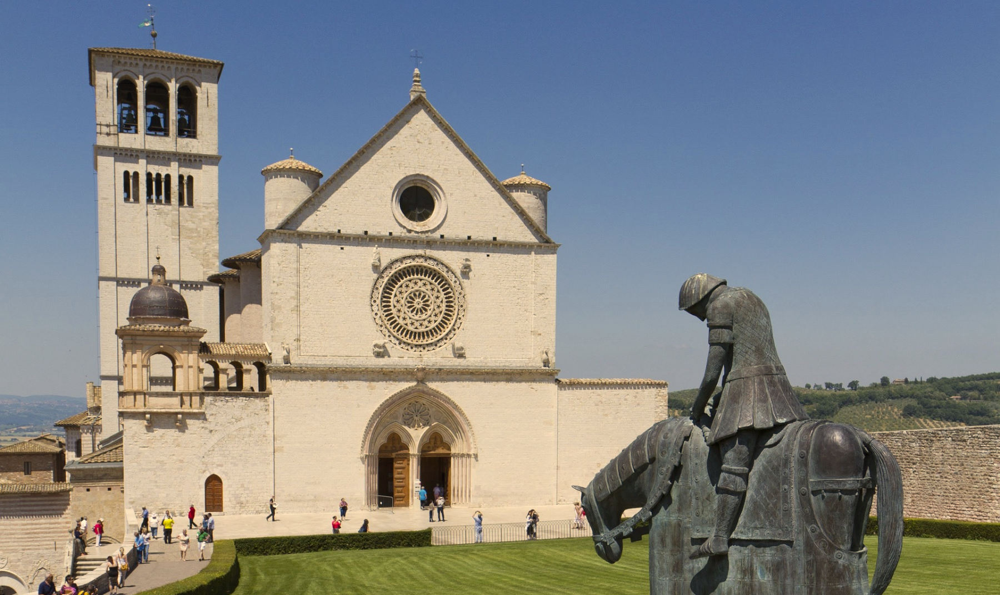

## Content

1. [Facts](/post/assisi/#facts)
2. [Life of St. Francis](/post/assisi/#life-of-st-francis)
3. [The Basilica(s)](/post/assisi/#the-basilicas)
4. [Lower Basilica](/post/assisi/#lower-basilica)  
  [Tomb of St. Francis](/post/assisi/#tomb-of-st-francis)  
  [St. Mary Magdalene](/post/assisi/#st-mary-magdalene)  
  [Cimabue's Majesty](/post/assisi/#cimabues-majesty-right-transept)  
  [Ceiling Above the High Altar](/post/assisi/#ceiling-above-the-high-altar)  
  [The Passion](/post/assisi/#the-passion-left-transept)  
5. [Upper Basilica](/post/assisi/#upper-basilica)  
  [Cimabue's Frescoes](/post/assisi/#cimabues-frescoes)  
  [Life of St. Francis](/post/assisi/#life-of-st-francis-1)
---
## Facts

- Francis of Assisi: 1181/82–1226
- Lower Basilica: 1228–1230
- Upper Basilica: 1239–1253
- Damaged by earthquake: 1997
- Restored: 1999

### Must-Sees

### Prayer Spots

## Life of St. Francis

Francis of Assisi (1181/82–1226), whose birth name was Francesco di Pietro di Bernardone, was an Italian saint and the **founder of the Franciscan religious order**. He was born into a **wealthy family** and served as a **soldier** before undergoing a spiritual transformation in his early twenties. He **gave away his wealth to the church** and dedicated his life to poverty and devotion. Having attracted followers whom he sent to preach throughout Europe, he restored faith in a Church that had become corrupt due to wealth and political ambition.

')

The Franciscan order was approved by Pope Innocent III in 1209. Francis emphasized the importance of **imitating Jesus**. He viewed **nature as a reflection of God**, referring to all creatures as his siblings. In 1219, Francis went to Egypt, where he **preached to the sultan**, and visited the holy places in Jerusalem. In 1224, he became the first person to receive **stigmata**.

## The Basilica(s)

The Basilica of St. Francis of Assisi, located in the town of Assisi in central Italy, is the mother church of the Roman Catholic Order of Friars Minor Conventual and is one of the most important places of pilgrimage in Italy. It is a Papal minor basilica and a UNESCO World Heritage Site. The Basilica consists of two churches (Upper and Lower) and a crypt where St. Francis is buried. These two churches or basilicas house works by the best late medieval painters such as **Cimabue** and **Giotto**.

')

[Cimabue](https://www.britannica.com/biography/Cimabue) was an Italian painter from the late 13th century. He is regarded as one of the pioneers of the Italian Renaissance and is credited with helping to bridge the gap between the Byzantine style of art and the more naturalistic style that would come to define the Renaissance. Cimabue's innovative use of perspective, as seen in his famous Madonna Enthroned painting, paved the way for future artists to explore new styles.

[Giotto](https://www.britannica.com/biography/Giotto-di-Bondone), a pupil of Cimabue, was an Italian painter from the 14th century who is widely regarded as one of the most significant artists of the early Renaissance. He is celebrated for his innovative use of perspective, his naturalistic depictions of human emotions and expressions, and his attention to detail. He took the Byzantine style of art and made it more realistic and humanistic. Giotto's works are easy to understand and are notable for portraying daily life as blessed, thereby combining the sacred and profane. Like St. Francis, Giotto made Christ more relatable and brought him down to earth.

## Lower Basilica

### Tomb of St. Francis

St. Francis’s tomb is situated halfway down the nave of the Lower Basilica, with staircases on either side leading to the crypt. Rather than being placed in a coffin or sarcophagus, his remains are actually housed within a **stone pillar**.

Initially, Francis was buried in the Church of San Giorgio, located near the city walls. However, concerns over **grave robbing** and the value of relics during that time led to his remains being moved to the basilica. The citizens went to great lengths to **protect his body**, even drilling down below the lower basilica to inter Francis.

For over **600 years**, the location of his grave was a mystery until Pope Pius VII permitted excavation of the lower basilica floor in 1818. After a 52-day search, **the tomb was rediscovered beneath iron bars**, and a Neo-Romanesque crypt was built to surround the burial site.

### St. Mary Magdalene
')

The Chapel of St. Mary Magdalene features Giotto's frescoes depicting the life of Mary Magdalene. Like St. Francis, she was a penitent saint. The most well-known fresco in the chapel is "**Christ Resurrecting Lazarus**."

### Cimabue's *Majesty* (Right Transept)
')

On the right side of the high altar, there is a painting of Mary and the Christ child surrounded by saints. This painting is known as a *Majesty* *(Maestà)*. The depiction of **St. Francis in this work is one of the earliest known images of him**.

### Ceiling Above the High Altar
')

Above the high altar, there is a fresco on the vaulted ceiling attributed to **Giotto** and his assistants. The fresco portrays St. Francis in a **majestic manner**, almost like a Byzantine emperor. It is an **unusual depiction for someone who promoted poverty**. This deviation from his humble image responded to the need to honor him as a leader. The rest of the ceiling fresco depicts the three virtues associated with the Franciscan order: **poverty**, **obedience**, and **chastity**.

### The Passion (Left Transept)
')

On the left side of the high altar, in the south transept, there is a series of frescoes by [Pietro Lorenzetti](https://www.britannica.com/biography/Pietro-Lorenzetti). These frescoes portray six stories related to the **Passion of Christ**. The most remarkable works in this cycle are "**Deposition**," which is a poignant image, and the "**Last Supper**," which is a more joyful scene. "The Last Supper" stands out because it is a rare example of a night scene that is illuminated and visually appealing.

## Upper Basilica

The Upper Basilica's interior is a notable example of **Gothic architecture** in Italy. It is decorated with frescoes by late medieval painters such as Cimabue and Giotto. The Basilica's exceptional art collection highlights the incredible development of Italian art during this period, especially when compared to the rest of Christian Europe. The Basilica, along with its accompanying friary, *Sacro Convento* (Sacred Convent), serves as a landmark for those approaching Assisi.

### Cimabue's Frescoes
')

Cimabue's frescoes decorate the **transept** and **apse** of the Upper Basilica. They have a distinct appearance that resembles **photographic negatives**. This can be attributed to the abundant use of lead-based paint which over time has undergone oxidation resulting in a surrealistic appearance.

The most captivating painting among these frescoes is located in the left transept and is titled "**Crucifixion**." This painting is particularly noteworthy for its depiction of expressive faces and dramatic gestures of the figures. These figures effectively draw the viewer's attention toward the cross, which holds immense significance in Franciscan thought.

### Life of St. Francis
')

**The Legend of St. Francis** by **Giotto** is a collection of 28 frescoes painted between 1297–1300, around the same time as the transept walls painted by Cimabue. They depict the life of St. Francis, including his youth, the creation of the first nativity scene at Greccio, Francis' encounter with the Egyptian Sultan, the Exorcism at Arezzo, and his death. To distinguish Francis from other characters in the frescoes, he is depicted wearing a **brown habit** and a **halo**.

#### Francis Receiving the Stigmata
')

The most famous fresco from the cycle is the "**Stigmatization of St. Francis**" (no. 19). In this painting, Francis receives a vision of an angel with six wings and a crucified figure. As a result, his hands and feet become marked with the **stigmata, representing the wounds of Christ's crucifixion**. The scene is depicted with rays from the vision illuminating Francis' hands and feet, while the rocky terrain is bathed in divine light.

#### Francis Renouncing His Worldly Goods
')

Another noteworthy fresco is Francis's "**Renunciation of Worldly Goods**" (no. 5). The figures in the fresco are divided into two groups: one represents **Francis's father**, symbolizing the past, while the other depicts **Francis with his hand raised towards God**, representing the future.
