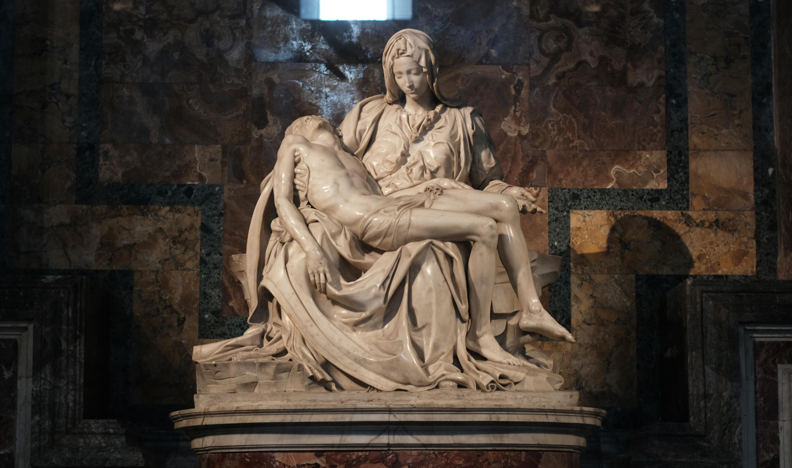
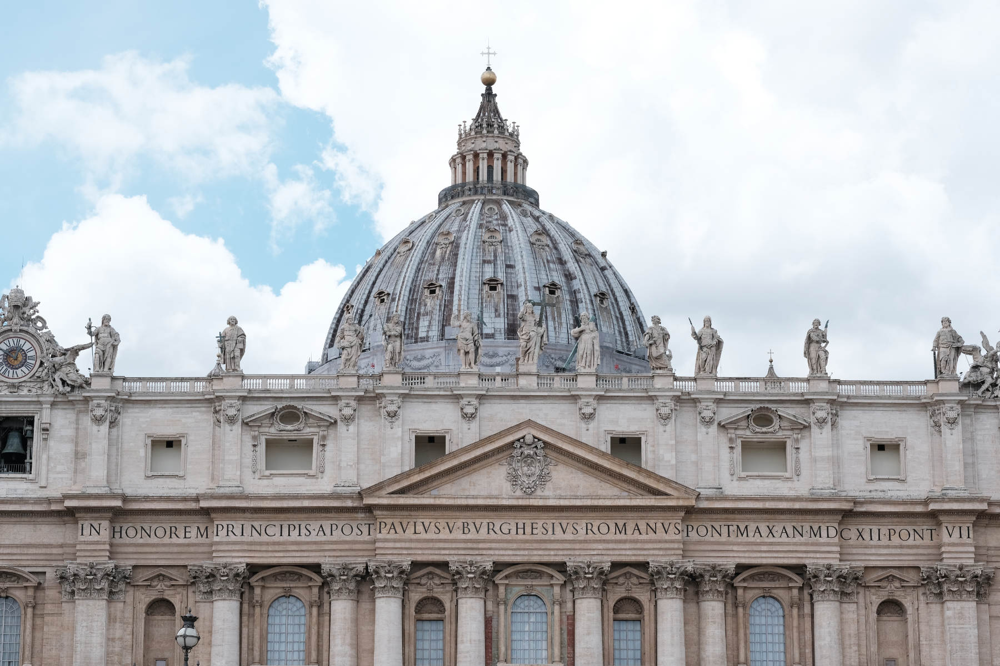

## Content

---
## Facts
Built: 319–333 | Rebuilt: 1506–1614

Emperor [**Constantine I**](https://www.britannica.com/biography/Constantine-I-Roman-emperor) built St. Peter's Basilica in the 4th century to honor Peter, who was crucified in year 64 at the Circus of Nero (Vatican Hill). The Basilica was built over Peter's resting place, now located under the main altar.

Due to **deterioration**, it was completely **reconstructed** over the course of almost 120 years (1506–1614), starting with the papacy of Julius II and ending with that of Paul V. The reconstruction was the work of some of the world’s **best architects and artists**, including Bramante, Raphael, Michelangelo (who designed the dome), Carlo Maderno (who designed the façade and portico), Bernini (who designed the colonnade, baldachin, and chair of St. Peter), and Giacomo Della Porta. The Basilica was **reconsecrated** in 1626 by Pope Urban VIII.

St. Peter’s Basilica is **Rome’s largest** church, spanning over 22,000 square meters. It is equivalent to **three soccer fields**. St. Peter’s was the largest church in the world until 1989, when it was exceeded in size by the newly built basilica in **Yamoussoukro, Ivory Coast**, Africa.
 
### Must-Sees
- Michelangelo’s Pietà  
- The Chair of St. Peter  
- Michelangelo’s Dome  
- Founder Saint Statues  
- Inscriptions on the Walls

### Prayer Spots
- Tomb of St. John Paul II (Chapel of St. Sebastian)
- Chapel of the Blessed Sacrament  
- Bronze Statue of St. Peter (c. 1200)  

Note: You can gain a plenary indulgence in this Basilica. See the requirements.

## Michelangelo’s Pietà

Date: 1498–1499

When you enter the Basilica, directly on your right stands Michelangelo’s Pietà. It depicts **Mary sustaining Jesus's dead body at Golgotha**. Michelangelo worked on it for two years. He was only **23 years old** when he finished it. It is **the only work he ever signed**: the sash running across Mary's chest contains the Latin inscription: “Michelangelo Buonarroti the Florentine was making this.”

## Monument to Christina of Sweden

Christina as Queen of Sweden: 1632–1654 

Then, there’s a somewhat underrated monument to Christina of Sweden. She is the brave **queen of Sweden who renounced her throne to become a Catholic**. Despite facing criticism from the Swedish nobility, she departed her country and resided in Rome until she passed away. A **crowned skull** below the inscription symbolizes our fleeting life and the reward for those who remain faithful.

## Tomb of John Paul II

John Paul II's Papacy: 1978–2005 | Canonized: 2014

As you walk down the right aisle, you’ll get to the altar of **St. Sebastian**, an early Christian martyr. The remains of Pope St. John Paul II lie under the altar. I encourage you to kneel for a while and ask for the third longest-serving pope to pray for you and your loved ones.

## Blessed Sacrament Chapel

Our next stop is the Blessed Sacrament Chapel, **reserved for prayer**. The Tabernacle of gilded bronze was designed by Bernini. Pietro da Cortona painted the altarpiece. It depicts the **Trinity**: the Father, the Son-made-man, and the Holy Spirit who guides the Church.

## Bronze Statue of St. Peter

Date: 5th/13th century

This statue's **right toes** are worn down by the touching and kissing of countless pilgrims. During the Middle Ages, pilgrims who arrived in Rome would **touch and kiss St. Peter’s foot**: they asked him for help in getting to heaven if they were to die during the pilgrimage.

## Chair of St. Peter

Date: 1657–1666 | Artist: Bernini

This magnificent sculpture houses **St. Peter’s wooden throne**. This throne symbolizes Peter's **teaching authority**. It also represents "the special mission of Peter and his Successors to tend Christ’s flock, keeping it united in faith and in charity."[^1] It is flanked by statues of four Doctors or Teachers of the Church: from left to right, they are Sts. **Ambrose**, **Athanasius**, **John Chrysostom**, and **Augustine**. Above the Chair of St. Peter, an alabaster window portrays the **Holy Spirit** in the form of a dove.

## Dome

Date: 1657–1666 | Artist: Michelangelo, Giacomo della Porta

At over **120 meters**, this is the world’s **tallest dome**. You can actually climb over **five-hundred steps** to the top and have a remarkable view of Rome and the Vatican Gardens.

Don’t forget to look at the **giant letters** on a gold background encircling the dome’s base. It is a text from Matthew 16:18, with which Jesus gave Peter the supreme authority: “*you are Peter, and on this rock I will build my church … [and] I will give you the keys of the kingdom of heaven*.”

Below the four Evangelists, you see **two more inscriptions**. From Sts. Veronica to Helen, it reads in Latin: “*From here, a single faith shines throughout the world*.” From Sts. Longinus to Andrew, it says: “*From here, the unity of the priesthood is born*.”

## *Loggias* of the Relics

The four statues, namely Veronica, Helen, Longinus, and Andrew, are located beneath their corresponding *loggias* (balconies). Behind them are rooms where **relics associated with these saints** are stored, **all relating to the Cross**. These relics are

- fragments of **Jesus's Cross** (above Helen);
- a **scrap of material**, showing the imprint of the face of a bearded man (above Veronica);
- a fragment of **St. Longinus's lance** (above Longinus); and
- **St. Andrew's head** (above Andrew).[^2]

## Founder Saint Statues

In St. Peter’s Basilica, there are **39 statues of founders of religious orders**. You’ll identify Sts. Louis de Montfort, Ignatius Loyola, John Bosco, Philip Neri, Vincent de Paul, Teresa of Jesus, and many more. These are people who served the Church by living out and developing the charism—the special grace—they received from God. For a complete list of these statues, [click here](https://stpetersbasilica.info/Statues/Founders/FounderSaints.htm).

## Maderno's Façade

Date: 1612 | Artist: Maderno

The façade inscription reads: “*In honor of the Prince of Apostles, Paul V Borghese, Roman, Supreme Pontiff, in 1612, the seventh of his pontificate*.” On top of the façade stand **13 statues**: Christ the Redeemer, John the Baptist, and eleven apostles including Matthias. Peter is not there since a five-meter statue of him stands on the south side of the square. Paul’s statue stands on the opposite side.

## Bernini’s Colonnades

Date: 1657–1667 | Artist: Bernini

Bernini’s Colonnades consist of 284 Doric columns and 88 pilasters of **travertine marble**. These columns are 13 meters tall and arranged in four rows. On top of them stand **140 statues of saints**. In Bernini's mind, these Colonnades represent **the arms of the Mother Church**, embracing all nations into her fold.

[^1]:Pope Benedict XVI, Angelus (February 19, 2012).
[^2]:It is no longer in St. Peter's Basilica since Pope Paul VI returned it to the Church of St. Andrew in Patras (Greece) in 1966.
