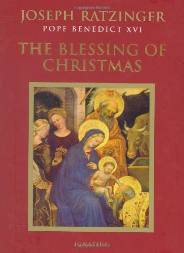

> Setting up the Christmas crèche in our homes helps us to relive the history of what took place in Bethlehem. Naturally, the Gospels remain our source for understanding and reflecting on that event. At the same time, its portrayal in the crèche helps us to imagine the scene. It touches our hearts and makes us enter into salvation history as contemporaries of an event that is living and real in a broad gamut of historical and cultural contexts.
> 
> —Pope Francis, *Admirabile signum*, §3

Christmas is the happiest moment of the year for many. In fact, countless beautiful childhood memories of mine are related to Christmas. I fondly remember our trips as a family during Christmas breaks. Decorating our Christmas tree also proved so much fun.

Another important memory of mine has to do with the first Nativity scene my parents bought for our home. Vacations and Christmas trees are splendid, yet it’s hard for me to think of a Christmas-related tradition that centers us on the mystery of God-made-man better than the [Nativity scene](https://glencairnmuseum.org/nativity-visualelements). By meditating on the figures of the crèche, we shall better appreciate the meaning of Christmas.

  

    

      
    

  

  

    <h4>
      <a href="https://amzn.to/3Is12iC" target="_blank" rel="noopener noreferrer">
        The Blessing of Christmas
      </a>
    </h4>
    <h5>Pope Benedict XVI</h5>
    
This collection of insightful writings and sermons by Pope Benedict XVI will prepare you to receive the blessings of the Advent and Christmas season.

  

# 1. The Shepherds and the Magi

Let’s begin our reflection by looking at the shepherds and the [magi](https://www.catholic.com/encyclopedia/magi). Our first question would be: why are they there?

In one of his talks, [Fulton Sheen](https://amzn.to/3D0TQ9j) wittily remarks that shepherds are those who know *they know nothing*. Magi, on the other hand, are those who know *they don’t know everything*.

')

We don’t find the know-it-alls, in contrast, at the Nativity scene. Only the humble are there. [Humility](https://www.ncregister.com/blog/mother-teresas-15-tips-to-help-you-become-more-humble): that’s what we should learn from the shepherds and the magi. That’s their “entrance ticket” to the Nativity scene. That’s also what is required of us if we want to approach the baby Jesus.

')

One afternoon back in 2019, I was seated in a bus. I was so thrilled when I heard our tour guide say: “Welcome to [Bethlehem](https://www.britannica.com/place/Bethlehem)!” Our main destination there was the [Basilica of the Nativity](https://en.wikipedia.org/wiki/Church_of_the_Nativity). 

As we approached the Basilica, the first thing that struck me was how low the entrance was. It used to be 5.5 meters high. Yet, during the [Ottoman Era](https://www.britannica.com/place/Ottoman-Empire), it was reduced to about 1.2 meters to prevent people from entering on horseback. So, unless your height is less than 1.2 meters, you better duck your head in order to pass through.

')

That’s what Bethlehem teaches us: to recognize who the baby Jesus is, we have to bow down. We must dismount the horse of our pride. To approach his birthplace, we ought to be humble.

# 2. The Ox and the Ass

The tradition of setting up Nativity scenes can be traced back to the Christmas Mass celebrated by [St. Francis](https://www.britannica.com/biography/Saint-Francis-of-Assisi) at a cave in [Greccio](http://www.visitgreccio.com/en/attraction/shrine-greccio#), Italy, in 1223. Curiously, prior to the Mass, the saint had directed that an [ox](https://www.britannica.com/animal/ox-mammal-Bos-taurus) and an [ass](https://www.britannica.com/animal/ass) should be present there.[^1] These two animals are also present in numerous Christmas carols (e.g., “[Good Christian Men Rejoice](https://youtu.be/gkCjddxp1g4),” “[What Child is This](https://en.wikisource.org/wiki/What_Child_Is_This%3F),” “[The Little Drummer Boy](https://youtu.be/qJ_MGWio-vc)”).

The questions would be: why an ox and an ass? What do they have to do with Christ’s birth? Where does the Bible mention them?

')

We find a reference to these animals in the [Book of Isaiah](https://www.youtube.com/watch?v=d0A6Uchb1F8). The prophet was then contrasting the wickedness and disobedience of Judah to the *understanding of the animals*:

> The ox knows its owner, and the ass its master’s crib; but Israel does not know, my people does not understand.
> 
> —Isaiah 1:3

In fact, Jesus was born surrounded by humanity’s wickedness and disobedience. 

Can we affirm that we *know* Jesus as the ox knows its owner? Or, at least, do we seek to *know* *him better*? If we recognize him as our owner, as our Lord, there’s a place for us near his crib.

# 3. Mary and Joseph

Near the baby Jesus stand Mary and Joseph, gazing at God-made-man. Words are incapable of expressing what’s before them. They are both silent. Pope Francis writes that

> [t]he birth of a child awakens joy and wonder; it sets before us the great mystery of life. Seeing the bright eyes of a young couple gazing at their newborn child, we can understand the feelings of Mary and Joseph who, as they looked at the Infant Jesus, sensed God’s presence in their lives.
> 
> —Pope Francis, *Admirabile signum*, §8

Mary and Joseph are discreet figures in the New Testament. [Mary speaks](https://udayton.edu/imri/mary/b/bible-quotes-by-mary.php) only six sentences plus one canticle. She mainly “treasured up all these things and pondered them in her heart” (Lk 2:19). What about Joseph? He says not a word in the Scripture! He is more of a worker who acts promptly in carrying out God’s will.

')

Silence. In this noisy world, silence has become a sign of contradiction, a lost art.

Yet silence is priceless. It indicates openness and readiness to listen. Our society and family would be a much better place if we listen to one another more attentively (yes … [put your smartphone away for a moment](https://www.verywellfamily.com/negative-effects-of-too-much-cell-phone-use-621152), will you?). Our silence tells the other person that she matters; that she is worth our time.

In this noisy, indifferent, and superficial world, we can surely benefit from learning from Mary and Joseph the arts of silence, listening, and contemplation.

# 4. The Host of Angels

A host of angels appeared to the shepherds. The Greek word for host is *stratias*—think, for example, of ‘strategy’—which means ‘army.’ We read that

> suddenly there was with the angel a multitude of the heavenly host, praising God and saying, “Glory to God in the highest heaven, and on earth peace among those whom he favors!”
> 
> —Luke 2:13–14

The army of angels manifests God’s might. God is powerful in such a way that he can make use even of human malice in order to bring about good.

')

In order to maintain order in his empire, the shrewd Roman [Emperor Hadrian](https://www.britannica.com/biography/Hadrian) (r. AD 117–138) sought to erase the memory of the sacred places from the minds of Christians. In AD 135, he converted Jesus’ birthplace in Bethlehem into a sacred forest in honor of [Adonis](https://www.greekmythology.com/Other_Gods/Minor_Gods/Adonis/adonis.html), the god of beauty and desire. By building a pagan temple there, he hoped to make Christians forget where Jesus was born.

Well, not so. In fact, the contrary happened: they remembered it all the more! When Christians were asked to indicate exactly where Christ’s birthplace was, they would simply say: “There, where the sacred forest of Adonis is.” On that very spot, the Christian [Emperor Constantine](https://en.wikipedia.org/wiki/Constantine_the_Great_and_Christianity) (r. AD 306–337) would eventually build the Basilica of the Nativity, consecrated in AD 339.

See? God makes use of evil in order to bring about good.

# 5. The Baby Jesus

Finally, our Nativity scene becomes alive when we lay baby Jesus down on the manger. There are two important things we can notice concerning him.

')

The first thing we note is that Jesus came in silence and humility: he came as a weak and dependent baby. He could have chosen to come as an adult, but he didn’t. Why? Because he wants to show us more clearly that he is true God *and* true Man: he was able to “sympathize with our weaknesses,” since he “has been tested as we are, yet without sin” (Heb 4:15). In addition, his weakness is strategic, as Joseph Ratzinger explains: “God comes without weapons, because he does not want to conquer from the outside but to *win us over from within* and to *transform us from within*.”[^2] St. Thomas Aquinas says something similar: 

> Since Christ willed to be born of a virgin, why did He will that His mother be espoused? … [It] was so that *His birth might be hidden from the devil*, lest, to wit, if he knew, he might impede His Passion, and the fruit of our redemption.
> 
> —St. Thomas Aquinas, *Commentary on the Gospel of St. Matthew*, in loc. Mt 1:12–21

The second thing we observe is that baby Jesus was laid *in a* [*manger*](https://en.wikipedia.org/wiki/Manger) (Lk 2:7). St. Augustine remarks: “Laid in a manger, he became our food.”[^3] Jesus lets us consume him. In fact, he was born in Bethlehem, which in Hebrew means “House of Bread.” Now, in the Eucharist, he has become for us the Bread of Life.

')

As we contemplate Jesus offering himself as our food, the figure of Joseph becomes even more significant. The [tabernacle](https://www.catholic.com/qa/what-is-a-tabernacle) key of some chapels and churches has a medal attached to it that reads: “*Ite ad Joseph*”—“[Go to Joseph](https://aleteia.org/2020/12/10/why-is-go-to-joseph-a-prayer/)”—(Gen 41:55).[^4] This phrase, which refers in reality to [Joseph the son of Jacob](https://www.britannica.com/biography/Joseph-biblical-figure), has popularly been applied to Joseph the husband of Mary. Like the Old Testament Joseph, who fed the entire nation of Israel, the New Testament Joseph also gives us food to eat. Yet he nourishes us not with grain out of which ordinary bread is made (Gen 42–44), but with the **Bread of Life**, with Jesus himself (Jn 6:35).

[^1]:See Ratzinger, [*The Blessing of Christmas*](https://amzn.to/3cWxmff), 77.
[^2]:Ratzinger, [*The Blessing of Christmas*](https://amzn.to/3cWxmff), 75–76.
[^3]:St. Augustine, *Sermon*, 189, 4.
[^4]:“When all the land of Egypt was famished, the people cried to Pharaoh for bread. Pharaoh said to all the Egyptians, ‘Go to Joseph; what he says to you, do’” (Gen 41:55).