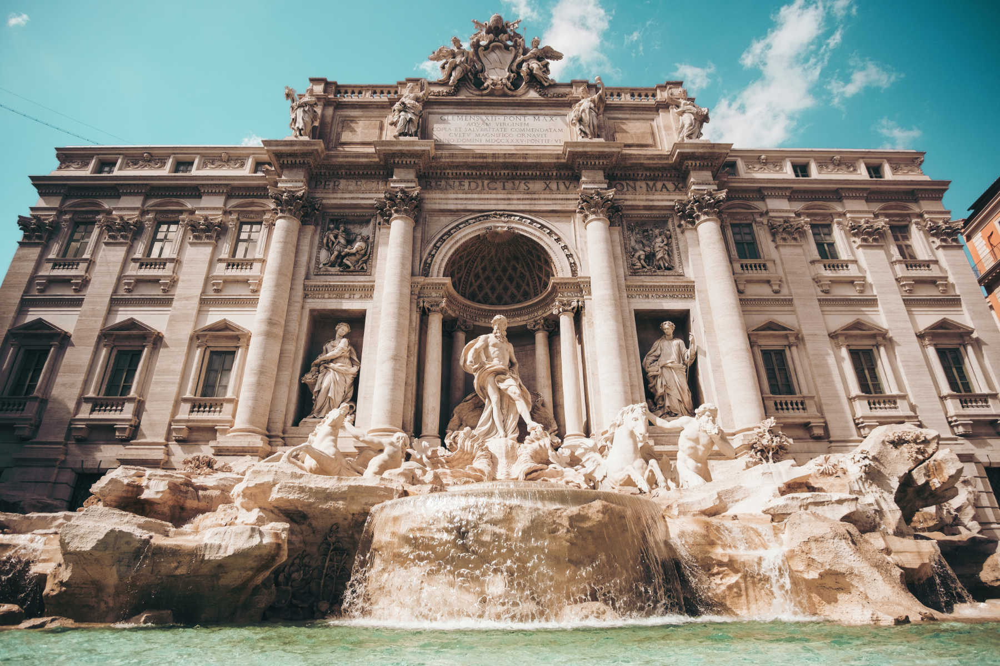

---
title: Colosseum & Trevi Fountain
featuredImage: colosseum1.jpg
format: Article
date: 2023-04-14
category:
  - History
excerpt: The Colosseum, an iconic ancient Roman landmark in Rome, Italy, was built almost 2,000 years ago and is considered one of the greatest engineering and architectural achievements of the Roman Empire. It was primarily used for gladiatorial contests and public spectacles. Today, the Colosseum remains one of the most visited tourist attractions in Rome, attracting millions of visitors each year. The Trevi Fountain, also located in Rome, is a Baroque masterpiece designed by architect Nicola Salvi in the 18th century. The fountain's cascading waters and ornate sculptures have made it one of the most popular landmarks in Rome, attracting millions of visitors each year.
---
## Colosseum

Built: 72-80 AD
    
The Colosseum, also known as the **Flavian Amphitheatre**, is an iconic ancient Roman landmark located in the heart of Rome, Italy. Built almost 2,000 years ago, it is considered one of the greatest engineering and architectural achievements of the Roman Empire.

The Colosseum was primarily used for **gladiatorial contests** and **public spectacles** such as animal hunts, mock sea battles, and public executions. It could hold up to 80,000 spectators and was renowned for its complex system of tunnels, elevators, and trapdoors for the performers and animals.

Today, the Colosseum remains one of the most visited tourist attractions in Rome, attracting millions of visitors each year. The Colosseum also serves as a venue for **cultural events** and **concerts**. Despite its dark history, the Colosseum remains a testament to the enduring legacy of ancient Rome.

It is possible that some Christians may have been martyred in the Coliseum, but **we do not have enough information to confirm or deny this**. Additionally, there is not enough evidence to support the claim that St. [Ignatius of Antioch](https://www.britannica.com/biography/Saint-Ignatius-of-Antioch) was martyred in the Colosseum.

## Trevi Fountain

Built: 1732–1762
    
The Trevi Fountain is a Baroque masterpiece located in the Trevi district of Rome, Italy. It was designed by architect **Nicola Salvi** and completed by **Giuseppe Pannini** in the 18th century. The fountain's cascading waters and ornate sculptures have made it one of the most popular landmarks in Rome, attracting millions of visitors each year. According to tradition, tossing a coin into the fountain with one's right hand over their left shoulder ensures that the thrower will return to Rome.

In the middle of the Trevi Fountain, there is a statue of **Oceanus**, the Titan god of the Ocean. He rides a chariot pulled by seahorses and led by tritons. On the left is a statue of **Abundance** holding a horn of plenty. On the right is a statue of Health holding a cup with a snake drinking from it. Above Abundance is a statue of **Agrippa**, a Roman general who repaired the aqueducts to bring water to the city's baths. Above **Health** is a statue of a **virgin**, representing the legend of a girl who led thirsty soldiers to water.

The fountain also has plants like figs, grapes, and artichokes. On the right side, there is an urn that was added to block the view of an ugly barber's shop. At the top of Palazzo Poli, there are four statues that represent the earth's bounty: **fruits, crops, autumn harvest, and flowers**. 

The Trevi Fountain is crowned with the coat of arms of Pope [Clement XII](https://www.britannica.com/biography/Clement-XII), who commissioned the fountain. He was also the Pope who finished the rebuilding of the [Basilica of St. John Lateran](/post/lateran/) in 1735.
