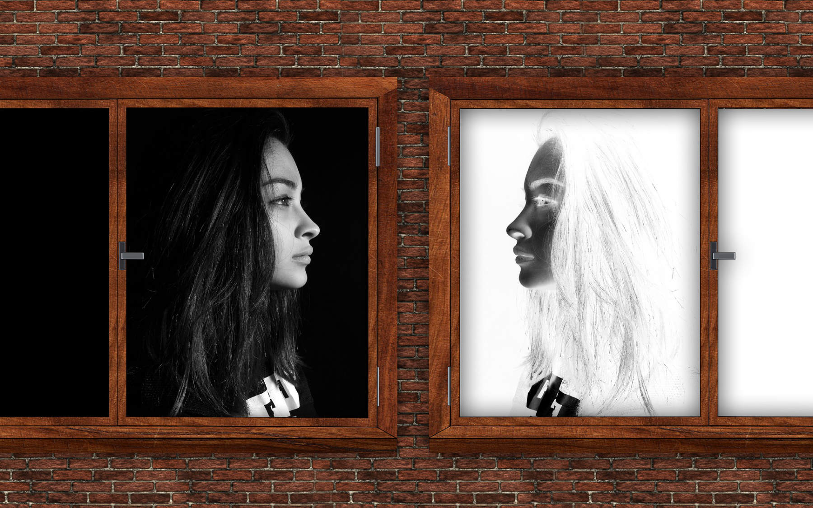
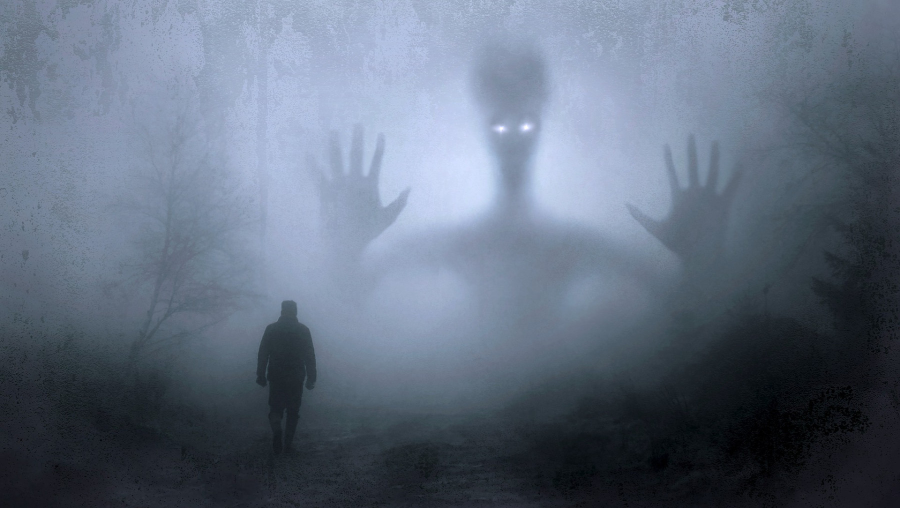
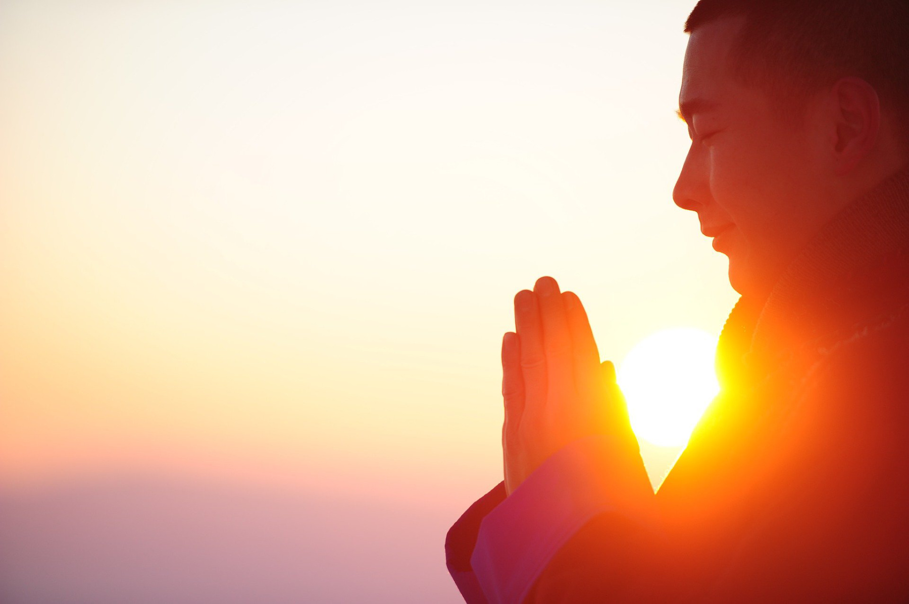
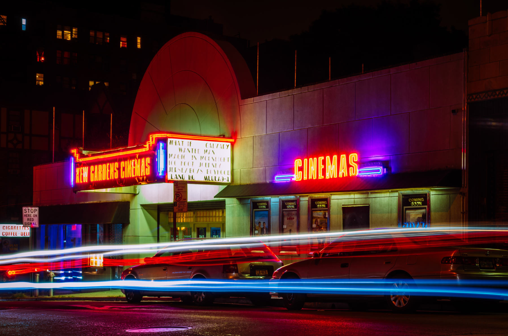

Saya adalah penggemar *superheroes*. Menyamar sebagai [Power Ranger](https://www.imdb.com/title/tt0106064/) di sebuah acara sekolah adalah salah satu kenangan masa kecil yang berkesan bagi saya. Selain Power Rangers, saya juga menggemari [Marvel](https://www.marvel.com/). Sesungguhnya, saya tidak ingin tumbuh terlalu cepat karena saya masih menikmati hiburan anak-anak.

Selama saya mendalami teologi beberapa tahun terakhir, saya sering bertanya-tanya apakah kisah-kisah *superheroes* bisa bermanfaat dalam pewartaan Injil. Di antara film-film Marvel yang saya sukai, saya memilih [*Doctor Strange*](https://www.imdb.com/title/tt1211837/) (2016) sebagai sampel dan meneliti apakah film ini bisa menjadi sarana evangelisasi yang efektif. Setelah membandingkannya dengan iman kristiani, saya mengambil kesimpulan bahwa ***Doctor Strange*** **dapat menjadi sarana evangelisasi yang berharga apabila penonton mampu menimba konten kristiani yang ada sekaligus mengenali unsur-unsur** ***New Age*** **di dalamnya sebagai unsur-unsur yang tidak sesuai dengan iman kristiani**.

---

## Daftar Isi

1. [Deskripsi Doctor Strange](/id/post/doctor-strange-new-age-and-christianity/#1-deskripsi-doctor-strange)  
	1.1. [Pencipta: Stan Lee](/id/post/doctor-strange-new-age-and-christianity/#11-pencipta-stan-lee)  
	1.2. [Sutradara: Scott Derrickson](/id/post/doctor-strange-new-age-and-christianity/#12-sutradara-scott-derrickson)  
	1.3. [Sinopsis Film](/id/post/doctor-strange-new-age-and-christianity/#13-sinopsis-film)  

2. [Kekristenan dalam *Doctor Strange*](/id/post/doctor-strange-new-age-and-christianity/#2-kekristenan-dalam-doctor-strange)  
  
	2.1. [Konten Filosofis-Antropologis](/id/post/doctor-strange-new-age-and-christianity/#21-konten-filosofis-antropologis)  
	. . 2.1.1. [Spiritualitas](/id/post/doctor-strange-new-age-and-christianity/#211-spiritualitas)  
	. . 2.1.2. [Hati Nurani](/id/post/doctor-strange-new-age-and-christianity/#212-hati-nurani)  
	. . 2.1.3. [Keabadian](/id/post/doctor-strange-new-age-and-christianity/#213-keabadian)  
	. . 2.1.4. [Martabat](/id/post/doctor-strange-new-age-and-christianity/#214-martabat)  
  
	2.2. [Konten Religius](/id/post/doctor-strange-new-age-and-christianity/#22-konten-religius)  
	. . 2.2.1. [Pertobatan](/id/post/doctor-strange-new-age-and-christianity/#221-pertobatan)  
	. . 2.2.2. [Ketekunan](/id/post/doctor-strange-new-age-and-christianity/#222-ketekunan)  
	. . 2.2.3. [Makna Hidup](/id/post/doctor-strange-new-age-and-christianity/#223-makna-hidup)  
	. . 2.2.4. [Pengorbanan Bagi Orang Lain](/id/post/doctor-strange-new-age-and-christianity/#224-pengorbanan-bagi-orang-lain)  
	. . 2.2.5. [Allah dan Iblis](/id/post/doctor-strange-new-age-and-christianity/#225-allah-dan-iblis)  
	. . 2.2.6. [Ungkapan Alkitabiah](/id/post/doctor-strange-new-age-and-christianity/#226-ungkapan-alkitabiah)  
  
3. [New Age dalam *Doctor Strange*](/id/post/doctor-strange-new-age-and-christianity/#3-new-age-dalam-doctor-strange)  
  
	3.1. [Apa itu New Age?](/id/post/doctor-strange-new-age-and-christianity/#31-apa-itu-new-age)  
	. . 3.1.1. [Esoterisme](/id/post/doctor-strange-new-age-and-christianity/#311-esoterisme)  
	. . 3.1.2. [Sinkretisme](/id/post/doctor-strange-new-age-and-christianity/#312-sinkretisme)  
	. . 3.1.3. [Narsisisme](/id/post/doctor-strange-new-age-and-christianity/#313-narsisisme)  
  
	3.2. [Apa yang ditawarkan oleh New Age?](/id/post/doctor-strange-new-age-and-christianity/#32-apa-yang-ditawarkan-oleh-new-age)  
	. . 3.2.1. [Alam Gaib](/id/post/doctor-strange-new-age-and-christianity/#321-alam-gaib)  
	. . 3.2.2. [Kesembuhan](/id/post/doctor-strange-new-age-and-christianity/#322-kesembuhan)  
	. . 3.2.3. [Holisme](/id/post/doctor-strange-new-age-and-christianity/#323-holisme)  
  
4. [Kesimpulan: *Doctor Strange* dan Evangelisasi](/id/post/doctor-strange-new-age-and-christianity/#4-kesimpulan-doctor-strange-dan-evangelisasi)  
	4.1. [Kerinduan akan Makna](/id/post/doctor-strange-new-age-and-christianity/#41-kerinduan-akan-makna)  
	4.2. [Kerinduan akan Keselamatan](/id/post/doctor-strange-new-age-and-christianity/#42-kerinduan-akan-keselamatan)  

---

## 1. Deskripsi *Doctor Strange*

### 1.1. Pencipta: Stan Lee

Doctor Stephen Strange adalah tokoh fiktif yang diciptakan oleh [Stan Lee](https://en.wikipedia.org/wiki/Stan_Lee) (1922–2018). Tokoh ini muncul pertama kalinya dalam komik Marvel *Strange Tales* #110 pada bulan April 1963.[^1] Stan Lee juga menciptakan tokoh-tokoh Marvel lainnya seperti Spider-Man, Fantastic Four, X-Men, Hulk, Iron Man, Thor, Daredevil, dan Black Panther.[^2]

Motivasi Stan Lee di balik penciptaan Doctor Strange tidaklah jelas. Namun, kita dapat mengamati bahwa kemunculan tokoh ini selaras dengan tren dalam dunia komik pada paruh pertama abad kedua puluh, ketika komik-komik yang menampilkan penyihir seperti [*Mandrake the Magician*](https://en.wikipedia.org/wiki/Mandrake_the_Magician) karya Lee Falk dan [*Zatara*](https://en.wikipedia.org/wiki/Zatara) (1938) karya Fred Guardineer diterbitkan.[^3]

### 1.2. Sutradara: Scott Derrickson

*Doctor Strange* adalah *origin story* Marvel yang dirilis tahun 2016. [Scott Derrickson](https://en.wikipedia.org/wiki/Scott_Derrickson) (1966–), yang menyutradarai *Doctor Strange* (2016), telah meraih popularitas melalui karya-karyanya sebelumnya, seperti *The Exorcism of Emily Rose* (2005), *Sinister* (2012), dan *Deliver Us from Evil* (2014). Sebagai “seseorang di Hollywood yang terbuka mengenai identitas kristianinya,"[^4] dia dideskripsikan sebagai "seorang *Presbyterian* yang dekat dengan iman Katolik."[^5] Dia sendiri mengungkapkan bahwa dia “hampir senantiasa [mengenakan] rosario Santo Fransiskus” dan menganggap dirinya “satu buku Chesterton jauhnya dari menyeberangi Sungai Tiber.”[^6]

Dengan mengetahui latar belakang religiusnya, kita tidak lagi heran melihat tema-tema *kebaikan*, *kejahatan*, dan *misteri* menempati tempat yang penting dalam karya-karya Derrickson. Dia secara khusus menekankan kehadiran misteri di dunia ini:

> Banyak orang mengatakan bahwa *dunia ini dapat dijelaskan*. Dunia perusahaan di Amerika melihat dunia hanya dari segi konsumerisme. Ilmu pengetahuan melihat dunia hanya sebagai *dunia material*. Bahkan agama bisa menawarkan banyak teori untuk menjelaskan segalanya mengenai dunia.
> 
> Saya pikir kita memerlukan dunia perfilman untuk menentang tren tersebut dan mengingatkan kita bahwa *kita tidak memegang kendali, dan kita tidak mengerti sebaik yang kita bayangkan*. … [Flannery O'Connor] mengatakan hal berikut mengenai iman Katolik: Gereja Katolik adalah *satu-satunya institusi yang tersisa di dunia yang melindungi misteri*. Saya pikir pernyataan ini benar.[^7]

### 1.3. Sinopsis Film

Kisah *Doctor Strange* dapat diringkas dalam enam momen berikut:

1. **Karir yang sukses**: Strange adalah seorang ahli bedah saraf yang sangat terkenal.
2. **Kecelakaan mobil**: Strange kehilangan kendali atas kedua tangannya.
3. **Mencari kesembuhan**: Setelah pengobatan medis gagal, Strange mengikuti nasihat Pangborn dan pergi ke Kamar-Taj untuk mencari pengobatan alternatif.  
4. **Pelatihan di Kamar-Taj**: Strange, yang dibantu oleh Mordo, mulai memperoleh keterampilan dalam seni mistik di bawah bimbingan Ancient One.
5. **Panggilan yang baru**: Strange menemukan misi barunya untuk menyelamatkan nyawa bukan melalui kedokteran alih-alih melalui seni mistik.
6. **Negosiasi dengan Dormammu**: Strange berhasil mengusir Dormammu dan menyelamatkan bumi.

## 2. Kekristenan dalam *Doctor Strange*

Saat ini, saya akan membedah ide-ide kristiani yang mendasari *Doctor Strange* dan yang menjadikannya sebuah karya yang berguna untuk evangelisasi. Saya akan mengulas baik konten filosofis-antropologis maupun konten religius.

### 2.1. Konten Filosofis-Antropologis

#### 2.1.1. Spiritualitas

Selaras dengan antropologi kristiani,[^8] *Doctor Strange* membantah paham-paham seperti *scientism* (pengetahuan hanya berasal dari *hard sciences*), empirisme (pengetahuan hanya berasal dari pengalaman), dan materialisme (materi adalah satu-satunya realitas yang ada). Film ini melakukannya dengan membedakan dengan jelas antara alam fisik dan alam spiritual.[^9]

Paham-paham di atas dianut oleh Strange sebelum pelatihannya di Kamar-Taj (“Mahkota Bulan” dalam bahasa Arab[^10]):

> Strange: “*Tidak ada yang namanya roh!* Kita terbuat dari materi dan hanya materi. Kamu hanyalah bintik kecil yang hidup sesaat dalam alam semesta.[^11]

Ancient One justru mengajarkan sebaliknya:

> Ancient One: “Menurut kamu, hanya ada alam materiil?”[^12] “Misteri-misteri apa yang berada di luar jangkauan indramu?"[^13]

#### 2.1.2. Hati Nurani

Moral kristiani menegaskan bahwa ”tujuan tidak membenarkan sarana.”[^14] Keputusan Ancient One untuk menimba kekuatan dari Dimensi Gelap jelas melanggar prinsip ini:

> Ancient One: “Saya tidak suka menimba kekuatan dari Dimensi Gelap. Namun, seperti yang kamu ketahui, terkadang *seseorang harus melanggar aturan untuk melayani kebaikan yang lebih besar*.”[^15]

Tanpa disangka-sangka, beberapa dialog dalam *Doctor Strange* tampak didasari pada ide kristiani mengenai hati nurani. Pertama-tama, menurut moralitas kristiani, hati nurani memiliki sifat yang mengikat.[^16] Hal ini tampak dalam pernyataan berikut:

> Strange: “[Ancient One] melakukan apa yang *dia pikir benar*.”[^17]

Kedua, hati nurani menuntut tanggung jawab.[^18] Dengan kata lain, setiap tindakan membawa konsekuensi, seperti yang sering ditekankan oleh Mordo:

> Mordo: “Kita melanggar aturan, sama seperti dia [Ancient One]. Kita pun akan menerima tagihan. Selalu! Sebuah pertanggungjawaban.”[^19]

#### 2.1.3. Keabadian

Manusia merindukan keabadian. Kata Gabriel Marcel: “Mencintai seseorang berarti mengatakan kepadanya: *Kamu tidak akan mati*.”[^20] Keinginan ini terungkap sepanjang film *Doctor Strange*. Ada banyak rujukan pada "kehidupan kekal."[^21] Ironisnya, rujukan-rujukan tersebut datang kerap kali dari seseorang yang memiliki gagasan yang suram mengenai hidup abadi:

> Strange: "Apa yang akan kamu peroleh dari utopia *New Age* ini?"
> 
> Kaecilius: “Sama denganmu. Sama dengan semua orang: *hidup ... hidup kekal*.“[^22]

#### 2.1.4. Martabat

*Doctor Strange* mengandung pembelaan atas *martabat hidup manusia*. Dalam budaya zaman ini, hidup manusia sering dilihat hanya sebagai sarana untuk mencapai 'kualitas' hidup, yakni, kehidupan yang *dianggap* berharga. Kekristenan dan filsafat yang benar, sebaliknya, selalu mempertahankan hidup manusia sebagai sebuah *kebaikan yang mendasar*—sebuah kebaikan yang tidak memerlukan pembuktian.[^23] Hidup *selalu* berharga.

Paham ini tampak dalam sebuah percakapan yang menegangkan antara Strange dan Palmer setelah pengobatan medis gagal menyembuhkan Strange:

> Strange: “Hidup tanpa pekerjaanku …”
> 
> Palmer: “… tetap adalah hidup. *Ini bukanlah sebuah akhir*. Ada hal-hal lain yang dapat memberi makna bagi hidupmu.”[^24]

### 2.2. Konten Religius

#### 2.2.1. Pertobatan

*Doctor Strange* adalah sebuah kisah pertobatan. Ada dua momen pertobatan dalam hidup Strange. Pertama, dia berjalan dari arogansi menuju kerendahan hati—atau, setidaknya, menuju pengakuan atas kesombongan dan kekecilannya di dalam *Multiverse* yang luas.[^25] Tidaklah mengherankan bahwa pernyataan “*ini bukan tentang kamu*” (“*it’s not about you*”) menjadi salah satu benang merah dalam film ini.

Kedua, Strange yang awalnya bersikap skeptis dan materialistis berubah menjadi seseorang yang terbuka terhadap realitas spiritual dan menyadari keterbatasan pengetahuannya. Namun proses ini tidak terjadi dalam waktu singkat. Seperti proses pertobatan pada umumnya, pertobatan Strange menuntut waktu:

> Strange: “Ini tidak masuk akal.”
> 
> Ancient One: ”Tidak semuanya masuk akal. *Tidak semuanya harus bisa dimengerti*. Kecerdasanmu telah mengantar kamu ke tempat yang jauh dalam hidupmu, namun kecerdasanmu tidak akan membawamu lebih jauh lagi.”[^26]

#### 2.2.2. Ketekunan

*Doctor Strange* adalah sebuah kisah ketekunan. Ketekunan tampak dalam disiplin diri yang dituntut kepada para penduduk di Kamar-Taj. Disiplin, yang dalam teologi dikenal sebagai bagian dari mati raga, merupakan bagian yang tak terpisahkan dari hidup rohani kristiani.

Ketekunan juga nyata dalam upaya Strange untuk mengusir Dormammu. Dengan memanfaatkan kemampuannya untuk memundurkan waktu, dia siap mencoba berkali-kali untuk membuat Dormammu meninggalkan bumi. Strange *berulang kali* datang dan berseru, ”Dormammu, aku datang untuk bernegosiasi.”[^27] Ketika kita mengamati adegan ini, kita diingatkan akan ketangguhan Bartimeus ([Mrk 10:46–52](https://www.bible.com/bible/306/MRK.10.TB)) dan ketekunan janda dalam perumpamaan Yesus tentang hakim yang tak benar ([Luk 18:1-8](https://www.bible.com/bible/306/LUK.18.TB)).

#### 2.2.3. Makna Hidup

Ada dua hal yang membuat hidup bermakna: panggilan *(vocation)* dan kematian. Pertama-tama, panggilan adalah “tujuan akhir yang kita miliki dalam hidup di dunia ini dan di akhirat.”[^28] Panggilan berkaitan erat dengan tujuan hidup. Panggilan mendasar orang kristiani adalah mengasihi dan melayani Allah. Pemenuhan panggilan ini tidak lain adalah “kebahagiaan abadi.”[^29]

Di satu sisi, *Doctor Strange* juga merupakan kisah panggilan. *Doctor Strange* menampilkan tokoh-tokoh yang mencari *makna hidup*, terutama Mordo,[^30] Kaecilius,[^31] dan Strange sendiri. Profesi medis Strange membantunya menemukan panggilannya untuk melindungi umat manusia:

> Strange [saat ia dipercayakan untuk menjaga *New York Sanctum*]: “Ketika saya menjadi seorang dokter, saya bersumpah untuk tidak menyakiti … dan saya baru saja membunuh seseorang! Saya tidak akan melakukannya lagi. *Saya menjadi dokter untuk menyelamatkan jiwa, bukan untuk mengambilnya*."[^32]

Meski demikian, Strange sungguh menyadari panggilannya untuk menyelamatkan umat manusia dari Dimensi Gelap setelah ia kehilangan kendali atas tangannya:

> Strange: Kamu mengatakan bahwa kehilangan tanganku tidak harus menjadi sebuah akhir ... namun bisa menjadi sebuah permulaan.”
> 
> Palmer: “Ya. Karena ada banyak cara lain untuk menyelamatkan nyawa.”
> 
> Strange: “Cara yang lebih sulit.”
> 
> Palmer: “Cara yang lebih aneh.”[^33]

Panggilan, yang seringkali menuntut seseorang untuk meninggalkan harta benda atau relasi yang ia miliki (lih. [Mat 19:29](https://www.bible.com/bible/306/MAT.19.TB)), disinggung dalam ulasan resmi Marvel tentang film ini:

> Tak lama kemudian, Strange—yang dipersenjatai dengan kekuatan magis yang baru ia peroleh—harus memilih untuk kembali ke kehidupan yang penuh dengan kekayaan dan kehormatan atau *meninggalkan segalanya untuk mempertahankan bumi* sebagai penyihir yang paling kuat.[^34]

Selain panggilan, kematian juga membuat hidup bermakna. Seseorang yang tidak mengakui kebenaran ini melihat kematian sebagai sebuah penghinaan:

> Kaecilius: “Dunia ini bukanlah dunia yang ideal. Manusia merindukan keabadian, dunia yang melampaui waktu, karena waktu memperbudak kita. Waktu adalah sebuah penghinaan. *Kematian adalah sebuah penghinaan*."[^35]

Sebaliknya, seseorang bisa melihat kematian sebagai sumber makna alih-alih perbudakan:

> Ancient One: “Kematian membuat hidup bermakna: mengetahui bahwa *hari-harimu terhitung … waktumu singkat*.”[^36]

Ungkapan terakhir ini tentunya mengingatkan kita akan salah satu perkataan Paulus: “Saudara-saudara, inilah yang kumaksudkan, yaitu: *waktu telah singkat*” (1Kor 7:29).

#### 2.2.4. Pengorbanan Bagi Orang Lain

*Doctor Strange* adalah kisah tentang pengorbanan bagi orang lain. Dalam beberapa kesempatan—meskipun mungkin dengan motivasi yang tidak selalu sejati—, Strange mengungkapkan kesediaannya untuk menderita bagi umat manusia. Kesiapsiagaan ini tampak, misalnya, dalam percakapannya dengan Dormammu:

> Strange: “Inilah keadaannya sekarang: kamu dan saya, terjebak dalam momen ini, selama-lamanya.”
> 
> Dormammu: “Kalau begitu, kamu akan mati selama-lamanya.”
> 
> Strange: “Ya. Namun semua orang di bumi akan hidup.”
> 
> Dormammu: “Tapi kamu akan menderita.”
> 
> Strange: “Penderitaan adalah teman lama.”[^37]

#### 2.2.5. Allah dan Iblis

Gagasan akan Allah sebagai sosok yang “mencari kepentingan-kepentingan-Nya sendiri”[^38] dan iblis sebagai pemberi yang murah hati tidaklah asing dalam Kitab Suci. Kita bisa menemukan gagasan yang keliru ini sejak Kejadian 3:

> … ular itu berkata kepada perempuan itu: "Sekali-kali kamu tidak akan mati, tetapi Allah mengetahui, bahwa pada waktu kamu memakannya matamu akan terbuka, dan *kamu akan menjadi seperti Allah*, tahu tentang yang baik dan yang jahat" (Kej. 3:4–5).

Pemahaman ini juga mendasari perumpamaan Yesus tentang talenta:

> Tuan, aku tahu bahwa tuan adalah *manusia yang kejam* yang *menuai di tempat di mana tuan tidak menabur* dan yang memungut dari tempat di mana tuan tidak menanam (Mat 25:24).

Selain itu, gagasan ini tampak jelas ketika iblis membawa Yesus

> ke atas gunung yang sangat tinggi dan memperlihatkan kepada-Nya semua kerajaan dunia dengan kemegahannya, dan berkata kepada-Nya: “Semua itu akan kuberikan kepada-Mu, jika Engkau sujud menyembah aku.” (Mat 4:8-9).

Pemahaman yang keliru ini juga dapat ditemukan di *Doctor Strange*. *Mutatis mutandis*—mengingat bahwa Ancient One bukanlah Allah—, Kaecilius juga menganggap Dormammu sebagai pemberi yang sejati, berkebalikan dengan Ancient One:

> Kaecilius: “apa yang dipertahankan Ancient One untuk dirinya sendiri, Dormammu *berikan dengan cuma-cuma: kehidupan abadi*. Dia bukanlah penghancur dunia, dokter. Dia adalah penyelamat dunia.”[^39]

#### 2.2.6. Ungkapan Alkitabiah

Selain keselarasan-keselarasan yang dipaparkan di atas, ada masih banyak lagi ungkapan-ungkapan alkitabiah dalam film ini. Saya sajikan beberapa contoh.

| Doctor Strange| Alkitab|
| ------------------------------------------------------------ | ------------------------------------------------------------ |
| “**Ancient One**” (Yang Lanjut Usia)|“Aku terus melihat dalam penglihatan malam itu, tampak datang dengan awan-awan dari langit seorang seperti anak manusia; datanglah ia kepada **Yang Lanjut Usianya** itu, dan ia dibawa ke hadapan-Nya” (Dan 7:13).[^40]|
| "Orang **Zelot**"[^41]|"Simon yang disebut orang **Zelot**" (Luk 6:15).|
| Mordo: ”Murid-muridnya [Kaecilius] **mengikutinya** seperti **domba**, terhasut oleh **ajaran sesat**.“[^42]|“**Domba-domba**-Ku mendengarkan suara-Ku dan Aku mengenal mereka dan mereka **mengikut** Aku” (Yoh 10:27). “Sebagaimana nabi-nabi palsu dahulu tampil di tengah-tengah umat Allah, demikian pula di antara kamu akan ada guru-guru palsu. Mereka akan memasukkan **pengajaran-pengajaran sesat** yang membinasakan” (2 Pet 2:1).|
| Kaecilius: “Ini **akhir** dan **awal**.“[^43]|“Aku adalah Alfa dan Omega, Yang Pertama dan Yang Terkemudian, Yang **Awal** dan Yang **Akhir**” (Why 22:13).|
| Strange: "Apa yang akan kamu peroleh dari utopia *New Age* ini?" —Kaecilius: “Sama denganmu. Sama dengan semua orang: **hidup** ... **hidup kekal**.“[^44]|“Guru yang baik, apa yang harus aku perbuat untuk memperoleh **hidup yang kekal**?” (Luk 18:18).|
| Ancient One: ”Kehidupan abadinya [Dormammu] bukanlah firdaus, namun **penderitaan**.”[^45]|“supaya [Lazarus] memperingati mereka dengan sungguh-sungguh, agar mereka jangan masuk kelak ke dalam tempat **penderitaan** ini” (Luk 16:28).|

## 3. New Age dalam *Doctor Strange*

Jika kita menempatkan dimulainya era postmodernisme pada akhir abad kedua puluh,[^46] maka hubungan postmodernisme dengan gerakan *New Age* menjadi jelas. Awal mula *New Age* biasanya ditempatkan pada tahun 1960-an dan dikaitkan dengan penampilan [musikal ](https://en.wikipedia.org/wiki/Hair_(musical))[*Hair*](https://en.wikipedia.org/wiki/Hair_(musical)), yang menjabarkan tema-tema utama *New Age* dalam lagunya “[Aquarius](https://www.allmusicals.com/lyrics/hair/aquarius.htm).”[^47]

*Doctor Strange* (2016) juga mengandung unsur-unsur *New Age*. Dalam film ini, setidaknya ada dua rujukan langsung kepada *New Age*. Rujukan yang pertama keluar dari mulut Strange sendiri dalam percakapannya dengan Kaecilius:

> Strange: "Apa yang akan kamu peroleh dari utopia *New Age* ini?"
> 
> Kaecilius: “Sama denganmu. Sama dengan semua orang: hidup ... hidup kekal.“[^48]

Rujukan yang kedua dibuat oleh Palmer dalam perjumpaan pertamanya dengan Strange setelah Strange pergi ke Kathmandu:

> Palmer: “Oh. Jadi kamu bergabung dengan sebuah sekte.”
> 
> Strange: “Tidak, bukan begitu. Tidak. Mereka mengajari saya untuk memanfaatkan kekuatan yang tidak saya ketahui sebelumnya.”
> 
> Palmer: “Ya. Kelihatannya kelompok itu adalah sebuah sekte.”[^49]

Di bagian ini, saya akan mengidentifikasikan—berdasarkan apa itu *New Age* dan apa yang ditawarkannya—unsur-unsur *New Age* dalam *Doctor Strange* yang tidak sesuai dengan iman kristiani.

### 3.1. Apa itu New Age?

#### 3.1.1. Esoterisme

New Age bersifat esoteris. Esoterisme mengacu pada “kumpulan pengetahuan kuno dan tersembunyi yang diperuntukkan hanya bagi kelompok yang sudah terinisiasi, yang menganggap diri mereka sebagai penjaga kebenaran-kebenaran yang tersembunyi dari mayoritas umat manusia.”[^50] Dalam lingkungan yang esoteris ini, seseorang mencapai alam yang lebih tinggi dengan “[mengikuti] guru-guru yang telah menerima ilham.”[^51]

Bentuk pemuridan dan pembatasan pengetahuan semacam ini mendominasi *Doctor Strange* sejak awal. Dalam kata-kata Wong, penjaga perpustakaan di Kamar-Taj, “bagian ini diperuntukkan hanya bagi para guru, tetapi dengan izin saya, orang lain dapat menggunakannya.”[^52] Meskipun dia menjelaskan bahwa “tidak ada pengetahuan di Kamar-Taj yang dilarang; hanya praktik-praktik tertentu,”[^53] penempatan rantai pada beberapa buku di perpustakaan Kamar-Taj menyiratkan bahwa pengetahuan tertentu hanya bisa diakses oleh mereka yang telah diinisiasi. Penggunaan bahasa Sansekerta klasik dalam beberapa buku juga meningkatkan suasana rahasia ini.

Rasionalitas dan universalitas dalam iman Katolik bertentangan secara langsung dengan esoterisme dalam *New Age*: “Rasionalitas memiliki keunggulan dalam hal universalitas: [apa yang rasional] tersedia secara bebas bagi semua orang, berkebalikan dengan karakter misterius dari agama 'mistis' yang esoteris atau gnostik."[^54]

#### 3.1.2. Sinkretisme

New Age bersifat sinkretis. Pada dasarnya, *New Age* adalah “sinkretisme antara elemen-elemen esoteris dan sekuler.”[^55] *New Age* memadukan elemen-elemen sekuler dari dunia Barat (misalnya, evolusionisme, narsisisme, “studi” agama, psikologi, *freemasonry*, feminisme, dan ekologi) dengan elemen-elemen esoteris dari dunia Timur (misalnya, gnostisisme, teosofi, okultisme, spiritualisme, sihir, zen, dan yoga).[^56]

Sinkretisme juga mewarnai *Doctor Strange*. Praktik-praktik di Kamar-Taj memadukan setidaknya berbagai jenis sihir, Buddhisme—yang tersirat dalam *password* Wi-Fi Kamar-Taj “*shamballa*”[^57]—, gnostisisme—yang tersirat dalam upaya untuk menimba kekuatan melalui pengetahuan—, dan meditasi.[^58]

#### 3.1.3. Narsisisme

Narsisisme spiritual dalam *New Age* tampak dalam usaha untuk mencapai pemenuhan ego dan keluar dari dunia.[^59] Narsisisme “seringkali tidak mengakui otoritas spiritual yang lebih tinggi daripada pengalaman batin pribadi.”[^60]

Narsisisme spiritual mendasari sejumlah adegan di *Doctor Strange*. Narsisisme mengemuka dalam kesombongan Strange[^61] dan kehausannya akan ketenaran.[^62] “*Ini bukan tentang kamu*” (“*it’s not about you*”) merupakan salah satu benang merah dalam film ini:

> Ancient One: “Kesombongan dan ketakutan masih menghalangi kamu untuk mempelajari hal paling sederhana dan paling penting: ini bukan tentang kamu.”[^63]

> Ancient One: “Kamu menjadi seorang dokter untuk menyelamatkan satu nyawa di atas segalanya: nyawamu sendiri. … Saya melihat apa yang selalu saya lihat: *ego kamu yang terlalu tinggi*. Kamu berpegang pada khayalan bahwa kamu dapat mengendalikan segala hal, bahkan kematian, yang tidak dapat dikendalikan oleh siapapun … .”[^64]

Selain itu, Kamar-Taj adalah kompleks yang menyerupai biara di mana para penghuninya *berupaya untuk keluar dari dunia*. Ada kamar pribadi untuk setiap penghuni, seperti yang ditempati oleh Strange.[^65]

### 3.2. Apa yang ditawarkan oleh New Age?

#### 3.2.1. Alam Gaib

*New Age* menawarkan hal-hal yang gaib, khususnya yang bersifat paranormal.[^66] *Doctor Strange* dipenuhi dengan manifestasi-manifestasi yang luar biasa, termasuk:

1. **sihir**, yang mendasari segala hal yang diajarkan di Kamar-Taj;[^67]
2. **aktivitas paranormal**, seperti tindakan melepaskan roh seseorang dari tubuhnya,[^68] perjalanan antar dimensi,[^69] telekinesis (misalnya, perubahan bentuk bangunan dan jalan); manipulasi waktu;[^70]
3. **channeling**,[^71] yang dilakukan ketika seorang *medium* (penyalur) bertindak sebagai saluran informasi dari makhluk-makhluk lain;[^72] meskipun *channeling* tidak secara jelas muncul di *Doctor Strange*, Strange mempraktikkannya di [*Avengers: 	Endgame*](https://www.imdb.com/title/tt4154796/) (2019) saat ia memprediksi hasil pertarungan;[^73]
4. penggunaan **benda-benda keramat** (yang disebut sebagai ‘relikui’);[^74]
5. **pemanggilan roh**, termasuk pengambilan kekuatan dari Dimensi Gelap[^75] oleh Kaecilius dan Ancient One,[^76] pemanggilan Dormammu dalam sebuah gereja Katolik,[^77] negosiasi dengan Dormammu[^78]—dengan "iblis," dalam istilah religius.

#### 3.2.2. Kesembuhan

*New Age* menonjolkan peran pikiran dan keselarasan dengan alam, terutama dalam proses penyembuhan.[^79] Pertama-tama, *New Age* mengklaim bahwa kesembuhan datang dari pikiran. Dengan kata lain, sumber kesembuhan ada dalam diri kita sendiri; kesembuhan merupakan “sesuatu yang kita capai ketika kita berhubungan dengan energi batin atau energi kosmik.”[^80]

Kesembuhan adalah salah satu tema utama dalam *Doctor Strange*.[^81] Dalam film in, penyembuhan seringkali dimengerti seturut paham *New Age*. Seseorang dapat sembuh—seperti yang dikatakan oleh Ancient One—apabila ia *diyakinkan* bahwa ia telah sembuh.[^82] Ancient One berpendapat bahwa, “pikiran dan materi bertemu pada akar keberadaan kita. *Pikiran membentuk realitas*.“[^83] *Kenyataan tergantung pada pikiran seseorang*. Pentingnya pikiran juga mendasari proses penyembuhan Pangborn:[^84]

> Ancient One: “[Pangborn] menyalurkan energi langsung ke tubuhnya sendiri.”
> 
> Strange: “Dia menggunakan sihir untuk berjalan?”
> 
> Ancient One: “Selalu. Dia mempunyai pilihan untuk kembali ke kehidupannya sendiri atau melayani sesuatu yang lebih besar dari dirinya sendiri.”[^85]

Kedua, menurut *New Age*, penyembuhan menuntut *keselarasan* dengan 'hukum alam.' Hal ini demikian adanya karena “penyakit dan penderitaan datang dari tindakan melawan alam.”[^86] *New Age* menggarisbawahi “pentingnya hidup selaras dengan alam atau kosmos … [dan menggapai] kesesuaian antara semua unsur alam semesta.”[^87]

Gagasan bahwa manusia perlu memanfaatkan kekuatan alam (dan kekuatan-kekuatan lainnya) dapat ditemukan di *Doctor Strange*:

> Palmer: “Oh. Jadi kamu bergabung dengan sebuah sekte.”
> 
> Strange: “Tidak, bukan begitu. Tidak. Mereka mengajari saya untuk *memanfaatkan kekuatan* yang tidak saya ketahui sebelumnya.”
> 
> Palmer: “Ya. Kelihatannya kelompok itu adalah sebuah sekte.”[^88]

'Hukum alam' juga sering disinggung dalam film ini.[^89] Meski demikian, makna yang diberikan pada istilah ini tidaklah jelas. Tampaknya, 'hukum alam' tidak dipahami secara filosofis sebagai partisipasi makhluk yang berakal budi dalam hukum abadi yang memampukan mereka untuk membedakan yang baik dari yang jahat.[^90] Saya cenderung menduga bahwa 'hukum alam' dalam *Doctor Strange* diartikan seturut persepsi *New Age*.

#### 3.2.3. Holisme

*New Age* melihat kosmos "sebagai satu keseluruhan yang organik."[^91] Oleh karena itu, *New Age* berusaha menghilangkan semua bentuk ‘*dualisme*’—misalnya, Pencipta-ciptaan, manusia-alam, roh-materi—yang dianggap sebagai “produk yang tidak sehat dari masa lampau.”[^92] Allah dipahami sebagai “energi impersonal yang ada di alam semesta dan membentuk dengannya sebuah ‘kesatuan kosmik:’ ‘*Semua adalah satu*.’”[^93] Akibatnya, manusia hanyalah sebuah bagian dari organisme kosmik ini. Manusia dilahirkan dengan “percikan ilahi … [yang] menghubungkan mereka dengan Kesatuan [ini].”[^94]

Sikap Kaecilius merujuk pada kesatuan ini:

> Kaecilius: “Dunia ini tidak harus binasa, dokter. Dunia ini dapat mengambil tempat yang diperuntukkan baginya bersama dengan begitu banyak dunia lainnya, sebagai *bagian dari Yang Satu, Yang Agung, dan Yang Indah*. Kita semua bisa hidup selamanya.”[^95]

> Kaecilius: "Apa ini?"
> 
> Strange: “Inilah semua yang selalu kamu inginkan. *Hidup kekal sebagai bagian dari Yang Satu*."[^96]

Namun, menurut pandangan ini, pribadi manusia secara individual menjadi tidak penting:

> Strange: “Bagaimana dengan orang-orang yang kamu bunuh?"
> 
> Kaecilius: “Kecil. Bintik yang hidup sesaat dalam alam semesta.”[^97]

Holisme dalam *New Age* berpendapat bahwa manusia “mampu naik ke alam-alam yang lebih tinggi yang tidak terlihat dan mengendalikan hidup mereka setelah kematian.”[^98] Kemungkinan untuk naik ke tingkat kehidupan yang lebih tinggi tersirat dalam kata-kata Pangborn.[^99] Selain itu, kehidupan “di luar kematian” inilah yang menurut Kaecilius ditawarkan oleh Dormammu.[^100]

## 4. Kesimpulan: *Doctor Strange* dan Evangelisasi

Saya telah menunjukkan bahwa *Doctor Strange* dapat menjadi sarana evangelisasi yang berharga apabila penonton mampu menimba konten kristiani yang ada sekaligus mengenali unsur-unsur New Age di dalamnya sebagai unsur-unsur yang tidak sesuai dengan iman kristiani. Di bagian terakhir ini, saya ingin menguraikan secara singkat dua jalur pewartaan Injil yang efektif yang disorot oleh film ini: *pencarian manusia akan makna dan keselamatan*. Kedua jalur ini berhubungan erat dengan *penyelenggaraan ilahi*: lewat penyelenggaraan-Nya, Allah membimbing ciptaan-ciptaan-Nya sampai ke tujuan akhir mereka[^101]—sampai mereka mencapai apa yang membuat hidup mereka *bermakna*, sampai ke *keselamatan* mereka. 

### 4.1. Kerinduan akan Makna

> Iman adalah jawaban manusia kepada Allah yang mewahyukan dan memberikan diri-Nya kepada manusia. Dengan demikian, Ia memberikan kepenuhan sinar kepada manusia yang sedang mencari *arti hidupnya yang paling mendalam*.[^102]

Evangelisasi di zaman ini harus mempertimbangkan kerinduan semua manusia akan makna. Makna adalah tujuan.[^103] Setiap orang melakukan sesuatu *untuk* tujuan tertentu. Fenomena *New Age* awalnya lahir sebagai tanggapan terhadap kerinduan manusia akan makna: 

> Ilmu pengetahuan dan teknologi jelas telah gagal untuk memberikan semua yang mereka janjikan sehingga, dalam *pencarian mereka akan makna dan kebebasan*, orang-orang telah beralih ke alam spiritual.[^104]

Memang, *Doctor Strange* adalah campuran unsur-unsur kristiani dan *New Age*, seperti yang telah saya tunjukkan di atas. Namun, seturut ungkapan Uskup Robert Barron, *Doctor Strange* merupakan "langkah yang penting ke arah yang benar"[^105] karena film ini membantah paham *scientism* yang berpikiran sempit dan mengakui keberadaan realitas di luar apa yang bisa ditangkap oleh panca indra.

Tidak jauh berbeda dari *Doctor Strange*, *New Age* sendiri adalah sebuah realitas yang ambigu. Beberapa ajarannya jelas bertentangan dengan iman kristiani. Namun, tren budaya ini juga memiliki beberapa aspek positif, seperti yang telah diungkapkan oleh Yohanes Paulus II.[^106] Misalnya, *New Age* terinspirasi oleh pencarian "makna baru dalam hidup."[^107] *New Age* juga mengekspresikan keinginan manusia untuk “melampaui praktik religius yang dingin dan berdasarkan akal budi semata.”[^108] Lebih jauh lagi, *New Age* sedikit banyak menyadari bahwa makna hanya dapat ditemukan di dalam Allah: “*New Age* sebenarnya bukanlah agama, namun *New Age* tertarik pada apa yang bersifat ‘ilahi.’”[^109]

### 4.2. Kerinduan akan Keselamatan

> Setelah mereka jatuh, dengan menjanjikan penebusan, Ia mengangkat mereka untuk mengharapkan keselamatan. Tiada putus-putusnya Ia memelihara umat manusia untuk mengurniakan hidup kekal kepada semua yang *mencari keselamatan dan bertekun melakukan apa yang baik*.[^110]

Evangelisasi hari ini harus menggunakan kerinduan manusia akan keselamatan sebagai batu loncatan. Seperti yang dinyatakan oleh Barron, “Kristologi harus selalu menyampaikan sebuah pemahaman mengenai keselamatan, yakni, sebuah penjelasan mengenai apa yang salah dengan umat manusia dan bagaimana Yesus menyelamatkan kita dari keadaan tersebut.”[^111]

Apa yang saya maksud dengan keselamatan? Keselamatan pada dasarnya adalah “pemeliharaan atau pembebasan dari bahaya, kehancuran, atau kehilangan.”[^112] Sekilas pandang, orang-orang mungkin mengira bahwa manusia zaman sekarang hanya mencari keselamatan materiil dalam bentuk kesehatan dan kekayaan. Namun, hal ini tidaklah benar. Apa yang dicari oleh orang-orang, misalnya, dalam *New Age*? Kaecilius memberikan sebuah jawaban kepada kita:

> Strange: "Apa yang akan kamu peroleh dari utopia *New Age* ini?"
> 
> Kaecilius: “Sama denganmu. Sama dengan semua orang: hidup ... hidup kekal.“[^113]

Entah bagaimana, manusia sadar bahwa ia ditakdirkan untuk hidup abadi. Ia ingin hidup selamanya. Ia mencari kebebasan dari bahaya kematian. Ia ingin melampaui batas waktu. Mumifikasi di peradaban Mesir Kuno sejak tahun 2600 SM[^114] merupakan salah satu kesaksian paling lugas tentang kerinduan manusia yang mendasar ini.

Hal yang masih belum disadari oleh banyak orang adalah kenyataan bahwa Allah adalah satu-satunya penyelamat. Salah satu tugas utama seorang pewarta Injil adalah menggarisbawahi kebenaran ini. Untungnya, *Doctor Strange* menggambarkan keterbatasan para *superheroes* dengan baik. Dunia bisa jadi memiliki penyihir-penyihir yang melindunginya dari Dimensi Gelap. Meski demikian, para penyihir memiliki keterbatasan. Pada akhirnya, Ancient One pun mengalami kematian. Strange juga bukanlah sang penyelamat utama karena dia sendiri membutuhkan keselamatan (misalnya, dari cedera di tangannya). Inilah bagaimana Allah berbeda dari para *superheroes*: Allah tidak perlu menyelamatkan diri-Nya sendiri demi menyelamatkan kita.

---

Tidak sedikit orang kristiani yang saya kenal bersikap skeptis terhadap kemampuan perfilman untuk menyampaikan kebenaran iman. Akan tetapi, berdasarkan apa yang telah saya jelaskan di atas, saya yakin bahwa, dalam zaman postmodern, film, yang adalah “wujud seni yang khas dari zaman kita,”[^115] dapat menjadi sarana evangelisasi yang efektif asalkan para penonton kristiani memiliki *sensus fidei*[^116] yang tajam untuk memisahkan gandum dari lalang.

Saya kira ini juga merupakan pandangan Derrickson perihal industri film. Ia bahkan sadar akan tugasnya untuk memuliakan Allah melalui produksi sinematiknya:

> Kebanyakan orang menyukai film dalam taraf tertentu. Namun sebagai seorang kristiani dan pembuat film, saya yakin orang-orang kristiani belum unggul dalam pembuatan film karena mereka tidak benar-benar mencintai perfilman. Mereka mungkin menyukai kekuatan film. Mereka mungkin menghargai dampak sosial dari film. Namun, banyak orang kristiani tetap *bersikap skeptis terhadap film*, dan ini menjadi masalah jika seseorang ingin berhasil dalam pembuatan film. Untuk melakukan apa yang saya lakukan, seseorang harus mengenal dan mencintai seluruh sejarah perfilman, dan percaya bahwa pembuatan film adalah *ekspresi kreativitas yang memuliakan Allah*.[^117]

[^1]:“Doctor Strange,” Marvel Database, [marvel.fandom.com](https://marvel.fandom.com/wiki/Doctor_Strange).

[^2]:“Stan Lee: The Greatest Characters,” Marvel Database, November 13, 2018, [www.marvel.com](https://www.marvel.com/comics/discover/546/stan-lee).

[^3]:David Roach, “Doctor Strange,” Britannica, [www.britannica.com](https://www.britannica.com/topic/Doctor-Strange-fictional-character).

[^4]:Steven D. Greydanus, “Interview: Filmmaker Scott Derrickson on Horror, Faith, Chesterton and His New Movie,” National Catholic Register, July 1, 2014, [www.ncregister.com](https://www.ncregister.com/news/interview-filmmaker-scott-derrickson-on-horror-faith-chesterton-and-his-new-movie).

[^5]:Wesley Baines, “The Christianity of Scott Derrickson,” Beliefnet, [www.beliefnet.com](https://www.beliefnet.com/entertainment/celebrities/the-christianity-of-scott-derrickson.aspx).

[^6]:Greydanus, “Interview: Filmmaker Scott Derrickson:” “I am not Catholic. I am, as a friend of mine once said, ‘one Chesterton book away from crossing the Tiber.’ Chesterton’s my favorite writer. I’m a big fan of a lot of Catholic mystic writers. I think the honest answer at this point in my life is I think I would become Catholic if I weren’t a parent. And the only reason I don’t is my tradition is so Protestant; it’s what I know. I don’t know how to raise my kids Catholic. Given the busyness of my life, it’s something I can’t start at this point. Maybe I will. Otherwise, I’m not sure there’s any reason for me not to make that leap. I wear a St. Francis rosary almost all the time. There’s a lot of things about Catholicism that have become increasingly important to me. … I have nothing but love for Catholicism.”

[^7]:Greydanus, “Interview: Filmmaker Scott Derrickson.” In the same interview, he also says the following: “It’s not about putting something evil in the world. It’s about reckoning with evil. We don’t need any more evil in the world. We need a lot more reckoning with it.”

[^8]:See Heinrich Denzinger, *Enchiridion Symbolorum, Definitionum et Declarationum de Rebus Fidei et Morum*, ed. Peter Hünermann, 2nd ed. (Bologna: Edizioni Dehoniane Bologna, 1995), 454: “deinde [condidit creaturam] humanam quasi communem ex spiritu et corpore constitutam” (DH 800).

[^9]:Wong: “While heroes like the Avengers protect the world from physical dangers, we sorcerers safeguard it against more mystical threats” (52:35–52:45).

[^10]:See “Kamar-Taj,” Marvel Cinematic Universe Wiki, n.d., [marvelcinematicuniverse.fandom.com](https://marvelcinematicuniverse.fandom.com/wiki/Kamar-Taj).

[^11]:28:00–10.

[^12]:29:45.

[^13]:29:56.

[^14]:*Catechism of the Catholic Church*, 2nd ed. (Washington, D.C.: USCCB, 2000), §1753.

[^15]:1:25:05–15.

[^16]:See Thomas Aquinas, II *Sent*., d. 39 q. 3 a. 3 ad 3.

[^17]:1:30:11.

[^18]:*CCC*, §1781: “Conscience enables one to assume responsibility for the acts performed.”

[^19]:1:42:20–30.

[^20]:In Josef Pieper, *Faith, Hope, Love* (San Francisco: Ignatius Press, 1997), 192.

[^21]:See 51:19; 1:02:55–03:05; 1:03:20–25; 1:40:50–41:00; etc.

[^22]:1:02:55–03:05.

[^23]:See John Keown, *Euthanasia, Ethics and Public Policy: An Argument Against Legalisation*, Second Edition (Cambridge: Cambridge University Press, 2018), 42–48.

[^24]:17:20–30.

[^25]:See 30:20–35.

[^26]:41:15–25.

[^27]:1:36:40 et seq.

[^28]:*CCC*, Glossary.

[^29]:*CCC*, Glossary.

[^30]:Mordo [to Strange]: “I once stood in your place” (24:10–20).

[^31]:Mordo [on Kaecilius]: “He was a grieving, broken man searching for answers in the mystic arts” (46:45).

[^32]:1:14:20–35.

[^33]:1:27:45–28:00.

[^34]:“Doctor Strange,” Marvel, n.d., [www.marvel.com](https://www.marvel.com/movies/doctor-strange).

[^35]:1:03:20–25.

[^36]:1:25:45–50.

[^37]:1:38:30–45.

[^38]:*CCC*, §399: “Scripture portrays the tragic consequences of this first disobedience. Adam and Eve immediately lose the grace of original holiness. They become afraid of the God of whom they have conceived a distorted image—that of a God *jealous of his prerogatives*” (emphasis mine).

[^39]:1:04:35–45.

[^40]:Unless otherwise indicated, the Indonesian translation of the Scripture used in this article is taken from Alkitab Terjemahan Baru*.

[^41]:37:35.

[^42]:47:00–05.

[^43]:1:02:07.

[^44]:30:20–35.

[^45]:1:20:15–20.

[^46]:“Postmodernism,” Oxford Learner’s Dictionaries, n.d., [www.oxfordlearnersdictionaries.com](https://www.oxfordlearnersdictionaries.com/us/definition/english/postmodernism).

[^47]:See Pontifical Council for Culture, *Jesus Christ the Bearer of the Water of Life: A Christian Reflection on the “New Age”* (Vatican City: Libreria Editrice Vaticana, 2003), 2.1.

[^48]:1:02:55–03:05.

[^49]:1:11:30–45.

[^50]:*Jesus Christ the Bearer of the Water of Life*, 7.2.

[^51]:*Jesus Christ the Bearer of the Water of Life*, 2.3.3.

[^52]:36:00–05.

[^53]:37:05–15.

[^54]:*Jesus Christ the Bearer of the Water of Life*, 6.1.

[^55]:*Jesus Christ the Bearer of the Water of Life*, 2.1.

[^56]:*Jesus Christ the Bearer of the Water of Life*, 2.3.2.

[^57]:33:45. See New World Encyclopedia Contributors, “Shambhala,” New World Encyclopedia, October 31, 2021, [www.newworldencyclopedia.org](https://www.newworldencyclopedia.org/entry/shambhala).

[^58]:33:30–35.

[^59]:*Jesus Christ the Bearer of the Water of Life*, 3.2.

[^60]:*Jesus Christ the Bearer of the Water of Life*, 2.2.1.

[^61]:08:55–09:00.

[^62]:09:10–20. “They weren’t about us. They were about you. … Everything is about you” (10:20). “I could have done better” (13:40). “But if it proves you arrogant ass wrong, worth it” (15:40). “Forget everything you think you know” (24:24). “You’re a man looking at the world through a keyhole” (27:42). “To show you just how much you don’t know … ” (29:00). “Stubbornness, arrogance, ambition … ” (32:15).

[^63]:1:24:15–25.

[^64]:1:14:30–50.

[^65]:33:45 et seq.

[^66]:*Jesus Christ the Bearer of the Water of Life*, 2.2.1.

[^67]:“We harness energy drawn from other dimensions of the Multiverse to cast spells, to conjure shields and weapons, to make magic” (35:00–10). “You have to surrender to its current, and use its power as your own” (41:10–15).

[^68]:28:40. Ancient One: “I pushed your astral form out of your physical form” (28:40).

[^69]:“… the astral dimension. A place where the soul exists apart from the body” (28:55); “travel throughout the Multiverse” (40:00); “the Mirror Dimension” (45:20); “the Dark Dimension” (51:16), which is “beyond time” (52:45; 1:02:35; 1:35:18–20), “beyond death” (1:35:23). See also *Jesus Christ the Bearer of the Water of Life*, 7.2, in the entry ‘crystal.’

[^70]:50:30–40.

[^71]:*Jesus Christ the Bearer of the Water of Life*, 1.1: “Some versions of New Age harness the powers of nature and seek to communicate with another world to discover the fate of individuals, to help individuals tune in to the right frequency to make the most of themselves and their circumstances.”

[^72]:*Jesus Christ the Bearer of the Water of Life*, 7.2.

[^73]:Tony Stark: “Hey, you said one out of fourteen million, we win, right? Tell me this is it.” —Strange: “If I tell you what happens, it won’t happen.” —Tony Stark: “You better be right.”

[^74]:Mordo: “Some magic is too powerful to sustain, so we imbue objects with it, allowing them to take the strain we cannot” (47:30–48:00).

[^75]:“A ritual to contact Dormammu and draw power from the Dark Dimension” (54:05–15).

[^76]:Mordo: “It’s true. She does draw power from the Dark Dimension” (1:20:40–45).

[^77]:39:10–30.

[^78]:1:36:40 et seq.

[^79]:See *Jesus Christ the Bearer of the Water of Life*, 2.2.3.

[^80]:*Jesus Christ the Bearer of the Water of Life*, 2.2.3.

[^81]:Kaecilius: “What was it that brought you to Kamar-Taj, doctor? Was it enlightenment? Power? You came to be healed, as did we all” (1:04:15–20).

[^82]:Ancient One: “He [Pangborn] couldn’t walk. I convinced him that he could” (26:00–10). “What if I told you that your own body could be convinced to put itself back together in all sorts of ways?” (26:20). “I know how to reorient the spirit to better heal the body” (26:50–55).

[^83]:30:00–10.

[^84]:Pangborn: “I’d given up on my body. I thought my mind’s the only thing I have left … I should at least try to elevate that” (20:15–25).

[^85]:1:24:40–55.

[^86]:*Jesus Christ the Bearer of the Water of Life*, 2.2.3.

[^87]:*Jesus Christ the Bearer of the Water of Life*, 2.2.2.

[^88]:1:11:30–45.

[^89]:Mordo: “You gave me the power to defeat my demons. And to live within the natural law” (32:35–45). Wong: “We do not tamper with natural law. We defend it” (52:05). Strange [rewinding time in Hong Kong]: “Breaking the laws of nature, I know” (1:34:25). Mordo: “Yes, we did it … by also violating the natural law” (1:42:09).

[^90]:See Thomas Aquinas, *ST* I-II, q. 91 a. 2 co.; *ST* I-II, q. 94 a. 1 ad 2.

[^91]:*Jesus Christ the Bearer of the Water of Life*, 2.3.3.

[^92]:*Jesus Christ the Bearer of the Water of Life*, 2.2.4.

[^93]:*Jesus Christ the Bearer of the Water of Life*, 2.3.4.2.

[^94]:*Jesus Christ the Bearer of the Water of Life*, 2.3.4.1.

[^95]:1:02:40–50.

[^96]:1:40:50–41:00.

[^97]:1:03:15–20.

[^98]:*Jesus Christ the Bearer of the Water of Life*, 2.3.3.

[^99]:Pangborn: “There were deeper secrets to learn there, but I didn’t have the strength to receive them. I chose to settle for my miracle and I came back home” (20:40–50).

[^100]:Kaecilius: “Isn’t it beautiful? A world beyond time … beyond death” (1:35:20–25).

[^101]:See Thomas Aquinas, *ST* I, q. 22 a. 1 co.; I *Sent*., d. 39 q. 2; *CCC*, §302.

[^102]:*CCC*, §26.

[^103]:Angus Stevenson and Christine A. Lindberg, *New Oxford American Dictionary*, Third Edition (Oxford: Oxford University Press, 2010), in the entry ‘meaning.’

[^104]:*Jesus Christ the Bearer of the Water of Life*, 2.1.

[^105]:Robert Barron, “‘Doctor Strange’ Offers a Taste of Spiritual Medicine,” The Catholic Register, November 19, 2016, [www.catholicregister.org](https://www.catholicregister.org/features/arts/item/23627-doctor-strange-offers-a-taste-of-spiritual-medicine).

[^106]:Pope John Paul II, “Address to the United States Bishops of Iowa, Kansas, Missouri and Nebraska on Their ‘Ad Limina’ Visit,” The Holy See, May 28, 1993, [www.vatican.va](https://www.vatican.va/content/john-paul-ii/en/speeches/1993/may/documents/hf_jp-ii_spe_19930528_iowa-ad-limina.html). See also *Jesus Christ the Bearer of the Water of Life*, 6.1.

[^107]:John Paul II, *Address to the United States Bishops*, §2.

[^108]:John Paul II, *Address to the United States Bishops*, §2.

[^109]:*Jesus Christ the Bearer of the Water of Life*, 2.3.3.

[^110]:Second Vatican Council, “Dogmatic Constitution on Divine Revelation Dei Verbum,” in *Vatican II Documents* (Vatican City: Libreria Editrice Vaticana, 2011), §3.

[^111]:Robert Barron, “Christ in Cinema: The Evangelical Power of the Beautiful,” in *The Oxford Handbook of Christology*, ed. Francesca Aran Murphy and Troy A. Stefano (Oxford, UK: Oxford University Press, 2015), 478.

[^112]:*New Oxford American Dictionary*, in the entry ‘salvation.’

[^113]:1:02:55–1:03:05.

[^114]:“Egyptian Mummies,” The Smithsonian Institution, n.d., [www.si.edu](https://www.si.edu/spotlight/ancient-egypt/mummies).

[^115]:Barron, “Christ in Cinema,” 487.

[^116]:International Theological Commission, “Sensus Fidei in the Life of the Church,” The Holy See, 2014, [www.vatican.va](https://www.vatican.va/roman_curia/congregations/cfaith/cti_documents/rc_cti_20140610_sensus-fidei_en.html), §49: “The *sensus fidei fidelis* is a sort of spiritual instinct that enables the believer to judge spontaneously whether a particular teaching or practice is or is not in conformity with the Gospel and with apostolic faith.”

[^117]:Scott Derrickson, “Behind the Lens,” Christian Century, January 30, 2002, [www.christiancentury.org](https://www.christiancentury.org/article/2002-01/behind-lens).
