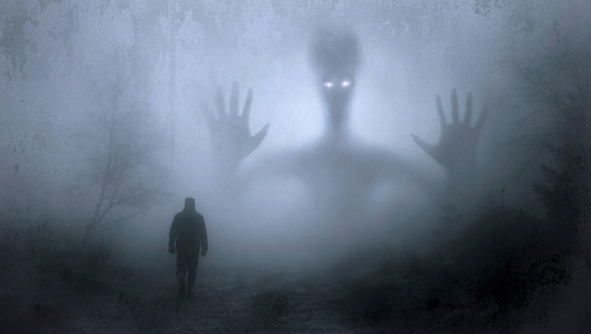

I love superheroes. Dressing up as a [Power Ranger](https://www.imdb.com/title/tt0106064/) at my school festival is one of my vivid childhood memories. Apart from Power Rangers, I have also been a fan of [Marvel](https://www.marvel.com/). One of my life’s wishes is not to grow too fast because I still enjoy kid stuff.

Throughout my theological studies, I have frequently wondered if superhero stories can do any good for evangelization. Among the Marvel movies I am fond of, I picked *[Doctor Strange](https://www.imdb.com/title/tt1211837/)* (2016) as a sample and examined whether it can be an effective tool to spread the message of Christianity. After scrutinizing and juxtaposing it with Christian faith, I came to the conclusion that ***Doctor Strange*** **can be a valuable instrument of evangelization on condition that the viewer is capable of extracting its Christian content while simultaneously identifying the New Age elements latent therein as incompatible with Christian faith**.

---

## Content

1. [Description of *Doctor Strange*](/post/doctor-strange-new-age-and-christianity/#1-description-of-doctor-strange)  
  1.1. [The Creator: Stan Lee](/post/doctor-strange-new-age-and-christianity/#11-the-creator-stan-lee)  
  1.2. [The Director: Scott Derrickson](/post/doctor-strange-new-age-and-christianity/#12-the-director-scott-derrickson)  
  1.3. [Movie Synopsis](/post/doctor-strange-new-age-and-christianity/#13-movie-synopsis)  
2. [Christianity in *Doctor Strange*](/post/doctor-strange-new-age-and-christianity/#2-christianity-in-doctor-strange)  
  2.1. [Philosophical-Anthropological Content](/post/doctor-strange-new-age-and-christianity/#21-philosophical-anthropological-content)
    2.1.1. [Spirituality](/post/doctor-strange-new-age-and-christianity/#211-spirituality)
    2.1.2. [Conscience](/post/doctor-strange-new-age-and-christianity/#212-conscience)
    2.1.3. [Eternity](/post/doctor-strange-new-age-and-christianity/#213-eternity)
    2.1.4. [Dignity](/post/doctor-strange-new-age-and-christianity/#214-dignity)
  2.2. [Religious Content](/post/doctor-strange-new-age-and-christianity/#22-religious-content)
    2.2.1. [Conversion](/post/doctor-strange-new-age-and-christianity/#221-conversion)
    2.2.2. [Perseverance](/post/doctor-strange-new-age-and-christianity/#222-perseverance)
    2.2.3. [Life’s Meaning](/post/doctor-strange-new-age-and-christianity/#223-lifes-meaning)
    2.2.4. [Vicarious Sacrifice](/post/doctor-strange-new-age-and-christianity/#224-vicarious-sacrifice)
    2.2.5. [God and the Devil](/post/doctor-strange-new-age-and-christianity/#225-god-and-the-devil)
    2.2.6. [Biblical References](/post/doctor-strange-new-age-and-christianity/#226-biblical-references)
3. [New Age in *Doctor Strange*](/post/doctor-strange-new-age-and-christianity/#3-new-age-in-doctor-strange)
  3.1. [What is New Age?](/post/doctor-strange-new-age-and-christianity/#31-what-is-new-age)
    3.1.1. [Esotericism](/post/doctor-strange-new-age-and-christianity/#311-esotericism)
    3.1.2. [Syncretism](/post/doctor-strange-new-age-and-christianity/#312-syncretism)
    3.1.3. [Narcissism](/post/doctor-strange-new-age-and-christianity/#313-narcissism)
  3.2. [What does New Age offer?](/post/doctor-strange-new-age-and-christianity/#32-what-does-new-age-offer)
    3.2.1. [Enchantment](/post/doctor-strange-new-age-and-christianity/#321-enchantment)
    3.2.2. [Healing](/post/doctor-strange-new-age-and-christianity/#322-healing)
    3.2.3. [Holism](/post/doctor-strange-new-age-and-christianity/#323-holism)
4. [Conclusion: *Doctor Strange* and Evangelization](/post/doctor-strange-new-age-and-christianity/#4-conclusion-doctor-strange-and-evangelization)
  4.1. [Desire for Meaning](/post/doctor-strange-new-age-and-christianity/#41-desire-for-meaning)
  4.2. [Desire for Salvation](/post/doctor-strange-new-age-and-christianity/#42-desire-for-salvation)

---

## 1. Description of *Doctor Strange*

### 1.1. The Creator: Stan Lee

Doctor Stephen Strange—a fictional character created by [Stan Lee](https://en.wikipedia.org/wiki/Stan_Lee) (1922–2018)—first appeared in Marvel Comics’ *Strange Tales* #110 published in April, 1963.[^1] Stan Lee is also the creator of other major Marvel personages, such as Spider-Man, Fantastic Four, X-Men, Hulk, Iron Man, Thor, Daredevil, and Black Panther.[^2]

His intention in creating Doctor Strange is unclear. One may observe, though, that this character’s debut was consonant with the general trend of the comic world in the first half of the twentieth century, when magician-featuring comics such as Lee Falk’s *[Mandrake the Magician](https://en.wikipedia.org/wiki/Mandrake_the_Magician)* (1934) and Fred Guardineer’s *[Zatara](https://en.wikipedia.org/wiki/Zatara)* (1938) were published.[^3]

### 1.2. The Director: Scott Derrickson

*Doctor Strange* is a Marvel origin story movie that premiered in 2016. [Scott Derrickson](https://en.wikipedia.org/wiki/Scott_Derrickson) (1966–), who directed *Doctor Strange* (2016), had gained popularity through *The Exorcism of Emily Rose* (2005), *Sinister* (2012), and *Deliver Us from Evil* (2014). As “a rare outspoken Christian in Hollywood,”[^4] he has been described as “a committed Presbyterian who flirts with Catholicism.”[^5] He even discloses that he “[wears] a St. Francis rosary almost all the time” and considers himself “one Chesterton book away from crossing the Tiber.”[^6]

Knowing his religious background, it is little wonder that the motifs of good, evil, and mystery occupy prominent places in his works. He specifically insists on the presence of mystery in this world:

> There are a lot of voices that are broadcasting that *the world is explainable*. Corporate America limits the world to consumerism. Science can limit it to the *material world*. Even religion limits it to a lot of theories that can explain everything.
> 
> I think we need cinema to break that apart and remind us that *we’re not in control, and we don’t understand as much as we think do*. … [Flannery O’Connor] said this about Catholicism: Catholicism is *the only institution left in the world that protects mystery*. I think that’s true.[^7]

### 1.3. Movie Synopsis

*Doctor Strange*’s plot can be summarized in the following six moments:

1. **Successful career**: Strange was a neurosurgeon of great renown.
2. **Car accident**: Strange lost control over his hands.
3. **In search of recovery**: After conventional medicine failed, Strange followed Pangborn’s counsel and departed for Kamar-Taj, questing after alternative healing.
4. **Training at Kamar-Taj**: Strange, assisted by Mordo, began to acquire skill in the mystic arts under the Ancient One’s tutelage.
5. **New vocation**: Strange discovered his new mission to save lives not through medicine, but through his mastery of mystic arts.
6. **Bargain with Dormammu**: Strange ousted Dormammu and saved the Earth.

## 2. Christianity in *Doctor Strange*

After this introduction, I will analyze the underlying Christian ideas in *Doctor Strange*, which render it a cultural manifestation apt for evangelization. I will touch on both philosophical-anthropological elements as well as religious ones.

### 2.1. Philosophical-Anthropological Content

#### 2.1.1. Spirituality

In line with Christian anthropology,[^8] *Doctor Strange* presents a bold refutation of *scientism* (knowledge comes only from hard sciences), *empiricism* (knowledge comes only from experience), and *materialism* (matter is the only reality there is). It does so, for instance, by establishing a clear distinction between the physical and spiritual realms.[^9]

The above-mentioned reductionist views characterize Strange prior to his training at Kamar-Taj (“Moon Crown” in Arabic[^10]):

> Strange: “*There is no such thing as spirit!* We are made of matter and nothing more. You’re just another tiny, momentary speck within an indifferent universe.”[^11]

Yet the Ancient One teaches him precisely the contrary:

> Ancient One: “You think that this material universe is all there is?”[^12] “What mysteries lie beyond the reach of your senses?”[^13]

#### 2.1.2. Conscience

Christian morality affirms that “the end does not justify the means.”[^14] The Ancient One’s recourse to the Dark Dimension clearly violates this principle:

> Ancient One: “I’ve hated drawing power from the Dark Dimension. But as you well know, sometimes *one must break the rules in order to serve the greater good*.”[^15]

Paradoxically, several dialogues in *Doctor Strange* seem to come near to the Christian notion of conscience. First of all, according to Christian morality, conscience has a binding character,[^16] which is perceptible in the following remark:

> Strange: “[The Ancient One] did what *she thought was right*.”[^17]

Secondly, conscience generates responsibility.[^18] Said otherwise, actions have consequences, as often insisted on by Mordo:

> Mordo: “We broke our rules, just like her [Ancient One]. The bill comes due. Always! A reckoning.”[^19]

#### 2.1.3. Eternity

Human beings desire eternity. In the words of Gabriel Marcel, “[t]o love a person means to say: *You will not die*.”[^20] This desire is explicitly manifested throughout *Doctor Strange*. References to “eternal life**” are numerous.[^21] Ironically, though, they come several times from a person who possesses a rather grim notion of eternal life:

> Strange: “What do you have to gain out of this New Age dimensional utopia?"
>
> Kaecilius: “The same as you. The same as everyone: *life … eternal life*.”[^22]

#### 2.1.4. Dignity

*Doctor Strange* contains a defense of the *dignity of human life*. In a culture in which human life is often seen as a mere means to achieve ‘Quality’ of life—namely, a life *considered* worthwhile—, Christianity and sound philosophy have tenaciously safeguarded human life as a *basic, self-evident good*.[^23] Life is *always* worthwhile. 

This defense is evident in the uneasy dialogue between Strange and Palmer after conventional medicine failed the former:

> Strange: “Life without my work … ”
>
> Palmer: “… is still life. *This isn’t the end*. There are other things that can give your life meaning.”[^24]

### 2.2. Religious Content

#### 2.2.1. Conversion

*Doctor Strange* is a conversion story. Strange’s conversion is twofold. Firstly, he embarks on a journey from arrogance toward humility—or, at least, toward the recognition of his pride and littleness within the vast Multiverse.[^25] It would not be an exaggeration to consider the phrase “*it’s not about you*” as one of this movie’s leitmotifs.

Secondly, he transitions from being a materialistic skeptic to being a person open to spiritual realities and aware of his cognitive limitations. However, this process does not take place straightaway. Like all conversions, it takes time:

> Strange: “That doesn’t make any sense.”
>
> Ancient One: ”Not everything does. *Not everything has to*. Your intellect has taken you far in life, but it will take you no further.”[^26]

#### 2.2.2. Perseverance

*Doctor Strange* is a story of perseverance. This perseverance is discernible in the self-discipline required of all the residents at the enclave of Kamar-Taj. Discipline, which the theological lexicon often calls ‘asceticism,’ is also an indispensable part of Christian spiritual life.

Perseverance is moreover manifested in Strange’s effort to turn Dormammu away. Leveraging his ability to rewind time, he was ready to make infinite attempts to have the villain leave the Earth in peace. Strange repeatedly exclaims: “Dormammu, I’ve come to bargain.”[^27] As one observes this scene, one cannot but recall Bartimaeus’ insistence ([Mk 10:46–52](https://www.biblegateway.com/passage/?search=Mark+10%3A46-52&version=NRSVCE)) and Jesus’ Parable of the Importunate Widow ([Lk 18:1–8](https://www.biblegateway.com/passage/?search=Lk+18%3A1%E2%80%938&version=NRSVCE)), both of which underline the value of perseverance.

#### 2.2.3. Life’s Meaning

There are two things that may render life meaningful: vocation and death. First of all, vocation is “the calling or destiny we have in this life and hereafter.”[^28] Vocation has to do with purpose. Christians’ fundamental vocation, for example, consists in loving and serving God. The fulfillment of this vocation is nothing less than “eternal happiness.”[^29]

In a way, *Doctor Strange* too is a story of vocation. It features characters in search of *life’s meaning*, most notably Mordo,[^30] Kaecilius,[^31] and Strange himself. The latter’s medical profession somehow facilitates the discovery of his vocation to protect mankind:

> Strange [as he was entrusted to guard New York Sanctum]: “When I became a doctor, I swore an oath to do no harm … and I have just killed a man! I’m not doing that again. *I became a doctor to save lives, not to take them*.”[^32]

Nonetheless, it is after losing control over his hands when Strange truly embraces his vocation to save humanity from the Dark Dimension:

> Strange: “You said that losing my hands didn’t have to be the end … that it could be a beginning.”
>
> Palmer: “Yeah. Because there are other ways to save lives.”
>
> Strange: “A harder way.”
>
> Palmer: “A weirder way.”[^33]

The idea of vocation, which usually implies leaving something or someone behind (cf. [Mt 19:29](https://www.biblegateway.com/passage/?search=Mt+19%3A29&version=NRSVCE)), is implicit in Marvel’s official overview of this movie:

> Before long Strange—armed with newly acquired magical powers—is forced to choose whether to return to his life of fortune and status or *leave it all behind to defend the world* as the most powerful sorcerer in existence.[^34]

Apart from vocation, death also gives meaning to life. One who does not embrace this truth sees death rather as an insult:

> Kaecilius: “The world is not what it ought to be. Humanity longs for the eternal, for a world beyond time, because time is what enslaves us. Time is an insult. *Death is an insult*.”[^35]

In contrast, one may see death as a source of meaning instead of enslavement:

> Ancient One: “Death is what gives life meaning: to know *your days are numbered … your time is short*.”[^36]

This last phrase surely reminds one of Paul’s words: “This therefore I say, brethren: *The time is short*” (1Cor 7:29 *DR*).

#### 2.2.4. Vicarious Sacrifice

*Doctor Strange* is a story of vicarious sacrifice. On multiple occasions—even though his underlying intentions may not always be upright—, Strange reveals his willingness to suffer on humanity’s behalf. This readiness is manifest, for example, in his conversation with Dormammu:

> Strange: “This is how things are now: you and me, trapped in this moment, endlessly.”
>
> Dormammu: “Then you will spend eternity dying.”
>
> Strange: “Yes. But everyone on Earth will live.”
>
> Dormammu: “But you will suffer.”
>
> Strange: “Pain’s an old friend.”[^37]

#### 2.2.5. God and the Devil

The portrayal of God as a hoarder “jealous of his prerogatives”[^38] and that of the devil as a genuinely generous giver are not foreign to the Scripture. In fact, it is latent as early as in the third chapter of Genesis:

> … the serpent said to the woman, “You will not die; for God knows that when you eat of it your eyes will be opened, and *you will be like God*, knowing good and evil” (Gen 3:4–5).

It also underlies Jesus’ Parable of the Talents:

> Master, I knew that you were a *harsh man, reaping where you did not sow*, and gathering where you did not scatter seed (Mt 25:24).

Moreover, it is obvious in the devil’s presumption as he

> took [Jesus] to a very high mountain and showed him all the kingdoms of the world and their splendor; and he said to him, “All these I will give you, if you will fall down and worship me” (Mt 4:8–9).

This falsification can also be found in *Doctor Strange*. *Mutatis mutandis*—bearing in mind that the Ancient One is not God—, Kaecilius too considers Dormammu as the true giver in contrast to the Ancient One:

> Kaecilius: “what the Ancient One hoards, Dormammu *gives freely: life everlasting*. He’s not the destroyer of worlds, doctor. He’s the savior of worlds.”[^39]

#### 2.2.6. Biblical References

Besides the above-exposed convergences, more expressions of biblical flavor are dispersed throughout the movie. Here are some examples thereof.

| Doctor Strange                                               | Bible                                                        |
| ------------------------------------------------------------ | ------------------------------------------------------------ |
| The “**Ancient One**”                                        | “I saw one like a human being coming with the clouds of heaven. And he came to the **Ancient One** and was presented before him” (Dan 7:13).[^40] |
| “The **Zealot**”[^41]                                        | “Simon, who was called the **Zealot**” (Lk 6:15).            |
| Mordo: “His [Kaecilius’] disciples **followed** him like **sheep**, seduced by **false doctrine**.”[^42] | “My **sheep** hear my voice. I know them, and they **follow** me” (Jn 10:27). “But false prophets also arose among the people, just as there will be false teachers among you, who will secretly bring in **destructive opinions**” (2Pet 2:1). |
| Kaecilius: “It’s the **end** and the **beginning**.”[^43]    | “I am the Alpha and the Omega, the first and the last, the **beginning** and the **end**” (Rev 22:13). |
| Ancient One: “This universe is only one of an infinite number. **World without end**.”[^44] | “Unto him be glory in the church by Christ Jesus throughout all ages, **world without end**” (Eph 3:21 KJV). |
| Ancient One: “His [Dormammu’s] eternal life is not paradise, but **torment**.”[^45] | “… that [Lazarus] may warn them, so that they will not also come into this place of **torment**” (Lk 16:28). |

## 3. New Age in *Doctor Strange*

If one dates the dawn of postmodernism to the late twentieth century,[^46] then its interrelation with New Age becomes quite manifest. The genesis of the latter is conventionally dated to the 1960s and associated with the [musical *Hair*](https://en.wikipedia.org/wiki/Hair_(musical)), which programmatically lays out New Age’s main themes in its song “[Aquarius](https://www.allmusicals.com/lyrics/hair/aquarius.htm).”[^47]

Neither is the association of *Doctor Strange* (2016) with New Age groundless. In the movie itself, there are at least two explicit allusions to New Age. The first one is made by Strange in his exchange with Kaecilius:

> Strange: “What do you have to gain out of this New Age dimensional utopia?”
>
> Kaecilius: “The same as you. The same as everyone: life … eternal life.”[^48]

The second suggestion comes from Palmer in her first encounter with Strange after he left for Kathmandu:

> Palmer: “Oh. So you joined a cult.”
>
> Strange: “No, I didn’t. No, not exactly. No. They did teach me to tap into powers that I never even knew existed.”
>
> Palmer: “Yeah. That sounds like a cult.”[^49]

In this section, I will identify—based on what New Age is and what it offers—references to New Age in *Doctor Strange* which are incompatible with Christian faith.

### 3.1. What is New Age?

#### 3.1.1. Esotericism

New Age is esoteric. Esotericism refers to “an ancient and hidden body of knowledge available only to initiated groups, who portray themselves as guardians of the truths hidden from the majority of humankind.”[^50] Within this esoteric setting, people reach higher spheres by “[following] enlightened masters.”[^51]

This form of discipleship and the restricted character of knowledge dominate *Doctor Strange*’s plot from the very outset. In the words of Wong, the librarian at Kamar-Taj, “this section is for masters only, but at my discretion, others may use it.”[^52] Even though he clarifies that “no knowledge in Kamar-Taj is forbidden; only certain practices,”[^53] the chaining of some books in Kamar-Taj’s library implies that certain knowledge is available only to initiated individuals. The use of classical Sanskrit in some works intensifies this secretive ambience.

Catholicism’s rationality and universality stand in contrast to New Age’s esotericism: “Rationality has the advantage of universality: it is freely available to everyone, quite unlike the mysterious and fascinating character of esoteric or gnostic ‘mystical’ religion.”[^54]

#### 3.1.2. Syncretism

New Age is syncretic. In fact, what makes New Age *new* is its “syncretism of esoteric and secular elements.”[^55] It combines Western secularist elements (e.g., evolutionism, narcissism, religious “studies,” psychology, freemasonry, feminism, ecology) with Eastern esoteric elements (e.g., Gnosticism, theosophy, occultism, spiritualism, magic, zen, yoga).[^56]

Syncretism is palpable in *Doctor Strange*. Kamar-Taj’s practices fuse at least magic of all sorts, Buddhism—implied in its Wi-Fi password “*shamballa*”[^57]—, Gnosticism—suggested by constant effort to control powers through knowledge and the perception of good and evil as two equally powerful forces—, and meditation.[^58]

#### 3.1.3. Narcissism

New Age’s spiritual narcissism consists in “attachment to a private world of ego-fulfillment and a consequent (though not always apparent) withdrawal from the world.”[^59] It “often recognizes no spiritual authority higher than personal inner experience.”[^60]

Spiritual narcissism underlies a number of scenes in *Doctor Strange*. It is embodied in Strange’s arrogance[^61] and thirst for fame.[^62] “*It’s not about you*” constitutes this movie’s through line:

> Ancient One: “Arrogance and fear still keep you from learning the simplest and most significant lesson of all: it’s not about you.”[^63]

> Ancient One: “You became a doctor to save one life above all others: your own. … I see what I’ve always seen: *your over-inflated ego*. You want to go back to the delusion that you can control anything, even death, which no one can control … .”[^64]

On top of that, Kamar-Taj itself is a monastery-like compound where its residents seem to *withdraw themselves from the world*. There is supposedly a cell dedicated to each of them, like the one occupied by Strange.[^65]

### 3.2. What does New Age offer?

#### 3.2.1. Enchantment

New Age is characterized by its fascination with enchantment, that is, “with **extraordinary manifestations**, and in particular with **paranormal entities**.”[^66] *Doctor Strange* is replete with extraordinary manifestations, including:

1. the use of **magic**, which impregnates everything taught at Kamar-Taj;[^67]
2. **paranormal activities**, such as detaching one’s astral form from one’s physical form,[^68] traveling between dimensions,[^69] telekinesis (e.g., disfigurement of buildings and streets); time manipulation;[^70]
3. **channeling**,[^71] which takes place when “psychic mediums claim to act as channels for information from other selves;”[^72] though not explicitly present in *Doctor Strange* (2016), Strange appears to practice it in *[Avengers: Endgame](https://www.imdb.com/title/tt4154796/)* (2019) as he predicted the battle outcome;[^73]
4. the use of **charms**, manifest in the utilization of relics;[^74]
5. **conjuring**, which may include the drawing of power from the Dark Dimension[^75] by both Kaecilius and the Ancient One,[^76] the summoning of Dormammu in a Catholic church,[^77] and Strange’s bargaining with him[^78]—with the “devil,” if one were to use religious terminology.

#### 3.2.2. Healing

New Age emphasizes the role of the mind and harmony with nature, especially in the healing process.[^79] First of all, it claims that healing comes from the mind. In other words, “[t]he source of healing is … within ourselves, something we reach when we are in touch with our inner energy or cosmic energy.”[^80]

Healing figures as one of the principal motors of *Doctor Strange*,[^81] in which it is often conceived from the New Age perspective. One can be healed—as the Ancient One alleges—by *being convinced* that one is healed.[^82] She contends that, “[a]t the root of existence, mind and matter meet. *Thoughts shape reality*.”[^83] *Reality depends on one’s mind*. The mind’s predominance is also presupposed in Pangborn’s healing process:[^84]

> Ancient One: “[Pangborn] channels dimensional energy directly into his own body.”
>
> Strange: “He uses magic to walk?”
>
> Ancient One: “Constantly. He had a choice to return to his own life or to serve something greater than himself.”[^85]

Secondly, according to New Age, healing presupposes *harmony* with ‘natural law.’ This is so because “illness and suffering come from working against nature.”[^86] New Age underlines “the importance of being in tune with nature or the cosmos … [and of accomplishing] the correspondences between all the elements of the universe.”[^87]

The idea that humans need to tap into powers of nature (and of other sorts) can be found in *Doctor Strange*:

> Palmer: “Oh. So you joined a cult.”
>
> Strange: “No, I didn’t. No, not exactly. No. They did teach me to *tap into powers* that I never even knew existed.”
>
> Palmer: “Yeah. That sounds like a cult.”[^88]

References to ‘natural law’ are likewise numerous in this movie.[^89] Nonetheless, the meaning assigned to this term is ambiguous. It does not seem that ‘natural law’ is understood philosophically as rational creatures’ participation in eternal law by which they distinguish good from evil.[^90] I would rather conjecture that ‘natural law’ is used in *Doctor Strange* within New Age’s framework.

#### 3.2.3. Holism

New Age envisages cosmos “as an organic whole.”[^91] Hence, it seeks to eliminate all forms of ‘*dualism*’—e.g., Creator-creation, man-nature, spirit-matter—, considered as “an unhealthy product of a less enlightened past.”[^92] God is conceived as an “‘impersonal energy’ immanent in the world, with which it forms a ‘cosmic unity:’ ‘*All is one*.’”[^93] Consequently, human beings are but parts of this grand organism. They were born with “divine spark … [which] links them into the unity of the Whole.”[^94]

Kaecilius’ stance hints at this unity:

> Kaecilius: “This world doesn’t have to die, doctor. This world can take its rightful place alongside so many others, as *part of the One, the great and beautiful One*. We can all live forever.”[^95]

> Kaecilius: “What is this?”
>
> Strange: “Well, it’s everything you’ve ever wanted. *Eternal life as part of the One*.”[^96]

However, according to this cosmovision, individuals lose their significance:

> Strange: “What about the people you killed?”
>
> Kaecilius: “Tiny. Momentary speck within an indifferent universe.”[^97]

Moreover, New Age’s holism avers that human beings are “capable of ascending to invisible higher spheres, and of controlling their own lives beyond death.”[^98] The possibility to ascend to higher levels of existence was suggested by Pangborn.[^99] In addition, this existence “beyond death” is what is thought by Kaecilius to be offered by Dormammu.[^100]

## 4. Conclusion: *Doctor Strange* and Evangelization

I wish to have shown that *Doctor Strange* can be a valuable instrument of evangelization on condition that the viewer is capable of extracting its Christian content while simultaneously identifying the New Age elements latent therein as incompatible with Christian faith. In this last section, I would like to briefly elaborate on two efficacious paths of evangelization highlighted by this movie: *human beings’ longing for meaning and their quest for salvation*. These paths are closely connected to *divine providence*, by which God guides his creatures to their end[^101]—to the attainment of that which renders their life *meaningful*, to their *salvation*. 

### 4.1. Desire for Meaning

> Faith is man’s response to God, who reveals himself and gives himself to man, at the same time bringing man a superabundant light as he searches for *the ultimate meaning of his life*.[^102]

Today’s evangelization ought to leverage human beings’ universal longing for meaning. Meaning is none other than purpose.[^103] Everybody does something *for* a specific reason. The New Age phenomenon emerged as a response to human longing for meaning: 

> Science and technology have clearly failed to deliver all they once seemed to promise, so in their *search for meaning and liberation* people have turned to the spiritual realm.[^104]

Granted: *Doctor Strange* is a mixed bag of Christian and New Age elements, as I have indicated above. Yet it nonetheless represents—in [Bishop Barron](https://en.wikipedia.org/wiki/Robert_Barron)’s words—“a significant step in the right direction”[^105] inasmuch as it debunks the narrow-minded scientism and testifies to the existence of realities beyond the empirically tangible domain.

Not unlike *Doctor Strange*, New Age contains ambiguous components, some of which are contrary to Christian faith. However, this cultural trend also possesses some positive aspects, as John Paul II points out.[^106] For instance, it is inspired by a quest for “new meaning in life.”[^107] It also manifests human desire to “go beyond a cold, rationalistic religiosity.”[^108] Furthermore, New Age somehow realizes that meaning can only be found in God: “New Age is not, properly speaking, a religion, but it is interested in what is called ‘divine.’”[^109]

### 4.2. Desire for Salvation

> Then after their fall His promise of redemption aroused in them the hope of being saved and from that time on He ceaselessly kept the human race in His care, to give eternal life to those who *perseveringly do good in search of salvation*.[^110]

Today’s evangelization should take human beings’ quest for salvation as one of its stepping-stones. As Barron affirms, “Christology must always convey a theory of salvation, that is to say, some account of what is fundamentally wrong with humanity and how Jesus saves us from that condition.”[^111]

Now, what sort of salvation are we talking about? Salvation basically means “preservation or deliverance from harm, ruin, or loss.”[^112] *Prima facie*, one might think that contemporary humans seek only material salvation consisting in health and wealth. However, this is not always true. What do people look for, for instance, in New Age? Kaecilius offers us an answer:

> Strange: “What do you have to gain out of this New Age dimensional utopia?” 
>
> Kaecilius: “The same as you. The same as everyone: life … eternal life.”[^113]

Human beings somehow perceive their eternal destiny. They want to live forever. They seek to be delivered from the harm of death. They wish to overcome all temporal limitations. Mummification in Ancient Egypt dating back to 2600 BC[^114] comes out as one of the most eloquent testimonies of this primordial human longing.

What many still do not realize is that God is the only savior. Thus, one of the evangelizer’s primary tasks would consist in underscoring this truth. Propitiously, *Doctor Strange* does a fine job in depicting the non-divine superheroes’ limitations. The world may have sorcerers protecting it from the Dark Dimension. Nonetheless, they can only do so much. The Ancient One, against all odds, ends up dying. Strange, too, is not the ultimate savior since he himself was in need of salvation (e.g., from his injury and egotism). This is how God differs from those superheroes: he had no need to save himself prior to saving us.

---

Not a few Christians I am acquainted with are skeptical about cinema’s capability to communicate truths of faith. Yet, based on everything I have explained above, I am convinced that, in the postmodern context, films—“the distinctive art form of our time”[^115]—can be effective means of evangelization provided that the Christian viewer has a sufficiently keen *sensus fidei*[^116] to separate the wheat from the chaff.

I believe this is how Derrickson also sees the movie industry. In fact, he is aware of his duty to glorify God through his cinematic productions:

> Most people, on some level, love movies. Yet as both a Christian and a filmmaker, I’m persuaded that Christians have not excelled at filmmaking because they haven’t really loved the cinema. They may love the power of cinema. They may appreciate the social impact of cinema. Yet many Christians remain *suspicious of film*, and that’s a problem if one wants to succeed in the creative endeavor of making films. In order to do what I do, one must know and love the entire history of film, and believe that filmmaking is an *expression of creativity that glorifies God*.[^117]

[^1]:“Doctor Strange,” Marvel Database, [marvel.fandom.com](https://marvel.fandom.com/wiki/Doctor_Strange).

[^2]:“Stan Lee: The Greatest Characters,” Marvel Database, November 13, 2018, [www.marvel.com](https://www.marvel.com/comics/discover/546/stan-lee).

[^3]:David Roach, “Doctor Strange,” Britannica, [www.britannica.com](https://www.britannica.com/topic/Doctor-Strange-fictional-character).

[^4]:Steven D. Greydanus, “Interview: Filmmaker Scott Derrickson on Horror, Faith, Chesterton and His New Movie,” National Catholic Register, July 1, 2014, [www.ncregister.com](https://www.ncregister.com/news/interview-filmmaker-scott-derrickson-on-horror-faith-chesterton-and-his-new-movie).

[^5]:Wesley Baines, “The Christianity of Scott Derrickson,” Beliefnet, [www.beliefnet.com](https://www.beliefnet.com/entertainment/celebrities/the-christianity-of-scott-derrickson.aspx).

[^6]:Greydanus, “Interview: Filmmaker Scott Derrickson:” “I am not Catholic. I am, as a friend of mine once said, ‘one Chesterton book away from crossing the Tiber.’ Chesterton’s my favorite writer. I’m a big fan of a lot of Catholic mystic writers. I think the honest answer at this point in my life is I think I would become Catholic if I weren’t a parent. And the only reason I don’t is my tradition is so Protestant; it’s what I know. I don’t know how to raise my kids Catholic. Given the busyness of my life, it’s something I can’t start at this point. Maybe I will. Otherwise, I’m not sure there’s any reason for me not to make that leap. I wear a St. Francis rosary almost all the time. There’s a lot of things about Catholicism that have become increasingly important to me. … I have nothing but love for Catholicism.”

[^7]:Greydanus, “Interview: Filmmaker Scott Derrickson.” In the same interview, he also says the following: “It’s not about putting something evil in the world. It’s about reckoning with evil. We don’t need any more evil in the world. We need a lot more reckoning with it.”

[^8]:See Heinrich Denzinger, *Enchiridion Symbolorum, Definitionum et Declarationum de Rebus Fidei et Morum*, ed. Peter Hünermann, 2nd ed. (Bologna: Edizioni Dehoniane Bologna, 1995), 454: “deinde [condidit creaturam] humanam quasi communem ex spiritu et corpore constitutam” (DH 800).

[^9]:Wong: “While heroes like the Avengers protect the world from physical dangers, we sorcerers safeguard it against more mystical threats” (52:35–52:45).

[^10]:See “Kamar-Taj,” Marvel Cinematic Universe Wiki, n.d., [marvelcinematicuniverse.fandom.com](https://marvelcinematicuniverse.fandom.com/wiki/Kamar-Taj).

[^11]:28:00–10.

[^12]:29:45.

[^13]:29:56.

[^14]:*Catechism of the Catholic Church*, 2nd ed. (Washington, D.C.: USCCB, 2000), §1753.

[^15]:1:25:05–15.

[^16]:See Thomas Aquinas, II *Sent*., d. 39 q. 3 a. 3 ad 3.

[^17]:1:30:11.

[^18]:*CCC*, §1781: “Conscience enables one to assume responsibility for the acts performed.”

[^19]:1:42:20–30.

[^20]:In Josef Pieper, *Faith, Hope, Love* (San Francisco: Ignatius Press, 1997), 192.

[^21]:See 51:19; 1:02:55–03:05; 1:03:20–25; 1:40:50–41:00; etc.

[^22]:1:02:55–03:05.

[^23]:See John Keown, *Euthanasia, Ethics and Public Policy: An Argument Against Legalisation*, Second Edition (Cambridge: Cambridge University Press, 2018), 42–48.

[^24]:17:20–30.

[^25]:See 30:20–35.

[^26]:41:15–25.

[^27]:1:36:40 et seq.

[^28]:*CCC*, Glossary.

[^29]:*CCC*, Glossary.

[^30]:Mordo [to Strange]: “I once stood in your place” (24:10–20).

[^31]:Mordo [on Kaecilius]: “He was a grieving, broken man searching for answers in the mystic arts” (46:45).

[^32]:1:14:20–35.

[^33]:1:27:45–28:00.

[^34]:“Doctor Strange,” Marvel, n.d., [www.marvel.com](https://www.marvel.com/movies/doctor-strange).

[^35]:1:03:20–25.

[^36]:1:25:45–50.

[^37]:1:38:30–45.

[^38]:*CCC*, §399: “Scripture portrays the tragic consequences of this first disobedience. Adam and Eve immediately lose the grace of original holiness. They become afraid of the God of whom they have conceived a distorted image—that of a God *jealous of his prerogatives*” (emphasis mine).

[^39]:1:04:35–45.

[^40]:Unless otherwise indicated, the English translation of the Scripture used in this article is taken from the *New Revised Standard Version: Catholic Edition*.

[^41]:37:35.

[^42]:47:00–05.

[^43]:1:02:07.

[^44]:30:20–35.

[^45]:1:20:15–20.

[^46]:“Postmodernism,” Oxford Learner’s Dictionaries, n.d., [www.oxfordlearnersdictionaries.com](https://www.oxfordlearnersdictionaries.com/us/definition/english/postmodernism).

[^47]:See Pontifical Council for Culture, *Jesus Christ the Bearer of the Water of Life: A Christian Reflection on the “New Age”* (Vatican City: Libreria Editrice Vaticana, 2003), 2.1.

[^48]:1:02:55–03:05.

[^49]:1:11:30–45.

[^50]:*Jesus Christ the Bearer of the Water of Life*, 7.2.

[^51]:*Jesus Christ the Bearer of the Water of Life*, 2.3.3.

[^52]:36:00–05.

[^53]:37:05–15.

[^54]:*Jesus Christ the Bearer of the Water of Life*, 6.1.

[^55]:*Jesus Christ the Bearer of the Water of Life*, 2.1.

[^56]:*Jesus Christ the Bearer of the Water of Life*, 2.3.2.

[^57]:33:45. See New World Encyclopedia Contributors, “Shambhala,” New World Encyclopedia, October 31, 2021, [www.newworldencyclopedia.org](https://www.newworldencyclopedia.org/entry/shambhala).

[^58]:33:30–35.

[^59]:*Jesus Christ the Bearer of the Water of Life*, 3.2.

[^60]:*Jesus Christ the Bearer of the Water of Life*, 2.2.1.

[^61]:08:55–09:00.

[^62]:09:10–20. “They weren’t about us. They were about you. … Everything is about you” (10:20). “I could have done better” (13:40). “But if it proves you arrogant ass wrong, worth it” (15:40). “Forget everything you think you know” (24:24). “You’re a man looking at the world through a keyhole” (27:42). “To show you just how much you don’t know … ” (29:00). “Stubbornness, arrogance, ambition … ” (32:15).

[^63]:1:24:15–25.

[^64]:1:14:30–50.

[^65]:33:45 et seq.

[^66]:*Jesus Christ the Bearer of the Water of Life*, 2.2.1.

[^67]:“We harness energy drawn from other dimensions of the Multiverse to cast spells, to conjure shields and weapons, to make magic” (35:00–10). “You have to surrender to its current, and use its power as your own” (41:10–15).

[^68]:28:40. Ancient One: “I pushed your astral form out of your physical form” (28:40).

[^69]:“… the astral dimension. A place where the soul exists apart from the body” (28:55); “travel throughout the Multiverse” (40:00); “the Mirror Dimension” (45:20); “the Dark Dimension” (51:16), which is “beyond time” (52:45; 1:02:35; 1:35:18–20), “beyond death” (1:35:23). See also *Jesus Christ the Bearer of the Water of Life*, 7.2, in the entry ‘crystal.’

[^70]:50:30–40.

[^71]:*Jesus Christ the Bearer of the Water of Life*, 1.1: “Some versions of New Age harness the powers of nature and seek to communicate with another world to discover the fate of individuals, to help individuals tune in to the right frequency to make the most of themselves and their circumstances.”

[^72]:*Jesus Christ the Bearer of the Water of Life*, 7.2.

[^73]:Tony Stark: “Hey, you said one out of fourteen million, we win, right? Tell me this is it.” —Strange: “If I tell you what happens, it won’t happen.” —Tony Stark: “You better be right.”

[^74]:Mordo: “Some magic is too powerful to sustain, so we imbue objects with it, allowing them to take the strain we cannot” (47:30–48:00).

[^75]:“A ritual to contact Dormammu and draw power from the Dark Dimension” (54:05–15).

[^76]:Mordo: “It’s true. She does draw power from the Dark Dimension” (1:20:40–45).

[^77]:39:10–30.

[^78]:1:36:40 et seq.

[^79]:See *Jesus Christ the Bearer of the Water of Life*, 2.2.3.

[^80]:*Jesus Christ the Bearer of the Water of Life*, 2.2.3.

[^81]:Kaecilius: “What was it that brought you to Kamar-Taj, doctor? Was it enlightenment? Power? You came to be healed, as did we all” (1:04:15–20).

[^82]:Ancient One: “He [Pangborn] couldn’t walk. I convinced him that he could” (26:00–10). “What if I told you that your own body could be convinced to put itself back together in all sorts of ways?” (26:20). “I know how to reorient the spirit to better heal the body” (26:50–55).

[^83]:30:00–10.

[^84]:Pangborn: “I’d given up on my body. I thought my mind’s the only thing I have left … I should at least try to elevate that” (20:15–25).

[^85]:1:24:40–55.

[^86]:*Jesus Christ the Bearer of the Water of Life*, 2.2.3.

[^87]:*Jesus Christ the Bearer of the Water of Life*, 2.2.2.

[^88]:1:11:30–45.

[^89]:Mordo: “You gave me the power to defeat my demons. And to live within the natural law” (32:35–45). Wong: “We do not tamper with natural law. We defend it” (52:05). Strange [rewinding time in Hong Kong]: “Breaking the laws of nature, I know” (1:34:25). Mordo: “Yes, we did it … by also violating the natural law” (1:42:09).

[^90]:See Thomas Aquinas, *ST* I-II, q. 91 a. 2 co.; *ST* I-II, q. 94 a. 1 ad 2.

[^91]:*Jesus Christ the Bearer of the Water of Life*, 2.3.3.

[^92]:*Jesus Christ the Bearer of the Water of Life*, 2.2.4.

[^93]:*Jesus Christ the Bearer of the Water of Life*, 2.3.4.2.

[^94]:*Jesus Christ the Bearer of the Water of Life*, 2.3.4.1.

[^95]:1:02:40–50.

[^96]:1:40:50–41:00.

[^97]:1:03:15–20.

[^98]:*Jesus Christ the Bearer of the Water of Life*, 2.3.3.

[^99]:Pangborn: “There were deeper secrets to learn there, but I didn’t have the strength to receive them. I chose to settle for my miracle and I came back home” (20:40–50).

[^100]:Kaecilius: “Isn’t it beautiful? A world beyond time … beyond death” (1:35:20–25).

[^101]:See Thomas Aquinas, *ST* I, q. 22 a. 1 co.; I *Sent*., d. 39 q. 2; *CCC*, §302.

[^102]:*CCC*, §26.

[^103]:Angus Stevenson and Christine A. Lindberg, *New Oxford American Dictionary*, Third Edition (Oxford: Oxford University Press, 2010), in the entry ‘meaning.’

[^104]:*Jesus Christ the Bearer of the Water of Life*, 2.1.

[^105]:Robert Barron, “‘Doctor Strange’ Offers a Taste of Spiritual Medicine,” The Catholic Register, November 19, 2016, [www.catholicregister.org](https://www.catholicregister.org/features/arts/item/23627-doctor-strange-offers-a-taste-of-spiritual-medicine).

[^106]:Pope John Paul II, “Address to the United States Bishops of Iowa, Kansas, Missouri and Nebraska on Their ‘Ad Limina’ Visit,” The Holy See, May 28, 1993, [www.vatican.va](https://www.vatican.va/content/john-paul-ii/en/speeches/1993/may/documents/hf_jp-ii_spe_19930528_iowa-ad-limina.html). See also *Jesus Christ the Bearer of the Water of Life*, 6.1.

[^107]:John Paul II, *Address to the United States Bishops*, §2.

[^108]:John Paul II, *Address to the United States Bishops*, §2.

[^109]:*Jesus Christ the Bearer of the Water of Life*, 2.3.3.

[^110]:Second Vatican Council, “Dogmatic Constitution on Divine Revelation Dei Verbum,” in *Vatican II Documents* (Vatican City: Libreria Editrice Vaticana, 2011), §3.

[^111]:Robert Barron, “Christ in Cinema: The Evangelical Power of the Beautiful,” in *The Oxford Handbook of Christology*, ed. Francesca Aran Murphy and Troy A. Stefano (Oxford, UK: Oxford University Press, 2015), 478.

[^112]:*New Oxford American Dictionary*, in the entry ‘salvation.’

[^113]:1:02:55–1:03:05.

[^114]:“Egyptian Mummies,” The Smithsonian Institution, n.d., [www.si.edu](https://www.si.edu/spotlight/ancient-egypt/mummies).

[^115]:Barron, “Christ in Cinema,” 487.

[^116]:International Theological Commission, “Sensus Fidei in the Life of the Church,” The Holy See, 2014, [www.vatican.va](https://www.vatican.va/roman_curia/congregations/cfaith/cti_documents/rc_cti_20140610_sensus-fidei_en.html), §49: “The *sensus fidei fidelis* is a sort of spiritual instinct that enables the believer to judge spontaneously whether a particular teaching or practice is or is not in conformity with the Gospel and with apostolic faith.”

[^117]:Scott Derrickson, “Behind the Lens,” Christian Century, January 30, 2002, [www.christiancentury.org](https://www.christiancentury.org/article/2002-01/behind-lens).
