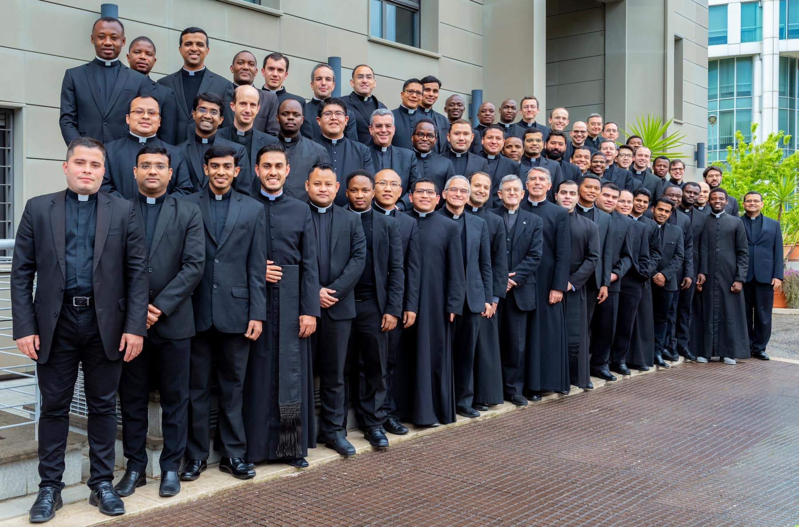

Dalam artikel ini, saya akan menjawab pertanyaan-pertanyaan yang paling sering saya terima. Jika pertanyaan Anda tidak ada di sini, jangan ragu untuk menghubungi saya melalui [formulir kontak](/#contact) di halaman beranda.

## 1. Siapa Anda?

Saya adalah seorang **imam Katolik**. Mengenai identitas seorang imam Katolik, baca [artikel ini](https://www.catholic.com/encyclopedia/priest).

## 2. Bagaimana kami harus memanggil Anda?

Silakan memanggil saya **Father Kenny**.

## 3. Mengapa Anda dipanggil ‘*Father*’?

Memang, ada sebuah kebiasaan untuk memanggil para imam, dalam berbagai bahasa, dengan sebutan ‘Bapa’ (misalnya, *Padre*, *Mon Père*, *Romo*). Dengan memanggil saya ‘Father,’ Anda sebenarnya memberikan kepada saya bantuan yang luar biasa. Anda mengingatkan saya bahwa, sebagai seorang imam, saya dipanggil—seperti halnya para ayah—untuk menjadi seorang **penyedia** *(provider)*. Saya ditahbiskan untuk **memberi makan umat beriman** dengan sakramen dan Sabda Allah serta untuk **melahirkan anak-anak Allah yang baru** melalui baptisan. 

Untuk pengetahuan lebih lanjut tentang mengapa kita memanggil para imam ‘Bapa,’ klik di [sini](https://www.ewtn.com/catholicism/library/why-do-we-call-priests-father-1178).

## 4. Anda tergabung dalam ordo/tarekat apa? Embel-embel apa yang harus kami letakkan di belakang nama Anda?

Saya adalah seorang **imam diosesan**. Oleh karena itu, saya tidak tergabung dalam ordo/tarekat manapun dan **tidak ada embel-embel** (seperti O.S.B., S.J., O.P., O.F.M., atau O.Carm.) yang perlu diletakkan di belakang nama saya.

## 5. Siapa itu imam diosesan?

Sederhananya, imam diosesan adalah **imam yang mengabdikan hidupnya untuk melayani keuskupan tertentu** ([c. 265](https://www.vatican.va/archive/cod-iuris-canonici/eng/documents/cic_lib2-cann208-329_en.html#CHAPTER_II.)). Sebuah keuskupan adalah “bagian dari umat AlIah, yang dipercayakan kepada Uskup untuk digembalakan dengan kerjasama para imam” ([c. 369](https://www.vatican.va/archive/cod-iuris-canonici/eng/documents/cic_lib2-cann368-430_en.html)).

Saya sendiri adalah imam [Keuskupan Surabaya](http://www.gcatholic.org/dioceses/diocese/sura0.htm). Dengan kata lain, saya bekerja sama dengan [uskup](https://www.catholic.com/encyclopedia/bishop) saya, [Vincentius Sutikno Wisaksono](http://www.catholic-hierarchy.org/bishop/bwisak.html), dalam melayani umat Katolik yang berada dalam wilayah keuskupan ini. Namun, ini tidak berarti bahwa pelayanan saya dibatasi oleh lingkup keuskupan ini. **Imamat saya, sebaliknya, “ditujukan kepada semua bangsa di segala zaman, dan tak mungkin dipersempit oleh batas-batas suku, bangsa atau kurun waktu”** ([PO, 10](https://katolisitas.org/presbyterorum-ordinis/)).

_Photo courtesy of Collegio Sacerdotale Altomonte (Rome)_

## 6. Apa perbedaan antara imam diosesan dan imam tarekat religius?

Mereka serupa karena keduanya adalah imam, namun—dalam banyak hal lain—**mereka sangat berbeda**. Saya akan membuat perbandingan antara mereka dalam tabel berikut.

| **Imam diosesan ...**                                        | **Imam tarekat religius ...**                                |
| :----------------------------------------------------------- | :----------------------------------------------------------- |
| hidup di tengah-tengah dunia                                 | hidup terpisah dari dunia ([PC, 5](https://katolisitas.org/perfectae-caritatis/)) dalam rumah religius/biara ([c. 665](https://www.vatican.va/archive/cod-iuris-canonici/eng/documents/cic_lib2-cann607-709_en.html#CHAPTER_III.)) |
| juga disebut “[imam sekuler](https://www.newadvent.org/cathen/13675a.htm)” ( dari bahasa Latin *saeculum*, yang berarti ‘dunia zaman sekarang’) | juga disebut “imam reguler” (dari bahasa Latin *regulae*, yang berarti “peraturan-peraturan”) |
| mengucapkan [janji](https://www.collinsdictionary.com/dictionary/english/promise) | mengucapkan [kaul](https://www.merriam-webster.com/dictionary/vow) untuk menghidupi nasihat-nasihat injili, yakni kemiskinan, kemurnian, dan ketaatan ([c.573 §1](https://www.vatican.va/archive/cod-iuris-canonici/eng/documents/cic_lib2-cann573-606_en.html#TITLE_I:)) |
| bisa memiliki harta pribadi dan dikenakan pajak              | tidak memiliki harta pribadi (dengan kata lain, segala sesuatu dimiliki bersama) |
| tergabung dalam [*presbyterium*](https://www.catholicculture.org/culture/library/view.cfm?recnum=6553) (kelompok imam) di bawah otoritas seorang uskup | tergabung dalam komunitas di bawah otoritas seorang superior (misalnya, abas) |

## 7. Janji-janji apa saja yang harus diucapkan oleh imam diosesan?

Para imam diosesan mengucapkan tiga janji pada hari mereka [ditahbiskan menjadi diakon](https://www.newadvent.org/cathen/04647c.htm). Mereka berjanji

- untuk hidup [selibat](https://www.newadvent.org/cathen/03481a.htm) demi kerajaan surga;
- untuk merayakan [Ibadat Harian](https://www.usccb.org/prayer-and-worship/liturgy-of-the-hours) (juga dikenal sebagai Brevir atau [*Divine Office*](https://www.newadvent.org/cathen/11219a.htm)) bagi kebaikan umat Allah dan seluruh dunia; serta
- untuk menaati uskup mereka dan para penerusnya.

_Photo courtesy of [St. Yakobus' Parish](https://www.instagram.com/santoyakobussby/) (Surabaya)_

## 8. Sebagai seorang imam, apa yang Anda lakukan sehari-hari?

Saat ini, saya sedang belajar untuk memperoleh [gelar lisensiat](https://en.wikipedia.org/wiki/Licentiate_(degree)#Theology,_canon_law,_history,_and_cultural_patrimony) dalam Teologi Dogmatik di [Universitas Kepausan Salib Suci](https://en.pusc.it/) di Roma. Meskipun saya menghabiskan sebagian besar waktu saya untuk belajar, **hal terpenting dalam hari saya adalah perayaan** [**Misa Kudus**](https://www.catholic.com/magazine/print-edition/why-go-to-mass). Kemudian, saya mendedikasikan banyak waktu untuk mendoakan Ibadat Harian, [berdoa secara pribadi](https://onepeterfive.com/a-beginners-guide-to-mental-prayer/), dan membaca [buku-buku rohani](https://www.delibris.org/en/node/210359). Selain itu, sesekali saya mendengarkan pengakuan dosa dan memberikan homili.

Untuk melihat keseharian saya ketika saya bekerja di sebuah paroki pada tahun 2019–2020, lihat [video ini](https://youtu.be/G1JPX-rMBBU).

## 9. Mengapa Anda mengenakan pakaian yang khas?

Kecuali saya berada di rumah atau melakukan aktivitas yang membutuhkan pakaian yang khusus (misalnya, [bermain ski](https://aleteia.org/2018/01/26/7-surprising-facts-about-the-skiing-pope-john-paul-ii/), berenang, berjalan-jalan), saya mengenakan jubah hitam atau kemeja klerikal hitam/putih karena berbagai alasan. Saya hanya akan memberikan empat alasan di sini.

1. Pertama, karena pakaian klerikal **mengingatkan saya** bahwa saya adalah seorang imam dan harus berperilaku sebagai imam.
2. Kedua, karena pakaian klerikal **memberitahu orang lain** bahwa saya adalah seorang imam. Ini sangat berguna ketika seseorang membutuhkan pelayanan saya (misalnya, [sakramen pengakuan dosa](https://opusdei.org/en/article/why-go-to-confession/), [berkat](https://www.newadvent.org/cathen/02599b.htm)). Bagaimanapun, setidaknya **pakaian saya dapat mengingatkan orang lain akan Allah**.
3. Ketiga, pakaian klerikal mendorong saya untuk **hidup sederhana**. Meskipun para imam sekuler tidak mengucapkan janji kemiskinan, mereka diharapkan untuk hidup sederhana. Pakaian klerikal berfungsi sebagai simbol kesederhanaan.
4. Terakhir, karena hukum menetapkan demikian. *Kitab Hukum Kanonik* menegaskan bahwa “[p]ara klerikus hendaknya mengenakan pakaian gerejawi yang pantas, menurut norma-norma yang dikeluarkan Konferensi para Uskup dan kebiasaan setempat yang legitim” ([c. 284](https://www.vatican.va/archive/cod-iuris-canonici/eng/documents/cic_lib2-cann208-329_en.html#CHAPTER_III.)).

Untuk informasi lebih lanjut mengenai tentang sejarah busana imam, baca [artikel ini](https://aleteia.org/2017/05/05/why-do-priests-wear-black/).
