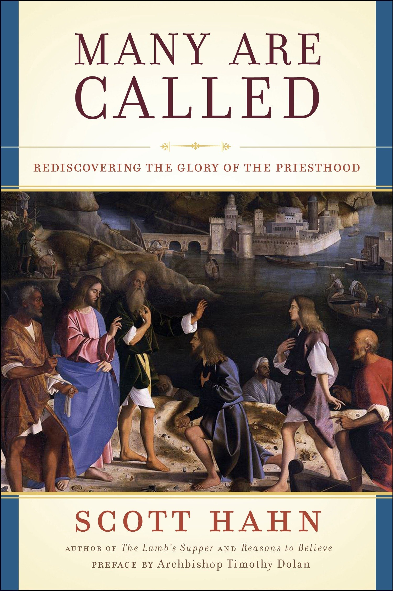

In this article, I provide answers to the questions I get asked the most. If your question is not here, feel free to reach out to me via [the contact form](/#contact) on the home page.

## 1. Who are you?

I am a **Catholic priest**. On who a Catholic priest is, check out [this article](https://www.catholic.com/encyclopedia/priest).

## 2. How should we address you?

You can call me **Father Kenny**.

## 3. Why are you called ‘Father’?

Indeed, it is customary to address priests, in different languages, as 'Father' (e.g., _Padre_, _Mon Père_, _Romo_). By calling me ‘Father,’ you are actually doing me a huge favor. You are reminding me that, as a priest, I am called—as all fathers are—to be **a provider**. I was ordained, indeed, to **nourish the faithful** with the sacraments and the Word of God as well as to **generate new children of God** through baptism.

More on why we call priests ‘Father,’ click [here](https://www.ewtn.com/catholicism/library/why-do-we-call-priests-father-1178).

  

    

      
    

  

  

    <h5>
      <a target="_blank" href="https://www.amazon.com/gp/product/B0036S4AP4/ref=as_li_tl?ie=UTF8&camp=1789&creative=9325&creativeASIN=B0036S4AP4&linkCode=as2&tag=happiness052f-20&linkId=1d3dbc85ad701809bcde2c0c89b618a8">Many Are Called: Rediscovering the Glory of the Priesthood</a>
    </h5>
    <h6>Scott Hahn</h6>
    
This work explains the priest’s roles as father, teacher, warrior, judge, bridegroom, and brother. If you are a bishop, a priest, a seminarian, somebody discerning the priesthood, or simply a person wanting to know more about Catholic priesthood, this book is meant for you.

  

## 4. Which religious order do you belong to? What title should we put behind your name?

I am a **diocesan priest**. Therefore, I do not belong to any religious order and **no religious title** (such as O.S.B., S.J., O.P., O.F.M., or O.Carm.) goes behind my name.

## 5. Who are diocesan priests?

Simply speaking, diocesan priests are **priests who dedicate their life to serving a particular diocese** ([c. 265](https://www.vatican.va/archive/cod-iuris-canonici/eng/documents/cic_lib2-cann208-329_en.html#CHAPTER_II.)). A diocese, in turn, is “a portion of the people of God which is entrusted to a bishop for him to shepherd with the cooperation of the _presbyterium_,” namely, the college of priests ([c. 369](https://www.vatican.va/archive/cod-iuris-canonici/eng/documents/cic_lib2-cann368-430_en.html)).

In my case, I am a priest of the [Diocese of Surabaya](http://www.gcatholic.org/dioceses/diocese/sura0.htm). In other words, I collaborate with my [bishop](https://www.catholic.com/encyclopedia/bishop), H.E. [Vincentius Sutikno Wisaksono](http://www.catholic-hierarchy.org/bishop/bwisak.html), in taking care of the Catholic faithful residing in the territory of this diocese. This does not mean, however, that my ministry is limited to the confines of this diocese. **My priesthood, rather, is “for all peoples and all times, and it knows no limits of blood, nationality or time”** ([PO, 10](https://www.vatican.va/archive/hist_councils/ii_vatican_council/documents/vat-ii_decree_19651207_presbyterorum-ordinis_en.html)).

')

## 6. How are diocesan priests different from religious order priests?

They are similar insofar as they are priests, yet—in many other ways—**they are very different**. I will make a comparison between them in the following table.

| Diocesan priests …                                           | Religious order priests …                                    |
| :----------------------------------------------------------- | :----------------------------------------------------------- |
| live in the middle of the world                              | live separated from the world ([PC, 5](https://www.vatican.va/archive/hist_councils/ii_vatican_council/documents/vat-ii_decree_19651028_perfectae-caritatis_en.html)) in a religious house ([c. 665](https://www.vatican.va/archive/cod-iuris-canonici/eng/documents/cic_lib2-cann607-709_en.html#CHAPTER_III.)) |
| are also called “[secular priests](https://www.newadvent.org/cathen/13675a.htm)” (from the Latin _saeculum_, which means ‘the present world’) | are also called “regular priests” (from the Latin _regulae_, which means ‘rules’) |
| made [promises](https://www.collinsdictionary.com/dictionary/english/promise) | made [vows](https://www.merriam-webster.com/dictionary/vow) to live the evangelical counsels of poverty, chastity and obedience ([c. 573 §1](https://www.vatican.va/archive/cod-iuris-canonici/eng/documents/cic_lib2-cann573-606_en.html#TITLE_I:)) |
| may own personal property and have to pay taxes              | do not own personal property (i.e., everything belongs to the community) |
| belong to a [_presbyterium_](https://www.catholicculture.org/culture/library/view.cfm?recnum=6553) (a body of priests) under the authority of a bishop | belong to a community under the authority of a superior (e.g., an abbot) |

## 7. What promises do diocesan priests have to make?

Diocesan priests made three promises on the day of their [diaconal ordination](https://www.newadvent.org/cathen/04647c.htm). They promised

- to live as [celibates](https://www.newadvent.org/cathen/03481a.htm) for the sake of the kingdom of heaven;
- to celebrate the [Liturgy of the Hours](https://www.usccb.org/prayer-and-worship/liturgy-of-the-hours) (also known as the Breviary or the [Divine Office](https://www.newadvent.org/cathen/11219a.htm)) for God’s people and for the entire world; and
- to obey their bishop and his successors.

')

## 8. As a priest, what do you do all day?

I am currently pursuing a [licentiate degree](<https://en.wikipedia.org/wiki/Licentiate_(degree)#Theology,_canon_law,_history,_and_cultural_patrimony>) in Dogmatic Theology at the [Pontifical University of the Holy Cross](https://en.pusc.it/) in Rome. Even though I spend most of my time studying, **the most important thing in my day is the celebration of the [Holy Mass](https://www.catholic.com/magazine/print-edition/why-go-to-mass)**. Then, I dedicate a good amount of time to reciting the Liturgy of the Hours, doing my [mental prayers](https://onepeterfive.com/a-beginners-guide-to-mental-prayer/), and reading [spiritual books](https://www.delibris.org/en/node/210359). In addition, I hear confessions and give homilies occasionally.

To see my typical day when I worked at a parish in 2019–2020, check out [this video](https://youtu.be/G1JPX-rMBBU).

## 9. Why do you wear peculiar clothing?

Unless I am at home or doing an activity that calls for a specific type of clothing (e.g., [skiing](https://aleteia.org/2018/01/26/7-surprising-facts-about-the-skiing-pope-john-paul-ii/), swimming, excursions), I wear black cassock or black/white clerical shirt for many reasons. I will list only four here.

- Firstly, because clerical clothing **reminds me** that I am a priest and should behave as such.
- Secondly, because it **tells other people** that I am a priest. This is especially helpful when somebody needs my service (e.g., the [sacrament of confession](https://opusdei.org/en/article/why-go-to-confession/), a [blessing](https://www.newadvent.org/cathen/02599b.htm)). In any case, at least **my clothing may remind people of God**.
- Thirdly, clerical clothing encourages me to **live modestly**. Even though secular priests do not make a promise of poverty, they are expected to live a simple life. Clerical clothing serves as a symbol of this simplicity.
- Lastly, because it is **the law**. _The Code of Canon Law_ establishes that “[c]lerics are to wear suitable ecclesiastical garb according to the norms issued by the conference of bishops and according to legitimate local customs” ([c. 284](https://www.vatican.va/archive/cod-iuris-canonici/eng/documents/cic_lib2-cann208-329_en.html#CHAPTER_III.)).

More on the history of clerical clothing, read [this article](https://aleteia.org/2017/05/05/why-do-priests-wear-black/).
