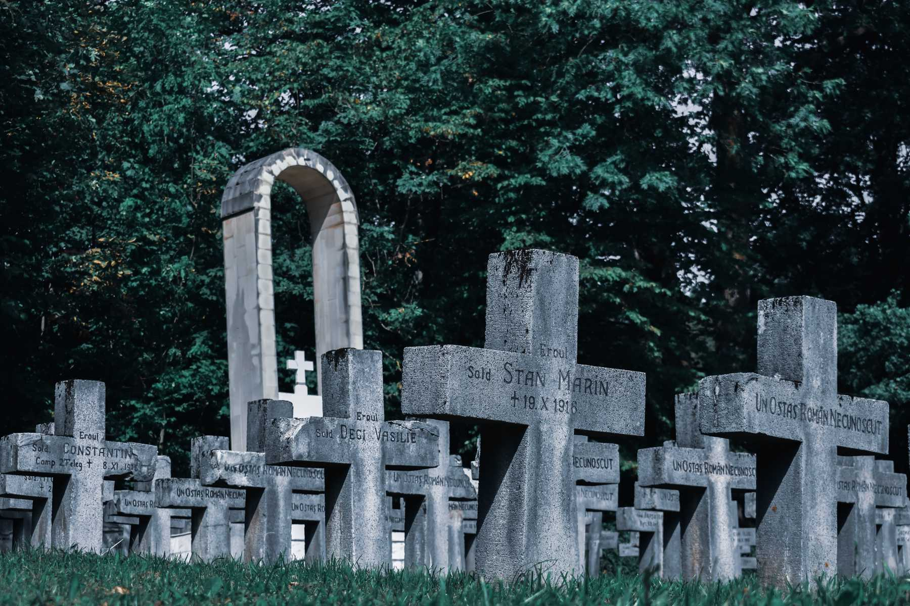

> Protes melawan Allah demi keadilan tidak banyak gunanya. Suatu dunia tanpa Allah merupakan dunia tanpa harapan (bdk. Ef 2:12). Hanya Allah dapat menciptakan keadilan. Dan iman memberi kita kepastian, bahwa Ia pasti melaksanakannya. Gambaran Pengadilan Terakhir bukanlah pertama-tama gambaran yang menakutkan, melainkan gambaran tentang harapan; mungkin bagi kita merupakan gambaran harapan yang menentukan.
>
> —Paus Benediktus XVI, *Spe Salvi*, §44

Sebagai orang kristiani, kita mengimani hidup yang kekal. Namun, pengetahuan kita tentang hal ini sangat terbatas: sejauh ini, belum ada orang mati yang kembali ke dunia orang hidup untuk memberikan kepada kita informasi yang lengkap tentang kehidupan setelah kematian. Namun, berkat wahyu Allah dan refleksi teologis selama berabad-abad, kita memiliki gambaran mengenai "hal-hal terakhir." Dalam artikel ini, saya akan menyajikan ringkasan akan hal-hal tersebut, yakni kematian; Pengadilan Khusus; neraka, api penyucian, dan surga; kebangkitan; dan Pengadilan Terakhir.

---

## Daftar Isi

1. [Kematian](/id/post/last-things/#1-kematian)  
    [Apa yang terjadi saat kita mati?](/id/post/last-things/#apa-yang-terjadi-saat-kita-mati)  
    [Mengapa kita mati?](/id/post/last-things/#mengapa-kita-mati)  
    [Apakah kematian bermakna?](/id/post/last-things/#apakah-kematian-bermakna)  
2. [Pengadilan Khusus](/id/post/last-things/#2-pengadilan-khusus)  
    [Apa itu Pengadilan Khusus?](/id/post/last-things/#apa-itu-pengadilan-khusus)  
    [Apa saja putusan yang mungkin kita peroleh dalam Pengadilan Khusus?](/id/post/last-things/#apa-saja-putusan-yang-mungkin-kita-peroleh-dalam-pengadilan-khusus)  
3. [Neraka](/id/post/last-things/#3-neraka)  
    [Apa itu neraka?](/id/post/last-things/#apa-itu-neraka)  
    [Bagaimana kita bisa tahu bahwa ada neraka?](/id/post/last-things/#bagaimana-kita-bisa-tahu-bahwa-ada-neraka)  
    [Apa yang kita maksud ketika kita menyatakan bahwa 'ada neraka'?](/id/post/last-things/#apa-yang-kita-maksud-ketika-kita-menyatakan-bahwa-ada-neraka)  
    [Apa yang membuat kita masuk neraka?](/id/post/last-things/#apa-yang-membuat-kita-masuk-neraka)  
    [Apa itu keadaan berdosa berat?](/id/post/last-things/#apa-itu-keadaan-berdosa-berat)  
    [Seperti apakah hukuman di neraka?](/id/post/last-things/#seperti-apakah-hukuman-di-neraka)  
    [Selama berapa lama hukuman di neraka berlangsung?](/id/post/last-things/#selama-berapa-lama-hukuman-di-neraka-berlangsung)  
4. [Api Penyucian](/id/post/last-things/#4-api-penyucian)  
    [Apa itu Api Penyucian?](/id/post/last-things/#apa-itu-api-penyucian)  
    [Apa itu 'keadaan rahmat'?](/id/post/last-things/#apa-itu-keadaan-rahmat)  
    [Apakah Api Penyucian memiliki dasar dalam Kitab Suci?](/id/post/last-things/#apakah-api-penyucian-memiliki-dasar-dalam-kitab-suci)  
    [Apakah ada penderitaan di api penyucian?](/id/post/last-things/#apakah-ada-penderitaan-di-api-penyucian)  
5. [Surga](/id/post/last-things/#5-surga)  
    [Apa itu surga?](/id/post/last-things/#apa-itu-surga)  
    [Apa yang membuat kita masuk surga?](/id/post/last-things/#apa-yang-membuat-kita-masuk-surga)  
    [Berapa lama kita akan berada di surga?](/id/post/last-things/#berapa-lama-kita-akan-berada-di-surga)  
    [Akankah semua orang menerima upah yang sama di surga?](/id/post/last-things/#akankah-semua-orang-menerima-upah-yang-sama-di-surga)    
    [Apa sumber sukacita kita di surga?](/id/post/last-things/#apa-sumber-sukacita-kita-di-surga)  
    [Mungkinkah kita berbuat dosa di surga?](/id/post/last-things/#mungkinkah-kita-berbuat-dosa-di-surga)  
6. [Kebangkitan](/id/post/last-things/#6-kebangkitan)  
    [Apa itu kebangkitan?](/id/post/last-things/#apa-itu-kebangkitan)  
    [Seperti apakah tubuh kita pada saat kita dibangkitkan?](/id/post/last-things/#seperti-apakah-tubuh-kita-pada-saat-kita-dibangkitkan)  
    [Berapa usia kita ketika kita bangkit kembali?](/id/post/last-things/#berapa-usia-kita-ketika-kita-bangkit-kembali)  
    [Akankah ada pernikahan di surga?](/id/post/last-things/#akankah-ada-pernikahan-di-surga)  
7. [Pengadilan Terakhir](/id/post/last-things/#7-pengadilan-terakhir)  
    [Apa itu Pengadilan Terakhir?](/id/post/last-things/#apa-itu-pengadilan-terakhir)  
    [Kapan Pengadilan Terakhir akan diselenggarakan?](/id/post/last-things/#kapan-pengadilan-terakhir-akan-diselenggarakan)  
    [Apa itu Parusia?](/id/post/last-things/#apa-itu-parusia)  
    [Siapa yang akan diadili di Pengadilan Terakhir?](/id/post/last-things/#siapa-yang-akan-diadili-di-pengadilan-terakhir)  
    [Apa yang akan diungkapkan dalam Pengadilan Terakhir?](/id/post/last-things/#apa-yang-akan-diungkapkan-dalam-pengadilan-terakhir)  
    [Mengapa Pengadilan Terakhir diperlukan?](/id/post/last-things/#mengapa-pengadilan-terakhir-diperlukan-apakah-pengadilan-khusus-tidak-cukup)  
    [Apa yang akan terjadi setelah Pengadilan Terakhir?](/id/post/last-things/#apa-yang-akan-terjadi-setelah-pengadilan-terakhir)  

---

## 1. Kematian

### Apa yang terjadi saat kita mati?

Ada dua hal yang terjadi saat kita mati. *Pertama*, saat kita mati, jiwa kita akan terpisah dari tubuh kita.[^1] Tubuh kita akan membusuk, namun jiwa kita akan tetap hidup. Jiwa kita bersifat abadi.

*Kedua*, saat kita mati, kehidupan duniawi kita berakhir.[^2] Ini berarti kematian mengakhiri kemungkinan untuk memperoleh pahala *(merit)*.[^3] Tidak ada lagi kemungkinan untuk bertobat setelah kematian.

### Mengapa kita mati?

Kita mati karena kita memiliki dosa asal.[^4] Pembaca yang penuh perhatian bisa jadi bertanya: “Yesus dan Maria tidak memiliki dosa asal. Lalu, mengapa mereka juga mati?” Bagi mereka, kematian bukanlah akibat dari dosa, melainkan *tuntutan alami*. Bagi mereka, kematian adalah konsekuensi dari *status mereka sebagai manusia*.

### Apakah kematian bermakna?

Dengan mati di kayu salib, Kristus memberi makna pada kematian:[^5] “melalui Baptisan, orang kristiani telah 'mati bersama Kristus' secara sakramental, untuk menjalani kehidupan baru.”[^6]

## 2. Pengadilan Khusus

### Apa itu Pengadilan Khusus?

Pengadilan Khusus adalah penerimaan *imbalan abadi* dalam jiwa kita pada saat kita mati.[^7]

### Apa saja putusan yang mungkin kita peroleh dalam **Pengadilan Khusus?**

Ada tiga putusan yang mungkin kita terima dalam Pengadilan Khusus: (1) surga (secara langsung); (2) surga (dengan melewati api penyucian); dan (3) neraka.

## 3. Neraka

### Apa itu neraka?

Neraka adalah “keadaan pengucilan diri secara definitif dari persekutuan dengan Allah dan dengan para kudus.”[^8]

### Bagaimana kita bisa tahu bahwa ada neraka?

Ada dua cara utama bagi kita untuk mengetahui bahwa ada neraka. Cara pertama adalah lewat *Kitab Suci*. Dalam Injil, Yesus menyebutkan neraka *(gehenna)* sebelas kali. Dia kadang-kadang berbicara mengenai neraka tanpa menggunakan istilah 'neraka' secara eksplisit, seperti dalam pernyataan berikut: "Enyahlah dari hadapan-Ku, hai kamu orang-orang terkutuk, enyahlah ke dalam api yang kekal yang telah sedia untuk Iblis dan malaikat-malaikatnya" (Mat 25:41).

Cara kedua adalah lewat *akal budi manusia*. Neraka adalah konsekuensi dari kebebasan manusia. Manusia adalah bebas. Artinya, kita bisa melakukan perbuatan baik atau perbuatan buruk. Pilihan kita membawa dampak. Perbuatan baik akan dipuji; sebaliknya, perbuatan buruk akan dihukum. Oleh karena itu, dalam pemerintahan duniawi, harus ada penjara untuk menghukum orang jahat dan menegakkan keadilan. Hal yang sama terjadi dalam pemerintahan Allah: harus ada neraka untuk menghukum orang jahat dan menegakkan keadilan ilahi. Dalam kata-kata Tomas Aquinas,

> Allah menjatuhkan hukuman bukan demi keuntungan-Nya sendiri, seolah-olah Dia menikmatinya, namun demi tujuan lain: yakni *demi keteraturan* yang harus diterapkan pada makhluk ciptaan. Dalam keteraturan itulah kebaikan alam semesta terwujud.[^9]

### Apa yang kita maksud ketika kita menyatakan bahwa 'ada neraka'?

Ketika kita mengatakan bahwa 'ada neraka,' kita menegaskan bahwa manusia dapat dengan bebas dan dengan teguh *menolak kasih Allah*. Allah berkehendak menyelamatkan semua manusia (1Tim 2:4). Namun, ini tidak berarti bahwa manusia *mau tidak mau* akan diselamatkan.

Ketika kita mengatakan bahwa 'ada neraka,' kita tidak sedang berbicara mengenai *ada atau tidaknya orang di neraka*. Kita tidak sedang menyatakan bahwa sebagian manusia pasti akan dikutuk. Gereja dapat menyatakan dengan pasti bahwa sejumlah manusia ada di surga: mereka adalah orang-orang kudus yang telah dikanonisasi. Meski demikian, Gereja *tidak pernah* menyatakan bahwa seseorang ada di neraka.

### Apa yang membuat kita masuk neraka?

Kita akan masuk neraka jika kita mati dalam keadaan *berdosa berat*.

### Apa itu keadaan berdosa berat?

Keadaan berdosa berat adalah keadaan seseorang yang tidak bertobat dari dosa berat yang telah dia lakukan. Sebuah dosa adalah mematikan jika tiga kondisi berikut terpenuhi:[^10]

1. Materinya berat.
2. Dosa itu dilakukan dengan penuh kesadaran.
3. Dosa itu dilakukan dengan persetujuan yang telah dipertimbangkan.

### Seperti apakah hukuman di neraka?

Menurut tradisi teologi, ada dua jenis hukuman di neraka.[^11]

Hukuman yang utama dan paling menyakitkan dinamakan dalam bahasa Latin *poena damni*.[^12] Hukuman ini berwujud keterpisahan abadi dari Allah dan ketidakmampuan untuk melihat Allah.[^13] Hukuman ini disebabkan oleh penolakan terhadap Allah *(aversio a Deo)* selama kehidupan seseorang di dunia.

Hukuman lainnya disebut *hukuman indrawi* *(poena sensus)*. Hukuman ini disebabkan oleh keterikatan pada makhluk ciptaan *(conversio ad creaturas)*. Hukuman ini dijatuhkan oleh Allah kepada seseorang melalui makhluk yang ia salahgunakan selama kehidupannya di dunia.

### Selama berapa lama hukuman di neraka berlangsung?

Hukuman di neraka berlangsung selama-lamanya: "Orang-orang yang membenci Tuhan akan tunduk menjilat kepada-Nya, dan itulah nasib mereka untuk selama-lamanya" (Mzm 81:15).

## 4. Api Penyucian

### Apa itu Api Penyucian?

Api Penyucian adalah *pemurnian terakhir* bagi mereka yang meninggal dalam *keadaan rahmat* tetapi *belum sepenuhnya murni*. Mereka yang berada di Api Penyucian *pasti* masuk surga.[^14] Di Api Penyucian, seseorang dimurnikan dari (1) dosa ringan yang tersisa di akhir hayat, (2) hukuman sementara akibat dosa, dan (3) kecenderungan untuk berbuat dosa.

### Apa itu 'keadaan rahmat'?

Keadaan rahmat adalah keadaan seseorang yang *bersahabat dengan Allah* dan bebas dari dosa berat.

')

### Apakah Api Penyucian memiliki dasar dalam Kitab Suci?

Ya. Api Penyucian ada baik dalam Perjanjian Lama maupun Perjanjian Baru.

Allah adalah *kudus*: “Setiap orang yang menaruh pengharapan itu kepada-Nya, menyucikan diri sama seperti Dia yang adalah suci” (1Yoh 3:3). Oleh karena itu, surga diperuntukkan hanya bagi *mereka yang kudus*: “tidak akan masuk ke dalamnya sesuatu yang najis, atau orang yang melakukan kekejian atau dusta” (Why 21:27). Namun, manusia pada faktanya berdosa: "Sesungguhnya, dalam kesalahan aku diperanakkan, dalam dosa aku dikandung ibuku" (Mzm 51:5). Karenanya, pemurnian terakhir setelah kematian adalah sesuatu yang selaras dengan belas kasih Allah, seperti yang disinggung dalam kitab kedua Makabe: “[Yudas Makabe] mengadakan korban penebus salah untuk semua orang yang sudah mati itu, supaya mereka dilepaskan dari dosa mereka” (2Mak 12:45 ). Ayat ini menegaskan kemungkinan untuk memperoleh pengampunan dan penebusan dosa-dosa ringan setelah kematian. Paulus juga menyinggung api penyucian: ”Jika pekerjaannya terbakar, ia akan menderita kerugian, tetapi ia sendiri akan diselamatkan, tetapi seperti dari dalam api” (1Kor 3:15).

### Apakah ada penderitaan di api penyucian?

Para doktor Gereja, misalnya Agustinus[^15] dan Tomas Aquinas,[^16] mengajarkan bahwa seseorang mengalami penderitaan yang amat besar di api penyucian. Penderitaan ini disebabkan oleh *tertundanya* penglihatan akan Allah. Mereka yang berada di api penyucian ingin melihat Allah tetapi belum bisa melakukannya.

## 5. Surga

### Apa itu surga?

Surga adalah pemenuhan yang total atas segala kerinduan kita akan kebahagiaan. Surga adalah penglihatan akan Allah—penglihatan yang membahagiakan. Surga adalah hidup bersekutu dengan Allah dan para kudus.[^17] Surga, pada akhirnya, adalah sesuatu yang tak terbayangkan: “Apa yang tidak pernah dilihat oleh mata, dan tidak pernah didengar oleh telinga, dan yang tidak pernah timbul di dalam hati manusia: semua yang disediakan Allah untuk mereka yang mengasihi Dia” (1Kor 2:9).

### Apa yang membuat kita masuk surga?

Kita masuk surga apabila kita mati dalam *keadaan rahmat* dan *telah dimurnikan secara sempurna*.

### Berapa lama kita akan berada di surga?

Untuk selama-lamanya. Namun, kamu mungkin bertanya: apa artinya hidup selama-lamanya? Memang, banyak dongeng berakhir dengan ungkapan 'mereka hidup bahagia selama-lamanya.' Akan tetapi, apakah kamu bersedia hidup di bumi ini sampai kamu berusia empat ratus tahun? Atau, apakah kamu akan memakan sebuah super-vitamin yang membuat kamu tidak bisa mati? Saya kira kamu tidak menginginkan hal ini. Ini bukanlah surga: surga bukanlah hidup selama-lamanya *dalam waktu*.

Waktu tidak memungkinkan kebahagiaan yang sempurna. Dalam waktu, kita hanya bisa mengalami kesenangan secara satu per satu: sekarang kita makan, lalu kita tidur. Kenikmatan yang diperoleh dari kedua aktivitas tersebut tidak dapat kita alami secara bersamaan.

Surga, sebaliknya, adalah kehidupan *di luar waktu*, dalam keabadian. Keabadian adalah “kepemilikan yang bersamaan dan sempurna akan kehidupan yang tiada akhirnya.”[^18] Tidak akan ada pergantian waktu (masa lalu - masa sekarang - masa depan) di surga. Itulah mengapa di surga kita akan dapat menikmati segala kebahagiaan pada saat yang sama.

')

### Akankah semua orang menerima upah yang sama di surga?

Tradisi teologi menyatakan bahwa di surga akan ada *kesetaraan dalam durasi* namun *ketidaksetaraan dalam upah*. Surga bersifat kekal bagi semua orang yang diselamatkan. Namun, akan ada upah yang berbeda bagi orang yang berbeda. Ketidaksetaraan ini akan bergantung pada *rahmat* Allah dan *jasa* mereka yang diselamatkan.

Saya pikir analogi berikut akan membantu: setiap orang kudus di surga ibarat botol yang diisi dengan anggur. Botol-botol itu semuanya terisi penuh, tetapi ukuran botol-botol tersebut bervariasi. Orang-orang kudus tertentu merupakan botol yang lebih besar daripada yang lain.[^19] Semua orang kudus di surga melihat Allah muka dengan muka, akan tetapi beberapa melihat-Nya secara lebih jelas ketimbang yang lain.

### Apa sumber sukacita kita di surga?

Segala sukacita kita di surga datang dari *penglihatan akan Allah*. Penglihatan ini adalah penglihatan yang membahagiakan—penglihatan yang membuat kita bersukacita: “Karena sekarang kita melihat dalam cermin suatu gambaran yang samar-samar, tetapi nanti kita akan melihat muka dengan muka” (1Kor 13:12). Kemampuan kita untuk melihat Allah datang semata-mata dari Allah. Namun, melihat Allah muka dengan muka tidak berarti sepenuhnya memahami Dia. Dalam kata-kata St. Tomas, kita akan melihat Allah *Yang Tak Terbatas* namun tidak secara *tak terbatas*.[^20]

### Mungkinkah kita berbuat dosa di surga?

Tidak, kita tidak mungkin berbuat dosa di surga. Namun ini tidak berarti bahwa kita kehilangan kebebasan. Ketika kita melihat Allah seperti apa adanya Dia, kita akan menyadari sepenuhnya bahwa Dia adalah sumber segala *kebaikan*. Kita tidak akan pernah memilih untuk membenci-Nya dengan berbuat dosa. Kita akan dengan bebas *menolak dosa*. Sekali diperoleh, hadiah surgawi tidak akan pernah bisa hilang.

## 6. Kebangkitan

### Apa itu kebangkitan?

Kebangkitan adalah persatuan kembali antara tubuh dan jiwa kita.[^21] Di surga, jiwa orang benar menunggu "saat di mana ia kelak akan disatukan kembali dengan tubuhnya.”[^22]

Kebangkitan adalah efek langsung dari Parusia dan prasyarat untuk Pengadilan Terakhir. Semua orang mati akan bangkit secara bersamaan di akhir zaman. Orang benar akan bangkit untuk hidup yang abadi; sebaliknya, orang jahat akan bangkit untuk dihukum.[^23]

### Seperti apakah tubuh kita pada saat kita dibangkitkan?

Pada saat kita dibangkitkan, tubuh kita akan serupa dengan tubuh Kristus.[^24] Tubuh kita pada saat itu adalah tubuh yang *padat*—kita tidak akan berubah menjadi hantu. Tubuh kita pada saat dibangkitkan adalah tubuh yang *lengkap*—dengan daging, tulang, dan darah. Tubuh kita adalah *tubuh yang sama* dengan yang kita miliki sekarang—kita tidak akan memiliki tubuh lain yang tidak kita miliki. Tubuh kita juga adalah tubuh yang *mulia*.

Tubuh yang mulia adalah tubuh yang memperoleh ciri-ciri yang secara khas dimiliki oleh jiwa. St. Tomas menyebutkan empat karakteristik.[^25] Tubuh yang dimuliakan akan memiliki *kejernihan*—tubuh itu adalah tubuh yang indah. Tubuh yang dimuliakan adalah tubuh yang *gesit*—ia akan bisa pergi ke mana pun sesuai keinginan jiwa. Tubuh yang dimuliakan adalah tubuh yang *halus*—ia akan mampu menembus objek materiil. Terakhir, Tubuh yang dimuliakan adalah tubuh yang *tidak dapat menderita*.

')

### Berapa usia kita ketika kita bangkit kembali?

Kebangkitan Kristus adalah model bagi kebangkitan kita: “Akulah kebangkitan dan hidup” (Yoh 11:25).[^26] Oleh karena itu, St. Tomas menegaskan bahwa—seperti Kristus—kita akan bangkit dalam usia yang sempurna, yakni sebagai orang muda.[^27]

### Akankah ada pernikahan di surga?

Tidak akan ada pernikahan di surga, sebagaimana Yesus tegaskan: “pada waktu kebangkitan orang tidak kawin dan tidak dikawinkan” (Mat 22:30). Di surga, masing-masing dari kita akan tetap menjadi pria atau wanita. Namun, kita tidak akan lagi menjalankan fungsi hewani kita, seperti makan, minum, tidur, dan berkembang biak.[^28]

## 7. Pengadilan Terakhir

### Apa itu Pengadilan Terakhir?

Pengadilan Terakhir adalah penilaian yang dibuat oleh Kristus, Hakim kita, atas segala perbuatan dan semua niat hati kita: “Tidak ada sesuatu pun yang tertutup yang tidak akan dibuka dan tidak ada sesuatu pun yang tersembunyi yang tidak akan diketahui” (Luk 12:2).

### Kapan Pengadilan Terakhir akan diselenggarakan?

Pengadilan Terakhir akan diselenggarakan ketika Kristus datang kembali *di akhir zaman*. Kedatangan-Nya yang kedua ini dikenal sebagai 'Parusia.'[^29] Pengadilan Terakhir akan didahului oleh kebangkitan orang mati.[^30]

### Apa itu Parusia?

Parusia adalah *kedatangan Kristus* di akhir zaman: “Sebab sama seperti kilat memancar dari sebelah timur dan melontarkan cahayanya sampai ke barat, demikian pulalah kelak kedatangan Anak Manusia” (Mat 24:27). Lebih dari dua ribu tahun yang lalu, pada kedatangan-Nya yang pertama, Putra Allah datang dalam *kerendahan hati* sebagai Juruselamat. Namun, pada kedatangan-Nya yang kedua, Dia akan datang dalam *kemuliaan* sebagai Hakim atas orang yang hidup dan yang mati.

')

### Siapa yang akan diadili di Pengadilan Terakhir?

Semua orang. Kristiani dan non-kristiani. Pengadilan Terakhir memiliki cakupan yang universal.

### Apa yang akan diungkapkan dalam Pengadilan Terakhir?

Pengadilan Terakhir akan menampilkan *kekudusan* dan *keadilan* Allah. Pengadilan Terakhir akan mengungkapkan segala *karya* dan *niat* hati kita. Pengadilan Terakhir akan mengungkapkan semua *konsekuensi* dari perbuatan dan kelalaian kita.[^31] Pengadilan Terakhir juga akan mengungkapkan *makna* terdalam dari penciptaan dan sejarah keselamatan.[^32]

### Mengapa Pengadilan Terakhir diperlukan? Apakah Pengadilan Khusus tidak cukup?

Memang benar bahwa, segera setelah kita mati, kita akan mengetahui tujuan akhir kita pada Pengadilan Khusus. Meski demikian, Pengadilan Terakhir tetap diperlukan karena *dampak-dampak* dari tindakan kita—tindakan baik dan tindakan buruk—menetap di bumi lama setelah kita mati. Perbuatan baik (atau buruk) kita, misalnya, berdampak pada anak-anak kita, cucu-cicit kita, dan seterusnya. Oleh karena itu, upah (atau hukuman) dapat *diberikan secara adil* hanya jika dampak-dampak tersebut turut diperhitungkan.[^33] Inilah mengapa Pengadilan Terakhir diperlukan.

### Apa yang akan terjadi setelah Pengadilan Terakhir?

Setelah Pengadilan Terakhir, alam semesta akan diubahkan dan orang-orang kudus akan memerintah bersama dengan Kristus.[^34] Kita tidak tahu persis seperti apa wujud alam semesta setelah Pengadilan Terakhir. Kita hanya tahu bahwa di “langit yang baru dan bumi yang baru” (2Pet 3:13), Allah akan menjadi “semua di dalam semua” (1Kor 15:28).[^35]

[^1]:Lih. *KGK*, §997.
[^2]:Lih. *KGK*, §1007.
[^3]:Lih. *KGK*, §1013; §1021.
[^4]:Lih. Rom 5:12; D 788; *KGK*, §1008.
[^5]:Lih. *KGK*, §1009.
[^6]:*KGK*, §1010.
[^7]:Lih. *KGK*, §1022; 1035.
[^8]:*KGK*, §1033.
[^9]:Aquinas, *ScG* III, cap. 144 n. 10.
[^10]:Lih. *KGK*, §1857: “Supaya satu perbuatan merupakan dosa berat harus dipenuhi secara serentak tiga persyaratan: 'Dosa berat ialah dosa yang mempunyai materi berat sebagai obyek dan yang dilakukan dengan penuh kesadaran dan dengan persetujuan yang telah dipertimbangkan'”
[^11]:Lih. Aquinas, *ST* I-II, q. 87 a. 4 co.
[^12]:Lih. *KGK*, §1035.
[^13]:Lih. *KGK*, §1057.
[^14]:Lih. *KGK*, §1031.
[^15]:Augustine, *Expositions on the Psalms*, 37:3.
[^16]:Aquinas, *Quaestio de purgatorio*, a. 3 co.
[^17]:Lih. *KGK*, §1024.
[^18]:Boethius, *De consolatione philosophiae*, 5, pr. 6:4.
[^19]:Lih. Paul O’Callaghan, *Christ Our Hope: An Introduction to Eschatology* (Washington, D.C.: The Catholic University of America Press, 2011), 182.
[^20]:Lih. Aquinas, *ST* I, q. 12 a. 7 ad 3.
[^21]:Lih. *KGK*, §1016.
[^22]:*KGK*, §997.
[^23]:Lih. Kis 24:15; *KGK*, §998; 1038.
[^24]:Lih. Aquinas, *ST* III, q. 54.
[^25]:Lih. Aquinas, *ST* Supplementum, q. 82–85.
[^26]:Lih. Aquinas, *ST* III, q. 65 a. 1.
[^27]:Lih. Aquinas, *ST* Supplementum, q. 81 a. 1.
[^28]:Lih. Aquinas, *ST* Supplementum, q. 81 a. 4.
[^29]:Lih. *KGK*, §1040.
[^30]:Lih. *KGK*, §1001; 1052.
[^31]:Lih. *KGK*, §1039.
[^32]:Lih. *KGK*, §1040.
[^33]:Lih. Aquinas, *ST* III, q. 59 a. 5 co.
[^34]:Lih. *KGK*, §1042.
[^35]:Lih. *KGK*, §1050.
