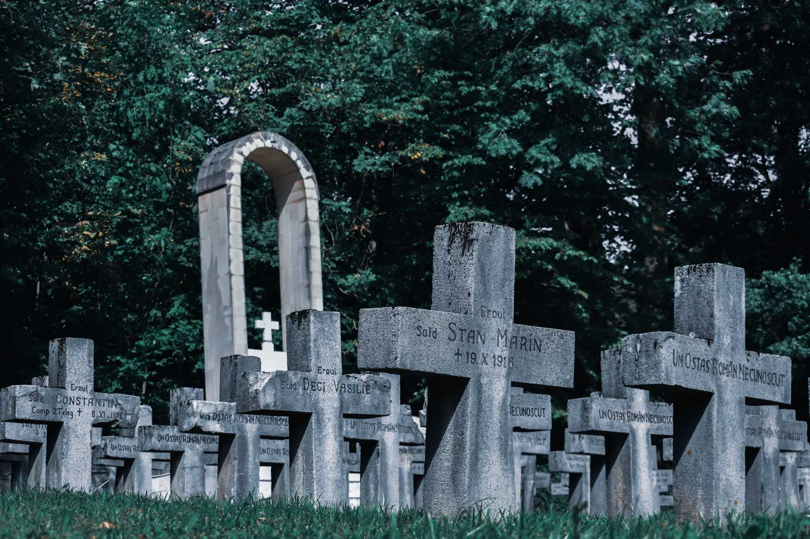

> To protest against God in the name of justice is not helpful. A world without God is a world without hope. Only God can create justice. And faith gives us the certainty that he does so. The image of the Last Judgement is not primarily an image of terror, but an image of hope; for us it may even be the decisive image of hope.
> 
> —Pope Benedict XVI, *Spe Salvi*, §44

As Christians, we profess our faith in life everlasting. Yet, our knowledge of it is very limited: so far no dead has returned to the world of the living to tell us what the afterlife looks like. However, thanks to God’s revelation and centuries of theological reflections, we do know something about the “last things.” In this article, I will provide a summary of these things, namely, death; the particular judgment; hell, purgatory, and heaven; resurrection; and the last judgment.

---

## Content

1. [Death](/post/last-things/#1-death)  
    [What happens to us when we die?](/post/last-things/#what-happens-to-us-when-we-die)  
    [Why do we die?](/post/last-things/#why-do-we-die)  
    [Is death meaningful?](/post/last-things/#is-death-meaningful)  
2. [The Particular Judgment](/post/last-things/#2-the-particular-judgment)  
    [What is the Particular Judgment?](/post/last-things/#what-is-the-particular-judgment)  
    [What are the possible outcomes of the Particular Judgment?](/post/last-things/#what-are-the-possible-outcomes-of-the-particular-judgment)  
3. [Hell](/post/last-things/#3-hell)  
    [What is hell?](/post/last-things/#what-is-hell)  
    [How can we know that there is hell?](/post/last-things/#how-can-we-know-that-there-is-hell)  
    [What do we mean when we affirm that ‘hell exists’?](/post/last-things/#what-do-we-mean-when-we-affirm-that-hell-exists)  
    [What makes us go to hell?](/post/last-things/#what-makes-us-go-to-hell)  
    [What is the state of mortal sin?](/post/last-things/#what-is-the-state-of-mortal-sin)  
    [What does the punishment in hell look like?](/post/last-things/#what-does-the-punishment-in-hell-look-like)  
    [How long does the punishment in hell last?](/post/last-things/#how-long-does-the-punishment-in-hell-last)  
4. [Purgatory](/post/last-things/#4-purgatory)  
    [What is purgatory?](/post/last-things/#what-is-purgatory)  
    [What is the 'state of grace'?](/post/last-things/#what-is-the-state-of-grace)  
    [Is purgatory biblical?](/post/last-things/#is-purgatory-biblical)  
    [Is there suffering in purgatory?](/post/last-things/#is-there-suffering-in-purgatory)  
5. [Heaven](/post/last-things/#5-heaven)  
    [What is heaven?](/post/last-things/#what-is-heaven)  
    [What allows us to go to heaven?](/post/last-things/#what-allows-us-to-go-to-heaven)  
    [How long will we be in heaven?](/post/last-things/#how-long-will-we-be-in-heaven)  
    [Will everybody receive the same reward in heaven?](/post/last-things/#will-everybody-receive-the-same-reward-in-heaven)    
    [What is the source of our joys in heaven?](/post/last-things/#what-is-the-source-of-our-joys-in-heaven)  
    [Will we be able to sin in heaven?](/post/last-things/#will-we-be-able-to-sin-in-heaven)  
6. [Resurrection](/post/last-things/#6-resurrection)  
    [What is resurrection?](/post/last-things/#what-is-resurrection)  
    [What will our resurrected body look like?](/post/last-things/#what-will-our-resurrected-body-look-like)  
    [Will we be young or old when we rise again?](/post/last-things/#will-we-be-young-or-old-when-we-rise-again)  
    [Will there be marriage in heaven?](/post/last-things/#will-there-be-marriage-in-heaven)  
7. [The Last Judgment](/post/last-things/#7-the-last-judgment)  
    [What is the Last Judgment?](/post/last-things/#what-is-the-last-judgment)  
    [When will the Last Judgment occur?](/post/last-things/#when-will-the-last-judgment-occur)  
    [What is Parousia?](/post/last-things/#what-is-parousia)  
    [Who will be judged in the Last Judgment?](/post/last-things/#who-will-be-judged-in-the-last-judgment)  
    [What will the Last Judgment reveal?](/post/last-things/#what-will-the-last-judgment-reveal)  
    [Why is the Last Judgment necessary? Does the Particular Judgment not suffice?](/post/last-things/#why-is-the-last-judgment-necessary-does-the-particular-judgment-not-suffice) 
    [What will follow the Last Judgment?](/post/last-things/#what-will-follow-the-last-judgment)  

---

## 1. Death

### What happens to us when we die?

Our death means two things. *Firstly*, when we die, our soul will be separated from our body.[^1] Our body will decay, yet our soul will remain alive. Our soul is immortal.

*Secondly*, when we die, our earthly life ends.[^2] This means that death puts an end to the possibility of gaining merits.[^3] Furthermore, no more conversion is possible after death.

### Why do we die?

We die because we have original sin.[^4] An attentive reader might ask: “But Jesus and Mary had no original sin. Why then did they also die?” For them, death is not a consequence of sin but a *natural necessity*. For them, death is part of *being human*.

### Is death meaningful?

By dying on the cross, Christ transformed death.[^5] Thanks to this transformation, death becomes meaningful: “through Baptism, the Christian has already ‘died with Christ’ sacramentally, in order to live a new life.”[^6]

## 2. The Particular Judgment

### What is the Particular Judgment?

The Particular Judgment is the immediate reception of *eternal retribution* in our immortal soul at the very moment of our death.[^7]

### What are the possible outcomes of **the Particular Judgment?**

There are three possible outcomes of the Particular Judgment: (1) heaven (immediately); (2) heaven (by going through purgatory); and (3) hell.

## 3. Hell

### What is hell?

Hell is the “state of definitive self-exclusion from communion with God and the blessed.”[^8]

### How can we know that there is hell?

There are two main ways for us to know that hell exists. The first way is the *Scripture*. In the Gospels, Jesus mentions hell *(gehenna)* eleven times. He sometimes refers to hell without using the term explicitly, as in the following case: “You that are accursed, depart from me into the eternal fire prepared for the devil and his angels” (Mt 25:41).

The second way is *human reasoning*. The existence of hell can be deduced from the existence of freedom. We are free. This means that we can do good acts or bad acts. Our deliberate choices are not indifferent. We praise good acts but punish bad ones. Hence, in an earthly government, there must be prisons to punish the wicked and uphold justice. The same thing happens in God’s government: there must be hell to punish the wicked and uphold divine justice. In the words of Thomas Aquinas,

> God inflicts punishments not for his own sake, as though he took pleasure in them, but for the sake of something else: namely *on account of the order* that must be imposed on creatures, in which [order] the good of the universe consists.[^9]

### What do we mean when we affirm that ‘hell exists’?

When we say that ‘hell exists,’ we are affirming that it is possible for human beings to freely and irrevocably *reject God’s love*. God wills to save all human beings (1Tim 2:4). However, this does not mean that human beings are *necessarily* saved.

When we affirm that ‘hell exists,’ we are not affirming whether or not *there are people in hell*. We are not affirming that some will necessarily be condemned. The Church can affirm with certainty that some are in heaven: they are the canonized saints. Nonetheless, the Church *never* proclaims that so-and-so is in hell.

### What makes us go to hell?

We go to hell if we die in the state of *mortal sin*.

### What is the state of mortal sin?

The state of mortal sin is the condition of a person who does not repent of a committed mortal sin. A sin is mortal if the three following conditions are met:[^10]

1. The matter is grave.
2. It is committed with full knowledge.
3. It is committed with deliberate consent.

### What does the punishment in hell look like?

According to a long-standing theological tradition, the punishment in hell is twofold.[^11]

The principal and most painful punishment is the *pain of loss* *(poena damni)*.[^12] This punishment consists in the eternal separation from God and the lack of beatific vision.[^13] This punishment is caused by the rejection of God *(aversio a Deo)* during one’s earthly life.

The other punishment is called the *pain of sense* *(poena sensus)*. This punishment is caused by the attachment to creatures *(conversio ad creaturas)*. This punishment is inflicted by God through the very creatures one abuses during one’s earthly life.

### How long does the punishment in hell last?

The punishment in hell lasts for all eternity: “Those who hate the Lord would cringe before him, and their doom would last forever” (Ps 81:15).

## 4. Purgatory

### What is purgatory?

Purgatory is the *final purification* of those who die in the *state of grace* but are *imperfectly purified*. Those in purgatory have the *certainty* of going to heaven.[^14] In purgatory, one is purified from (1) venial sins remaining at the end of life, (2) the temporal punishment due to sin, and (3) the inclination of the will toward sin.

### What is the 'state of grace'?

The state of grace is the condition of a person who is a *friend of God* and free from any mortal sin.

')

### Is purgatory biblical?

Yes, it is. It is present both in the Old and the New Testament.

God is *holy*: “all who have this hope in him purify themselves, just as he is pure” (1Jn 3:3). Hence, heaven is only for *those who are holy*: “nothing unclean will enter it, nor anyone who practices abomination or falsehood” (Rev 21:27). Human beings, however, are sinful: “I was born guilty, a sinner when my mother conceived me” (Ps 51:5). Therefore, it befits God’s mercy to allow for a definitive purification after death, as suggested in the second book of Maccabees: “[Judas Maccabeus] made atonement for the dead, so that they might be delivered from their sin” (2Mac 12:45). This passage affirms the possibility of forgiveness and expiation of venial sins after death. Paul too alludes to purgatory: “If the work is burned up, the builder will suffer loss; the builder will be saved, but only as through fire” (1Cor 3:15).

### Is there suffering in purgatory?

Doctors of the Church, such as Augustine[^15] and Thomas Aquinas,[^16] teach that one suffers intensely in purgatory. This suffering is caused by the *delay* of the vision of God. Those in purgatory desire to see God but cannot do so as yet.

## 5. Heaven

### What is heaven?

Heaven is the total fulfillment of our desire for happiness. It is the vision of God—the beatific vision. It is life in communion with God and the saints.[^17] Heaven is, in the end, unimaginable: “What no eye has seen, nor ear heard, nor the human heart conceived, what God has prepared for those who love him” (1Cor 2:9).

### What allows us to go to heaven?

We go to heaven if we die in the *state of grace* and are *perfectly purified*.

### How long will we be in heaven?

For all eternity. Yet, you may ask: what does living forever mean? Indeed, many tales end with the expression ‘they lived happily ever after.’ But, would you desire to live on earth until you are four hundred years old? Or, would you take a super-vitamin that will allow you to never die? I do not think this is what you want. Nor is this heaven: heaven is *not* living forever *within time*.

Time makes perfect happiness impossible. Within time, we can only experience pleasures successively: now we eat, then we sleep. We cannot experience pleasures obtained from those two activities simultaneously.

Heaven, by contrast, is living *outside of time*, in eternity. Eternity is “the simultaneous and perfect possession of a never-ending life.”[^18] There will be no succession of time (past - present - future) in heaven. That is why we will be able to enjoy all joys simultaneously.

')

### Will everybody receive the same reward in heaven?

A long-standing theological tradition has it that in heaven there will be *equality of duration* but *inequality of rewards*. Heaven will be eternal for all who are saved but there will be different rewards for different persons. This inequality will depend on God’s *grace* and the *merits* of the blessed.

I find the following analogy helpful: every saint will be like a bottle filled with wine. The bottles are all full, but they are of varying sizes. Some saints are bigger bottles than the others.[^19] All the saints in heaven see God face to face, yet some see him with greater clarity than the others.

### What is the source of our joys in heaven?

All our joys in heaven will come from *seeing God*. This vision is called the beatific vision—the vision that makes us rejoice: “For now we see in a mirror, dimly, but then we will see face to face” (1Cor 13:12). Our capacity to see God can come from God alone. However, seeing God face to face does not mean completely comprehending him. In St. Thomas’ words, we will see God, the *Infinite*, but not *infinitely*.[^20]

### Will we be able to sin in heaven?

No, it is impossible to sin in heaven. But this does not mean that we will no longer be free. When we see God as he is, we will fully realize that he is the source of all *goodness*. We will never choose to hate him by sinning. We will freely *reject sinning*. Once obtained, the prize of heaven can never be lost.

## 6. Resurrection

### What is resurrection?

Resurrection is the reunion of our body with our soul.[^21] In heaven, the soul of the just awaits “its reunion with its glorified body.”[^22]

Resurrection is the immediate effect of Parousia and the precondition for the Last Judgment. All the dead will rise simultaneously at the end of time. The just will rise to the resurrection of life; the unjust, however, will rise to the resurrection of judgment.[^23]

### What will our resurrected body look like?

Our resurrected body will look like Christ’s.[^24] It will be a *solid* body—we will not be ghosts. It will be a *complete* body—with flesh, bones, and blood. It will be the *same* body that we possess now—we will not have another body that has never been ours. It will be a *glorious* body.

A glorified body is a body that acquires certain characteristics proper to the soul. St. Thomas enumerates four such characteristics.[^25] A glorified body will have *clarity*—it will be beautiful. It will be *agile*—it will be able to go wherever the soul wishes. It will be *subtle*—it will be able to penetrate material objects. Lastly, it will be *impassible*—it will be immune to suffering.

')

### Will we be young or old when we rise again?

Christ’s resurrection is the model of our resurrection: “I am the resurrection and the life” (Jn 11:25).[^26] Hence, St. Thomas affirms that—like Christ—we will rise with the perfect age, that is, as a young person.[^27]

### Will there be marriage in heaven?

There will be no marriage in heaven, as Jesus explicitly states: “For in the resurrection they neither marry nor are given in marriage” (Mt 22:30). In heaven, every one of us will either be male or female. However, we will no longer exercise functions belonging to our ‘animal side,’ such as eating, drinking, sleeping, and procreating.[^28]

## 7. The Last Judgment

### What is the Last Judgment?

The Last Judgment is the assessment made by Christ, our Judge, of all our works and all the intentions of our hearts: “Nothing is covered up that will not be uncovered, and nothing secret that will not become known” (Lk 12:2).

### When will the Last Judgment occur?

The Last Judgment will take place when Christ comes again *at the end of time*. This second coming is known as ‘Parousia.’[^29] The Last Judgment will be preceded by the resurrection of the dead.[^30]

### What is Parousia?

Parousia is *Christ’s coming* at the end of time: “For as the lightning comes from the east and flashes as far as the west, so will be the coming of the Son of Man” (Mt 24:27). Over two thousand years ago, at his first coming, the Son of God came in *humility* as a Savior. At his second coming, though, he will come in *glory* as a Judge of the living and the dead.

')

### Who will be judged in the Last Judgment?

Everybody. Christians and non-Christians. The Last Judgment has a universal scope.

### What will the Last Judgment reveal?

The Last Judgment will reveal God’s *holiness* and *justice*. It will reveal all our *works* and all the *intentions* of our hearts. It will reveal all the *consequences* of our deeds and omissions.[^31] It will also reveal the ultimate *meaning* of creation and the history of salvation.[^32]

### Why is the Last Judgment necessary? Does the Particular Judgment not suffice?

It is true that, immediately after we die, we will know our afterlife destiny at the Particular Judgment. Even so, the Last Judgment is still necessary because the *consequences* of our actions—both good and bad—remain long after we die. Our good (or bad) deeds, for example, impact our children, our children’s children, and so on. Therefore, rewards (or punishments) can be *justly* given only if those consequences are taken into account.[^33] This is why the Last Judgment is necessary.

### What will follow the Last Judgment?

After the Last Judgment, the universe will be transformed and the saints will reign with Christ.[^34] We do not know exactly how the universe will be transformed. We only know that in the “new heavens and a new earth” (2Pet 3:13), God will be “all in all” (1Cor 15:28).[^35]

[^1]:See *CCC*, §997.
[^2]:See *CCC*, §1007.
[^3]:See *CCC*, §1013; §1021.
[^4]:See Rom 5:12; D 788; *CCC*, §1008.
[^5]:See *CCC*, §1009.
[^6]:*CCC*, §1010.
[^7]:See *CCC*, §1022; 1035.
[^8]:*CCC*, §1033.
[^9]:Aquinas, *ScG* III, cap. 144 n. 10.
[^10]:See *CCC*, §1857: “For a sin to be mortal, three conditions must together be met: ‘Mortal sin is sin whose object is grave matter and which is also committed with full knowledge and deliberate consent.’”
[^11]:See Aquinas, *ST* I-II, q. 87 a. 4 co.
[^12]:See *CCC*, §1035.
[^13]:See *CCC*, §1057.
[^14]:See *CCC*, §1031.
[^15]:Augustine, *Expositions on the Psalms*, 37:3.
[^16]:Aquinas, *Quaestio de purgatorio*, a. 3 co.
[^17]:See *CCC*, §1024.
[^18]:Boethius, *De consolatione philosophiae*, 5, pr. 6:4.
[^19]:See Paul O’Callaghan, *Christ Our Hope: An Introduction to Eschatology* (Washington, D.C.: The Catholic University of America Press, 2011), 182.
[^20]:See Aquinas, *ST* I, q. 12 a. 7 ad 3.
[^21]:See *CCC*, §1016.
[^22]:*CCC*, §997.
[^23]:See Acts 24:15; *CCC*, §998; 1038.
[^24]:See Aquinas, *ST* III, q. 54.
[^25]:See Aquinas, *ST* Supplementum, q. 82–85.
[^26]:See Aquinas, *ST* III, q. 65 a. 1.
[^27]:See Aquinas, *ST* Supplementum, q. 81 a. 1.
[^28]:See Aquinas, *ST* Supplementum, q. 81 a. 4.
[^29]:See *CCC*, §1040.
[^30]:See *CCC*, §1001; 1052.
[^31]:See *CCC*, §1039.
[^32]:See *CCC*, §1040.
[^33]:See Aquinas, *ST* III, q. 59 a. 5 co.
[^34]:See *CCC*, §1042.
[^35]:See *CCC*, §1050.
