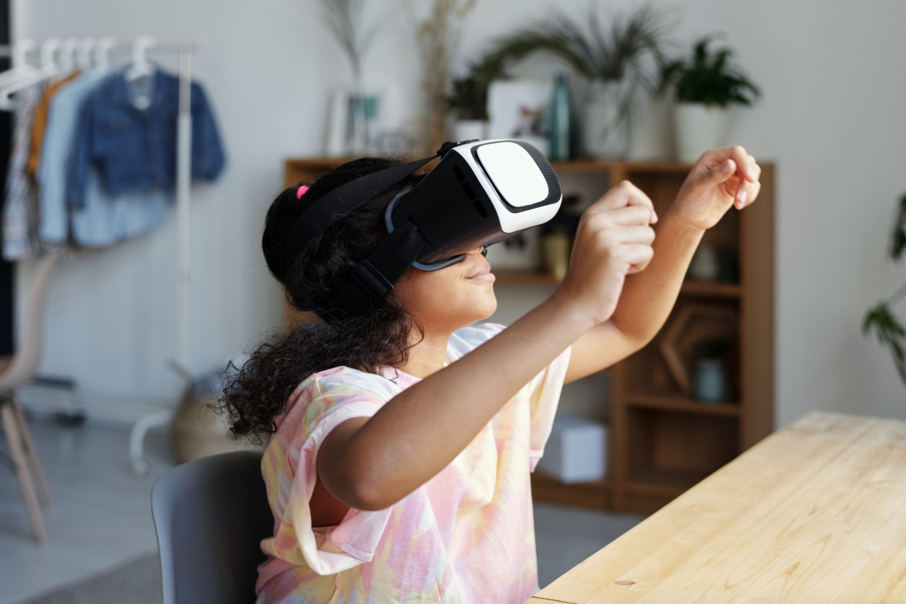

Bagi banyak orang, pertemuan online telah menjadi hal yang biasa. Namun, tidakkah kita menginginkan pertemuan yang lebih *menyeluruh* *(immersive)*? Kita tidak hanya ingin melihat wajah orang lain dalam kotak-kotak kecil: kita ingin berinteraksi dengan mereka lebih lagi. Meski terpisah oleh jarak, kita ingin berjabat tangan dengan mereka, menepuk bahu mereka, dan melihat bahasa tubuh mereka.

Kita mendengar bahwa semua hal ini bisa dilakukan dalam *metaverse*. Tapi, akankah teknologi baru ini mendatangkan kebaikan semata? Baca terus untuk mengetahui lebih lanjut.

---

## Daftar Isi

1. [Apa itu *metaverse*?](/id/post/metaverse/#1-apa-itu-metaverse)

2. [Apakah *metaverse* baik atau buruk?](/id/post/metaverse/#2-apakah-metaverse-baik-atau-buruk)

3. [Apa yang salah dengan *metaverse*?](/id/post/metaverse/#3-apa-yang-salah-dengan-metaverse)  
		
	[Anonimitas](/id/post/metaverse/#anonimitas)
		
	[Kesewenang-Wenangan](/id/post/metaverse/#kesewenang-wenangan)
		
	[Pengasingan Diri](/id/post/metaverse/#pengasingan-diri)
		
	[Spiritualisme](/id/post/metaverse/#spiritualisme)
		
	[Disintegrasi](/id/post/metaverse/#disintegrasi)
		
4. [Kesimpulan](/id/post/metaverse/#4-kesimpulan)

[Referensi](/id/post/metaverse/#referensi)

---

## 1. Apa itu *metaverse*?

“*Nihil sub sole novum*”—“tak ada sesuatu yang baru di bawah matahari,” kata kitab Pengkhotbah (1:9). *Metaverse* bukanlah sesuatu yang baru. Para pendahulunya, seperti ruang *chat* dan situs media sosial, telah meraih popularitas di tahun 1990-an. Selain itu, jika kamu pernah bermain [*The Sims*](https://www.ea.com/games/the-sims) atau RPG lainnya, kamu pasti bisa membayangkan seperti apa *metaverse* itu.

Istilah *'metaverse'* pertama kali digunakan oleh Neal Stephenson dalam novelnya [*Snow Crash*](https://en.wikipedia.org/wiki/Snow_Crash) (1992) untuk menggambarkan hubungan antara teknologi-teknologi digital yang membentuk sebuah realitas virtual. [*Meta*](https://www.merriam-webster.com/words-at-play/meaning-of-metaverse) sendiri adalah kata Yunani yang berarti 'melampaui.' Misalnya, meta-fisika adalah cabang filsafat yang melampaui hal-hal yang bersifat fisik. Metamorfosis berarti perubahan atau tindakan melampaui bentuk yang dimiliki sekarang (*morphe* dalam bahasa Yunani berarti ‘bentuk’). Dengan demikian, *metaverse* (*meta* + *universe*) berarti *melampaui alam semesta*.

*Metaverse* adalah sebuah realitas alternatif di mana kamu bisa hidup sebagai sebuah [*avatar*](https://en.wikipedia.org/wiki/Avatar_(computing)). *Metaverse* adalah "dunia virtual yang terpusat,” sebuah 'tempat' yang berbeda dari dunia fisik yang kita huni.[^1] Salah satu kata sifat yang menggambarkan *metaverse* dengan baik adalah *menyeluruh* *(immersive)*.

*Metaverse* menggabungkan *realitas virtual* dan *kehidupan kedua* dalam bentuk digital: *metaverse* adalah realitas virtual yang “berfungsi sebagai *platform* komputer untuk menjalani kehidupan kedua secara online.”[^2] Menurut [Matthew Ball](https://www.nytimes.com/2022/01/18/technology/personaltech/metaverse-gaming-definition.amp.html), *metaverse* adalah tahap keempat dalam perkembangan komputer. Kita sudah memiliki *mainframe computing*, *personal computing*, dan *mobile computing*. Sekarang kita bersiap untuk menyambut *ambient computing*, *metaverse*. Mark Zuckerberg pun menyatakan bahwa *metaverse* adalah "bab selanjutnya bagi internet."[^3]

## 2. Apakah *metaverse* baik atau buruk?

Jawaban singkatnya adalah: *tergantung*. 

*Metaverse* adalah sebuah *sarana*. Zuckerberg menegaskan bahwa *metaverse* adalah sarana untuk “mengumpulkan orang.”[^4] Sebagai sarana, *metaverse* tidaklah baik dan tidaklah buruk. 

*Metaverse* menjadi baik atau buruk tergantung dari *cara kita menggunakannya*. *Metaverse* menyerupai api yang bisa menghangatkan atau membakar kita hidup-hidup. *Metaverse* menyerupai air yang dapat menyegarkan atau menenggelamkan kita.

Hal-hal baik bisa muncul dari *metaverse* dan realitas virtual. Apabila digunakan dengan baik, realitas virtual dapat meningkatkan produktivitas kita. Sejumlah orang telah menggunakan realitas virtual untuk menata tempat kerja virtual mereka (misalnya, dengan memasang empat monitor virtual alih-alih membeli empat monitor fisik). Terlebih lagi, dengan *metaverse*, kita tidak perlu banyak bepergian untuk bekerja; menurunnya jumlah perjalanan dengan kendaraan akan mengurangi polusi.

Dalam ranah sejarah, realitas virtual dapat merekam peristiwa, tarian, dan bahkan bahasa (misalnya, gerakan bibir dan lidah) lebih baik daripada buku-buku.

Di bidang pengajaran agama, saya dapat membayangkan bagaimana anak-anak kita di masa depan dapat mempelajari kisah-kisah Alkitab dan kebenaran iman secara lebih efektif melalui *augmented reality*. Bukankah semua hal ini baik adanya? Tentu saja.

## 3. Apa yang salah dengan *metaverse*?

Bagaimana jika kita menggunakan *metaverse* dengan buruk? *Metaverse* pun menjadi buruk. Kita menggunakan *metaverse* dengan buruk apabila kita menggunakannya secara *anonim* dan *sewenang-wenang*. *Metaverse* juga menjadi buruk ketika ia *mengasingkan kita dari orang lain*, *merendahkan realitas materiil*, dan *menyebabkan disintegrasi dalam hidup kita*. Marilah kita mendalami lima poin ini.

### Anonimitas

Pertama, *metaverse* menjadi buruk ketika ia digunakan secara anonim. Menurut istilah Yunani aslinya, ‘anonimitas’ berarti 'tanpa nama' (*an-*, 'tanpa,' dan *onoma*, 'nama'). Ketika kita bertindak secara anonim, kita bertindak tanpa nama. Kita bertindak tanpa identitas.

Anonimitas tidaklah selalu buruk: terkadang anonimitas bisa berguna. Dalam survei, anonimitas mendorong kejujuran. Dalam sakramen pengakuan dosa, peniten yang datang untuk mengaku dosa berhak mempertahankan anonimitasnya. Itulah mengapa ruang pengakuan dosa yang baik memiliki terali yang memisahkan peniten dan imam.[^5]

Namun, dalam ranah moral, *anonimitas mendatangkan bahaya karena ia menghilangkan tanggung jawab*. *Metaverse* bertopang pada anonimitas. Dalam *metaverse*, setiap dari kita akan hidup sebagai *avatar* yang menyembunyikan identitas asli kita. Ketika kita bersembunyi di balik *avatar* kita, kita tidak dapat dimintai pertanggungjawaban atas kejahatan kita atau dipuji atas perbuatan baik kita.

Namun, apa yang terjadi ketika tidak ada tanggung jawab? Tidak ada *keadilan*.

### Kesewenang-Wenangan 

Kedua, *metaverse* menjadi buruk ketika digunakan secara sewenang-wenang.

Inilah yang dijanjikan oleh *metaverse*: tempat di mana kita bisa melakukan apapun yang kita inginkan. Seperti yang dikatakan oleh Zuckerberg: “Bukankah ini janji utama teknologi … agar kita bisa berada bersama siapa pun, pergi ke mana saja, dan menciptakan dan merasakan apa pun?”[^6]

Dalam *metaverse*, kita bisa menjadi siapa pun yang kita inginkan. Kita dapat melakukan apa pun yang kita inginkan—berbelanja, bekerja, menghasilkan uang, bersosialisasi, mendapatkan hiburan, dan lain-lain. *Metaverse* akan secara langsung mewujudkan imajinasi kita. Kita bisa menciptakan dunia yang kita bayangkan. Kita bisa menentukan apa yang baik dan apa yang buruk. Masing-masing dari kita akan menjadi *pencipta*.

Konsekuensi negatif dari gagasan ini tidak terhitung banyaknya. 

Pertama, jika *metaverse* digunakan secara sewenang-wenang, *metaverse* akan *mengikis pengendalian diri kita*. *Metaverse* akan menuntun kita untuk melakukan hal-hal yang tidak akan kita lakukan dalam dunia nyata. *Metaverse* bisa menjadi wadah bahkan bagi ujaran kebencian dan kekerasan (seperti dalam kasus [Facebook yang mengizinkan ](https://www.reuters.com/world/europe/exclusive-facebook-instagram-temporarily-allow-calls-violence-against-russians-2022-03-10/)[*posting*](https://www.reuters.com/world/europe/exclusive-facebook-instagram-temporarily-allow-calls-violence-against-russians-2022-03-10/)[yang mendesak kekerasan terhadap pihak Rusia](https://www.reuters.com/world/europe/exclusive-facebook-instagram-temporarily-allow-calls-violence-against-russians-2022-03-10/)). *Metaverse* memungkinkan kita untuk menikmati kesenangan yang terlarang atau sulit kita peroleh dalam dunia nyata. *Metaverse* dapat memudahkan kita untuk berbuat dosa. Tidaklah mengherankan bahwa cara menggunakan *metaverse* seperti ini akan menyebabkan kecanduan.

Kedua, jika *metaverse* digunakan secara sewenang-wenang, *metaverse akan menjadi tempat pelarian*. *Metaverse* akan menjadi jalan keluar bagi kita dari kesulitan yang kita hadapi di dunia nyata. Dengan demikian, *metaverse* akan menyebabkan disintegrasi dalam pribadi, keluarga, dan masyarakat.

Sebuah contoh sederhana bisa menggambarkan hal ini. Memiliki anak di dunia nyata adalah suatu hal yang rumit dan mahal. Bagaimana jika mayoritas pasangan di suatu negara memutuskan untuk memiliki anak tetapi hanya secara virtual? Jika kita dapat memiliki hewan peliharaan virtual seperti [Tamagotchi](https://en.wikipedia.org/wiki/Tamagotchi), apa yang mencegah kita untuk memiliki anak secara virtual pula?

### Pengasingan Diri

Ketiga, *metaverse* menjadi buruk ketika ia mengasingkan kita dari orang lain.

Manusia adalah makhluk sosial. Kita ingin diterima sebagai bagian dari sebuah komunitas.

Sebenarnya, inilah yang dijanjikan oleh *metaverse*. Menurut Zuckerberg, tujuan dari *metaverse* adalah “menghubungkan orang-orang … dan memberikan pengalaman di mana kita berada bersama orang lain.“[^7] Ia beraspirasi membuat kita “merasa ada bersama dengan orang-orang yang kita kasihi.”[^8]

Berkat media sosial, banyak orang termasuk saya telah berhubungan kembali dengan teman-teman lama. Kita juga telah mengalami hubungan nyata dengan orang lain melalui perjumpaan online selama pandemi Covid-19.

Namun pertanyaannya adalah: seberapa *personal* hubungan kita dengan orang-orang di dunia virtual—di *metaverse*? Pribadi manusia *(person)* terdiri dari tubuh dan jiwa. Suatu interaksi bersifat personal ketika interaksi tersebut melibatkan jiwa (misalnya, berpikir, berkehendak) dan tubuh (misalnya, berjabat tangan, berpelukan, berjumpa). Sebagai manusia, kita mendambakan *kedekatan fisik*, bukan hanya kedekatan spiritual.

Sayangnya, interaksi virtual di *metaverse* menghilangkan segala sesuatu yang bersifat fisik. Zuckerberg sendiri menegaskan bahwa “hanya dengan sepasang kacamata, Anda dapat *melampaui dunia fisik* dan mengalami hal-hal yang telah kita bahas hari ini."[^9]

Dengan kata lain, dalam *metaverse*, kita tidak bisa memeluk keluarga dan teman-teman kita. Kita tidak bisa makan dan minum di sana. Karena tiadanya realitas fisik, interaksi virtual di *metaverse* bukanlah interaksi yang *sepenuhnya* bersifat *personal*. *Metaverse* tidak dapat memuaskan kerinduan kita akan kedekatan fisik kendati kita mengenakan *tracking suit* yang menutup seluruh badan kita. Menurut psikolog Jazayeri, “komputer bukanlah pengganti manusia.”[^10]

Kehadiran fisik orang lain *tidak akan pernah bisa disimulasikan*. Realitas virtual tidak memiliki apa yang disebut oleh para filsuf sebagai [*qualia*](https://plato.stanford.edu/entries/qualia/) yang bisa dialami terutama di dunia fisik. *Qualia* mengacu pada kualitas yang ditangkap dari pengalaman (misalnya, mencicipi segelas anggur), sensasi tubuh (misalnya, merasa haus), emosi, atau suasana hati.

Ternyata, teknologi yang dirancang untuk “menghubungkan orang-orang” malah mengasingkan kita dari orang lain, dari hubungan *yang sepenuhnya personal*. Kekhawatiran ini diungkapkan oleh seorang *digital creator* di *Second Life* Carrie Tatsu yang berkata:

Sangatlah penting bagi manusia untuk berada *bersama manusia lain dalam kehidupan nyata* ... Dan, saya pikir, sembari anak-anak tumbuh dalam lingkungan ini, harus ada tempat bagi orang-orang untuk berinteraksi, mencium bunga, berjalan di alam terbuka, melakukan percakapan secara langsung dengan teman Anda dan bermain bola. Maksud saya, *meskipun Anda dapat mensimulasikan hal tersebut, simulasi tidaklah sama* [dengan dunia nyata]. Dan, dalam taraf tertentu, saya merasa prihatin dengan keadaan anak-anak saya.[^11]

### Spiritualisme

Keempat, *metaverse* menjadi buruk ketika ia merendahkan realitas materiil.

Iman kristiani senantiasa berpihak pada *kenyataan*. Dunia fisik yang nyata itu penting. Inilah mengapa orang kristiani didorong untuk memajukan dan melestarikan alam semesta.[^12]

Mengapa dunia fisik itu penting? Karena “Firman itu telah menjadi manusia, dan diam di antara kita” (Yohanes 1:14). Allah Putra mengambil kodrat manusia yang terdiri dari tubuh dan jiwa. Sang Putra tidak menampakkan diri kepada kita dalam ‘kostum’ manusia: dia benar-benar adalah manusia. Dia hadir di dunia kita secara nyata, bukan secara virtual. Dia mengangkat martabat tubuh-Nya—benda materiil—dan menjadikannya alat keilahian-Nya. Inkarnasi memberitahu kita bahwa hal-hal materiil itu baik. Semua makhluk itu baik. Dunia fisik itu baik.

Dalam hal ini, *metaverse* bertentangan dengan iman kristiani dalam dua hal. Pertama, *metaverse* dapat membuat kita *merendahkan dunia materiil*, setidaknya secara tidak sadar. Dalam *metaverse*, segala sesuatu dapat berjalan sesuai keinginan kita. Dalam keadaan ini, kita akan dengan mudah melihat dunia fisik sebagai dunia yang lebih rendah derajatnya. Dunia fisik adalah dunia yang berantakan. Banyak hal yang tidak selalu berjalan sesuai rancangan kita. Tubuh kita bisa sakit. Kita harus pergi ke kamar mandi. Barang-barang mengalami kerusakan. Kita semua menjadi tua.

Kedua, *metaverse* dapat menghalangi upaya kita untuk *mengatasi masalah dalam kehidupan nyata*.[^13] Kita akan dengan mudah melihat *metaverse* sebagai tempat 'keselamatan' di mana kita dibebaskan dari segala sesuatu yang bersifat materiil. 

Jika kita dapat mengabaikan permasalahan kita dalam dunia nyata hanya dengan mengenakan kacamata VR kita, mengapa kita harus repot-repot menyelesaikan permasalahan tersebut? Jika kita memiliki ‘kehidupan kedua’ di mana kita bisa mendapatkan segalanya dan menjadi siapa pun yang kita dambakan, mengapa kita perlu repot-repot memperbaiki ‘kehidupan pertama’ kita?

### Disintegrasi

Terakhir, *metaverse* menjadi buruk ketika ia menyebabkan disintegrasi dalam hidup kita.

Kehidupan kristiani sepatutnya dicirikan oleh integritas. Seorang kristiani adalah seorang kristiani di mana pun dia berada, sendiri atau bersama dengan orang lain. Dia memiliki satu kehidupan: kehidupan sebagai anak Allah. Dia tidak memiliki dua kehidupan yang berbeda: satu di dunia nyata dan satu lagi di dunia maya. Iman kristiani bukanlah topi yang kita lepas saat kita memasuki 'bangunan' kehidupan bermasyarakat, lingkungan kerja, atau bahkan internet.

Apakah *metaverse* menyebabkan kita kehilangan integritas hidup? Tentu saja tidak. *Metaverse* bukanlah *penyebab langsung* dari disintegrasi hidup. Namun, *metaverse*—lebih dari internet sekarang ini—dapat memudahkan kita untuk menjalani ‘kehidupan kedua’ disamping kehidupan nyata kita. (Tidak secara kebetulan, 'Second Life' adalah nama sebuah [*game online*](https://secondlife.com/)[ yang](https://secondlife.com/) berusaha menyajikan kehidupan kedua di dunia virtual.) Kita sekarang memiliki dua kehidupan: kehidupan virtual dan kehidupan fisik yang nyata. Kita bisa memiliki dua identitas bahkan dua wajah yang berbeda.

Bukankah ini akan mengarah pada *disintegrasi pribadi manusia* seperti yang disebut oleh Kenneth Gergen dalam bukunya [*The Saturated Self*](https://amzn.to/3BqBJKU)? Pastinya. Disintegrasi ini cepat atau lambat akan menyebabkan hilangnya individualitas.

## 4. Kesimpulan

Sebagai manusia, kita membutuhkan hiburan. Tetapi, tidak semua hiburan memiliki nilai moral yang setara. Sebagai orang kristiani, kita bertanggung jawab untuk memastikan bahwa hiburan kita memajukan kita alih-alih menjatuhkan kita sebagai manusia. *Metaverse* bisa membawa hal-hal yang baik, seperti yang telah saya katakan. Namun, bahaya yang ditimbulkannya bagi kita tidaklah sepele. Oleh karena itu, kita harus memutuskan apakah menghabiskan Rp. 5 juta untuk membeli [kacamata VR](https://www.oculus.com/quest-2/) merupakan suatu hal yang bijaksana sementara ada banyak alternatif lain untuk mendapatkan hiburan (tanpa kehilangan jiwa kita di dunia nyata).

## Referensi

### Buku

Matthew Ball, [*The Metaverse: And How it Will Revolutionize Everything*](https://www.amazon.com/Metaverse-How-Will-Revolutionize-Everything/dp/1324092033/ref=tmm_hrd_swatch_0?_encoding=UTF8&qid=&sr=) (2022)

David J. Chalmers, [*Reality+*](https://www.amazon.com/Reality-Virtual-Worlds-Problems-Philosophy/dp/0393635805/ref=sr_1_1?crid=2FZJJ9LEYFK3U&keywords=Reality%2B+chalmers&qid=1647592638&s=books&sprefix=reality%2B+chalmers%2Cstripbooks-intl-ship%2C192&sr=1-1) (2022)

Sherry Turkle, [*Alone Together: Why We Expect More from Technology and Less From Each Other*](https://www.amazon.com/Alone-Together-Expect-Technology-Other/dp/0465093655/ref=sr_1_1?crid=3TSCWH1YN9XKO&keywords=turkle+Alone+Together%3A+Why+We+Expect+More+from+Technology+and+Less+From+Each+Other&qid=1647592659&s=books&sprefix=turtle+%2Cstripbooks-intl-ship%2C178&sr=1-1) (2017)

Neal Stephenson, [*Snow Crash*](https://en.wikipedia.org/wiki/Snow_Crash) (1992)

Kenneth Gergen, [*The Saturated Self*](https://amzn.to/3BqBJKU) (1991)

Isaac Asimov, [*The Naked Sun*](https://www.amazon.com/Naked-Sun-Robot-Book-ebook/dp/B004JHYRDQ/ref=sr_1_1?crid=5CQ4I7H92IXT&keywords=Isaac+Asimov%2C+The+Naked+Sun&qid=1647592778&s=books&sprefix=isaac+asimov%2C+the+naked+sun%2Cstripbooks-intl-ship%2C172&sr=1-1) (1957)

C. S. Lewis, [*Abolition of Man*](https://www.amazon.com/Abolition-Man-C-S-Lewis-ebook/dp/B09MQ8S6SH/ref=tmm_kin_swatch_0?_encoding=UTF8&qid=1647592797&sr=1-1) (1943)

### Film

[Ready Player One (2018)](https://www.imdb.com/title/tt1677720/?ref_=fn_al_tt_1)

[Arrival (2016)](https://www.imdb.com/title/tt2543164/)

### Video

[Introducing Meta](https://youtu.be/pjNI9K1D_xo) (Mark Zuckerberg, 29 Oct 2021)

### Artikel

[Navigating the Metaverse](https://ethosinstitute.sg/navigating-the-metaverse/) (Ethos Institute, 26 Feb 2022)

[What’s All the Hype About the Metaverse?](https://www.nytimes.com/2022/01/18/technology/personaltech/metaverse-gaming-definition.html) (New York Times, 18 Jan 2022)

[Can We Have a Meaningful Life in a Virtual World?](https://www.nytimes.com/interactive/2021/12/13/magazine/david-j-chalmers-interview.html) (New York Times, 6 Jan 2022)

[The Metaverse’s Dark Side: Here Come Harassment and Assaults](https://www.nytimes.com/2021/12/30/technology/metaverse-harassment-assaults.html) (New York Times, 30 Dec 2021)

[Coming to a metaverse near you](https://www.catholicculture.org/commentary/coming-to-metaverse-near-you/) (Jeff Mirus, 14 Dec 2021)

[A Virtual Life: How Social Media Changes Our Perceptions](https://www.thechicagoschool.edu/insight/from-the-magazine/a-virtual-life/) (The Chicago School of Professional Psychology, 7 Dec 2021)

[The Metaverse Has Already Arrived. Here’s What That Actually Means](https://time.com/6116826/what-is-the-metaverse/) (TIME, 15 Nov 2021)

[Some Quick Thoughts on the ‘Metaverse’](https://catholicism.org/some-quick-thoughts-on-the-metaverse.html) (André Marie, 13 Nov 2021)

[Are You Missing Out on the Metaverse?](https://www.nytimes.com/2021/11/02/style/meta-facebook.html) (New York Times, 11 Nov 2021)

[Sorry, Mark Zuckerberg: We Catholics want the real world, not the metaverse](https://www.americamagazine.org/arts-culture/2021/11/02/facebook-meta-mark-zuckerberg-241763) (America Magazine, 2 Nov 2021)

[Christians, Beware the Metaverse](https://www.crisismagazine.com/2021/christians-beware-the-metaverse) (Crisis Magazine, 29 Oct 2021)

[The Metaverse is About to Change Everything](https://www.vanityfair.com/news/2021/10/the-metaverse-is-about-to-change-everything) (Vanity Fair, 22 Oct 2021)

[Facebook’s Next Target: The Religious Experience](https://www.nytimes.com/2021/07/25/us/facebook-church.html) (New York Times, 31 Aug 2021)

[Virtual reality and the coming Catholic Metaverse](https://www.ncronline.org/news/opinion/just-catholic/virtual-reality-and-coming-catholic-metaverse) (National Catholic Report, 3 Aug 2021)

[My generation grew up online. Endless ‘virtual life’ would be terrifying](https://www.nationalgeographic.com/magazine/article/my-generation-grew-up-online-coronavirus-reveals-endless-virtual-life-would-be-terrifying) (National Geographic, 29 May 2020)

[^1]:“[The Metaverse Has Already Arrived](https://time.com/6116826/what-is-the-metaverse/)” (15 Nov 2021).

[^2]:“[What’s All the Hype About the Metaverse?](https://www.nytimes.com/2022/01/18/technology/personaltech/metaverse-gaming-definition.html)” (18 Jan 2022).

[^3]:Mark Zuckerberg, “[Introducing Meta](https://youtu.be/pjNI9K1D_xo)” (29 Oct 2021).

[^4]:Zuckerberg, “[Introducing Meta](https://youtu.be/pjNI9K1D_xo).”

[^5]:Lih. *Kitab Hukum Kanonik*, kan. 964 §2: “Mengenai tempat pengakuan, hendaknya dibuat pedoman-pedoman oleh Konferensi para Uskup, tetapi dengan tetap dijaga supaya tempat pengakuan selalu diadakan di tempat terbuka, dilengkapi dengan penyekat yang kokoh antara peniten dan bapa pengakuan; tempat itu dapat digunakan dengan bebas oleh umat beriman, jika mereka menghendakinya.”

[^6]:Zuckerberg, “[Introducing Meta](https://youtu.be/pjNI9K1D_xo).”

[^7]:Zuckerberg, “[Introducing Meta](https://youtu.be/pjNI9K1D_xo).”

[^8]:Zuckerberg, “[Introducing Meta](https://youtu.be/pjNI9K1D_xo).”

[^9]:Zuckerberg, “[Introducing Meta](https://youtu.be/pjNI9K1D_xo).”

[^10]:Ali Jazayeri, dikutip di [A Virtual Life](https://www.thechicagoschool.edu/insight/from-the-magazine/a-virtual-life/) (7 Dec 2021).

[^11]:Carrie Tatsu, “[The Metaverse Has Already Arrived](https://time.com/6116826/what-is-the-metaverse/)” (15 Nov 2021).

[^12]:*Gaudium et spes*, §34: “Bagi kaum beriman ini merupakan keyakinan: kegiatan manusia baik perorangan maupun kolektif, atau usaha besar-besaran itu sendiri, yang dari zaman ke zaman di kerahkan oleh banyak orang untuk memperbaiki kondisi-kondisi hidup mereka, memang sesuai dengan rencana Allah. Sebab manusia, yang diciptakan menurut gambar Allah, menerima titah-Nya, supaya menakhlukkan bumi beserta segala sesuatu yang terdapat padanya, serta menguasai dunia dalam keadilan dan kesucian.”

[^13]:Lih. [A Virtual Life](https://www.thechicagoschool.edu/insight/from-the-magazine/a-virtual-life/).
