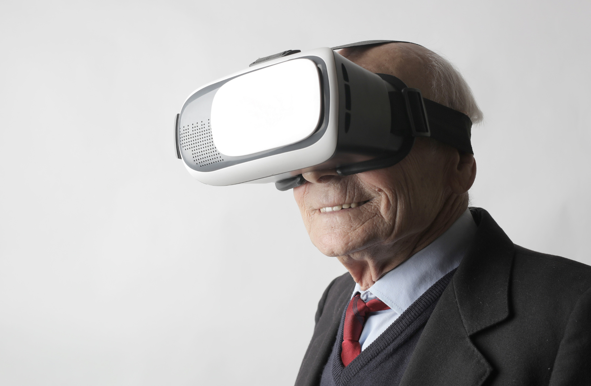

For many of us, online meetings have lately become the order of the day. But don’t we want more *immersive* encounters? We don’t just want to see other people’s faces in small boxes: we want to interact more with them. While being miles apart, we want to shake their hands, pat them on the back, and appreciate their body language.

It is said that all these things will become possible in the metaverse. But will this new technology come up roses? Keep on reading to find out more.

---

## Content

1. [What is the metaverse?](/post/metaverse/#1-what-is-the-metaverse)

2. [Is the metaverse good or bad?](/post/metaverse/#2-is-the-metaverse-good-or-bad)

3. [What’s bad about the metaverse?](/post/metaverse/#3-whats-bad-about-the-metaverse)

    [Anonymity](/post/metaverse/#anonymity)

    [Arbitrariness](/post/metaverse/#arbitrariness)

    [Isolation](/post/metaverse/#isolation)

    [Spiritualism](/post/metaverse/#spiritualism)

    [Disintegration](/post/metaverse/#disintegration)

4. [The Verdict](/post/metaverse/#4-the-verdict)

[References](/post/metaverse/#references)

---

## 1. What is the metaverse?

“*Nihil sub sole novum*”—“there is nothing new under the sun,” says the book of Ecclesiastes (1:9). The metaverse isn’t anything new. Its precursors like chatrooms and social media sites already gained popularity in the 1990s. In addition, if you’ve ever played [*The Sims*](https://www.ea.com/games/the-sims) or other RPGs, then you have an idea of what the metaverse is like.

The term ‘metaverse’ was first used by Neal Stephenson in his 1992 science fiction novel [*Snow Crash*](https://en.wikipedia.org/wiki/Snow_Crash) to describe the interconnection of digital technologies that form a virtual reality. [*Meta*](https://www.merriam-webster.com/words-at-play/meaning-of-metaverse) itself is a Greek word meaning ‘transcending.’ For example, meta-physics is a branch of philosophy that transcends what is physical. Meta-morphosis means change or the act of transcending the current form (*morphe* in Greek). Thus, metaverse (meta + universe) means *transcending the universe*.

The metaverse is an alternative reality in which you can exist as an [avatar](https://en.wikipedia.org/wiki/Avatar_(computing)). It is “a centralized virtual world, a ‘place’ parallel to the physical world.”[^1] One of the adjectives that well describe the metaverse is *immersive*.

The metaverse combines *virtual reality* and digital *second life*: it is a virtual reality that “serves as a computing platform for living a second life online.”[^2] According to [Matthew Ball](https://www.nytimes.com/2022/01/18/technology/personaltech/metaverse-gaming-definition.amp.html), the metaverse is the fourth stage in the development of computing. We’ve had mainframe computing, personal computing, and mobile computing. Now comes *ambient computing*, the metaverse. Along the same line, Mark Zuckerberg remarks that it is “the next chapter for the internet.”[^3]

## 2. Is the metaverse good or bad?

The short answer is: *it depends*. 

In itself, the metaverse is a *means*. At least this is how Zuckerberg sees it. He affirms that the metaverse is a means to “[bring] people together.”[^4] As a means, abstractly speaking, the metaverse is *neither good nor bad*. 

Concretely speaking, though, it will be good or bad depending on *how we use it*. It’s like fire which can keep us warm or burn us alive. It’s like water which can keep us hydrated or drown us.

Good things may come out of the metaverse and virtual reality. When used well, virtual reality may boost our productivity. Some have used virtual reality to arrange their virtual workstations (e.g., by setting up four virtual monitors instead of buying four physical monitors). Moreover, with the metaverse, we won’t have to travel as much for work; less travel means less pollution.

In the domain of history, virtual reality may be able to record events, dances, and even languages (e.g., the movement of our lips and tongue) better than printed papers.

In the field of religious instruction, I can easily imagine how our children in the future could learn Bible stories and the truths of faith more effectively through virtual reality. Aren’t these good things? Undoubtedly they are.

## 3. What’s bad about the metaverse?

Yet what if we use the metaverse badly? It becomes bad. We use the metaverse badly when we use it *anonymously* and *arbitrarily*. The metaverse also becomes bad when it *isolates us from others*, *undermines matter*, and *disintegrates our life*. Let us talk a look at these five points.

### Anonymity

Firstly, the metaverse is bad when it is used anonymously. According to the original Greek term, ‘anonymous’ means ‘nameless’ (*an-*, ‘without,’ and *onoma*, ‘name’). When we act anonymously, we act namelessly. We act without identity.

Anonymity is not always bad: it might at times be useful. In surveys, anonymity stimulates honesty. In the realm of the Christian life, especially in the sacrament of confession, the penitent’s right to anonymity is respected. That’s why a good confessional would have a fixed grate between the penitent and the confessor.[^5]

However, in the moral sphere, *anonymity is harmful because it dissolves real responsibility*. Unfortunately, the metaverse lives by anonymity. In the metaverse, every one of us will exist as an avatar that hides our real identity. When we are nameless—when we hide behind our avatar—, we can neither be called to account for the crimes we commit nor be praised for the good deeds we perform. 

Yet what happens when there is no real responsibility? There is no justice. And this ain’t what you want.

### Arbitrariness

Secondly, the metaverse is bad when it is used arbitrarily.

This is what the metaverse promises: it will be a place where we can do whatever we want. As Zuckerberg says: “Isn’t that the ultimate promise of technology … to be together with anyone, to be able to teleport anywhere, and to create and experience anything?”[^6]

In the metaverse, we can be whoever we want. We can do whatever we want—we can shop, work, earn, socialize, get entertained, and what have you. The metaverse will provide immediate satisfaction to our imagination. It will allow us to create any universe we’ve ever imagined. We’ll be able to determine what is good and bad. Every one of us shall become a *godlike creator*.

The catastrophic consequences of this pretension are innumerable. 

Firstly, if the metaverse is arbitrarily used, *it will erode self-control*. It may lead us to behave in a way we wouldn’t in the real world. It may encourage hate speech and even violence (as in the case of [Facebook allowing war posts urging violence against Russian invaders](https://www.reuters.com/world/europe/exclusive-facebook-instagram-temporarily-allow-calls-violence-against-russians-2022-03-10/)). It may allow us to enjoy pleasures that are illicit or difficult to obtain in the real world. It may make it easier for us to sin. It’s not hard to see that this way of using the metaverse will also create addiction.

Secondly, if the metaverse is arbitrarily used, *it will foster escapism*. It will make us see the metaverse as a way to escape the difficulties we face in the real world. This will lead to personal, familial, and social disintegration. 

A simple example will suffice. Having children in the real world is complicated and expensive. What if the majority of couples in a country decided to have children but only virtually? If we can have a virtual pet like [Tamagotchi](https://en.wikipedia.org/wiki/Tamagotchi), what is there to prevent us from having a virtual child too?

### Isolation

Thirdly, the metaverse is bad when it isolates us from others.

Human beings are social beings. We want to be accepted as part of a community.

In reality, this is what the metaverse promises. According to Zuckerberg, the goal of the metaverse is “to connect people … and deliver an experience where we are present with each other.”[^7] His dream is to make us “feel present with the people we care about.”[^8]

Indeed, thanks to social media, many people including myself have renewed contact with old friends. We have also experienced real connections with others via online meetings during the Covid-19 pandemic.

Yet the question is: how *personal* is our relationship with people in a virtual world—in the metaverse? Human person is made up of soul and body. An interaction is fully personal when it involves both soul (e.g., thinking, willing) and body (e.g., shaking hands, hugging, being together). As humans, we yearn for *physical proximity*, not only spiritual proximity.

However, virtual interaction in the metaverse does the exact contrary: it eliminates everything physical. Zuckerberg himself affirms that “with just a pair of glasses, you will be able to step *beyond the physical world* and into the kinds of experiences that we have talked about today.”[^9]

This means that in the metaverse we can’t hug our family and friends. We can’t eat and drink there. Since it renounces physical realities, virtual interaction in the metaverse cannot be a *fully* *personal* interaction. The metaverse cannot satisfy our yearning for physical proximity—not even if we wear a full-body tracking suit. In the words of the psychologist Jazayeri, “the computer is not a substitute for a real human being.”[^10]

The physical presence of another human being can *never be simulated*. Virtual reality lacks what philosophers call [*qualia*](https://plato.stanford.edu/entries/qualia/), mainly perceived in the physical world. *Qualia* refer to qualities of perceptual experiences (e.g., tasting a glass of wine), bodily sensations (e.g., feeling thirsty), emotions, or moods.

Isn’t this ironic? A technology intended to “connect people” may end up isolating us from real people, from *fully personal* relationships. This concern is expressed by a digital creator in *Second Life* Carrie Tatsu who states the following:

> It’s so important for humans to *be with humans in real life* … And so I think that as kids grow up in this space, there will have to be outlets for people to engage, go smell a flower here, walk in on a trail, have a real conversation with your friend and throw a ball. I mean, *even though you can simulate that, the simulation is not the same*. And so I feel in some ways bad for my kids.[^11]

### Spiritualism

Fourthly, the metaverse is bad when it undermines matter.

Christian faith is *reality-oriented*. The real, physical world matters. This is why Christians are called to improve the current world.[^12]

Why does the physical world matter? Because “the Word became flesh and lived among us” (John 1:14). God the Son becomes incarnate by assuming human nature composed of *soul and body*. The Son does not appear to us in a human costume: he is truly human. He is present in our world really, not virtually. He elevated his body—a material thing—and made it an instrument of his divinity. Incarnation tells us that matter is good. All creatures are good. The physical world is good.

In this respect, the metaverse contrasts with Christianity in two ways. Firstly, the metaverse may lead us to *despise the physical world*, at least unconsciously. In the metaverse, things can go as we want. Immersed in this ego-fulfilling domain, we will easily see the physical world as inferior. In the physical world, things are messy. They don’t always work as we want them to. Our bodies get ill. We have to go to the bathroom. Things deteriorate. We age.

Secondly, the metaverse may undermine our effort to *address real-life problems*.[^13] We may end up seeing the metaverse as a place of ‘salvation’ where we are freed from everything physical. 

If we can dismiss our real-world problems by simply putting our VR headsets on, why bother solving them? If we have a second life where we can get everything and be whoever we want, why bother working on improving our first life?

### Disintegration

Lastly, the metaverse is bad when it disintegrates our life.

Christian life ought to be characterized by integrity. A Christian is a Christian wherever she is, alone or with others. She lives one life: the life of God’s child. She doesn’t have two different lives: one in the real world and another in the virtual world. Christian faith should not be a hat we take off as we enter the ‘buildings’ of public life, work environment, or even the internet.

Does the metaverse cause us to lose our life’s integrity? Of course not. The metaverse is not the direct cause of a disunited life. However, the metaverse—more so than the current internet space—can facilitate us to live a second life parallel to our real life. (Not coincidentally, ‘Second Life’ is the name of an [online game](https://secondlife.com/) seeking to provide just that: a second life in a virtual world.) We now have two lives: a virtual life and a real, physical life. We can have two identities and even two different faces.

Wouldn’t this lead to the *fragmentation of the human person* warned of by Kenneth Gergen in his book [*The Saturated Self*](https://amzn.to/3BqBJKU)? Undoubtedly. This fragmentation will in turn lead to the loss of individuality.

## 4. The Verdict

As humans, we need entertainment. But not all entertaining activities are morally equal. As Christians, we are responsible for ensuring that our entertainment edifies us as humans instead of demeaning us.

The metaverse could bring good things, as I have said. However, the dangers it poses to us are not trivial. Therefore, it’s on us to decide if it’s wise to spend our $349 on a [VR headset](https://www.oculus.com/quest-2/) when there are alternatives to get entertained (without losing our real souls).

---

## References

### Books

Matthew Ball, [*The Metaverse: And How it Will Revolutionize Everything*](https://www.amazon.com/Metaverse-How-Will-Revolutionize-Everything/dp/1324092033/ref=tmm_hrd_swatch_0?_encoding=UTF8&qid=&sr=) (2022)

David J. Chalmers, [*Reality+*](https://www.amazon.com/Reality-Virtual-Worlds-Problems-Philosophy/dp/0393635805/ref=sr_1_1?crid=2FZJJ9LEYFK3U&keywords=Reality%2B+chalmers&qid=1647592638&s=books&sprefix=reality%2B+chalmers%2Cstripbooks-intl-ship%2C192&sr=1-1) (2022)

Sherry Turkle, [*Alone Together: Why We Expect More from Technology and Less From Each Other*](https://www.amazon.com/Alone-Together-Expect-Technology-Other/dp/0465093655/ref=sr_1_1?crid=3TSCWH1YN9XKO&keywords=turkle+Alone+Together%3A+Why+We+Expect+More+from+Technology+and+Less+From+Each+Other&qid=1647592659&s=books&sprefix=turtle+%2Cstripbooks-intl-ship%2C178&sr=1-1) (2017)

Neal Stephenson, [*Snow Crash*](https://en.wikipedia.org/wiki/Snow_Crash) (1992)

Kenneth Gergen, [*The Saturated Self*](https://amzn.to/3BqBJKU) (1991)

Isaac Asimov, [*The Naked Sun*](https://www.amazon.com/Naked-Sun-Robot-Book-ebook/dp/B004JHYRDQ/ref=sr_1_1?crid=5CQ4I7H92IXT&keywords=Isaac+Asimov%2C+The+Naked+Sun&qid=1647592778&s=books&sprefix=isaac+asimov%2C+the+naked+sun%2Cstripbooks-intl-ship%2C172&sr=1-1) (1957)

C. S. Lewis, [*Abolition of Man*](https://www.amazon.com/Abolition-Man-C-S-Lewis-ebook/dp/B09MQ8S6SH/ref=tmm_kin_swatch_0?_encoding=UTF8&qid=1647592797&sr=1-1) (1943)

### Movies

[Ready Player One (2018)](https://www.imdb.com/title/tt1677720/?ref_=fn_al_tt_1)

[Arrival (2016)](https://www.imdb.com/title/tt2543164/)

### Videos

[Introducing Meta](https://youtu.be/pjNI9K1D_xo) (Mark Zuckerberg, 29 Oct 2021)

### Articles

[Metaverse: What is it and who's in control?](https://www.thinkchina.sg/metaverse-what-it-and-whos-control?utm_source=newsletter&utm_medium=email&utm_campaign=weekly_newsletter) (Think China, 21 Mar 2022)

[Navigating the Metaverse](https://ethosinstitute.sg/navigating-the-metaverse/) (Ethos Institute, 26 Feb 2022)

[What’s All the Hype About the Metaverse?](https://www.nytimes.com/2022/01/18/technology/personaltech/metaverse-gaming-definition.html) (New York Times, 18 Jan 2022)

[Can We Have a Meaningful Life in a Virtual World?](https://www.nytimes.com/interactive/2021/12/13/magazine/david-j-chalmers-interview.html) (New York Times, 6 Jan 2022)

[The Metaverse’s Dark Side: Here Come Harassment and Assaults](https://www.nytimes.com/2021/12/30/technology/metaverse-harassment-assaults.html) (New York Times, 30 Dec 2021)

[Coming to a metaverse near you](https://www.catholicculture.org/commentary/coming-to-metaverse-near-you/) (Jeff Mirus, 14 Dec 2021)

[A Virtual Life: How Social Media Changes Our Perceptions](https://www.thechicagoschool.edu/insight/from-the-magazine/a-virtual-life/) (The Chicago School of Professional Psychology, 7 Dec 2021)

[The Metaverse Has Already Arrived. Here’s What That Actually Means](https://time.com/6116826/what-is-the-metaverse/) (TIME, 15 Nov 2021)

[Some Quick Thoughts on the ‘Metaverse’](https://catholicism.org/some-quick-thoughts-on-the-metaverse.html) (André Marie, 13 Nov 2021)

[Are You Missing Out on the Metaverse?](https://www.nytimes.com/2021/11/02/style/meta-facebook.html) (New York Times, 11 Nov 2021)

[Sorry, Mark Zuckerberg: We Catholics want the real world, not the metaverse](https://www.americamagazine.org/arts-culture/2021/11/02/facebook-meta-mark-zuckerberg-241763) (America Magazine, 2 Nov 2021)

[Christians, Beware the Metaverse](https://www.crisismagazine.com/2021/christians-beware-the-metaverse) (Crisis Magazine, 29 Oct 2021)

[The Metaverse is About to Change Everything](https://www.vanityfair.com/news/2021/10/the-metaverse-is-about-to-change-everything) (Vanity Fair, 22 Oct 2021)

[Facebook’s Next Target: The Religious Experience](https://www.nytimes.com/2021/07/25/us/facebook-church.html) (New York Times, 31 Aug 2021)

[Virtual reality and the coming Catholic Metaverse](https://www.ncronline.org/news/opinion/just-catholic/virtual-reality-and-coming-catholic-metaverse) (National Catholic Report, 3 Aug 2021)

[My generation grew up online. Endless ‘virtual life’ would be terrifying](https://www.nationalgeographic.com/magazine/article/my-generation-grew-up-online-coronavirus-reveals-endless-virtual-life-would-be-terrifying) (National Geographic, 29 May 2020)

[The Surprising Theological Possibilities of Virtual Reality](https://www.christianitytoday.com/ct/2016/november-web-only/surprising-theological-possibilities-of-virtual-reality.html) (Christianity Today, 11 Nov 2016)

[^1]:“[The Metaverse Has Already Arrived](https://time.com/6116826/what-is-the-metaverse/)” (15 Nov 2021).

[^2]:“[What’s All the Hype About the Metaverse?](https://www.nytimes.com/2022/01/18/technology/personaltech/metaverse-gaming-definition.html)” (18 Jan 2022).

[^3]:Mark Zuckerberg, “[Introducing Meta](https://youtu.be/pjNI9K1D_xo)” (29 Oct 2021).

[^4]:Zuckerberg, “[Introducing Meta](https://youtu.be/pjNI9K1D_xo).”

[^5]:See *Code of Canon Law*, can. 964 §2: “The conference of bishops is to establish norms regarding the confessional; it is to take care, however, that there are always confessionals with a fixed grate between the penitent and the confessor in an open place so that the faithful who wish to can use them freely.”

[^6]:Zuckerberg, “[Introducing Meta](https://youtu.be/pjNI9K1D_xo).”

[^7]:Zuckerberg, “[Introducing Meta](https://youtu.be/pjNI9K1D_xo).”

[^8]:Zuckerberg, “[Introducing Meta](https://youtu.be/pjNI9K1D_xo).”

[^9]:Zuckerberg, “[Introducing Meta](https://youtu.be/pjNI9K1D_xo).”

[^10]:Ali Jazayeri, quoted in "[A Virtual Life](https://www.thechicagoschool.edu/insight/from-the-magazine/a-virtual-life/)" (7 Dec 2021).

[^11]:Carrie Tatsu, “[The Metaverse Has Already Arrived](https://time.com/6116826/what-is-the-metaverse/)” (15 Nov 2021).

[^12]:*Gaudium et spes*, §34: “Throughout the course of the centuries, men have labored to better the circumstances of their lives through a monumental amount of individual and collective effort. To believers, this point is settled: considered in itself, this human activity accords with God's will. For man, created to God's image, received a mandate to subject to himself the earth and all it contains, and to govern the world with justice and holiness.”

[^13]:See "[A Virtual Life](https://www.thechicagoschool.edu/insight/from-the-magazine/a-virtual-life/)."
