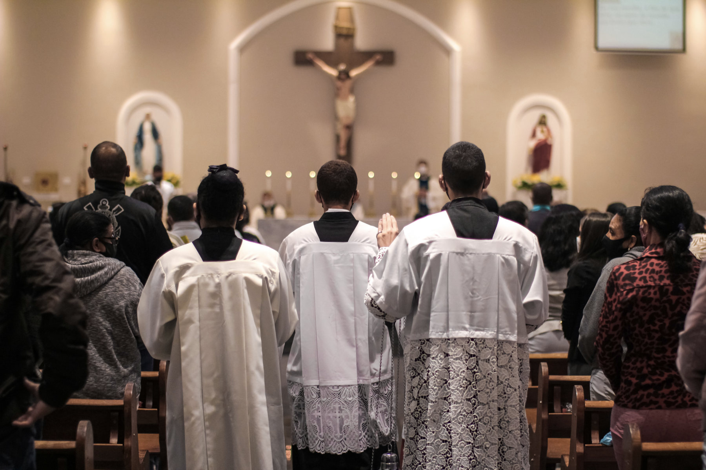
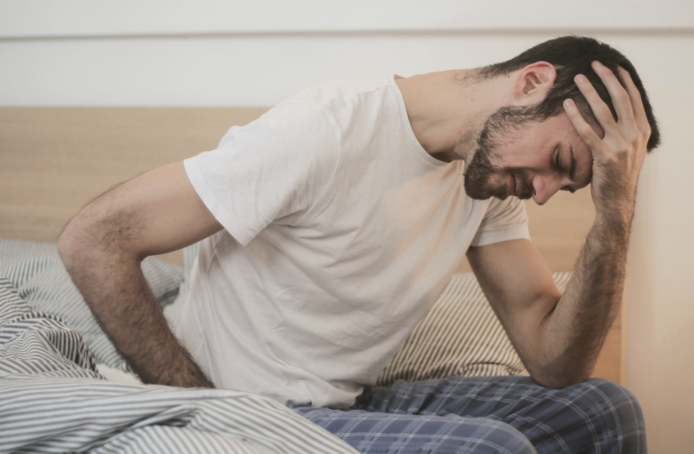
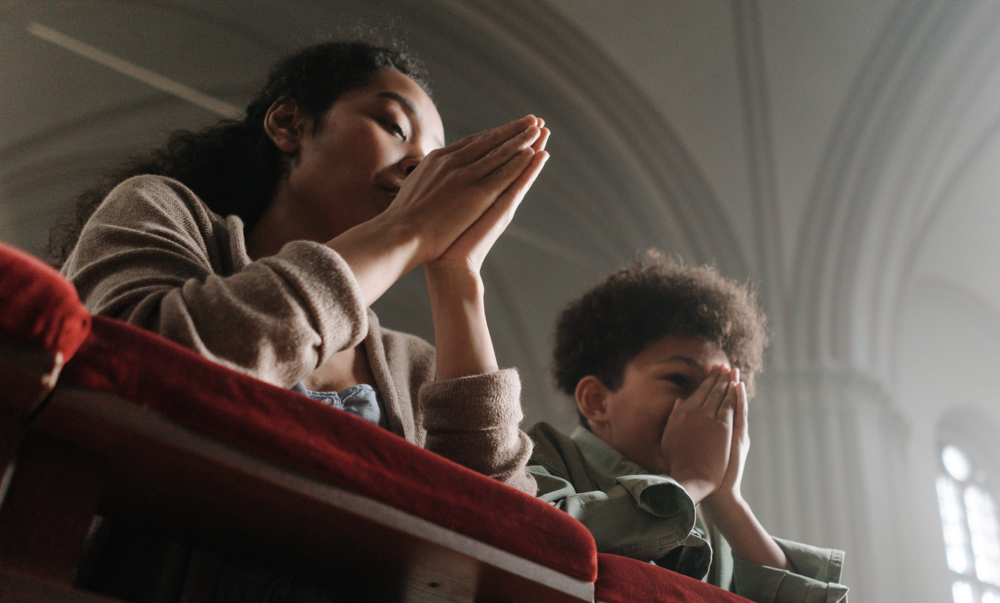
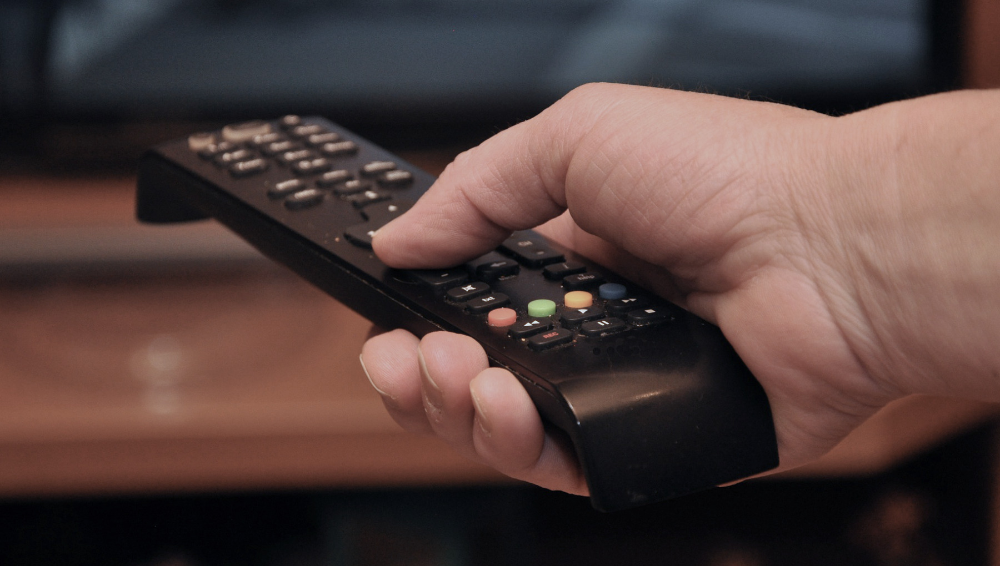

> Saat ini, pandemi ini … telah membuat kita semua berkomunikasi, bahkan secara religius, melalui alat-alat komunikasi. … *Dan ini bukanlah Gereja*: ini adalah Gereja dalam situasi yang sulit, yang diizinkan oleh Tuhan, namun aspirasi Gereja adalah selalu bersama dengan umat dan dengan sakramen-sakramen. Selalu.[^1]
> 
> —Paus Fransiskus

Dalam artikel ini, saya menjawab sebelas pertanyaan mengenai apa yang biasa disebut ‘Misa online.’ Jangan ragu untuk langsung menuju ke pertanyaan-pertanyaan yang paling menarik bagi kamu.

## Daftar Isi

1. [Apa masalahnya?](/id/post/the-honest-truth-about-online-mass/#1-apa-masalahnya)
2. [Apa itu Misa?](/id/post/the-honest-truth-about-online-mass/#2-apa-itu-misa)
3. [Apa pentingnya menghadiri Misa pada hari-hari raya wajib?](/id/post/the-honest-truth-about-online-mass/#3-apa-pentingnya-menghadiri-misa-pada-hari-hari-raya-wajib)
4. [Apakah ada saat-saat di mana tidak menghadiri Misa bukan merupakan dosa berat?](/id/post/the-honest-truth-about-online-mass/#4-apakah-ada-saat-saat-di-mana-tidak-menghadiri-misa-bukan-merupakan-dosa-berat)
5. [Apa yang harus saya lakukan jika menghadiri Misa merupakan suatu hal yang mustahil?](/id/post/the-honest-truth-about-online-mass/#5-apa-yang-harus-saya-lakukan-jika-menghadiri-misa-merupakan-suatu-hal-yang-mustahil)
6. [Ketika mustahil bagi saya untuk menghadiri Misa, apakah saya wajib menonton Misa online?](/id/post/the-honest-truth-about-online-mass/#6-ketika-mustahil-bagi-saya-untuk-menghadiri-misa-apakah-saya-wajib-menonton-misa-online)
7. [Mengapa Misa online bukanlah Misa?](/id/post/the-honest-truth-about-online-mass/#7-mengapa-misa-online-bukanlah-misa)
8. [Apabila Misa online bukan Misa yang sesungguhnya, mengapa Misa masih disiarkan secara langsung?](/id/post/the-honest-truth-about-online-mass/#8-apabila-misa-online-bukan-misa-yang-sesungguhnya-mengapa-misa-masih-disiarkan-secara-langsung)
9. [Saya tidak menghadiri Misa secara fisik, tapi saya menerima komuni di luar Misa. Apakah hal ini tidak cukup untuk memenuhi Perintah Allah yang Ketiga?](/id/post/the-honest-truth-about-online-mass/#9-saya-tidak-menghadiri-misa-secara-fisik-tapi-saya-menerima-komuni-di-luar-misa-apakah-hal-ini-tidak-cukup-untuk-memenuhi-perintah-allah-yang-ketiga)
10. [Ketika gereja berada dalam keadaan penuh, saya dapat berpartisipasi secara penuh dalam Misa dengan mengikutinya melalui layar TV yang tersedia di balai paroki. Apa bedanya dengan mengikuti Misa melalui layar TV di rumah?](/id/post/the-honest-truth-about-online-mass/#10-ketika-gereja-berada-dalam-keadaan-penuh-saya-dapat-berpartisipasi-secara-penuh-dalam-misa-dengan-mengikutinya-melalui-layar-tv-yang-tersedia-di-balai-paroki-apa-bedanya-dengan-mengikuti-misa-melalui-layar-tv-di-rumah)
11. [Apa yang bisa kita lakukan sekarang?](/id/post/the-honest-truth-about-online-mass/#11-apa-yang-bisa-kita-lakukan-sekarang)

## 1. Apa masalahnya?

Untuk memperoleh gambaran mengenai keadaan saat ini, ingatlah bahwa, [menurut survei Pew Research tahun 2019](https://www.pewresearch.org/fact-tank/2019/08/05/transubstantiation-eucharist-u-s-catholics/), kira-kira dua pertiga umat Katolik *tidak tahu apa itu Ekaristi*. Ini berarti mereka juga tidak tahu *betapa berharganya* Ekaristi dan, akibatnya, mereka tidak merindukan Gereja selama pandemi ini. Mungkin beberapa bahkan senang bahwa mereka tidak lagi diwajibkan untuk menghadiri Misa secara fisik.

Akan tetapi, jika Gereja sedemikian tidak pentingnya, untuk apa kita berbicara perihal *kembali* ke Misa? Jika, selama pandemi, seseorang dapat berhubungan dengan Allah ‘secara rohani’ melalui YouTube atau Zoom, untuk apa ia repot-repot datang secara fisik ke parokinya? Para uskup bisa saja mengumumkan bahwa umat Katolik harus kembali menghadiri Misa secara fisik. Tetapi seseorang bisa menjawab: dari mana *para uskup* memperoleh wewenang untuk memberitahu *saya* apa yang harus saya lakukan?

. Photo courtesy of St. Yakobus (Surabaya)')

## 2. Apa itu Misa?

Apakah kamu sadar akan masalah sedang kita hadapi? Itulah mengapa kita harus kembali ke titik awal. Apa itu Misa atau Ekaristi? Pada dasarnya, kita dapat mendeskripsikan Misa sebagai berikut. Pertama, Misa adalah *kurban*. Kedua, Misa adalah *sakramen*.

Pertama, Misa adalah *kurban Kristus sendiri* di kayu Salib.[^2] Misa bukanlah *pengulangan* akan penyaliban Tuhan karena Ia hanya mati satu kali. Namun Ia ingin agar kurban-Nya yang satu-satunya *dihadirkan kembali* setiap hari di seluruh dunia hingga akhir zaman.[^3] Untuk apa? Supaya kamu dan saya diselamatkan. Dari apa? Dari hukuman kekal akibat dosa.

Kedua, Misa adalah *sakramen*.[^4] Apa itu sakramen? Sakramen adalah *tanda yang berdaya guna dari rahmat*.[^5]

Tapi, apa itu tanda? Tanda adalah sesuatu yang dapat ditangkap oleh indra dan menunjuk pada suatu hal yang lain. Asap adalah tanda dari api; ketika kamu melihat asap, kamu tahu bahwa di sana ada api. Jalan yang basah adalah tanda dari hujan. Sakramen adalah tanda dari rahmat; ketika kamu melihat seorang bayi dibaptis, kamu berpikir mengenai rahmat Allah yang dicurahkan kepada bayi itu. Sebagai tanda, sakramen mirip dengan jalan yang basah dan asap. Namun, sakramen berbeda dari jalan yang basah dan asap karena sakramen memiliki *daya guna*. Asap tidak berdaya guna karena ia tidak menghasilkan api. Jalan yang basah tidak berdaya guna karena ia tidak mendatangkan hujan. Sebaliknya, sebuah sakramen memiliki *daya guna* karena ia *menyebabkan* datangnya rahmat: sakramen tidak hanya membuat kamu *berpikir* mengenai rahmat, tetapi ia juga membuat rahmat *hadir* dalam diri orang yang menerimanya.

Misa adalah sakramen, *tanda yang berdaya guna*. Oleh karena itu, Misa adalah sesuatu yang dapat ditangkap oleh indra kita. Salah satu indra kita adalah sentuhan. Agar kita dapat menyentuh sesuatu, diperlukan *kehadiran fisik*. *Inilah salah satu alasan mengapa Misa tidak dapat diikuti secara online*. Sama seperti kodrat manusia membatasi apa yang bisa kita lakukan (misalnya, kita tidak bisa terbang), kodrat sakramen membatasi waktu dan cara untuk merayakan sakramen. Singkatnya,
> Ekaristi online adalah sesuatu yang jelas tidak sakramental, bahkan anti-sakramental.
> 
> —[Anthony R. Lusvardi, S.J.](https://www.americamagazine.org/voices/anthony-r-lusvardi-sj)

## 3. Apa pentingnya menghadiri Misa pada hari-hari raya wajib?

Ada banyak alasan mengapa kita patut menghadiri Misa pada hari-hari wajib. Ingat bahwa kita sedang berbicara tentang menghadiri Misa pada “hari raya wajib,” yang mencakup hari Minggu dan hari-hari raya wajib lainnya.[^6] Kita tidak sedang berbicara tentang menghadiri Misa ‘harian.’ Karena itu, mari kita sebutkan setidaknya dua alasan mengapa menghadiri Misa pada hari-hari raya wajib itu penting.

Pertama, Ekaristi adalah “sumber dan puncak seluruh hidup kristiani.”[^7] Selain itu, Ekaristi hari Minggu adalah “dasar dan peneguhan seluruh hidup kristiani.”[^8] Menghadiri Misa bukanlah semata-mata tindakan individual. Menghadiri Misa adalah tindakan khas dari anggota Tubuh Kristus. Jadi, “[m]engambil bagian pada perayaan Ekaristi pada hari Minggu secara bersama memberi kesaksian tentang keanggotaan dan kesetiaan kepada Kristus dan Gereja-Nya.”[^9]

Kedua, menghadiri Misa merupakan kewajiban kita. Alasan kedua ini didasarkan pada alasan pertama. *Kitab Hukum Kanonik* menetapkan bahwa

> [p]ada hari Minggu dan pada hari raya wajib lain umat beriman *berkewajiban untuk ambil bagian dalam Misa*; selain itu, hendaknya mereka tidak melakukan pekerjaan dan urusan-urusan yang merintangi *ibadat* yang harus dipersembahkan kepada Allah atau merintangi *kegembiraan* hari Tuhan atau *istirahat* yang dibutuhkan bagi jiwa dan raga.[^10]

Ini berarti bahwa *tidak* menghadiri Misa dengan sengaja tanpa “alasan yang wajar” adalah sebuah “dosa berat.”[^11]

## 4. Apakah ada saat-saat di mana tidak menghadiri Misa *bukan* merupakan dosa berat?

Ya, ada. Bukanlah *dosa berat* bagi kita untuk tidak menghadiri Misa ketika kita *tidak wajib* *menghadirinya*. Karena tidak seorang pun diwajibkan melakukan hal yang mustahil, kita tidak diwajibkan menghadiri Misa ketika menghadiri Misa merupakan suatu hal yang mustahil. Berikut adalah beberapa keadaan yang membuat kita *tidak wajib* menghadiri Misa.

Pertama, ketika tidak *ada imam yang merayakannya*, menghadiri Misa adalah suatu hal yang mustahil dan, karenanya, bukanlah sebuah kewajiban.[^12] Pikirkan, misalnya, desa-desa terpencil yang dikunjungi oleh imam mereka hanya sebulan sekali atau bahkan setahun sekali. Tidaklah *mungkin* bagi umat di sana untuk menghadiri Misa setiap hari Minggu.

Kedua, ketika ada “*alasan yang wajar*” untuk tidak menghadiri Misa, menghadiri Misa bukanlah sebuah kewajiban. Contoh “*alasan yang wajar*” adalah penyakit, cuaca buruk, pandemi, kewajiban merawat orang sakit atau bayi, atau kewajiban lain yang mendesak.[^13]

Terakhir, ketika *pastor memberikan dispensasi* dari kewajiban menghadiri Misa, menghadiri Misa bukanlah sebuah kewajiban.[^14]

## 5. Apa yang harus saya lakukan jika menghadiri Misa merupakan suatu hal yang mustahil?

Menghadiri Misa adalah sebuah cara untuk memenuhi perintah Allah yang ketiga.[^15] Tidak wajib menghadiri Misa *bukan berarti* tidak wajib menguduskan hari Sabat. Perintah Ketiga harus ditaati *selalu*, bahkan ketika menghadiri Misa merupakan suatu hal yang mustahil.

Pertanyaannya tentu adalah: bagaimana kita dapat memenuhi perintah ketiga ketika menghadiri Misa merupakan suatu hal yang mustahil? Kanon 1248 §2 dari *Kitab Hukum Kanonik* memberikan kepada kita dua alternatif.

Alternatif pertama: kita “sangat dianjurkan” untuk ”ambil bagian dalam *liturgi Sabda*, jika hal itu ada di gereja paroki atau di tempat suci lain.”[^16] Alternatif ini mungkin tidak bisa kita laksanakan ketika *lockdown* diberlakukan.

Alternatif kedua bisa kita pilih apabila alternatif pertama tidak bisa diwujudkan. Ketika tidak ada perayaan liturgi sabda di paroki, kita “sangat dianjurkan” untuk “*meluangkan waktu untuk berdoa selama waktu yang pantas* secara perorangan atau dalam keluarga atau jika mungkin beberapa keluarga bersama.”[^17]

## 6. Ketika mustahil bagi saya untuk menghadiri Misa, apakah saya wajib menonton Misa online?

Pertanyaan ini adalah pertanyaan yang paling sering saya terima selama pandemi ini: *apakah saya wajib menonton Misa online?*

Menurut kanon 1248 §2 dari *Kitab Hukum Kanonik* (lihat Pertanyaan 5), jawabannya adalah jelas: *tidak*. Perhatikan bahwa kanon ini *tidak mengatakan apa-apa* mengenai Misa online. Ini *bukan* karena Misa online belum disiarkan pada tahun 1983 ketika [*Kitab Hukum Kanonik*](https://www.vatican.va/archive/cod-iuris-canonici/cic_index_en.html) diterbitkan. [Misa yang pertama kali disiarkan secara langsung di televisi](https://youtu.be/381nnQSq3oA) adalah Misa Malam Natal di Katedral Notre Dame di Paris pada tahun 1948.

Jadi, saya menegaskan: *menonton Misa online bukanlah sebuah kewajiban*.

Mengapa? Karena Misa online hanyalah *salah satu sarana* yang dapat membantu kita melakukan apa yang dianjurkan kepada kita ketika menghadiri Misa atau liturgi sabda secara fisik di paroki kita merupakan suatu hal yang mustahil. Mendengarkan doa, bacaan, dan homili dalam Misa online dapat membantu kita “*meluangkan waktu untuk berdoa selama waktu yang pantas*.”[^18] Namun, Misa online bukanlah *satu-satunya* cara untuk berdoa. Kita dapat “meluangkan waktu untuk berdoa selama waktu yang pantas,” misalnya, dengan merenungkan Kitab Suci atau berdoa bersama dalam keluarga.

## 7. Mengapa Misa online bukanlah Misa?

Sekarang saya akan memberikan tiga alasan mengapa Misa online *bukanlah Misa yang sesungguhnya*.

### Misa online mengaburkan hukum inkarnasi

Misa online bukanlah Misa yang sesungguhnya karena Misa online mengaburkan *hukum inkarnasi*. Apa itu hukum inkarnasi? Hukum inkarnasi tidaklah serumit yang kamu bayangkan. Yohanes 1:14 merangkumnya dengan sangat baik: “Firman itu telah menjadi manusia, dan diam di antara kita.”

Inilah hukum inkarnasi. Hukum inkarnasi menyatakan bahwa Kristus *sungguh-sungguh* hadir di dunia; ia tidak hadir secara *virtual*. Selama hidup-Nya di bumi, orang-orang melihat, mendengar, dan menyentuh-Nya. Sekarang kita juga dapat melihat, mengecap, dan menyentuh Dia dalam Ekaristi, seperti yang telah Ia katakan: “Barangsiapa makan daging-Ku dan minum darah-Ku, ia tinggal di dalam Aku dan Aku di dalam dia” (Yoh 6:56). Inilah hukum inkarnasi: *Allah dapat dilihat, disentuh, dan bahkan disantap!*

Ketika kita menyadari betapa pentingnya inkarnasi, kita akan memahami mengapa liturgi online “berisiko menjauhkan kita dari pertemuan pribadi dan intim dengan Allah yang telah menjadi manusia.”[^19] Kita semua sesungguhnya sadar akan hal ini. Berbicara dengan teman kita lewat *video call* tidaklah sama dengan berbicara dengannya di ruangan yang sama. Demikian pula Misa online bukanlah Misa yang sesungguhnya.

### Misa online tidak diikuti dalam konteks transendensi

Alasan kedua terkait erat dengan yang pertama: Misa online bukanlah Misa yang sesungguhnya karena Misa online tidak diikuti dalam *konteks transendensi* di mana sakramen sepatutnya dirayakan. Transendensi merujuk pada pengalaman yang melampaui apa yang biasa.[^20] Konteks transendensi mencakup karya seni, musik, arsitektur, tanggapan, gerak tubuh, keheningan, dll.

Mengapa semua elemen ini harus ada ketika kita ambil bagian dalam Misa? Karena *hukum inkarnasi*. Dalam inkarnasi, Putra Allah mengambil kodrat manusia yang terdiri dari jiwa dan tubuh. Dengan demikian Ia mengangkat tubuh-Nya—yang adalah materi—dan menjadikannya instrumen keilahian-Nya. Inkarnasi mengajarkan kita bahwa hal-hal materiil tidaklah buruk; sebaliknya, hal-hal materiil dapat membawa kita kepada Allah.

. © 2020 Kenny Ang')

Sayangnya, bisa dikatakan bahwa konteks transendensi sama sekali tidak ada ketika kita menonton Misa online. Kita tidak secara fisik berada di dalam gereja. Kita hampir tidak bisa melihat berbagai patung dan lukisan di dalamnya. Kita mendengar lagu-lagu dinyanyikan, namun bisa jadi kita tidak terlalu terdorong untuk ikut bernyanyi. Lebih penting lagi, kita acap kali tidak mampu menolak godaan untuk melakukan *multitasking* ketika kita menonton Misa online.

Dengan demikian, karena Misa online tidak memiliki *konteks transendensi*, Misa online bukanlah Misa yang sesungguhnya.

### Misa online tidak memungkinkan partisipasi penuh dan aktif

Alasan terakhir adalah alasan yang paling penting: Misa online bukanlah Misa yang sesungguhnya karena Misa online tidak mendorong “partisipasi penuh dan aktif”[^21] yang dituntut oleh perayaan Ekaristi yang sangat suci. Mari kita teliti kedua kata sifat ini. Apa arti dari partisipasi *penuh* dan *aktif* dalam Misa?

Pertama, partisipasi semestinya bersifat *aktif*. Seseorang disebut *aktif*, misalnya, apabila ia berkontribusi.

Saat kita menonton Misa online—seperti ketika kita menonton TV atau YouTube—, kita cenderung memiliki sikap yang *pasif*. Kita duduk, bersantai, dan menikmati. Kita hanya menjadi penonton Misa. Kita tidak *secara aktif* berkontribusi pada apa yang terjadi di depan mata kita. Kita hanya menerima *secara pasif*.

Sikap *pasif* ini bertentangan dengan apa yang dituntut dari kita dalam Misa. Sebagai umat beriman yang dibaptis dan mengambil bagian dalam imamat Kristus sebagai anggota Gereja, hendaknya kita, bersama dengan imam, juga mempersembahkan kurban *seluruh hidup* kita dalam Misa. Persembahan kita ini dilambangkan oleh roti dan anggur yang diarak dalam persiapan persembahan. Dengan kata lain, dalam Misa,

> kurban Kristus juga menjadi kurban anggota-anggota tubuh-Nya. *Hidup*, *pujian*, *kesengsaraan*, *doa*, dan *karya* umat beriman dipersatukan dengan hidup, pujian, kesengsaraan, doa, dan karya Kristus dan dengan persembahan diri-Nya yang total, dan karenanya memperoleh nilai yang baru.[^22]

Sebelum kita beralih ke kata sifat yang kedua, izinkan saya memperjelas sebuah hal. Tentu saja seseorang dapat menghadiri Misa secara fisik *dengan sikap yang pasif*. Sebaliknya, seseorang dapat menonton Misa online dengan perhatian yang lebih penuh daripada seseorang yang menghadiri Misa secara fisik dalam gereja. Oleh karena itu, saya tidak mengatakan bahwa sikap pasif *disebabkan* secara langsung oleh Misa online. Saya hanya mengatakan bahwa Misa online *tidak mempermudah* partisipasi aktif, melainkan sebaliknya.

Kedua, partisipasi semestinya bersifat *penuh*. Partisipasi harus melibatkan seluruh pribadi manusia yang terdiri dari jiwa dan tubuh. Partisipasi yang semata-mata bersifat *eksternal* atau *jasmani* bukanlah partisipasi yang *penuh*. Partisipasi yang semata-mata bersifat *internal* atau *rohani* juga bukan merupakan partisipasi yang *penuh*.

Harus diakui bahwa Misa online memungkinkan partisipasi *rohani*; dengan kata lain, kita dapat memusatkan pikiran kita pada apa yang kita tonton. Namun, Misa online tentu saja tidak memungkinkan partisipasi yang penuh *secara fisik*. Memang, kita dapat dengan khusyuk melakukan gerakan-gerakan yang biasa kita lakukan dalam Misa tatap muka (misalnya, berdiri, berlutut, dan duduk). Beberapa dari kita bahkan ikut bernyanyi. Namun, dengan melakukan semua hal baik ini, kita masih belum berpartisipasi secara *penuh* dalam Misa karena kita tidak *secara fisik* hadir sebagai *bagian dari jemaat liturgi*. Manusia bukan hanya jiwa, melainkan tubuh dan jiwa.

Singkatnya, menonton Misa online jelas bukan merupakan partisipasi yang *penuh* dalam Misa. Kemungkinan besar, menonton Misa online juga bukan merupakan partisipasi yang *aktif*. Maka dari itu, Misa online bukanlah Misa yang sesungguhnya.

## 8. Apabila Misa online bukan Misa yang sesungguhnya, mengapa Misa masih disiarkan secara langsung?

Pertama-tama, kita perlu mengingat bahwa Misa online bukanlah hal baru yang mulai dilakukan dalam masa pandemi. [Misa yang pertama kali disiarkan secara langsung di televisi](https://youtu.be/381nnQSq3oA) adalah Misa Malam Natal di Katedral Notre Dame di Paris pada tahun 1948. Sejak saat itu, perayaan-perayaan liturgis—baik dari Basilika Santo Petrus di Vatikan maupun dari EWTN dan tempat-tempat lain—telah disiarkan secara langsung. Pertanyaannya adalah: *untuk siapa Misa disiarkan secara langsung?*

Misa online diperuntukkan bagi mereka yang *pada dasarnya* *tidak memiliki kewajiban menghadiri Misa*. Misa online bisa jadi bermanfaat, misalnya, bagi mereka yang tidak bisa meninggalkan rumah, penghuni panti jompo, mereka yang memiliki daya tahan tubuh yang lemah, mereka yang menderita cacat fisik atau yang memiliki anggota keluarga yang cacat, dan bahkan mereka yang memiliki jadwal kerja yang menghalangi kehadiran dalam Misa secara teratur. Ketakutan yang sungguh akan virus juga dapat dihitung sebagai sebuah “alasan yang wajar” yang membuat seseorang tidak wajib menghadiri Misa.[^23] Seperti yang telah saya katakan, Misa online bukanlah Misa yang sesungguhnya, namun hal ini bukan sebuah kendala karena orang-orang yang saya sebut dalam paragraf ini *pada dasarnya* *tidak memiliki kewajiban menghadiri Misa*.

Sebaliknya, Misa online *tidak diperuntukkan bagi orang sehat* yang masih mampu datang ke gereja. Misa online tidak diperuntukkan bagi mereka yang dalam taraf tertentu telah kembali menjalani kehidupan secara normal dalam masa pandemi ini. Jika kita telah kembali mengunjungi restoran dan *mall*, mengapa kita tidak kembali menghadiri Misa di gereja? Kata seorang uskup dari Amerika,

> jika kamu benar-benar takut tertular virus, tinggallah di rumah ... Jika kamu telah makan siang di luar, jika kamu telah makan malam di luar, maka kamu tidak sungguh-sungguh takut.
> 
> —Uskup [Timothy E. Freyer](https://en.wikipedia.org/wiki/Timothy_Edward_Freyer)

## 9. Saya tidak menghadiri Misa secara fisik, tapi saya menerima komuni di luar Misa. Apakah hal ini tidak cukup untuk memenuhi Perintah Allah yang Ketiga?

Tidak: hal ini tidak cukup. Banyak orang beranggapan bahwa Misa dan komuni adalah dua hal yang sama. Apabila mereka menghadiri Misa tanpa menerima komuni, mereka *merasa belum menghadiri Misa*.

Meski Misa dan komuni adalah dua hal yang tak terpisahkan, Misa dan komuni adalah dua hal yang berbeda. Kewajiban menghadiri Misa pada hari Minggu dan pada hari raya wajib lainnya berhubungan dengan *partisipasi*,[^24] bukan dengan penerimaan *komuni*.

Perbedaan ini terlihat dengan jelas apabila kita meneliti perintah-perintah Gereja yang pertama dan ketiga.[^25] Perintah pertama berbunyi:

> Hadirilah Misa pada hari Minggu dan pada hari raya wajib.[^26]

Perintah ketiga berbunyi:

> Terimalah sakramen Ekaristi sekurang-kurangnya selama masa Paskah.[^27]

Perintah pertama menyangkut *partisipasi*. Perintah ketiga menyangkut penerimaan *komuni*. Perintah ketiga tidak mengharuskan kita menerima komuni setiap hari Minggu dan hari raya wajib. Perintah ketiga hanya mengharuskan kita menerima komuni *sekurang-kurangnya* *sekali setahun* selama masa Paskah.

Dengan kata lain, kita dapat *berpartisipasi* secara penuh dalam Misa yang kita hadiri secara fisik meskipun kita tidak menerima *komuni* karena alasan tertentu. Jika kamu belum tahu keadaan-keadaan di mana kamu seharusnya *tidak* menerima komuni, [baca artikel ini](https://www.catholic.com/tract/who-can-receive-communion).

## 10. Ketika gereja berada dalam keadaan penuh, saya dapat berpartisipasi secara penuh dalam Misa dengan mengikutinya melalui layar TV yang tersedia di balai paroki. Apa bedanya dengan mengikuti Misa melalui layar TV di rumah?

Mengikuti Misa melalui layar TV yang dipasang di balai paroki dan mengikuti Misa melalui layar TV di rumah *adalah dua hal yang* *berbeda*. Saya akan memberikan sebuah analogi untuk menggambarkan perbedaan ini.

Colosseum adalah salah satu tujuan wisata yang populer di Roma. Bob saat ini sedang berada di Roma dan memutuskan untuk mengunjunginya. Begitu dia keluar dari stasiun metro “Colosseo,” dia dengan semangat langsung mengambil video Colosseum. Dia memusatkan perhatiannya sedemikian rupa pada pengambilan video sampai-sampai dia *lupa melihat Colosseum dengan matanya sendiri*. Hari itu, dia hanya melihat Colosseum *melalui layar HP-nya*.

Jane memiliki kisah yang berbeda. Seperti Bob, dia sangat menyukai Colosseum. Tapi, karena tabungannya sedikit, dia tidak bisa pergi ke Roma. Namun, suatu hari, dia memutuskan untuk menonton video Colosseum di HP-nya. Hari itu, dia melihat Colosseum *melalui layar HP-nya*.

Baik Bob maupun Jane melihat Colosseum hanya melalui layar HP mereka. Mereka tampak melakukan hal yang sama. Namun, ketika kita mempertimbangkan keadaan mereka dalam lingkungan sekitar mereka, *pengalaman Bob jauh lebih kaya daripada pengalaman Jane*. Meskipun, seperti Jane, Bob tidak melihat Colosseum secara langsung dengan matanya, dia merasakan cuaca di sekitar Colosseum; dia mungkin melihat orang-orang yang mengantri untuk masuk ke Colosseum; dia pasti mendengar suara para pedagang kaki lima; dia menghirup udara di sekitar sana; dia merasakan kegembiraan sebelum dan sesudah mengunjungi tempat tersebut. Jane tidak merasakan pengalaman ini. Berbeda dari Bob, *Jane bukan merupakan bagian dari peristiwa di sekitar Colosseum*.

Perbedaan antara Bob dan Jane menggambarkan perbedaan antara mengikuti Misa melalui layar TV yang dipasang di balai paroki (karena keterbatasan tempat di dalam gereja) dan mengikuti Misa melalui layar TV di rumah. Ketika kita mengikuti Misa online, kita *bukan bagian dari peristiwa*: kita *tidak* berpartisipasi *secara penuh* dalam Misa. Ketika kita mengikuti Misa secara fisik, kita adalah *bagian dari peristiwa*: kita adalah bagian dari *jemaat liturgi* dan kita dapat berpartisipasi *secara penuh* dalam Misa. Menjadi bagian dari jemaat adalah sesuatu yang penting karena “rumah Tuhan mengandaikan kehadiran keluarga anak-anak Allah.”[^28] Inilah sebabnya

> apabila keadaan telah memungkinkan … kita harus kembali ke kehidupan kristiani yang normal, yang memiliki gedung gereja sebagai rumahnya … .”[^29]
> 
> —Robert Kardinal Sarah

## 11. Apa yang bisa kita lakukan *sekarang*?

Ini adalah pertanyaan yang bagus. Tentunya, saya tidak memiliki jawaban yang sempurna. Namun, saya memiliki beberapa usul yang ingin saya tawarkan kepada semua—uskup, imam, dan umat beriman—yang kebetulan membaca artikel ini.

### Jelaskan apa itu Ekaristi

Jika seseorang tidak tahu apa itu Ekaristi, mengapa ia harus repot-repot *kembali* ke gereja untuk menghadiri Misa?

Itulah sebabnya kita harus berusaha sekeras mungkin agar semakin banyak orang mengerti apa itu Ekaristi. Saya melihat banyak komunitas Katolik masih menyelenggarakan webinar dengan topik yang beragam, misalnya. Mengapa tidak sekali-kali menyelenggarakan sesi mengenai Ekaristi?

### Bangunlah komunitas kita

Misa online menanamkan gagasan bahwa komunitas paroki tidak penting. Misa online membuat kita berpikir, setidaknya secara tidak sadar, bahwa kita bisa menjadi orang kristiani hanya dengan menonton Misa di kamar kita sendiri.

Namun, ini *bukanlah Gereja*. Gereja adalah *persekutuan*: persekutuan manusia dengan Allah dan persekutuan di antara manusia.[^30]

Menjadi seorang kristiani berarti menjadi anggota komunitas orang beriman. *Tidak ada yang* bisa menjadi orang kristiani *sendirian*.

Di era pasca pandemi, inilah yang menurut saya perlu kita tekankan: *komunitas paroki kita adalah sesuatu yang tak tergantikan*. Persekutuan antara umat beriman harus bisa *dilihat* dengan mata.[^31] Gereja adalah sebuah komunitas dalam segala aspek kehidupannya, termasuk dalam Misa. *Misa bukanlah sekedar kegiatan sosial*. Tetapi janganlah lupa bahwa Misa *juga merupakan peristiwa sosial* karena “Ekaristi adalah kekuatan kreatif dan sumber persekutuan di antara anggota Gereja, karena Ekaristi menyatukan masing-masing anggota dengan Kristus sendiri.”[^32]

Inilah saatnya bagi kita untuk menemukan kembali pentingnya *ikatan komunitas yang mendalam* di paroki kita. Ada banyak hal yang bisa kita lakukan untuk mencapai tujuan ini: saya yakin banyak dari kalian pasti lebih kreatif daripada saya!

Pertama, saya kira penting bagi kita untuk membuat orang-orang datang ke paroki *bukan hanya untuk menghadiri Misa*. Tentu saja, Misa adalah hal yang paling penting. Namun untuk mempererat ikatan komunitas, mereka perlu lebih sering *berkumpul* di paroki. Mereka perlu menyadari bahwa kehadiran fisik mereka di sana sangatlah penting. Bagaimana jika kita mengadakan kegiatan mingguan? Menonton film bersama? Makan dan berkumpul bersama setelah Misa? Permainan setelah Misa untuk anak-anak dan remaja?

Kedua, masih banyak hal yang harus kita lakukan dalam bidang keramah-tamahan. Setiap paroki mungkin perlu membentuk sebuah *tim keramah-tamahan* yang bertugas menghubungi umat paroki dengan menelepon atau mengirimkan undangan untuk kembali ke Misa. *Kontak secara pribadi* adalah satu hal yang sangat penting sekarang. Para pastor paroki bisa menulis surat kepada umat mereka. Saya bahkan mengenal seorang pastor paroki di Jakarta yang menelepon umatnya satu per satu di hari ulang tahun mereka. Betapa mengagumkan!

### Tunjukkan kasih Kristus kepada orang lain

Poin terakhir ini adalah poin yang paling penting: inilah saatnya bagi kita untuk melakukan yang terbaik dalam menunjukkan kasih Kristus kepada sesama kita.

Mengingatkan orang-orang akan *kewajiban* menghadiri Misa pada hari Minggu tidak akan cukup untuk membawa mereka kembali ke Misa. Kamu bisa mengatakan kepada temanmu, “Kamu wajib menghadiri Misa.” Dia bisa jadi menjawab, “Saya tidak peduli.”

Menghadiri Misa memang merupakan sebuah kewajiban. Tapi menghadiri Misa *melebihi* sekadar kewajiban. Menghadiri Misa adalah *tanggapan pribadi terhadap kasih Kristus*. Namun jangan lupa: setiap orang mengalami kasih Allah melalui perbuatan dan perkataan baik kita.

## Referensi

Berikut ini adalah beberapa artikel yang saya teliti sembari saya menulis artikel ini. Kamu dapat membacanya juga. Semua kecuali dua ditulis selama pandemi.

“[Bishops urge Catholics to put church above sport and shopping](https://www.theguardian.com/world/2021/nov/19/catholic-sunday-mass-covid-virtual-worship-england-and-wales)” (The Guardian, 19 Nov 2021)

“[Virus-Prodded Online Masses Have Changed Many Catholic Parishes — Are They Keeping Some Catholics From Returning to Church?](https://www.ncregister.com/news/virus-prodded-online-masses-have-changed-many-catholic-parishes-are-they-keeping-some-catholics-from-returning-to-church)” (National Catholic Register, 24 Aug 2021)

“[Lifting dispensation is not enough to get Catholics back to in-person Mass](https://www.catholicnews.com/lifting-dispensation-is-not-enough-to-get-catholics-back-to-in-person-mass/)” (Catholic News Service, 14 Jul 2021)

“[What Liturgy Should Look Like in Your Domestic Church](https://www.ncregister.com/blog/what-liturgy-should-look-like-in-your-domestic-church)” (National Catholic Register, 22 May 2021)

“[So you’re about to watch a livestream Mass with a toddler](https://www.americamagazine.org/faith/2020/12/18/catholic-mass-kids-covid-19-239501)” (America, 18 Dec 2020)

“[We should stop filming the Liturgy of the Eucharist](https://www.americamagazine.org/faith/2020/11/24/livestream-mass-liturgy-coronavirus-stop)” (America, 25 Nov 2020)

“[‘Virtual’ Mass never substitutes in-person participation](https://www.vaticannews.va/en/vatican-city/news/2020-09/letter-congregation-worship-celebration-liturgy-covid.html)” (Vatican News, 12 Sep 2020)

“[Let us return to the Eucharist with joy](https://www.catholicnewsagency.com/news/45815/full-text-cardinal-sarah-let-us-return-to-the-eucharist-with-joy)” (Robert Cardinal Sarah, 15 Aug 2020)

“[What does it mean to ‘actively participate’ in Mass?](https://www.catholicnewsagency.com/news/45422/what-does-it-mean-to-actively-participate-in-mass)” (Catholic News Agency, 6 Aug 2020)

“[Will Catholics Return to Mass?](https://www.thecatholicthing.org/2020/04/15/will-catholics-return-to-mass/)” (The Catholic Thing, 15 Apr 2020)

“[The dangers of live-streaming Masses](https://www.catholicculture.org/commentary/dangers-live-streaming-masses/)” (Catholic Culture, 9 Apr 2020)

“[Televised Masses](https://www.ewtn.com/catholicism/library/televised-masses-4895)” (Edward McNamara, 18 Jan 2005)

“[Is TV Mass as Good as the Real Thing?](https://www.catholic.com/qa/is-tv-mass-as-good-as-the-real-thing)” (Catholic Answers, n.d.)

[^1]:Pope Francis, [Homily at Domus Sanctae Marthae](http://www.vatican.va/content/francesco/en/cotidie/2020/documents/papa-francesco-cotidie_20200417_lafamiliarita-conil-signore.html) (17 Apr 2020).
[^2]:See *Catechism of the Catholic Church* (*CCC*), §1330; §1367.
[^3]:See *CCC*, §1341.
[^4]:See *CCC*, §1331.
[^5]:See *CCC*, Glossary.
[^6]:*Code of Canon Law*, can. 1247; 1246 §1.
[^7]:*Lumen Gentium*, §11.
[^8]:See *CCC*, §2181.
[^9]:*CCC*, §2182.
[^10]:Can. 1247; see *CCC*, §2181.
[^11]:*CCC*, §2181.
[^12]:See can. 1248 §2.
[^13]:See *CCC*, §2181.
[^14]:See *CCC*, §2181.
[^15]:See *CCC*, §2180.
[^16]:Can. 1248 §2.
[^17]:Can. 1248 §2.
[^18]:Can. 1248 §2.
[^19]:Robert Cardinal Sarah, “[Let us return to the Eucharist with joy](https://www.catholicnewsagency.com/news/45815/full-text-cardinal-sarah-let-us-return-to-the-eucharist-with-joy)” (15 Aug 2020).
[^20]:Angus Stevenson and Christine A. Lindberg, *New Oxford American Dictionary*, Third Edition (Oxford: Oxford University Press, 2010), s.v. transcendence.
[^21]:*Sacrosanctum Concilium*, §15.
[^22]:*CCC*, §1368.
[^23]:*CCC*, §2181.
[^24]:See can. 1247.
[^25]:See *CCC*, §§2041–2043.
[^26]:*CCC*, §2042.
[^27]:*CCC*, §2042.
[^28]:Robert Cardinal Sarah, “[Let us return to the Eucharist with joy](https://www.catholicnewsagency.com/news/45815/full-text-cardinal-sarah-let-us-return-to-the-eucharist-with-joy)” (15 Aug 2020).
[^29]:Robert Cardinal Sarah, “[Let us return to the Eucharist with joy](https://www.catholicnewsagency.com/news/45815/full-text-cardinal-sarah-let-us-return-to-the-eucharist-with-joy)” (15 Aug 2020).
[^30]:See Congregation for the Doctrine of the Faith (CDF), [*Letter to the Bishops of the Catholic Church on Some Aspects of the Church Understood as Communion*](https://www.vatican.va/roman_curia/congregations/cfaith/documents/rc_con_cfaith_doc_28051992_communionis-notio_en.html) (1992), §3.
[^31]:See CDF (1992), §4.
[^32]:CDF (1992), §4.
