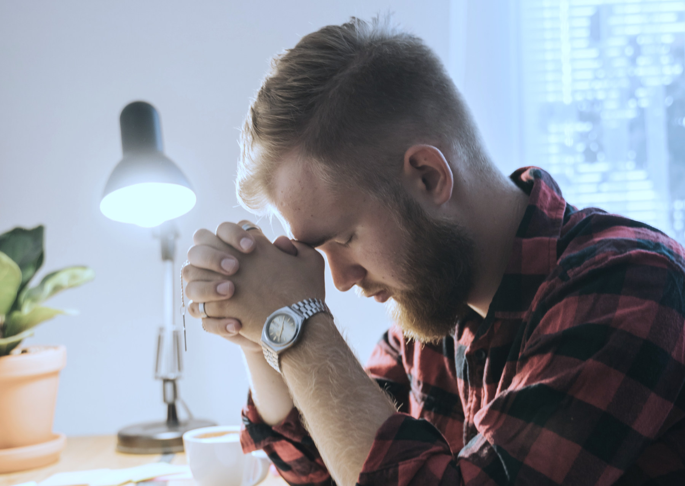
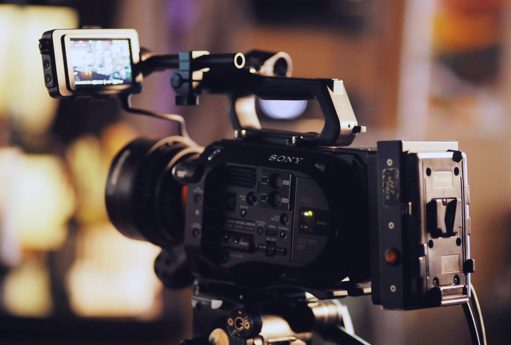
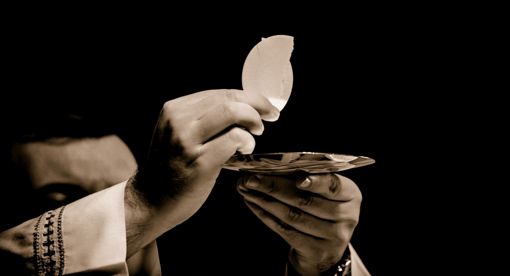
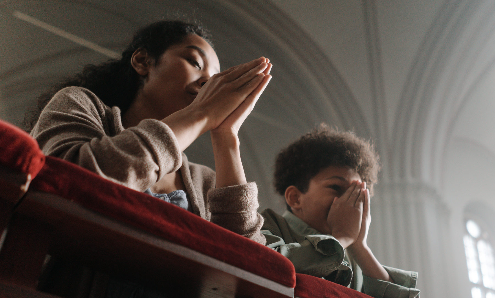
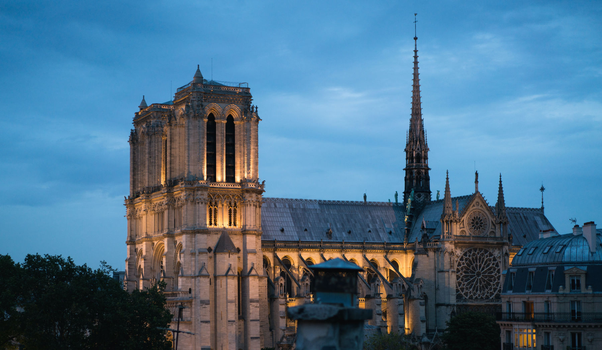
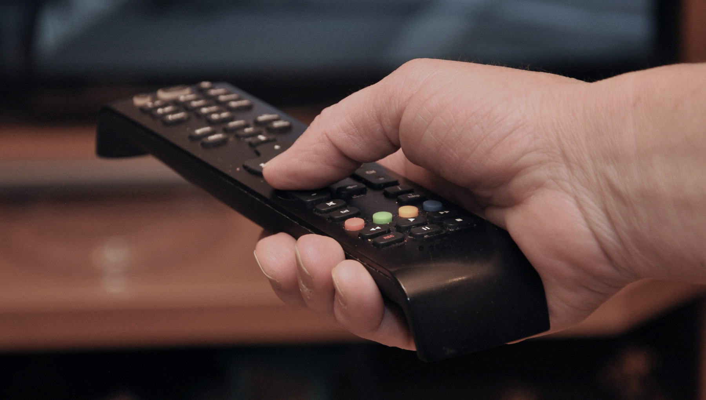

> This moment, this pandemic … has made us all communicate, even religiously, through the means of communication. … And this is *not the Church*: this is the Church in a difficult situation, which the Lord permits, but the ideal of the Church is always *with the people* and *with the Sacraments*. Always.[^1]
> 
> —Pope Francis

In this article, I answer eleven questions concerning the so-called ‘online Mass.’ Feel free to jump directly to questions that interest you the most.

## Content

1. [What’s the matter?]()
2. [What is the Mass?]()
3. [Why is it important to attend Mass on days of obligation?]()
4. [Are there times in which missing Mass is not a grave sin?]()
5. [What should I do when attending Mass is impossible?]()
6. [When attending Mass is impossible, am I obliged to watch an online Mass?]()
7. [Why is online Mass not a Mass?]()
8. [If online Mass is not the real thing, why are Masses still live-streamed?]()
9. [I don’t attend Mass in-person, but I receive communion outside of Mass. Isn’t that enough to fulfill the Third Commandment?]()
10. [When the church is full, I can fully participate in Mass by following it through a TV screen set up at our parish hall. Why is following it through a TV screen at my home any different?]()
11. [What can we do now?]()

## 1. What’s the matter?

To get an idea of where we are today, bear in mind that, [according to the 2019 Pew Research survey](https://www.pewresearch.org/fact-tank/2019/08/05/transubstantiation-eucharist-u-s-catholics/), roughly two-thirds of Catholics *don’t know what Eucharist really is*. This means that they also don’t know *how precious* the Eucharist is and, consequently, they wouldn’t have missed the Church during this pandemic. Some might even be happy that they are no longer obliged to attend Mass in-person.

Yet if the Church is thus dispensable, why speak of *returning* to Mass? If, during the pandemic, one could relate to God ‘spiritually’ via YouTube or Zoom, why make a trip to one’s local parish now? The bishops may announce that one should go back to attending in-person Mass. But one may retort: why should the *bishops* tell *me* what to do?

. Photo courtesy of St. Yakobus (Surabaya)')

## 2. What is the Mass?

So, do you see the problem? That’s why it’s important to go back to square one. What is a Mass or Eucharist? Fundamentally, we can describe it in at least two ways. Firstly, Mass is a *sacrifice*. Secondly, Mass is a *sacrament*.

Firstly, Mass is *the same sacrifice of Christ* on the Cross.[^2] It’s not a *repetition* of that sacrifice, since he died only once. Yet he wants his one-and-only sacrifice to be *made present again* every single day all around the world until the end of time.[^3] Why? So you and I can be saved. From what? From eternal punishment due to sin.

Secondly, Mass is a *sacrament*.[^4] What is a sacrament? A sacrament is an *efficacious sign* of grace.[^5]

But, what is a sign? A sign is, by nature, something perceptible by our senses which points to something other than itself. Smoke is a sign of fire; when you see smoke, you know there’s fire. A wet road is a sign of rain. A sacrament is a sign of grace; when you see a baby getting baptized, you think of God’s grace being given to that baby. Insofar as it’s a sign, a sacrament is similar to a wet road and smoke. However, it’s different from them insofar as it’s *efficacious*. Smoke is not efficacious since it doesn’t cause fire. A wet road is not efficacious since it doesn’t cause rain. A sacrament, however, is *efficacious* since it *causes* grace: it doesn’t only make you *think* of grace, but it also makes grace *present* in its receiver.

The Mass is a sacrament, an *efficacious sign*. The Mass, therefore, is something *sensible*, something perceptible by our senses. One of our exterior senses is touch. In order for us to touch something, however, *physical presence* is required. *This is one of the reasons why a Mass cannot be participated online*. Just as the nature of humanity imposes limits on what we can do (e.g., we can’t fly), the nature of the sacraments—what the sacraments really are—imposes limits on when and how they can be celebrated. In short,
> there is something decidedly un-sacramental, even anti-sacramental in e-Eucharist.
> 
> —[Anthony R. Lusvardi, S.J.](https://www.americamagazine.org/voices/anthony-r-lusvardi-sj)

## 3. Why is it important to attend Mass on days of obligation?

There are many reasons why attending Mass on days of obligation is important. Bear in mind that we’re here talking about attending Mass on “days of obligation,” which include Sundays and other holy days of obligation.[^6] We’re not talking about attending “daily” Mass. Having said this, let’s cite just two reasons why attending Mass on days of obligation is important.

Firstly, Eucharist is “the fount and apex of the whole Christian life.”[^7] Moreover, the Sunday Eucharist is the foundation and confirmation of all Christian practice.[^8] Attending Mass is not merely an individual act. It is rather an act proper to a member of Christ’s Body. Thus, “[p]articipation in the communal celebration of the Sunday Eucharist is a testimony of belonging and of being faithful to Christ and to his Church.”[^9]

Secondly, it’s our obligation. This second reason is based on the first. The *Code of Canon Law* establishes that

> [o]n Sundays and other holy days of obligation, the faithful are *obliged to participate in the Mass*. Moreover, they are to abstain from those works and affairs which hinder the *worship* to be rendered to God, the *joy* proper to the Lord’s day, or the *suitable relaxation* of mind and body.[^10]

This implies that it is “a grave sin” to deliberately *not* attend Mass without “a serious reason.”[^11]

## 4. Are there times in which missing Mass is *not* a grave sin?

Yes, there are. It is *not a grave sin* for us to miss Mass when we are *not* *obliged* to attend it. Since nobody is obliged to do the impossible, we are not obliged to attend Mass when it’s *impossible* to do so. Here are several circumstances that make attending Mass *not obligatory*.

Firstly, when there’s *no priest to celebrate it*, attending Mass is not obligatory simply because it’s *impossible*.[^12] Think of those remote villages to which their priest can come only once a month or even once a year. It’s *impossible* for the people there to attend Mass every Sunday.

Secondly, when there’s a “*serious reason*” to not attend Mass, attending Mass is not obligatory. Examples of a “serious reason” would be illness, severe weather, a pandemic, the care of the sick or infants, or some other serious obligations.[^13]

Lastly, when you’re *dispensed by your pastor* from attending Mass, attending Mass is not obligatory.[^14]

## 5. What should I do when attending Mass is impossible?

Attending Mass is a way to fulfill the Third Commandment.[^15] Not being obliged to attend Mass is *not* equivalent to not being obliged to keep the sabbath holy. The Third Commandment has to be observed *always*, even when it’s impossible to attend Mass.

The question certainly is: how can we fulfill the Third Commandment when attending Mass is impossible? Canon 1248 §2 of the *Code of Canon Law* provides us with two alternatives.

The first alternative: we are “strongly recommended” to ”take part in a *liturgy of the word* if such a liturgy is celebrated in a parish church or other sacred place.”[^16] This alternative may not be doable when there’s a stay-at-home order.

The second alternative comes in when the first is not feasible. When there’s no liturgy of the word celebrated in a parish church, we are “strongly recommended” to “*devote [ourselves] to prayer for a suitable time* alone, as a family, or, as the occasion permits, in groups of families.”[^17]

## 6. When attending Mass is impossible, am I obliged to watch an online Mass?

This is perhaps the question I get asked the most during this pandemic: *is watching an online Mass obligatory?*

According to canon 1248 §2 of the *Code of Canon Law* (see Question 5), the answer is very clear: *no*. Note that this canon says *nothing* about online Mass. It doesn’t mention online Mass *not* because online Mass was nonexistent in 1983 when the [*Code of Canon Law*](https://www.vatican.va/archive/cod-iuris-canonici/cic_index_en.html) was published. The [first televised Mass](https://youtu.be/381nnQSq3oA) was the Midnight Mass of Christmas broadcast from Paris’ Notre Dame Cathedral in 1948.

So let me be extra clear about this: *watching an online Mass is not obligatory*.

Why? Because online Mass is only *one of the means* that could help us do what we’re strongly recommended to do when it’s impossible to physically attend Mass or a liturgy of the word at our parish. Listening to prayers, readings, and short sermons in an online Mass may help us “*devote [ourselves] to prayer for a suitable time*.”[^18] However, it is by no means the *only* way to pray. We can “devote [ourselves] to prayer for a suitable time,” for example, by reflecting on a biblical passage or praying together as a family.

## 7. Why is online Mass not a Mass?

I will now give three reasons why an online Mass is *not the real Mass*.

### Online Mass blurs the law of incarnation

Online Mass is not the real Mass because it blurs the *law of incarnation*. But, what is the law of incarnation? It’s not as complicated as it sounds. John 1:14 summarizes it very well: “the Word became flesh and lived among us.”

That’s the law of incarnation. It tells us that Christ is present in our world *really*, not *virtually*. During Jesus’ earthly life, people saw, heard, touched, and smelled him. Now we can also see, taste, and touch him in the Eucharist, as he says: “Those who eat my flesh and drink my blood abide in me, and I in them” (John 6:56). This is the law of incarnation: *God has become visible, touchable, and even edible!*

When we become conscious of how important Incarnation is, we become aware of how online liturgies “risk distancing us from a personal and intimate encounter with the incarnate God.”[^19] We know this at heart. Talking to our friend via internet video call is not the same as being with her in the same room. Likewise, an online Mass is not the real Mass.

### Online Mass lacks transcendence

The second reason is closely related to the first: online Mass is not the real Mass because it lacks the *context of transcendence* in which sacraments ought to be celebrated. Transcendence points to “existence or experience beyond the normal or physical level.”[^20] This context includes sacred art, music, architecture, responses, gestures, silence, etc.

Why should we be immersed in all these elements when we participate in Mass? Because of the *law of incarnation*. In the incarnation, the Son assumed human nature composed of soul and body. By doing so, he elevated his body—a material thing —and made it an instrument of his divinity. The incarnation tells us that material things are not bad; rather, they can lead us to God.

Alas, the context of transcendence is almost completely absent when we watch an online Mass. We’re not physically within a church. We can hardly see the statues and paintings in it. We may hear the hymns being sung, but we may be less inclined to sing along. More importantly, the temptation to multi-task is too great when we watch an online Mass.

Hence, since online Mass lacks the *context of transcendence*, it is not the real Mass.

### Online Mass does not allow for full and active participation

The last reason is the most important one: online Mass is not the real Mass because it does not foster “full and active participation”[^21] that befits the celebration of such a sacred mystery. Let’s take a closer look at these two adjectives. What does it mean to *fully* and *actively* participate in Mass?

Firstly, participation ought to be *active*. Something active implies contribution. 

When we watch an online Mass—just like when we watch a TV show or a YouTube video—, the almost natural attitude we have is a *passive* one. We sit back, relax, and enjoy. We become mere spectators of the Mass. We’re not *actively* contributing anything to what’s going on in front of us. We’re just *passively* receiving.

This passivity goes against what is expected of us in Mass. As baptized faithful who participate in Christ’s priesthood as members of the Church, we are *co-offerers* at Mass together with the priest. We offer the *sacrifice* of our *entire life* symbolized by the bread and wine presented during the preparation of the gifts. In other words, at Mass,

> the sacrifice of Christ becomes also the sacrifice of the members of his Body. The *lives* of the faithful, their *praise*, *sufferings*, *prayer*, and *work*, are *united* with those of Christ and with his total offering, and so *acquire a new value*.[^22]

Before moving on to the second adjective, let me clarify one thing. Of course one can attend an in-person Mass and have a passive attitude there too. Likewise, one may watch an online Mass more attentively than somebody physically present in a church during a celebration of a Mass. Therefore, I’m not saying that passive attitude is necessarily *caused* by watching an online Mass. I’m just saying that online Mass *does not facilitate* active participation, but rather its contrary.

Secondly, participation needs to be *full*. This means that participation should involve the entire human person composed of body and soul. An exclusively *external* or *physical* participation is not a *full* participation. Neither can an exclusively *internal* or *spiritual* participation be considered *full*.

Granted: online Mass may allow for a *spiritual* participation (i.e., we can focus our thoughts on what we’re watching). However, online Mass certainly doesn’t allow for a full *physical* participation. Yes: we can devoutly make the gestures we usually make in an in-person Mass (e.g., standing, kneeling, sitting). Some of us even sing along. However, by doing all these good things, we’re still not *fully* participating in Mass since we’re not *physically* present as *part of the liturgical assembly*. A human being is not only spirit, but rather body and spirit.

In sum, watching an online Mass is certainly not a *full* participation in a Mass. Most probably, neither is it an *active* participation. That’s why it’s not the real Mass.

## 8. If online Mass is not the real thing, why are Masses still live-streamed?

Let us remember that online Mass is not a Covid-specific thing. The [first televised Mass](https://youtu.be/381nnQSq3oA) was the Midnight Mass of Christmas broadcast from Paris’ Notre Dame Cathedral in 1948. Liturgies—from St. Peter’s in the Vatican to EWTN—have been televised since. The question is: *whom is online or televised Mass intended for?*

Online Mass is for those who are *not obliged to attend Mass in the first place*. Online Mass can prove helpful, for instance, for shut-ins, nursing-home residents, people with compromised immune systems, the homebound, those with disabilities or disabled family members, and even those whose work schedules prevent them from attending Mass regularly. A genuine fear of catching the virus too may qualify as a “serious reason” that would make attending Mass not obligatory.[^23] As I’ve said, online Mass is not the real thing—it doesn’t ‘count’—, but it doesn’t matter since these people *don’t have any obligation to fulfill* in the first place.

However, online Mass is *not for the healthy* who can still come to church. It’s not for those who have already returned to normality to some extent during this pandemic. If we have returned to restaurants and shopping malls, why not return to Mass as well? In the words of an American bishop,

> [i]f you’re truly, truly afraid of catching the virus, then you stay home … If you’ve gone out to lunch, if you’ve gone out to dinner, then you’re not truly afraid.
> 
> —Bishop [Timothy E. Freyer](https://en.wikipedia.org/wiki/Timothy_Edward_Freyer)

## 9. I don’t attend Mass in-person, but I receive communion outside of Mass. Isn’t that enough to fulfill the Third Commandment?

No, it isn’t enough. Many people confuse Mass and communion. If they go to Mass without receiving communion, they *feel* like *not having gone to Mass*.

Although they are inseparable, they are two different things. The obligation to attend Mass on Sundays and other holy days of obligation has to do with *participation*,[^24] not with the reception of *communion*.

This difference can be clearly seen in the first and the third precepts of the Church.[^25] The first precept reads:

> You shall attend Mass on Sundays and on holy days of obligation and rest from servile labor.[^26]

The third precept reads:

> You shall receive the sacrament of the Eucharist at least during the Easter season.[^27]

The first precept has to do with *participation*. The third precept concerns the reception of *communion*. Bear in mind that the third precept doesn’t require us to receive communion every Sunday and every holy day of obligation. It only requires us to receive communion *at least once a year* during the Easter season.

In sum, we can fully *participate* in a Mass even though, while being physically present, we do not receive *communion* for some reasons. If you don’t know the circumstances under which you should not receive communion, [read this article](https://www.catholic.com/tract/who-can-receive-communion).

## 10. When the church is full, I can fully participate in Mass by following it through a TV screen set up at our parish hall. Why is following it through a TV screen at my home any different?

Following the Mass through a TV screen set up at our parish hall and following it through a TV screen at our home are *not the same thing*. Let me provide an analogy to illustrate this.

The Colosseum is one of the most popular landmarks in Rome. Bob is currently in Rome and decides to check it out. As soon as he exits the “Colosseo” metro station, he gets so excited that he immediately starts taking video of the Colosseum. He is so focused on recording footages that he actually *forgets to see the Colosseum with his own eyes*. That day, he only sees the Colosseum *through his phone screen*.

Jane’s story is different. Like Bob, she loves the Colosseum. But, since she’s low on savings, she can’t travel to Rome. One day, though, she decides to watch videos of the Colosseum on her phone. That day, she sees the Colosseum *through her phone screen*.

Both Bob and Jane see the Colosseum only through their phone screen. They apparently do the same thing. However, when we consider them within their surroundings, *Bob’s experience is way richer than Jane’s*. Even though, like Jane, Bob doesn’t see the Colosseum directly with his eyes, he feels the weather around the Colosseum; he probably sees people lining up to go inside; he certainly hears the street vendors’ voices; he breathes the air around there; he feels the excitement before and after visiting the site. Jane lacks these experiences. *She is not part of the scene*. *Bob is*.

To some extent, this illustrates the difference between following the Mass through a TV screen set up at our parish hall (due to lack of space in the church) and following it through a TV screen at our home. In the second case, we are *not part of the scene*: we are not *fully* participating in Mass. In the first case, we are *part of the scene*: we are part of the *liturgical assembly* and may *fully* participate in Mass. Being part of the assembly is crucial since “the house of the Lord presupposes the presence of the family of the children of God.”[^28] This is why

> as soon as circumstances permit … it is necessary and urgent to return to the normality of Christian life, which has the church building as its home … .”[^29]
> 
> —Robert Cardinal Sarah

## 11. What can we do *now*?

That’s a good question and certainly I don’t have all the answers. I do have some action items I would like to offer to all—bishops, priests, and laymen—who happen to read this article.

### Explain what the Eucharist is

If somebody doesn’t know what the Eucharist is, then why bother *going back* to Mass (or *attending* it in the first place)?

That’s why we have to do all we can so that more and more people understand what the Eucharist is. I’m seeing that many Catholic communities still organize webinars on different topics, for example. Why not set one up on the Eucharist?

### Build up our community

Online Mass instills the idea that the parish community is dispensable. It makes us think, at least unconsciously, that we can be Christians just by watching Mass in the solitude of our bedroom.

This, however, is not what the Church is. The Church is a *communion*: a communion with God and a communion among human beings.[^30]

Being a Christian entails being a member of a community of believers. *No one* can be a Christian *alone*.

In the post-pandemic era, this is what I think needs to be emphasized: *our parish community is indispensable*. Communion is not only *invisible* but also *visible*.[^31] The Church is a community in all aspects of her life, including at Mass. *Mass is by no means merely a social event*. But let us not forget that it is, among other more important things, *also a social event* inasmuch as “[t]he Eucharist is the creative force and source of communion among the members of the Church, precisely because it unites each one of them with Christ himself.”[^32]

It’s time to rediscover the importance of *deep community bonds* in our parishes. There are many ways we can achieve this: I’m sure many of you are more creative than I am!

Firstly, I think it’s important to get people to come to their parish *more than just for Mass*. Of course, Mass is the most important thing. But to strengthen community bonds, they need to *hang out* more at the parish. They need to realize that their personal, physical presence there is important. What if we organize weekly social events? Movie nights? Food and fellowship after Mass? Games after Mass for kids and teenagers? You name it.

Secondly, more has to be done in the field of hospitality. Each parish may want to establish its own *hospitality team* in charge of getting in touch with parishioners by calling or sending them invitations to return to Mass. *Personal contact* is more important than ever. Parish priests may want to write a letter to their parishioners. I even know of a parish priest in Jakarta who calls his parishioners one by one on their birthday. How awesome!

### Show Christ’s love to others

This last point is the most important one: it is time for us to do our best in showing Christ’s love to our neighbors.

Insisting on Sunday obligation will not be enough to bring people back to Mass. You can tell your friend, “Pal, you’re obliged to attend Mass.” He can simply respond, “I don’t care.” If this conversation sounds familiar, then you know what I mean.

Attending Mass is indeed an obligation. But it’s also much more than that. It’s a *personal response to Christ’s love*. But don’t forget: people experience God’s love through our good works and words.

## References

These are some helpful articles I read as I was preparing this article. You too can check them out. All except two were written during the pandemic.

“[Bishops urge Catholics to put church above sport and shopping](https://www.theguardian.com/world/2021/nov/19/catholic-sunday-mass-covid-virtual-worship-england-and-wales)” (The Guardian, 19 Nov 2021)

“[Virus-Prodded Online Masses Have Changed Many Catholic Parishes — Are They Keeping Some Catholics From Returning to Church?](https://www.ncregister.com/news/virus-prodded-online-masses-have-changed-many-catholic-parishes-are-they-keeping-some-catholics-from-returning-to-church)” (National Catholic Register, 24 Aug 2021)

“[Lifting dispensation is not enough to get Catholics back to in-person Mass](https://www.catholicnews.com/lifting-dispensation-is-not-enough-to-get-catholics-back-to-in-person-mass/)” (Catholic News Service, 14 Jul 2021)

“[What Liturgy Should Look Like in Your Domestic Church](https://www.ncregister.com/blog/what-liturgy-should-look-like-in-your-domestic-church)” (National Catholic Register, 22 May 2021)

“[So you’re about to watch a livestream Mass with a toddler](https://www.americamagazine.org/faith/2020/12/18/catholic-mass-kids-covid-19-239501)” (America, 18 Dec 2020)

“[We should stop filming the Liturgy of the Eucharist](https://www.americamagazine.org/faith/2020/11/24/livestream-mass-liturgy-coronavirus-stop)” (America, 25 Nov 2020)

“[‘Virtual’ Mass never substitutes in-person participation](https://www.vaticannews.va/en/vatican-city/news/2020-09/letter-congregation-worship-celebration-liturgy-covid.html)” (Vatican News, 12 Sep 2020)

“[Let us return to the Eucharist with joy](https://www.catholicnewsagency.com/news/45815/full-text-cardinal-sarah-let-us-return-to-the-eucharist-with-joy)” (Robert Cardinal Sarah, 15 Aug 2020)

“[What does it mean to ‘actively participate’ in Mass?](https://www.catholicnewsagency.com/news/45422/what-does-it-mean-to-actively-participate-in-mass)” (Catholic News Agency, 6 Aug 2020)

“[Will Catholics Return to Mass?](https://www.thecatholicthing.org/2020/04/15/will-catholics-return-to-mass/)” (The Catholic Thing, 15 Apr 2020)

“[The dangers of live-streaming Masses](https://www.catholicculture.org/commentary/dangers-live-streaming-masses/)” (Catholic Culture, 9 Apr 2020)

“[Televised Masses](https://www.ewtn.com/catholicism/library/televised-masses-4895)” (Edward McNamara, 18 Jan 2005)

“[Is TV Mass as Good as the Real Thing?](https://www.catholic.com/qa/is-tv-mass-as-good-as-the-real-thing)” (Catholic Answers, n.d.)

[^1]:Pope Francis, [Homily at Domus Sanctae Marthae](http://www.vatican.va/content/francesco/en/cotidie/2020/documents/papa-francesco-cotidie_20200417_lafamiliarita-conil-signore.html) (17 Apr 2020).
[^2]:See *Catechism of the Catholic Church* (*CCC*), §1330; §1367.
[^3]:See *CCC*, §1341.
[^4]:See *CCC*, §1331.
[^5]:See *CCC*, Glossary.
[^6]:*Code of Canon Law*, can. 1247; 1246 §1.
[^7]:*Lumen Gentium*, §11.
[^8]:See *CCC*, §2181.
[^9]:*CCC*, §2182.
[^10]:Can. 1247; see *CCC*, §2181.
[^11]:*CCC*, §2181.
[^12]:See can. 1248 §2.
[^13]:See *CCC*, §2181.
[^14]:See *CCC*, §2181.
[^15]:See *CCC*, §2180.
[^16]:Can. 1248 §2.
[^17]:Can. 1248 §2.
[^18]:Can. 1248 §2.
[^19]:Robert Cardinal Sarah, “[Let us return to the Eucharist with joy](https://www.catholicnewsagency.com/news/45815/full-text-cardinal-sarah-let-us-return-to-the-eucharist-with-joy)” (15 Aug 2020).
[^20]:Angus Stevenson and Christine A. Lindberg, *New Oxford American Dictionary*, Third Edition (Oxford: Oxford University Press, 2010), s.v. transcendence.
[^21]:*Sacrosanctum Concilium*, §15.
[^22]:*CCC*, §1368.
[^23]:*CCC*, §2181.
[^24]:See can. 1247.
[^25]:See *CCC*, §§2041–2043.
[^26]:*CCC*, §2042.
[^27]:*CCC*, §2042.
[^28]:Robert Cardinal Sarah, “[Let us return to the Eucharist with joy](https://www.catholicnewsagency.com/news/45815/full-text-cardinal-sarah-let-us-return-to-the-eucharist-with-joy)” (15 Aug 2020).
[^29]:Robert Cardinal Sarah, “[Let us return to the Eucharist with joy](https://www.catholicnewsagency.com/news/45815/full-text-cardinal-sarah-let-us-return-to-the-eucharist-with-joy)” (15 Aug 2020).
[^30]:See Congregation for the Doctrine of the Faith (CDF), [*Letter to the Bishops of the Catholic Church on Some Aspects of the Church Understood as Communion*](https://www.vatican.va/roman_curia/congregations/cfaith/documents/rc_con_cfaith_doc_28051992_communionis-notio_en.html) (1992), §3.
[^31]:See CDF (1992), §4.
[^32]:CDF (1992), §4.
