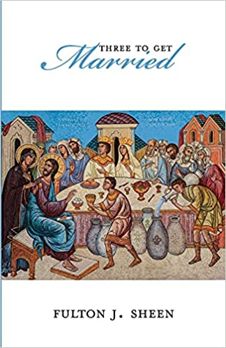

> I, (name), take you, (name), to be my wife/husband. I promise to be faithful to you, in good times and in bad, in sickness and in health, to love you and to honor you all the days of my life.
>
> —_Marriage Consent_

---

As a priest, one of the biggest joys in my ministry is to assist at a marriage. In today’s society, where provisionality and [relativism](https://www.catholic.com/magazine/online-edition/how-to-refute-moral-relativism) reign, the act of contracting marriage has become a heroic act: an act in which a man and a woman publicly declare that **everlasting love is still possible**!

At the same time, though, we should not forget that marriage is not a product of human genius. **Human beings did not invent marriage: God did.** For our benefit, the central part of the wedding ceremony—the **marriage consent**[^1]—condenses the essence of what marriage is according to God’s design.

Are you currently dating and preparing yourself for marriage? Are you a spouse? Or, are you simply somebody interested in knowing more about marriage? If you answer in the affirmative, this article is written for you. Let us together reflect on the words of the marriage consent.

## 1. Marriage: a Free Act

The first word of the marriage consent is **_I_**. I am the one getting married: not my parents, not my extended families, not my friends … but myself.

This is a robust assertion of one’s freedom: I am the one making the decision. Marriage is free: **if there is no freedom, there is no marriage.** I do not enter into marriage because my parents tell me to; because I fear the negative judgment of others; or because I have already made down payments to my wedding vendors! Instead, I marry this other person **freely**, because **I want to**.

## 2. Spouses: Ministers of Christ

In marriage, therefore, this '**_I_**' is never solitary. Now, the '**_you_**' enters the scene: **_I … take you … to be my wife … to be my husband_**. Marriage is unique among the sacraments because, in it, **the spouses themselves**—not the priest!—are the “**ministers of Christ’s grace** [who] mutually confer upon each other the sacrament of Matrimony by expressing their consent before the Church.”[^2] This very consent constitutes marriage.[^3]

Moreover, it is to be noted that this **_you_** is in singular—**_te_**, in its Latin original. This highlights one of the essential properties of marriage, which is **unity**. Matrimony is possible only between **one man and** **one woman**. Any other combination is ruled out; there is no marriage between one man and two women (or more); between one woman and two men (or more); between one man and another man; nor between one woman and another woman. **Matrimony, according to God’s original plan, is between one man and one woman**.[^4] It is not a product of human genius, but God’s sovereign design.

## 3. Marriage: One, Indissoluble, and Open to Life

The phrase that comes next is **to be my wife … to be my husband**. Something grand and mysterious normally has more than one name. Why? Because no single name can exhaust its immense reality. Think of the Eucharist: at least nine names of the Eucharist are listed in the _Catechism_![^5]

**A similar phenomenon happens with marriage.** At least there are four names in Latin—the mother of several major European languages—that designate the mystery of marriage. Let us briefly go through each of them.

- _Nuptiae_

The first name in my list is _nuptiae_ (Lt. _nubere_, to veil), wherefrom comes the English term ‘nuptials.’ The Latin noun _nuptus_ means 'covering' or 'veil.' This is in reality a [synecdoche](https://literarydevices.net/synecdoche/)—the using of a part of something to refer to its whole (as in saying “I’ve got wheels” to mean “I have a car”). Thus, the veiling of the bride in the celebration represents the veiling of the mystery of marriage.

The use of [veil in weddings](https://www.catholicculture.org/culture/library/dictionary/index.cfm?id=37052) dates back at least to the Greco-Roman times. In a religious context, it stands for **modesty** and **obedience** before God as well as for **chastity**.

- _Matrimonium_

The second name is _matrimonium_, a word composed of the words _matris munia_ (i.e., the mother’s duties). This is another synecdoche. Marriage is here designated by the mother’s responsibilities. The name ‘matrimony,’ hence, points to the **procreative end** of marriage. Couples, in other words, are called to be **open to life**.

This openness to life entails unwavering [opposition to the use of contraception](https://www.catholic.com/tract/birth-control). Mind you: the Church is not a police officer. She is a wise mother. When she prohibits something, **she does so because it goes against your interest**!

She tells you, “Don’t use contraception,” because, on the one hand, **it disfigures marriage by separating its unitive and procreative purposes which—in God’s original plan—are bound together**. There is no separation between “be fruitful and multiply” (Gen 1:28) and “they become one flesh” (Gen 2:24). The one who uses contraception, though, only wants sex (union) but not babies (procreation).

Contraception, on the other hand, destroys matrimonial love since, when it is employed, a spouse can **no longer say he gives himself unreservedly to the other spouse**. Why? Because he at least refuses to give his spouse his fertility—his capability to give her progeny!

Contraception and total self-giving, therefore, are mutually exclusive.

- _Consortium_

The third name is _consortium_, formed by _con_ (together with) and _sors_ (destiny). This name suggests that marriage has—apart from the **procreative end**—a **unitive end**, namely, the good of the spouses. A couple promises to live in union with one another as each one of them pronounces: **_I promise to be faithful to you_** … . _Consortium_ also conveys the idea of [indissolubility](https://media.ascensionpress.com/2018/08/06/the-sacramentality-and-indissolubility-of-marriage/): I want to be faithful to you in order to **_love you and to honor you all the days of my life_**.

- _Conjugum_

The fourth name is _conjugum_; it is a combination of _con_ (together with) and _jugum_ (yoke). This name suggests that married couples are called to carry the same yoke. For them, yoke represents all the life contradictions they have to face: **_the good times and the bad, sickness and health, etc_**.

Those familiar with agriculture will know that a [yoke](https://www.britannica.com/technology/yoke) would normally be carried by two animals. However, unlike those animals, married couples are not the only ones carrying the yoke. **Christ helps them.** He carries the yoke with them. That is why Fulton Sheen asserts that **it takes three to get married**: God + a man + a woman.

> It takes three to make Love in Heaven
> —Father, Son, and Holy Spirit.
>
> It takes three for Heaven to make love to earth
> —God, Man, and Mary, through whom God became Man.
>
> It takes three to make love in the Holy Family
> —Mary, and Joseph, and the consummation of their love, Jesus.
>
> It takes three to make love in hearts
> —The Lover, the Beloved, and Love.
>
> To that Woman Who taught the sublime mystery of Love, Mary Immaculate,
> This book is dedicated.
>
> That nations, hearts, and homes may learn
> That love does not so much mean to give oneself to another
> As for both lovers to give themselves to that Passionless Passion,
> Which is God.
>
> —Fulton J. Sheen, _Three to Get Married_, Prologue

  

    

      
    

  

  

    <h5>
      <a href="https://amzn.to/3ECnnZ1">Three To Get Married</a>
    </h5>
    <h6>Fulton J. Sheen</h6>
    
Centering on the essence of love and its implications for marriage, this book is an edifying read for engaged couples, married couples, marriage counselors, and priests alike.

  

[^1]: “Matrimonial consent is an act of the will by which a man and a woman mutually give and accept each other through an irrevocable covenant in order to establish marriage” ([c. 1057 §2](https://www.vatican.va/archive/cod-iuris-canonici/eng/documents/cic_lib4-cann998-1165_en.html#CHAPTER_IV.)).
[^2]: [_CCC_, 1623](https://www.vatican.va/archive/ENG0015/__P52.HTM).
[^3]: See _The Code of Canon Law_, [c. 1057 §1](https://www.vatican.va/archive/cod-iuris-canonici/eng/documents/cic_lib4-cann998-1165_en.html#CHAPTER_IV.).
[^4]: See Gen 2:24 _NRSVCE_: “Therefore a man leaves his father and his mother and clings to his wife, and they become one flesh.”
[^5]: See [_CCC_, 1328](https://www.vatican.va/archive/ENG0015/__P3Y.HTM) et seq.
