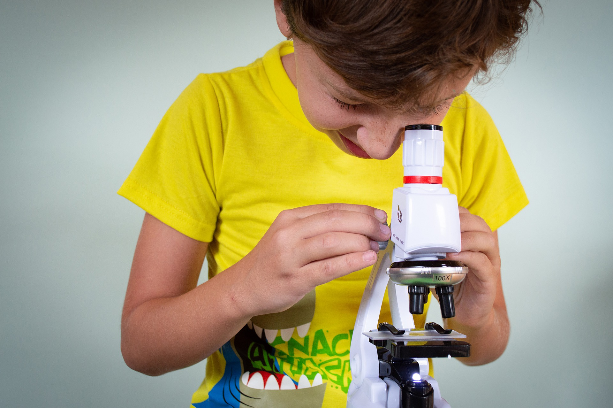

Mereka yang mengenal saya tahu bahwa, sebelum memasuki jenjang universitas, **saya tidak pernah belajar di sekolah Katolik**. Alasannya cukup sederhana: sekolah Katolik di dekat tempat saya tinggal tidak memenuhi ekspektasi orang tua saya. 

Saya prihatin dengan kenyataan bahwa banyak sekolah Katolik yang tidak berperilaku sesuai dengan namanya. Tidak hanya ada ‘umat Katolik KTP’ di sekitar kita; ternyata, ada banyak juga ‘sekolah Katolik KTP.’ Kata-kata berikut dari seorang kudus dari abad kedua puluh mengungkapkan keadaan ini dengan jelas:

> Saya harus mengakui bahwa saya tidak menyukai ungkapan ‘sekolah Katolik,’ ‘sekolah Gereja,’ dll., meskipun saya menghormati mereka yang berpikiran lain. Saya lebih menyukai suatu hal yang ditonjolkan karena buahnya, bukan karena namanya.
> 
> Sebuah sekolah bisa dikatakan benar-benar kristiani ketika sekolah itu, dengan tetap menjadi seperti sekolah-sekolah yang lain dan dengan berjuang untuk menjadi lebih baik, memberikan pendidikan yang integral—yang mencakup pembinaan iman kristiani—, sembari menghormati kebebasan pribadi dan mempromosikan keadilan sosial yang sangat dibutuhkan. Jika hal itu tercapai, maka nama tidaklah terlalu penting.
>
>— St. Josemaría, [*Percakapan*, no. 81](https://www.escrivaworks.org/book/conversations-chapter-6.htm)

Tidak bisa diragukan bahwa pendidikan anak menempati salah satu posisi teratas dalam daftar prioritas orang tua Katolik. Oleh karena itu, mereka berhak untuk memilih apa yang terbaik untuk anak-anak mereka, walaupun itu bisa jadi berarti mempercayakan pendidikan mereka ke sebuah sekolah non-Katolik. Tentu saja: pada dasarnya, mereka berharap bisa menyekolahkan putra-putri mereka di sebuah sekolah Katolik. Namun, karena berbagai alasan dan keadaan, **mereka—dengan penuh tanggung jawab—memilih untuk tidak melakukannya**.

Apakah Anda **orang tua Katolik** yang berusaha untuk memilih sekolah untuk anak-anak Anda? Apakah Anda seorang **pengelola sekolah**, **guru**, **pastor paroki**, atau **kapelan** yang terlibat dalam memajukan sekolah Katolik? Atau, apakah Anda **seorang Katolik biasa** yang ingin memperbaiki panorama sekolah Katolik di daerah Anda? Jika Anda menjawab iya, maka artikel ini ditulis untuk Anda. Di sini, saya akan menguraikan tiga ciri-ciri sekolah Katolik yang autentik berdasarkan dokumen Vatikan II yang berjudul [*Gravissimum Educationis*](https://katolisitas.org/gravissimum-educationis/), yang diterbitkan pada tahun 1965.
# 1. Bagian dari Gereja
Ciri pertama yang membedakan sebuah sekolah Katolik dari lembaga pendidikan lainnya adalah **kesadarannya sebagai bagian dari Gereja**. Sekolah-sekolah non-Katolik bisa jadi berjuang semata-mata untuk mengikuti tren pasar atau memenuhi tuntutan para pengurus yayasan mereka yang ambisius. Sebaliknya, sebuah sekolah yang benar-benar Katolik tidak akan pernah lupa bahwa ia adalah bagian dari Gereja yang didirikan oleh Kristus. Misinya tidak berbeda sama sekali dari misi Gereja. Setiap sekolah Katolik adalah sebuah sarana—sarana yang paling penting[^1]—bagi Gereja untuk menyebarluaskan pendidikan kristiani.[^2]

Di sisi lain, kesadaran sebuah sekolah akan tempatnya dalam Gereja akan membangkitkan kesadaran bahwa ia perlu senantiasa **bekerja sama dengan para orang tua murid**. Perlu diingat bahwa pendidik utama seorang anak bukanlah guru sekolahnya, namun orang tuanya sendiri.[^3] Oleh karena itu, guru-guru sekolah Katolik dituntut untuk “bekerja sama, terutama dengan para orang tua … dalam seluruh pendidikan.”[^4]

Hanya apabila sebuah sekolah sadar bahwa ia adalah bagian dari Gereja, ia layak menyandang nama ‘Katolik.’
# 2. Keselarasan Iman-Akal Budi
Sebuah sekolah Katolik yang sejati juga ditandai oleh **keselarasan antara iman dan akal budi**. Belakangan ini, ekspresi seperti ‘pendidikan integral’ dan ‘pendekatan interdisipliner’ telah menjadi frasa kunci di ranah pendidikan, baik non-Katolik maupun Katolik. Namun saya ingin menekankan bahwa pendidikan adalah benar-benar integral hanya jika ia mampu menyelaraskan iman dengan akal budi. Dengan demikian, **sebuah kurikulum yang mengecualikan iman kristiani, misalnya, tidak layak disebut ‘integral.’ Lebih parah lagi adalah sekolah-sekolah yang berlabel ‘Katolik’ namun sama sekali tidak memberikan pembinaan iman Katolik atau memberikannya dengan kualitas di bawah standar.**

Di sini, saya perlu memperjelas bahwa keselarasan antara iman dan akal budi tidak menganulir kemandirian masing-masing cabang ilmu pengetahuan seperti fisika, biologi, dan sejarah. Biologi tidak akan berubah menjadi teologi. Fisika juga akan mempertahankan identitasnya. Ilmu-ilmu profan tetap harus dipelajari “menurut asas-asasnya sendiri, dengan metodenya sendiri, dan dengan kebebasan penelitian ilmiah sedemikian rupa, sehingga ilmu-pengetahuan di bidang-bidang itu kian hari makin mendalam.”[^5]

Sebetulnya, keselarasan antara iman dan akal budi menyiratkan perlunya usaha yang serius agar **pembinaan iman kristiani dan pengajaran ilmu-ilmu duniawi dapat berjalan beriringan**.[^6] Pendidikan yang integral harus beraspirasi untuk mengembangkan pribadi manusia dalam semua dimensinya, yang mencakup dimensi-dimensi intelektual, emosional, budaya, moral, profesional, dll.[^7] Akibatnya, pencapaian akademis—yang tentunya sangat penting bagi sebuah sekolah—tidak dapat dijadikan satu-satunya parameter untuk mengukur seberapa ‘Katolik’ sebuah sekolah. Sebuah sekolah Katolik yang menduduki peringkat pertama dalam daftar sekolah-sekolah berdasarkan nilai ujian, misalnya, belum tentu merupakan sebuah sekolah Katolik yang autentik. Mengapa demikian? **Karena manusia bukan hanya terdiri dari intelek.** Selain intelek, saya memiliki tubuh yang juga harus dididik. Saya memiliki indra-indra yang harus dibina dengan hal-hal yang indah. Saya mempunyai kehendak yang harus diresapi oleh niat-niat mulia. Saya merasakan emosi yang perlu disesuaikan dengan akal budi. Intelek saya, pada gilirannya, juga harus diterangi oleh iman.

Hanya apabila sebuah sekolah menawarkan pendidikan integral yang ditandai dengan keselarasan antara iman dan akal budi, ia layak menyandang nama ‘Katolik.’

# 3. Mengajar: Sebuah Panggilan
Ciri terakhir dari sekolah Katolik yang sejati adalah keyakinannya bahwa **tugas mengajar yang diembannya adalah sebuah panggilan**.[^8] Memang, ide ini tidak dimiliki secara eksklusif oleh kaum Katolik. Guru-guru kristiani non-Katolik atau bahkan guru-guru non-kristiani pun bisa jadi dengan tulus meyakini bahwa mereka dipanggil oleh Allah—atau oleh dewa-dewa lain—untuk mengajar. Namun sebuah artikel tentang sekolah Katolik tidak akan lengkap tanpa rujukan kepada para guru, yang seharusnya “menyadari, bahwa terutama peranan merekalah yang menentukan bagi sekolah Katolik, untuk dapat melaksanakan rencana-rencana dan usaha-usahanya.”[^9]

Pembaca *Gravissimum Educationis* dapat menemukan di dalamnya setidaknya tiga ciri yang perlu dimiliki oleh guru-guru Katolik. Tanpa guru-guru dengan ciri-ciri di bawah, tidak ada sekolah yang dapat dianggap sungguh-sungguh ‘Katolik.’

- **Kompeten**. Guru hendaknya “sungguh-sungguh disiapkan, supaya membawa bekal ilmu-pengetahuan profan maupun keagamaan yang dikukuhkan oleh ijazah-ijazah semestinya, dan mempunyai kemahiran mendidik sesuai dengan penemuan-penemuan zaman modern.”[^10] Saya ingin menggarisbawahi kata ‘maupun’ di atas. Kompetensi mencakup bukan hanya penguasaan **ilmu-ilmu profan**, namun juga **ilmu keagamaan**. Dengan kata lain, **seorang guru yang tidak sepenuhnya berpegang teguh dan menghidupi iman Katolik tidak layak untuk bekerja di sebuah sekolah Katolik**. Mengapa? Karena siswa-siswi perlu melihat keselarasan antara berbagai mata pelajaran. Mereka harus dibimbing untuk menyadari bahwa tidak ada pertentangan sama sekali antara apa yang diajarkan dalam kelas sosiologi dan apa yang dijelaskan kepada mereka dalam kelas agama—misalnya—karena semua kebenaran berasal dari Allah, yang adalah Kebenaran itu sendiri.

- **Apostolik**. Para guru Katolik sepatutnya menjadi rasul-rasul bagi murid-murid mereka. Semua guru dipanggil untuk “memberi kesaksian tentang Kristus Sang Guru satu-satunya melalui perihidup dan tugas mereka mengajar.”[^11] Lebih konkret lagi, seorang guru yang baik—terlepas dari materi yang ia ajarkan—adalah guru yang **membawa Injil ke ruang kelasnya**! Mungkin ia tidak melakukannya dengan berbicara mengenai Kristus atau Kitab Suci secara eksplisit, namun ia bisa melakukannya dengan **menunjukkan kegembiraan yang sejati, kesabaran dalam membimbing para murid, dan cintanya akan kebenaran**.

- **Mencintai**. Hendaknya para guru berusaha agar “cinta kasih menjadi ikatan mereka timbal balik dengan para siswa.”[^12] Cinta kasih bukanlah emosi semata. Cinta kasih, lebih tepatnya, adalah **kehendak untuk mengusahakan apa yang baik bagi orang lain**.[^13] Akan tetapi, perlu diingat bahwa cinta kasih seorang guru terhadap murid-muridnya tidak boleh berhenti pada hari kelulusan mereka. Sebaliknya, Gereja mendorong semua guru agar, “juga sesudah para siswa tamat sekolah …[,] tetap mendampingi mereka dengan nasehat-nasehat, sikap bersahabat, pun melalui himpunan-himpunan yang bertujuan khusus dan bernafaskan semangat gerejawi yang sejati.”[^14] Anjuran ini menegaskan lebih lagi bahwa, lebih dari profesi semata, mengajar adalah sebuah panggilan. Oleh sebab itu, **kepedulian seorang guru terhadap murid-muridnya harus melampaui hari kelulusan**!

Hanya apabila sebuah sekolah memiliki tim guru-guru yang kompeten, apostolik, dan mencintai dengan sungguh, ia layak menyandang nama ‘Katolik.’
***
Sembari saya menulis artikel ini, saya teringat akan percakapan saya dengan seorang kenalan beberapa tahun yang lalu. Karena dia adalah seorang Katolik yang taat, saya terkejut ketika mengetahui bahwa dia memilih untuk tidak menyekolahkan kedua putrinya di sekolah Katolik. “Mengapa demikian, Bob (bukan nama sebenarnya)?” saya terbingung-bingung. Jawaban yang dia berikan sangatlah singkat namun menusuk:

>*Father*, saya menyekolahkan putri-putri saya di sebuah sekolah non-Katolik karena saya lebih memilih untuk mengetahui bahwa mereka diajar oleh setan—dengan demikian, saya dapat secara khusus menyisihkan waktu untuk membekali mereka dengan pendidikan iman kristiani yang memadai di rumah—daripada beranggapan bahwa mereka dibimbing oleh malaikat padahal, pada kenyataannya, mereka dididik oleh setan.

Jika Anda adalah orang tua Katolik yang berencana menyekolahkan anak Anda di sekolah Katolik, **selidiki terlebih dahulu apakah tiga kualitas yang telah dipaparkan di atas dimiliki oleh sekolah tersebut**. Dengan demikian, Anda memastikan bahwa sekolah Katolik tersebut sungguh-sungguh Katolik. Di sisi lain, jika Anda adalah seorang pengelola sekolah, guru, pastor paroki, atau kapelan yang terlibat dalam memajukan sekolah-sekolah Katolik, saya memohon agar Anda **bertanya kepada diri sendiri**: apa yang dapat saya lakukan untuk meningkatkan (1) kesadaran sebuah sekolah bahwa ia adalah bagian dari Gereja, (2) keselarasan antara iman dan akal budi, serta (3) kualitas guru di sekolah Katolik yang berada dalam lingkup tanggung jawab saya? Belum terlambat untuk mengubah haluan dan ketekunan kita semua tidak akan sia-sia!

***

*Terima kasih kepada [Prof. Anita Lie](https://scholar.google.com/citations?user=huC3y0gAAAAJ&hl=id) dari [Universitas Katolik Widya Mandala](https://ukwms.ac.id/?lang=en) yang telah memeriksa dan memberikan pendapatnya yang berharga atas artikel ini.*

***

[^1]: Lih. *Gravissimum Educationis*, 5: “Diantara segala upaya pendidikan sekolah mempunyai makna yang istimewa.”
[^2]:*Gravissimum Educationis*, 4.
[^3]:Lih. *Gravissimum Educationis*, 6: “Orang tualah yang pertama-tama mempunyai kewajiban dan hak yang pantang diganggu gugat untuk mendidik anak-anak mereka. Maka sudah seharusnyalah mereka sungguh-sungguh bebas dalam memilih sekolah-sekolah.”
[^4]:*Gravissimum Educationis*, 8.
[^5]:*Gravissimum Educationis*, 10.
[^6]:Lih. *Gravissimum Educationis*, 7: “Oleh Konsili para orangtua diingatkan akan kewajiban mereka yang berat, untuk menyelenggarakan atau juga menuntut apa saja yang diperlukan, supaya anak-anak mereka mendapat kemudahan-kemudahan itu, dan mengalami kemajuan dalam pembinaan kristen, yang serasi dengan pendidikan profan mereka.”
[^7]:Lih. *Gravissimum Educationis*, 5.
[^8]:Lih. *Gravissimum Educationis*, 5.
[^9]:*Gravissimum Educationis*, 8.
[^10]:*Gravissimum Educationis*, 8.
[^11]:*Gravissimum Educationis*, 8.
[^12]:*Gravissimum Educationis*, 8.
[^13]:Thomas Aquinas, [*ST* I, q. 20 a. 3 co.](https://www.newadvent.org/summa/1020.htm)
[^14]:*Gravissimum Educationis*, 8.

