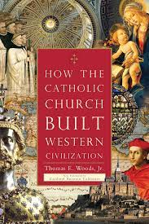

People who are acquainted with me know that, until university, **I never went to a Catholic school**. The reason was quite simple: the Catholic school in my district was not good enough to meet my parents’ expectations.

Indeed, I am saddened by the fact that many Catholic schools do not live up to their name. Not only are there ‘nominal Catholics’ around; there are also ‘nominal Catholic schools.’ The following words of a twentieth-century saint drive this point home:

> I must confess that I do not like the expressions ‘Catholic schools,’ ‘Church schools,’ etc., even though I respect those who think differently. I prefer to see things distinguished by their results and not by their names. A school is truly Christian when it strives for excellence, and gives a complete education—which includes Christian ideals—at the same time respecting personal freedom and earnestly furthering social justice. If this is accomplished, then the name is of little importance.
>
> — St. Josemaría, [_Conversations_, no. 81](https://www.escrivaworks.org/book/conversations-chapter-6.htm)

Children’s education no doubt occupies one of the top positions in Catholic parents’ list of priority. Hence, it is only reasonable that they would choose what is best for their kids even if that means entrusting them to a non-Catholic school. Of course: they wish they could send their sons and daughters to a Catholic school. But, for various reasons and circumstances, **they just responsibly cannot**.

Are you a **Catholic parent** trying to pick a school to enroll your children to? Are you a **school administrator**, a **teacher**, a **parish priest**, or a **chaplain** involved, in one way or another, in running a Catholic school? Or, are you an **ordinary Catholic** seeking to better the panorama of Catholic schools in your area? If you answer in the affirmative, this article is for you. Here, I will elaborate on three characteristics of authentic Catholic schools in light of a timeless Vatican II document titled [_Gravissimum Educationis_](https://www.vatican.va/archive/hist_councils/ii_vatican_council/documents/vat-ii_decl_19651028_gravissimum-educationis_en.html), published in 1965.

## 1. Being Part of the Church

The first trait that sets Catholic schools apart from other educational institutions is **their consciousness of being part of the Church**. Non-Catholic schools might fight solely to follow the market trend or meet the demands of their ambitious board of directors. A truly Catholic school, however, will never forget that it belongs to the very Church founded by Christ. Its mission is no different than the Church’s. Every Catholic school is a means—the most important one indeed[^1]—with which the Church imparts Christian education.[^2]

A school’s consciousness of being part of the Church would in turn generate the consciousness of being **a collaborator of its students’ parents**. Every child’s primary educators are not their school teachers, but their own parents.[^3] Therefore, Catholic school teachers ought to “work as partners with parents … in every phase of education.”[^4]

Only when a school is conscious of being part of the Church can it be worthily called Catholic.

  

    

      
    

  

  

    <h5>
      <a href="https://amzn.to/3zwpaek">How the Catholic Church Built Western Civilization</a>
    </h5>
    <h6>Thomas E. Woods</h6>
    
If you want to know about the relationship between the Church and science, how the monks saved civilization, and how Catholic charities changed the world, you will enjoy this book.

  

## 2. Faith-Reason Harmony

Authentically Catholic schools are also characterized by **harmony of faith and reason**. It takes little effort to realize that ‘integral education’ and ‘interdisciplinary approach’ have become buzz phrases in today’s educational milieu—be it non-Catholic or Catholic. Yet I would argue, though, that an education can be truly integral only if it is capable of harmonizing faith and reason. **A curriculum that excludes Christian faith—to put it bluntly—can never be integral**. **Worse still are schools that bear the title ‘Catholic’ but provide no or shamefully substandard formation in Catholic faith**.

At this point, it seems necessary to clarify that harmony of faith and reason does not deprive secular sciences—such as physics, biology, and history—of their respective methodological independence. Biology will not turn into theology. Physics will also remain as such. These subjects must still be studied “according to their own principles, method, and liberty of scientific inquiry, in such a way that an ever deeper understanding in these fields may be obtained.”[^5]

The harmony of faith and reason does imply, though, that **Christian formation and instruction in secular subjects must go hand in hand**.[^6] An integral education should aim at developing the human person in all his dimensions—e.g., intellectual, emotional, cultural, moral, and professional.[^7] Consequently, academic outcome—as crucial as it is—is never the sole parameter to gauge how Catholic a school is. A Catholic school that tops the ranking of schools based on final exam scores, for instance, may not necessarily be authentically Catholic. Why so? **Because human being is more than just intellect**. Apart from intellect, I have a body which, in a certain sense, also ought to be educated. I have senses, which must be put into contact with the beautiful. I have will, which ought to be impregnated by noble intentions. I experience emotions, which have to be put in conformity with reason. My intellect, in turn, should also be enlightened by faith.

Only when a school provides an integral education marked by harmony of faith and reason can it be worthily called Catholic.

## 3. Teaching as a Vocation

The last feature of a genuinely Catholic school is its conviction that its **duty of teaching is a vocation**.[^8] Granted: this idea is not exclusively Catholic. Non-Catholic Christian or even non-Christian teachers may sincerely believe that they have been called by God—or by another being or beings they regard as divine—to teach. Yet an article on Catholic schools would not be complete without a reference to teachers, upon whom “the Catholic school depends … almost entirely for the accomplishment of its goals and programs.”[^9]

One can identify in _Gravissimum Educationis_ at least three traits of Catholic teachers without which no Catholic school would be worthy of its name.

- **Competent**. Teachers should “be very carefully prepared so that both in secular and religious knowledge they are equipped with suitable qualifications and also with a pedagogical skill that is in keeping with the findings of the contemporary world.”[^10] I would emphasize the word ‘both.’ Competence needs to be acquired not only **in the secular subject** a teacher is put in charge of, but also **in the knowledge of the faith**. Simply put, **teachers who are not fully practicing their Catholic faith are simply out of place in a Catholic school**. Why? Because students need to see the harmony of different school subjects. They ought to be led to appreciate that there is no contradiction whatsoever between what is being taught in sociology and what they learn in religion class—for example—since all truths originate from God, the Truth himself.

- **Apostolic**. Catholic teachers ought to be apostles and, thus, to be deeply rooted in their Catholic faith. They are called to, “by their life as much as by their instruction[,] bear witness to Christ, the unique Teacher.”[^11] More concretely, a good teacher—notwithstanding the subject she imparts—would **bring the Gospel to her classroom**! She does so perhaps not explicitly by referring to Christ or the Bible, but by sincerely **demonstrating her joy, patience, and love of truth**.

- **Loving**. Teachers should be “[i]ntimately linked in charity to one another and to their students.”[^12] Charity is not a mere emotion. It consists, rather, in **willing what is good for another**.[^13] A teacher’s love toward her students, nonetheless, should not extend only to the latter’s graduation day. Instead, the Church encourages all teachers, “even after graduation[,] to continue to assist [their students] with advice, friendship and by establishing special associations imbued with the true spirit of the Church.”[^14] This enjoinment further underlines that teaching is a vocation, as opposed to an ordinary daytime job. **A teacher’s care for his students must go beyond graduation**!

Only when a school boasts a roster of highly competent, zealously apostolic, and earnestly loving teachers can it be worthily called Catholic.

---

As I was writing this article, I recalled a conversation I had with an acquaintance of mine a couple of years ago. Knowing that he was a fervent Catholic, I was surprised when I found out that he chose not to send his daughters to a Catholic school. “How come, Bob (not his real name)?” I wondered. His answer was astonishingly pithy:

> Father, I sent my daughters to a non-Catholic school because I would rather know that they are being instructed by demons—this way, I can intentionally set aside time to provide them with adequate Christian formation at home—than believe that they are being educated by angels when, in reality, they are being taught by demons.

If you are a Catholic parent considering a Catholic school for your children, **investigate whether the three above-described qualities are present in the school**. That way, you will ensure that the Catholic school you are looking at is truly Catholic. On the other hand, if you are a school administrator, a teacher, a parish priest, or a chaplain involved—in one way or another—in running a Catholic school, I beg of you to **question yourself**: what can I do to increase consciousness of being part of the Church, the harmony of faith and reason, as well as the quality of teachers in the Catholic school I am responsible for? It is not too late to set the course right and it is worth persevering!

---

_Special thanks to [Prof. Anita Lie](https://scholar.google.com/citations?user=huC3y0gAAAAJ&hl=id) of [Widya Mandala Catholic University](https://ukwms.ac.id/?lang=en) for proofreading and thoughtfully commenting on this article._

[^1]: See _Gravissimum Educationis_, 5: “Among all educational instruments the school has a special importance.”
[^2]: _Gravissimum Educationis_, 4.
[^3]: See _Gravissimum Educationis_, 6: “Parents who have the primary and inalienable right and duty to educate their children must enjoy true liberty in their choice of schools.”
[^4]: _Gravissimum Educationis_, 8.
[^5]: _Gravissimum Educationis_, 10.
[^6]: See _Gravissimum Educationis_, 7: “The Church reminds parents of the duty that is theirs to arrange and even demand that their children be able to … advance in their Christian formation to a degree that is abreast of their development in secular subjects.”
[^7]: See _Gravissimum Educationis_, 5.
[^8]: See _Gravissimum Educationis_, 5.
[^9]: _Gravissimum Educationis_, 8.
[^10]: _Gravissimum Educationis_, 8.
[^11]: _Gravissimum Educationis_, 8.
[^12]: _Gravissimum Educationis_, 8.
[^13]: Thomas Aquinas, [_ST_ I, q. 20 a. 3 co.](https://www.newadvent.org/summa/1020.htm)
[^14]: _Gravissimum Educationis_, 8.
