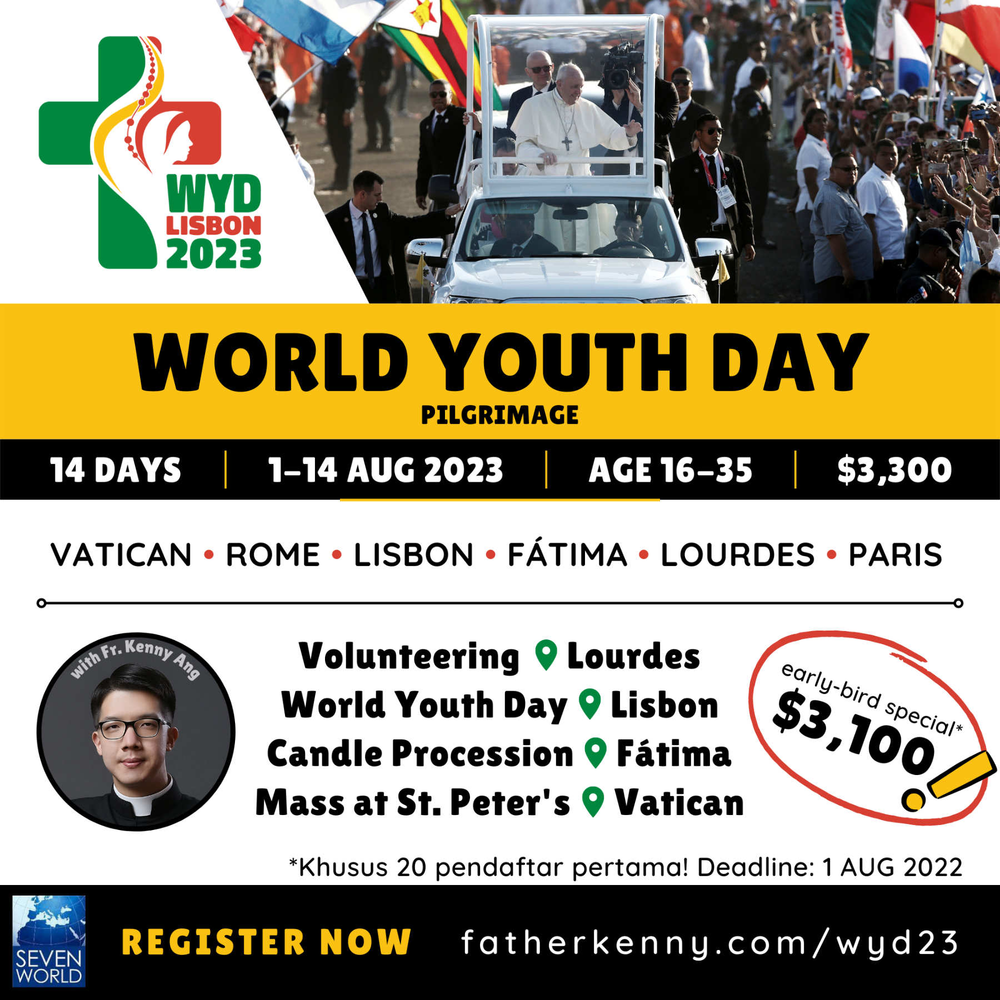

  

    <ul>
      <li>
        REGISTRATION CLOSED. Questions? <a href="http://wa.me/+6283896128777" target="_blank" rel="noopener noreferrer">Ask Seven World Tours</a>  
      </li>
    </ul>
  

---

## Daftar Isi

1. [Kapan perjalanan ini diadakan?](/wyd23/#1-kapan-perjalanan-ini-diadakan)
2. [Apa itu World Youth Day?](/wyd23/#2-apa-itu-world-youth-day)
3. [Kapan sebaiknya saya mendaftar?](/wyd23/#3-kapan-sebaiknya-saya-mendaftar)
4. [Mengapa sebaiknya saya mendaftar sedini mungkin?](/wyd23/#4-mengapa-sebaiknya-saya-mendaftar-sedini-mungkin)
5. [Siapa yang memimpin perjalanan ini?](/wyd23/#5-siapa-yang-memimpin-perjalanan-ini)
6. [Apa saja alasan untuk bergabung?](/wyd23/#6-apa-saja-alasan-untuk-bergabung)
7. [Apa saja persyaratan untuk bergabung?](/wyd23/#7-apa-saja-persyaratan-untuk-bergabung)
8. [Itinerary (1–14 Agustus 2023)](/wyd23/#8-itinerary-114-agustus-2023)
9. [Berapa biaya perjalanan ini?](/wyd23/#9-berapa-biaya-perjalanan-ini)
10. [_Refer-a-friend_ voucher](/wyd23/#10-refer-a-friend-voucher)
11. [Bagaimana cara saya mendaftar?](/wyd23/#11-bagaimana-cara-saya-mendaftar)

---

<iframe width="560" height="315" src="https://www.youtube-nocookie.com/embed/6rAJiPEL04o" title="YouTube video player" frameborder="0" allow="accelerometer; autoplay; clipboard-write; encrypted-media; gyroscope; picture-in-picture" allowfullscreen></iframe>

## 1. Kapan perjalanan ini diadakan?

WYD Pilgrimage direncanakan berangkat dari Jakarta tanggal **1 Agustus 2023** dan tiba kembali di Jakarta tanggal **14 Agustus 2023**.

## 2. Apa itu World Youth Day?

World Youth Day (WYD) 2023 di Lisbon merupakan salah satu acara utama dalam perjalanan ini. WYD adalah perjumpaan orang-orang muda dari seluruh dunia dengan Paus. Untuk mengetahui lebih jauh tentang apa itu World Youth Day (WYD), kunjungi [situs resmi WYD 2023 Lisbon](https://www.lisboa2023.org/en/about). Untuk mengetahui lebih jauh mengenai aktivitas-aktivitas selama WYD, kunjungi [situs resmi WYD 2023 Lisbon](https://www.lisboa2023.org/en/about/what-happens-during-wyd).

<a href="http://www.gettyimages.com/detail/584171976" target="_blank" style="color:#a7a7a7;text-decoration:none;font-weight:normal !important;border:none;display:inline-block;">Embed from Getty Images</a>

<iframe src="//embed.gettyimages.com/embed?assets=584171976,538201472,174290823,584562558,81934390&et=W7HID_5WQNtugaQmW3-w2w&tld=com&sig=1w4GMReJSpmoCRrD-B6BUJB4HQvHn5jJT0fp876XXDQ=&caption=true&ver=1" scrolling="no" frameborder="0" width="594" height="421" style="display:inline-block;position:absolute;top:0;left:0;width:100%;height:100%;margin:0;"></iframe>

## 3. Kapan sebaiknya saya mendaftar?

Pendaftaran telah ditutup karena kuota telah terpenuhi.

## 4. Mengapa sebaiknya saya mendaftar sedini mungkin?

Jika kamu merasa tergerak untuk bergabung, penting bagimu untuk mendaftar sekarang karena beberapa alasan:

- *Biaya yang lebih terjangkau*. Kamu pasti tahu bahwa, semakin lambat kita mendaftar, harga tiket pesawat dan hotel akan menjadi semakin mahal. Mau berhemat? Daftar sekarang.
- *Lokasi yang lebih strategis*. Kamu juga pasti tahu bahwa, semakin cepat kita mendaftar, semakin cepat panitia dapat melakukan reservasi hotel, gereja, restoran, dll. Ingatlah bahwa WYD adalah sebuah acara massal. WYD Kraków pada tahun 2016, misalnya, dihadiri oleh [3,5 juta orang](https://edition.cnn.com/2013/07/19/world/world-youth-day-fast-facts/index.html). Kita bisa mendapatkan lokasi yang lebih strategis untuk hotel dan acara (misalnya, Misa dengan Paus, Misa di berbagai gereja di Eropa) hanya jika kita melakukan reservasi sedini mungkin. Lokasi yang lebih strategis pastinya akan memberi kita pengalaman dan kenyamanan yang lebih baik.
- _Persiapan keuangan_. Kamu dapat mulai menabung atau menggalang dana. Kamu dapat mulai merencanakan cuti jika kamu bekerja atau bersekolah.
- _Persiapan rohani_. Kamu dapat mulai berdoa untuk perjalanan ini, untuk dirimu sendiri, dan untuk sesama peserta. Kamu dapat mendaraskan [doa resmi untuk WYD Lisbon 2023](https://www.lisboa2023.org/en/article/prayer-for-world-youth-d), misalnya.

## 5. Siapa yang memimpin perjalanan ini?

Perjalanan ini akan dipimpin oleh [Fr. Kenny Ang](https://www.fatherkenny.com/cv/) dan dikelola oleh Fifi Lukito dari [Seven World Tours](https://www.instagram.com/sevenworldtours/). Sebagai pendiri agen tour ini, ia telah mendampingi banyak grup wisata ke berbagai tujuan di seluruh dunia. Tahun 2019, saya mendampingi rombongan ziarahnya ke Tanah Suci.

Sangatlah menyenangkan bepergian dengannya. Semua orang menyukai Fifi. Ia selalu mengendalikan situasi dengan baik. Ketenangan dan keceriaannya membuat semua orang senang berada di sekitarnya. Ia tahu kapan harus bersikap tegas dan kapan bisa bersikap fleksibel. Ia bahkan bisa melanggar beberapa aturan untuk membuat kamu senang. (Misalnya, ia memberi kami kemasan saus sambal ketika kami makan di restoran Kosher.) Ia sangat tahu jika kami lapar dan terkadang akan mengejutkan kami dengan camilan tambahan—saya tidak tahu dari mana ia memperoleh begitu banyak _bakcang_ (粽子) dan pisang untuk kami dalam bus ketika kami berada di Tanah Suci. Terakhir dan yang lebih penting lagi: ia adalah pemandu yang handal karena ia mencintai Yesus.

## 6. Apa saja alasan untuk bergabung?

Sekarang, saya akan menjawab pertanyaan yang terpenting: apakah manfaat yang akan kita dapatkan dari perjalanan ke WYD ini sepadan dengan waktu dan uang yang kita korbankan? Di bagian ini, saya berbicara kepada kamu, _calon peserta_, serta Anda, _orang tua_, yang sedang mempertimbangkan untuk mendanai perjalanan anak-anak Anda. Setidaknya ada tiga alasan yang akan membuat perjalanan ini sebuah pengalaman yang berharga.

### Alasan #1: Perjalanan ini akan mengubah hidup kita.

Perjalanan ini akan mengubah hidup kita karena berbagai alasan. Saya akan menyebutkan dua.

Pertama, _perjalanan ini adalah sebuah ziarah_. Perjalanan ini bukan sekadar rekreasi. Ziarah _(pilgrimage)_ adalah perjalanan untuk mengunjungi tempat-tempat suci—sebuah kegiatan yang umum dalam Kekristenan. Dalam perjalanan ini, kita akan mengunjungi tiga tempat suci utama: Roma, Lourdes, dan Fátima. Kita juga akan merayakan Misa dan berdoa bersama setiap hari. Perjalanan ini akan menjadi kesempatan bagi kita untuk memperdalam iman kita. Kita juga akan semakin mengenal sejarah Gereja Katolik yang sudah berusia lebih dari dua ribu tahun.

Kedua, _kita akan menjadi volunteers di Lourdes_. Jika kamu pernah ke Lourdes, kamu pasti melihat banyak orang muda melayani dalam berbagai hal di sana: mereka mengatur antrian, memimpin prosesi lilin, mendorong orang sakit yang duduk di kursi roda, membantu para peziarah di tempat pemandian, dll. Inilah yang juga akan kita lakukan: kita akan melayani para peziarah di Lourdes, terutama mereka yang sakit. Dengan demikian, kita berharap untuk mendengar Kristus berkata kepada kita: "ketika Aku sakit, kamu melawat Aku" (Mat 25:36).

<a href="http://www.gettyimages.com/detail/1234680986" target="_blank" style="color:#a7a7a7;text-decoration:none;font-weight:normal !important;border:none;display:inline-block;">Embed from Getty Images</a>

<iframe src="//embed.gettyimages.com/embed?assets=1234680986,577998922,1234680943,1233792230,966791510&et=zZpEC1vfQSl2gds7uulsCQ&tld=com&sig=2gdIZIBYFcjnvnmV060-PqUNYkkqyY44UB3PViDc0AQ=&caption=true&ver=1" scrolling="no" frameborder="0" width="594" height="396" style="display:inline-block;position:absolute;top:0;left:0;width:100%;height:100%;margin:0;"></iframe>

Izinkan saya menyampaikan sebuah pengalaman pribadi. Pada tahun 2017, saya menetap selama tiga minggu di Fátima sebagai _volunteer_ di [panti untuk orang-orang cacat mental](https://www.ump.pt/Home/uniao/areas-de-atuacao/equipamentos-anexos/centro-de-apoio-a-deficientes-joao-paulo-ii/). Saya melakukan berbagai hal seperti mengganti seprai tempat tidur mereka dan memberi mereka makan. Hal-hal itu tidaklah mudah. Tapi, seusai pengalaman itu, hidup saya diubahkan. Saya menyadari betapa berharganya setiap manusia. Kontak langsung dengan penderitaan orang lain mengubah hidup saya. Pengalaman inilah yang ingin saya hidupi kembali bersama denganmu.

### Alasan #2: Kehadiran kita di WYD penting adanya.

Kehadiran kita di WYD penting karena dua alasan.

Pertama, dengan mewakili negara kita, kita akan _menonjolkan universalitas Gereja Katolik_. Ingatlah bahwa universalitas adalah salah satu [tanda dari Gereja kita](https://www.catholiceducation.org/en/culture/catholic-contributions/the-four-marks-of-the-church.html): ia diperuntukkan bagi semua manusia—ia ada di mana-mana. Kita bisa menunjukkan hal ini kepada dunia!

<iframe width="560" height="315" src="https://www.youtube-nocookie.com/embed/DOxGBaEVM8c" title="YouTube video player" frameborder="0" allow="accelerometer; autoplay; clipboard-write; encrypted-media; gyroscope; picture-in-picture" allowfullscreen></iframe>

Kedua, kehadiran kita dalam WYD akan _menginspirasi orang-orang muda dari seluruh dunia_. Saya menghadiri [WYD Kraków](https://en.wikipedia.org/wiki/World_Youth_Day_2016) tahun 2016 dan terpukau melihat begitu banyaknya orang muda Katolik yang berkobar dalam iman mereka. Namun, ingatlah bahwa ini merupakan sebuah proses dua arah: jika kehadiran orang lain membangun kita, kehadiran kita juga penting bagi mereka. Kita juga merupakan sumber semangat bagi kaum muda dari seluruh dunia.

### Alasan #3: Perjalanan ini menyenangkan.

Kita akan bersenang-senang bersama. Pengalaman membuktikan kepada saya bahwa 'ziarah' bukanlah sinonim dari 'membosankan.' Jangan khawatir—kita tidak akan berdoa 24 jam. Sebagai orang kristiani, kita adalah manusia yang normal: kita suka melihat tempat yang baru, makan, berbelanja, bersosialisasi, mengambil foto, dan tidur. Oleh karena itu, kita akan menikmati makanan lokal. Selain gereja-gereja, kita akan mengunjungi tempat-tempat wisata yang tentunya *Instagrammable*. Akan ada waktu untuk berbelanja. Yang terpenting, kita akan saling mengenal dan membantu satu sama lain sebagai sebuah tim. Saya berharap, di akhir perjalanan, akan tumbuh pertemanan di antara kita. Bahkan, beberapa bisa jadi menemukan pasangan hidupnya dalam perjalanan ini—siapa tahu?

## 7. Apa saja persyaratan untuk bergabung?

### Syarat #1: Usia 16-35

Rentang usia ini tidaklah mutlak, tetapi WYD diperuntukkan terutama bagi mereka yang berusia 16 hingga 35 tahun. _Akan ada orang dewasa_ dalam rombongan kita yang akan menjadi pendamping _(chaperones)_ bagi peserta di bawah usia 18 tahun.

### Syarat #2: Kesehatan

Perjalanan ini menuntut banyak aktivitas fisik. Kita akan banyak berjalan dan berdiri. Kondisi cuaca tidak dapat diprediksi. Harap dicatat juga bahwa permohonan diet khusus dapat diajukan namun tidak dapat dijamin.

Apabila kamu memiliki keterbatasan fisik namun tertarik untuk ikut, silakan menghubungi Seven World Tours.

### Syarat #3: Semangat petualang

Sebuah ziarah menuntut pengorbanan pribadi. Kita harus mengorbankan beberapa kenyamanan yang biasa kita nikmati di rumah. Namun, pengalaman pribadi saya mengatakan bahwa kebahagiaan yang akan kita alami akan jauh lebih besar daripada segala ketidaknyamanan!

### Syarat #4: Kesediaan untuk melayani

Saya dapat menjamin bahwa keberhasilan perjalanan ini akan tergantung pada hal ini. Perjalanan ini akan menyenangkan apabila masing-masing dari kita memikirkan dirinya sendiri lebih sedikit dan lebih memikirkan peserta lain dalam rombongan. Sebaliknya, perjalanan ini akan menjadi sebuah mimpi buruk jika masing-masing dari kita bersikap egois. Itulah sebabnya kesediaan untuk melayani orang lain adalah persyaratan yang penting.

### Syarat #5: Kegembiraan

Terakhir, hati yang ceria dibutuhkan dalam perjalanan ini. Mengapa? Karena tidak ada orang yang gemar berada di sekitar individu yang muram dan pesimis—karena sebagai orang kristiani kita dipanggil untuk menyebarkan kedamaian dan sukacita!

## 8. Itinerary (1–14 Agustus 2023)

Dalam perjalanan ini, kita akan mengunjungi enam tempat utama, yakni Vatikan, Roma, Lisbon, Fátima, Lourdes, dan Paris. Di sela-sela perjalanan, kita juga akan singgah di Burgos dan Loyola (Spanyol).

### TUE 1: Jakarta - Rome

### WED 2: Arrival in Rome

[Basilica of St. Paul Outside the Walls](https://en.wikipedia.org/wiki/Basilica_of_Saint_Paul_Outside_the_Walls)

### THU 3: Rome

Basilicas of [St. Peter](https://en.wikipedia.org/wiki/St._Peter%27s_Basilica) - [St. Mary Major](https://en.wikipedia.org/wiki/Santa_Maria_Maggiore) - [St. John Lateran](https://en.wikipedia.org/wiki/Archbasilica_of_Saint_John_Lateran) • [Roman Forum](https://en.wikipedia.org/wiki/Roman_Forum) • [Colosseum](https://en.wikipedia.org/wiki/Colosseum) • [Trevi Fountain](https://en.wikipedia.org/wiki/Trevi_Fountain)

### FRI 4: Rome - Lisbon (Flight)

**WYD** | Evening: [Way of the Cross](https://youtu.be/0xuN89LvZ3o)

### SAT 5: Lisbon

**WYD** | Morning: [Walking pilgrimage to the vigil site](https://youtu.be/xhk7wZIe3rk) • Afternoon: Shows, music, prayer, [sacrament of confession](https://youtu.be/ZY2prGQbuMU) • Evening: [Eucharistic adoration](https://youtu.be/LZa6spYqHsA)

### SUN 6: Lisbon - Fátima

**WYD** | [Mass celebrated by the Pope](https://youtu.be/LBpsF5QusI0)  
**Fátima** | Evening: [Rosary and Candlelight Procession](https://youtu.be/7RZz1g5f-S4) (21:30)

<a href="http://www.gettyimages.com/detail/682426284" target="_blank" style="color:#a7a7a7;text-decoration:none;font-weight:normal !important;border:none;display:inline-block;">Embed from Getty Images</a>

<iframe src="//embed.gettyimages.com/embed?assets=682426284,897005290,1143392522&et=t8rxeFpdSDV6BT_qorHEWg&tld=com&sig=hgSJ2rGwjq33dbT8z2yka3l2FwlR05jlPxuGmw3ci1Q=&caption=true&ver=1" scrolling="no" frameborder="0" width="594" height="395" style="display:inline-block;position:absolute;top:0;left:0;width:100%;height:100%;margin:0;"></iframe>

### MON 7: Fátima - Burgos

[Cathedral of Burgos](https://youtu.be/q0mi1NMSlOU)

### TUE 8: Burgos - Loyola - Lourdes

[Sanctuary of Loyola](https://en.wikipedia.org/wiki/Sanctuary_of_Loyola)

### WED 9: Lourdes

[Volunteering](https://youtu.be/s_djUFpaXNk) • [Way of the Cross](https://www.tripadvisor.com/Attraction_Review-g187171-d10833994-Reviews-Le_Via_Crucis_Way_of_the_Cross_Chemin_de_Croix-Lourdes_Hautes_Pyrenees_Occitanie.html) • City tour

<iframe width="560" height="315" src="https://www.youtube-nocookie.com/embed/rn-M0pV-if8" title="YouTube video player" frameborder="0" allow="accelerometer; autoplay; clipboard-write; encrypted-media; gyroscope; picture-in-picture" allowfullscreen></iframe>

### THU 10: Lourdes

Volunteering • Shopping (free time)

### FRI 11: Lourdes - Paris (Train)

**Paris** | Evening tour • Shopping

### SAT 12: Paris

Paris city tour • Photo stop at [Eiffel Tower](https://www.toureiffel.paris/en) • Shopping (free time)

### SUN 13: Paris - Jakarta

[The Sacred Heart Basilica of Montmartre](https://en.wikipedia.org/wiki/Sacré-Cœur,_Paris)

### MON 14: Arrival in Jakarta

## 9. Berapa biaya perjalanan ini?

### Biaya total (per orang)

- Biaya: **US$3,300**
- Diskon _early-bird_: **–US$200** (khusus bagi 20 pendaftar pertama yang mendaftar paling lambat tanggal 1 Agustus 2022)

Biaya mencakup:

- Tiket pesawat _(economy class, non-refundable, non-endorsed, no rerouting)_:
  - Jakarta-Eropa-Jakarta _(round-trip)_
  - Roma-Lisbon _(one-way)_
- Bagasi (dengan berat sesuai ketentuan maskapai)
- Transportasi darat
- Pendaftaran WYD
- Akomodasi (sekamar berdua/bertiga)
- Konsumsi (dua kali per hari): *breakfast* + *lunch/dinner*
- Asuransi perjalanan

Biaya tidak mencakup:

- Transportasi ke dan dari Bandara Soekarno-Hatta (Jakarta)
- Visa Schengen
- Akomodasi di Jakarta (jika peserta berasal dari luar Jakarta)
- Tip untuk *driver* dan *tour leader*
- Pengeluaran pribadi (pulsa HP, _laundry_, _snack_, _overweight luggages_, etc.).

### Ketentuan Pembayaran

1. Khusus bagi peserta yang **visanya gagal terbit** dan apabila **perjalanan dibatalkan**, uang pembayaran akan dikembalikan selama uang tersebut belum digunakan untuk keperluan peserta itu sendiri (e.g., untuk _booking_, pendaftaran, etc.).
2. Pendaftaran harus disertai Bukti Transfer deposit sebesar **US$500**.
3. Pembayaran bisa dilakukan dalam mata uang Rupiah dengan mengikuti nilai tukar US$ yang berlaku saat pembayaran dilakukan, seperti yang tertera pada https://www.bca.co.id/kurs. (Pembayaran melalui Key BCA/m-banking mengikuti kurs e-Rate Jual. Pembayaran melalui counter BCA mengikuti kurs TT Counter Jual.)
4. Seluruh biaya tour harus lunas paling lambat tanggal **1 April 2023**.
5. Seven World Tours tidak menerima pembayaran tunai (tanpa melalui bank).
6. Biaya transfer ditanggung oleh peserta apabila transfer dilakukan melalui bank lain.
7. Jumlah nominal uang yang dicatat oleh Seven World Tours adalah nominal yang masuk dalam rekening BCA yang tertera di bawah.

### Rekening Pembayaran

- Harap mencantumkan **NAMA LENGKAP PESERTA** dalam Berita Transfer.
- Seluruh pembayaran dapat disetorkan ke rekening berikut:

Bank BCA (cabang Kupang Jaya)  
Nama rekening: **PT TUJUH WISATA TOURS**  
Nomor rekening: **612.0700.888**

### Jadwal Pembayaran

| Pembayaran |    Tanggal     | Nominal (US$) |
| :--------: | :------------: | :-----------: |
|  Deposit   | Saat Mendaftar |     $500      |
|  Pertama   |   1 Sep 2022   |    $1,000     |
|   Kedua    |   1 Des 2022   |    $1,000     |
|   Ketiga   |   1 Apr 2023   |    SISANYA    |

## 10. _Refer-a-friend_ voucher

Jangan lupa untuk mengajak temanmu untuk bergabung dalam perjalanan ini! Untuk **setiap satu teman** yang kamu ajak, kamu akan mendapatkan **satu _shopping voucher_** senilai **US$10** _(non-redeemable)_! Benar: kalau kamu mengajak dua teman, berarti kamu akan mendapatkan dua voucher. Kalau kamu mengajak tujuh teman? Tujuh voucher!

Hanya saja, jangan lupa untuk meminta teman yang kamu ajak untuk memasukkan namamu dalam bagian _Refer-a-Friend_ ketika ia mendaftar.

## 11. Bagaimana cara saya mendaftar?

Kamu bisa mendaftar dengan mengklik tombol "REGISTER NOW" yang tersebar di halaman ini. Untuk menyelesaikan pendaftaran, diperlukan:

- Scan/foto bukti transfer deposit sebesar US$500
- Screenshot rate Kurs BCA yang dapat diakses di https://www.bca.co.id/kurs (contoh screenshot dapat dilihat dalam Google Form)
- Scan/foto halaman depan paspor _(passport data page)_
- Tanda tangan digital peserta
- Tanda tangan digital orang tua (bagi peserta di bawah usia 18 tahun)

Apabila kamu (atau orang tuamu) belum memiliki tanda tangan digital, jangan khawatir. Tanda tangan digital dapat dibuat pada saat kamu mendaftar lewat Google Form itu sendiri.

