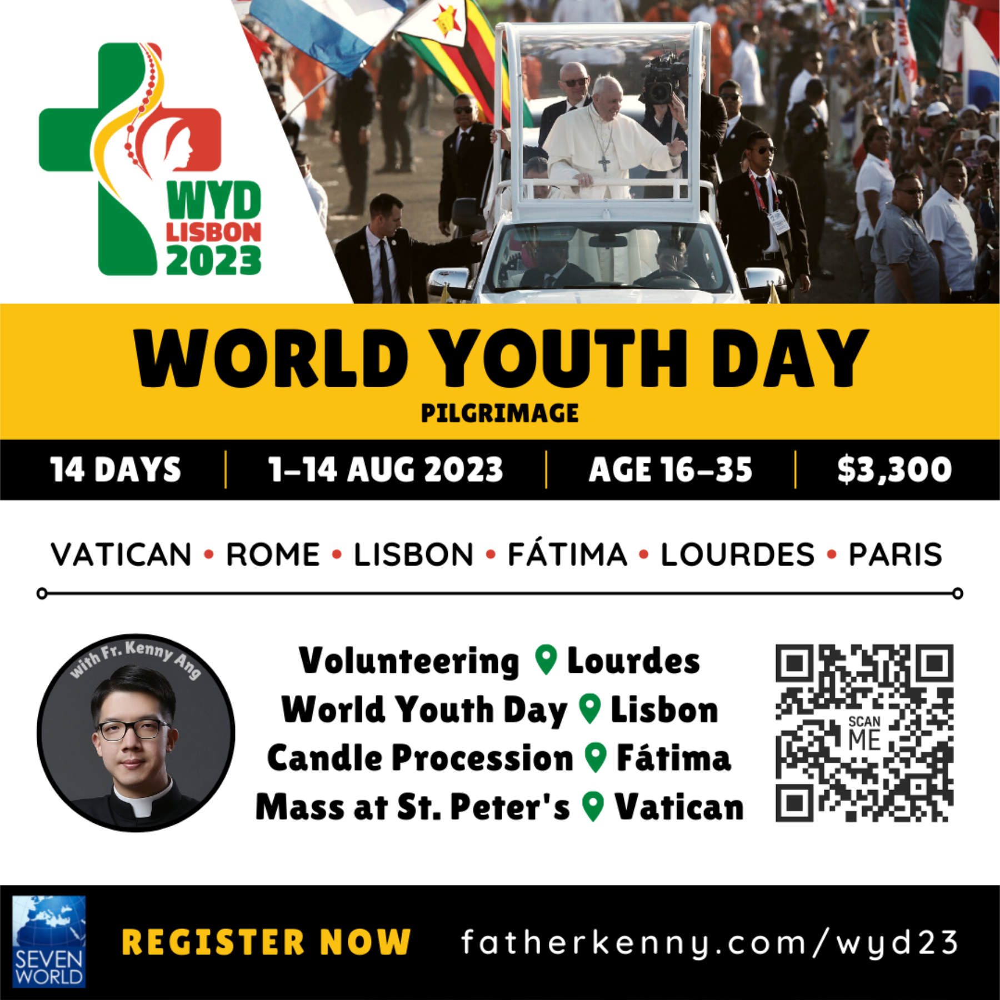

  

    <ul>
      <li>
        <a class="button" href="/">BOOK NOW </a> 
      </li>
      <li>
        Questions? <a href="/">Ask Seven World Tours</a>  
      </li>
    </ul>
  

To read more about what World Youth Day (WYD) is, visit [WYD Lisbon 2023 official website](https://www.lisboa2023.org/en/about). To see heartfelt moments from previous WYDs, watch these videos: [History of WYD](https://youtu.be/t8BObfDtPVM) - [WYD 2000 Rome](https://youtu.be/RoIWquTYtzY) - [WYD 2011 Madrid](https://youtu.be/a48jsJm-jiA) - [WYD 2013 Rio](https://youtu.be/LZa6spYqHsA) - [WYD 2016 Kraków](https://youtu.be/xgqyEPemnKo). To listen to the best songs of WYD, see [The Unofficial Hymn of WYD](https://youtu.be/0KB8yY_hs60) - [The Best Songs of WYD](https://youtu.be/f-9clTldvdE).

---

## Content

1. [First things first: what’s the point?](/post/wyd23/#1-first-things-first-whats-the-point)
2. [What are the requirements to join?](/post/wyd23/#2-what-are-the-requirements-to-join)
3. [Itinerary (August 1–14, 2023)](/post/wyd23/#3-itinerary-august-114-2023)
4. [Who is in charge of this pilgrimage?](/post/wyd23/#4-who-is-in-charge-of-this-pilgrimage)
5. [How much does it cost?](/post/wyd23/#5-how-much-does-it-cost)
6. [Why is it important to book early?](/post/wyd23/#6-why-is-it-important-to-book-early)
7. [Sponsorship](/post/wyd23/#7-sponsorship)
8. [Previous Trips of Seven World Tours](/post/wyd23/#8-previous-trips-of-seven-world-tours)

---

## 1. First things first: what’s the point?

Let’s start with the most important question: why is this trip worth our time and money? In this section, I’m addressing you, _prospective participants_, as well as you, _parents_, who are considering funding your children’s trip. At least _three reasons_ make it reasonable to spend our precious time and hard-earned cash on this journey.

### Reason #1. This trip will change our life.

This trip will be life-changing for many reasons. Let me mention two for now.

Firstly, _this trip is a pilgrimage_. It’s more than just an excursion. A pilgrimage is a journey of devotion to holy places—a practice common to Christianity and other world religions. In this pilgrimage, we’ll get to visit three major holy sites: Rome, Lourdes, and Fátima. We’ll also celebrate Mass and pray together every day. This trip will be an occasion for us to deepen our faith. It will also increase our familiarity with the two-thousand-year history of Catholicism.

Secondly, _we will volunteer in Lourdes_. If you’ve been to Lourdes, you’ve surely seen many young people helping out with different things at the Shrine: they organize queue lines, lead rosary processions, escort the sick in their wheelchairs, help the pilgrims go to the baths, etc. This is what we’ll do. We’ll serve the pilgrims, especially those who are ill. By doing so, we hope to hear Christ tell us: “I was sick and you took care of me” (Mt 25:36).

Back in 2017, I spent three weeks in Fátima volunteering in a [residence for the mentally disabled](https://www.ump.pt/Home/uniao/areas-de-atuacao/equipamentos-anexos/centro-de-apoio-a-deficientes-joao-paulo-ii/). I did things like changing their beddings and feeding them. It was tough. I had nausea several times for reasons I don’t have to specify. But after that experience, my life was no longer the same. I discovered that all human beings are valuable just because they exist. That immediate contact with human suffering changed my life. It will change yours too.

### Reason #2. It is important to attend the World Youth Day.

Our presence at WYD matters for two reasons.

Firstly, we’ll _show the universality of the Catholic Church_ by representing our countries. Recall that universality is one of the [distinctive features of our Church](https://www.catholiceducation.org/en/culture/catholic-contributions/the-four-marks-of-the-church.html): she is meant for all human beings—she is everywhere. Let’s show this to the world!

Secondly, our presence at this gathering will _inspire our fellow youth from around the world_. I attended [WYD Kraków](https://en.wikipedia.org/wiki/World_Youth_Day_2016) in 2016 and I can tell you how uplifting it was to see so many young Catholics on fire with their faith. Yet remember that this is a two-way procedure: if the presence of others edifies us, our presence matters to them too. We are likewise a source of encouragement for young people from other parts of the globe.

### Reason #3. This trip is gonna be fun.

We’ll simply have a good time. Experience has proven that ‘pilgrimage’ is not a synonym for ‘boring.’ Don’t worry—we won’t be praying all the time. As Christians, we are truly human: we like to sightsee, eat, shop, socialize, and sleep. Hence, we’ll try some local cuisines. Aside from churches, we’ll visit famous landmarks. We’ll do some shopping. Most importantly, we’ll get to know and help each other as a team. I am hopeful that, at the end of our trip, we’ll become friends. Some might even encounter their future spouse in this journey—who knows?

## 2. What are the requirements to join?

### Age: 16-35

This age range is not absolute, but WYD is intended for those aged 16 to 35. Know that _there will be adults_ in our group chaperoning participants under the age of 18.

### Good health

This pilgrimage will include a considerable amount of physical activity. We must ensure that we are in good physical condition and will not endanger ourselves or other travelers. This pilgrimage will require much walking which may include hills, uneven pavement, stairs, narrow passages and elevators, cobblestone roads, and other ‘challenging’ scenarios. Please note that dietary requests can be made but are not guaranteed.

### Adventurous spirit

Pilgrimage entails personal sacrifices. We won’t probably stay in five-star hotels. We’ll most likely have roommates. We’ll have to let go of some comforts we’re used to back at home. This might sound otherworldly to some of you. But, from my experience, I can tell you that the fun will far outweigh all the discomforts!

### Willingness to serve

I can guarantee that the success of this trip will greatly depend on this point. We’ll have a good time if each one of us thinks less of himself/herself and more of others in our group. On the contrary, we’ll have an awful time if each one of us is egoistic. That’s why willingness to serve others is so crucial.

### Joyful heart

Lastly, a joyful heart is needed for this trip. Why? Because nobody likes being around gloomy and pessimistic individuals—because as Christians we’re called to spread peace and joy!

## 3. Itinerary (August 1–14, 2023)

### TUE 1: Jakarta to Rome

### WED 2: Arrival in Rome

Basilica of St. Paul Outside the Walls • [Via del Corso](https://anamericaninrome.com/2018/02/where-shop-rome/) (shopping)

### THU 3: Rome

Basilica of St. Peter • Basilica of St. Mary Major • Basilica of St. John Lateran • Roman Fora • Colosseum • Trevi Fountain

### FRI 4: Rome - Lisbon

**Rome - Lisbon** | Flight  
**WYD** | Evening: [Way of the Cross](https://youtu.be/0xuN89LvZ3o)

### SAT 5: Lisbon

**WYD** | Morning: [Walking pilgrimage to the vigil site](https://youtu.be/xhk7wZIe3rk) • Afternoon: Shows, music, prayer, [sacrament of confession](https://youtu.be/ZY2prGQbuMU) • Evening: [Eucharistic adoration](https://youtu.be/LZa6spYqHsA)

### SUN 6: Lisbon - Fátima

**WYD** | [Mass celebrated by the Pope](https://youtu.be/LBpsF5QusI0)  
**Lisbon - Fátima** | Bus  
**Fátima** | Afternoon: City tour • Evening: [Rosary and Candlelight Procession](https://youtu.be/7RZz1g5f-S4) (21:30)

### MON 7: Fátima - Burgos

**Fátima - Burgos** | Bus  
**Burgos** | [Cathedral of Burgos](https://youtu.be/q0mi1NMSlOU)

### TUE 8: Burgos - Loyola - Lourdes

**Burgos - Loyola** | Bus  
**Loyola** | [Sanctuary of Loyola](https://en.wikipedia.org/wiki/Sanctuary_of_Loyola)  
**Loyola - Lourdes** | Bus  
**Lourdes** | Briefing for volunteers

### WED 9: Lourdes

[Volunteering](https://youtu.be/s_djUFpaXNk) • Way of the Cross • City tour

### THU 10: Lourdes

Volunteering • Free time & shopping

### FRI 11: Lourdes - Paris

**Lourdes - Paris** | Train  
**Paris** | Evening tour • Shopping

### SAT 12: Paris

City tour • Eiffel tower • Seine river

### SUN 13: Paris - Jakarta

**Paris** | [The Sacred Heart Basilica of Montmartre](https://en.wikipedia.org/wiki/Sacré-Cœur,_Paris)

### MON 14: Arrival in Jakarta

  

    <ul>
      <li>
        <a class="button" href="/">BOOK NOW </a> 
      </li>
      <li>
        Questions? <a href="/">Ask Seven World Tours</a>  
      </li>
    </ul>
  

## 4. Who is in charge of this pilgrimage?

This pilgrimage is organized by Seven World Tours and Fifi Lukito will be our group leader. As the founder of this travel agency, she has led numerous tour groups to multiple destinations around the world. In 2019, I was the chaplain of her pilgrimage group to the Holy Land.

')

It’s such a blast to travel with her. Everybody loves Fifi. She is always on top of things. Her tranquility and cheerfulness make everybody enjoy being around her. She knows when to go by the book and when to be flexible. She may even break some rules to make your life easier. (For example, she gave us sachets of chili sauce when we were eating at a Kosher restaurant.) She perfectly knows if we’re hungry and will sometimes surprise us with extra snacks—I didn’t know how she got so many _bakcang_ (粽子) and bananas for us on the bus when we were at the Holy Land. Last but not least: she is a great guide because she loves Jesus.

## 5. How much does it cost?

Price per person: **2,500 EURO**

This rate includes:

- Transportation (plane, train, bus)
- Travel insurance
- WYD Registration
- Entrance fees to landmarks
- 2 meals per day
- 10 nights at hotel (double occupancy)

## 6. Why is it important to book early?

If you feel called to go, it is important to book early for several reasons.

- _Spiritual preparation_. You can start praying for this pilgrimage, for yourself, and for your fellow travelers. You can also say [the official prayer for WYD Lisbon 2023](https://www.lisboa2023.org/en/article/prayer-for-world-youth-d).
- _Financial preparation_. You can start saving and fundraising. You can start planning your leave if you’re working or studying.
- _Better experience_. The sooner we know the number of participants, the sooner we can register for WYD and book accommodations, churches, restaurants, etc. Bear in mind that WYD is a mass event. The WYD Kraków in 2016, for instance, was attended by [3.5 million people](https://edition.cnn.com/2013/07/19/world/world-youth-day-fast-facts/index.html). Only if we _book as early as possible_ can we get better locations for hotels and events (e.g., at the Mass with the Pope, for Mass at churches across Europe). Better locations will give us a better experience.

  

    <ul>
      <li>
        <a class="button" href="/">BOOK NOW </a> 
      </li>
      <li>
        Questions? <a href="/">Ask Seven World Tours</a>  
      </li>
    </ul>
  

## 7. Sponsorship

If you are interested in sponsoring a group meal while we are in Europe or contributing to our WYD fund which will be shared across the group, please fill out this form.

## 8. Previous Trips of Seven World Tours
